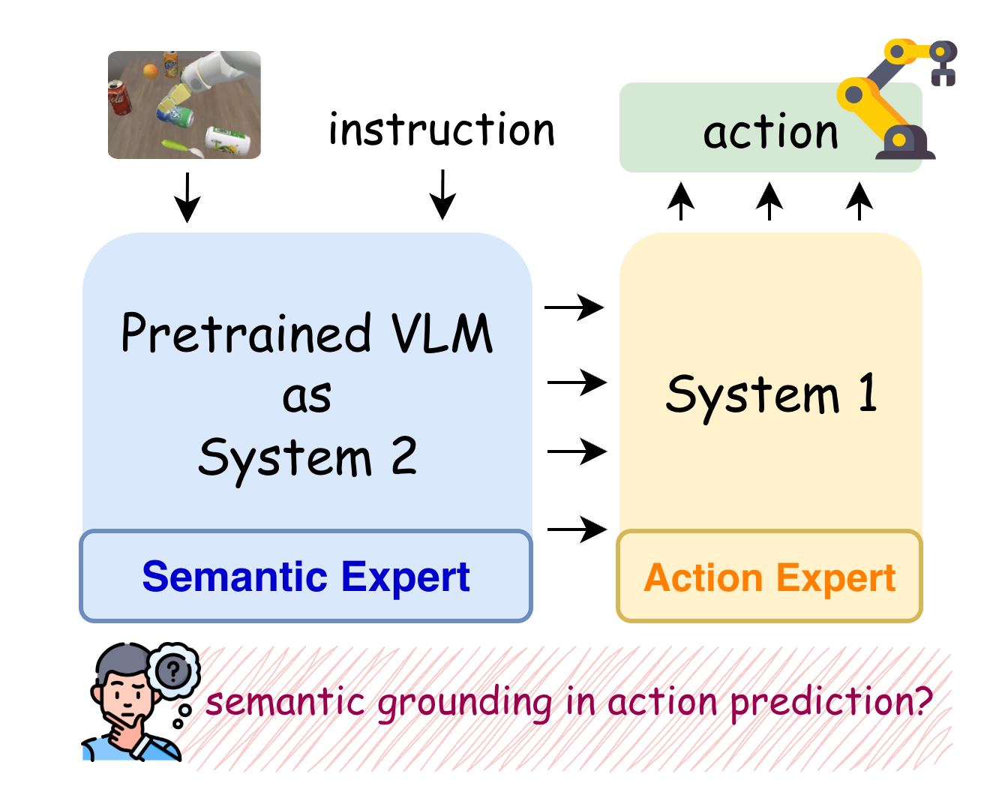
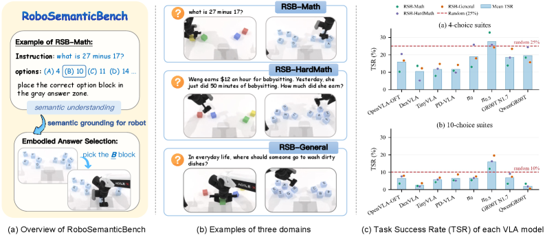
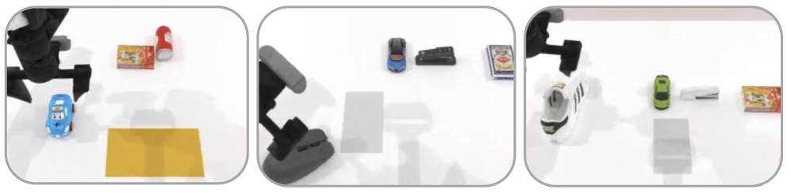
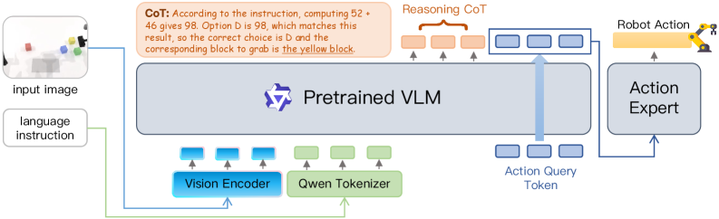

# RoboSemanticBench: VLA 모델의 Action Prediction에서 Semantic Grounding 진단하기 — 한국어 기술 번역

- 원문: [RoboSemanticBench: Diagnosing Semantic Grounding in Action Prediction for VLA Models](https://arxiv.org/abs/2606.02277)
- 저자: Bin Yu, Yao Zhang, Haishan Liu, Shijie Lian, Yuliang Wei, Xiaopeng Liu, Zhaolong Shen, Changti Wu, Ruina Hu, Bailing Wang, Cong Huang, Kai Chen
- Hugging Face: https://huggingface.co/papers/2606.02277
- 번역 범위: Abstract, Introduction, Method/Benchmark, Experiments/Results, Discussion/Conclusion을 충실히 번역·정리했습니다. Appendix와 세부 ablation 표는 핵심만 요약했습니다.

## 다운로드한 그림
- 
- 
- 
- 

## 그림/표 캡션 요약
- Figure 1: semantic expert와 action expert 사이의 gap을 보여주는 motivating diagram.
- Figure 2/3: RSB answer-block task, choice suite, option-to-block mapping 예시.
- Tables: GSR/TSR/nSG decomposition으로 grasp와 semantic choice를 분리.

## Abstract
VLA(Vision-Language-Action) 모델은 pretrained language/VLM backbone의 semantic competence가 로봇 action prediction에 반영된다는 전제 위에 세워진다. 하지만 로봇 fine-tuning은 대개 task-specific imitation loss로 최적화되며, 많은 benchmark는 visual shortcut이나 instruction-action shortcut만으로도 풀릴 수 있다. RoboSemanticBench(RSB)는 post-trained VLA 모델이 복잡한 instruction semantics를 사용해 올바른 물리 target을 선택하고 조작하는지 진단하는 embodied benchmark이다. 각 episode에서 로봇은 multiple-choice 수학 또는 일반지식 문제와 후보 answer blocks를 보고, 정답에 해당하는 block을 집어 answer zone으로 옮겨야 한다. 대표 VLA 모델들은 block grasp 자체는 학습하지만, grasp success를 통제하면 semantically correct block 선택은 random 또는 below-random에 가깝게 나타나 backbone-level semantic competence와 action prediction 사이의 persistent gap을 보여준다.

## 1. Introduction
논문은 “VLA의 semantic expert가 action expert를 실제로 guide하는가?”라는 질문에서 출발한다. π0류 dual-system 설명에서는 low-frequency System-2 semantic expert가 observation/instruction을 해석하고 high-frequency System-1 action expert가 행동을 만든다고 설명하지만, imitation learning loss는 성공 trajectory 분포를 맞추는 데 집중할 뿐 semantic decision을 action module에 안정적으로 전달하라고 강제하지 않는다. 따라서 instruction을 표면적으로 포함하더라도 policy는 색상, 위치, 자주 등장하는 object-action pair 같은 shortcut으로 task success를 얻을 수 있다.

## 2. Background
Open X-Embodiment/RT-X, Octo, OpenVLA, π0, π0.5, GR00T N1 같은 VLA/robot foundation model은 web-scale VLM representation과 robot data를 결합한다. 기존 CALVIN, LIBERO, SimplerEnv, RoboTwin 계열 benchmark는 multi-task manipulation과 generalization을 잘 측정하지만, language instruction이 짧은 template인 경우가 많아 “semantic reasoning이 action target selection에 쓰였는지”를 분리해 측정하기 어렵다.

## 3. RoboSemanticBench
RSB의 핵심 구성은 question q, candidate options O={o1…oN}, visible answer blocks B={b1…bN}, option-to-block mapping m:O→B이다. policy는 question과 mapping을 instruction으로 받고 scene을 관찰한 뒤 정답 option에 연결된 block을 pick-and-place해야 한다. action primitive는 항상 동일한 answer-selection primitive이므로 motor execution보다는 “question을 풀고 → option을 고르고 → option을 visible block에 ground → 행동으로 실행”하는 semantic grounding chain을 평가한다.

## 3.2 Semantic task construction
RSB-Math는 두 자리 덧셈/뺄셈, 한 자리×두 자리 곱셈을 procedurally generate하고 가까운 distractor를 섞어 피상적 pattern이 아니라 계산을 요구한다. RSB-HardMath는 GSM8K식 grade-school word problem을 사용해 multi-sentence compositional semantics를 요구한다. RSB-General은 commonsense/factual knowledge 문제를 사용해 backbone의 world knowledge가 action selection으로 이어지는지 본다.

## 3.3 Choice suites and visual grounding
4-choice suite는 A/B/C/D, 10-choice suite는 J를 제외한 A/B/C/D/E/F/G/H/I/K를 사용한다. 10-choice는 same-color letter blocks와 randomized layout/mapping을 사용해 color/position shortcut을 줄이고, guessing success를 낮춘다.

## 3.5 Expert demonstrations and simulation
benchmark는 Aloha-AgileX dual-arm embodiment, multi-view RGB/wrist cameras, robot proprioception이 있는 tabletop simulator로 구현된다. scripted expert가 ground-truth answer를 visible block으로 매핑하고 target position에 따라 arm을 선택해 MPLib motion planning으로 pick-and-place trajectory를 생성한다.

## 4. Experiments and metrics
훈련/평가 question split을 분리해 question-answer memorization을 방지한다. 주요 metric은 grasp success rate(GSR), task success rate(TSR), 그리고 grasp 성공을 통제한 normalized semantic grounding score(nSG)이다. high GSR/low TSR은 “잡기는 하지만 무엇을 잡아야 하는지 모른다”를 뜻한다.

## 4.4 Main results
대표 VLA 모델들은 candidate block을 grasp하는 primitive는 학습하지만 target selection에서는 낮은 TSR과 near/below-random nSG를 보인다. 특히 harder semantic domain과 10-choice suite에서 semantic grounding gap이 커진다.

## 6. Error analysis
grasp는 성공했지만 task는 실패한 episode를 보면 대부분 placement failure가 아니라 wrong-target selection이다. QwenGR00T와 ReasoningVLA 모두 실패의 대부분이 잘못된 answer block 선택으로 귀결되어, 문제는 motor control이 아니라 instruction semantics가 action pathway에 결합되지 않는 데 있음을 뒷받침한다.

## 7–8. Discussion / Conclusion
RSB는 standalone QA 능력을 재는 benchmark가 아니라 semantic decision이 physical action prediction에 들어갔는지 측정한다. 결과는 강한 VLM을 action expert에 붙이는 것만으로는 semantically grounded policy가 되지 않으며, selected semantic target을 action module에 보존·노출하는 training objective/interface가 필요함을 시사한다. Appendix의 세부 표는 본 번역에서 생략하고 핵심 결과/metric 중심으로 정리했다.

## 생략/압축한 부분
- arXiv HTML에서 본문과 주요 figure는 확인했지만, appendix의 모든 numeric table/ablation row는 원문 링크를 참조하도록 남겼습니다. 본 문서는 학습과 wiki ingestion에 필요한 핵심 기술 내용 위주로 충실히 번역했습니다.
