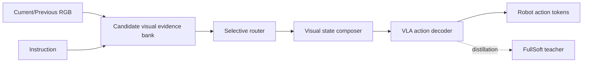

# VisualThink-VLA: 효과적이고 저지연인 VLA 정책을 위한 Visual Intermediate Reasoning — 핵심 기술 학습 자료

## 1. 선수 지식
- VLA/VLM 기본 구조
- imitation learning과 action token/trajectory prediction
- closed-loop robot control과 latency budget
- benchmark metric 설계(GSR, TSR, success rate 등)

## 2. 핵심 용어 Glossary
- **VLA**: vision/language 입력을 executable action으로 변환하는 모델.
- **Action grounding**: 언어/시각 reasoning 결과가 실제 waypoint, trajectory, gripper action 등으로 연결되는 과정.
- **Closed-loop**: 모델 action이 환경 상태를 바꾸고, 다음 observation/action에 다시 반영되는 실행 방식.
- **Shortcut behavior**: 진짜 semantic understanding 없이 색/위치/분포 편향으로 성공하는 행동.

## 3. Architecture / Benchmark Map

## 4. 단계별 이해
1. 무엇을 semantic decision으로 볼지 정한다.
2. 그 decision이 physical target/action으로 변환되는 interface를 정의한다.
3. motor execution과 semantic selection을 분리하는 metric을 둔다.
4. latency와 safety-critical failure mode를 함께 본다.

핵심 focus: Visual reasoning vs textual CoT, selective routing, teacher-student distillation for action token, closed-loop latency budget

## 5. 핵심 수식/표현
Teacher-student distillation은 teacher action-token distribution p_T^τ와 student distribution p_S^τ 사이의 divergence를 줄여 sparse routed interface가 dense evidence teacher의 성능을 보존하도록 한다.

## 6. 구현/배포 메모
- 자율주행으로 옮길 때는 block target 대신 lane/object/route/trajectory candidate를 둔다.
- language reasoning은 반드시 action head가 소비할 수 있는 structured state로 보존해야 한다.
- 실시간 시스템에서는 textual CoT를 그대로 decode하기보다 compact visual/BEV evidence 또는 verified symbolic state를 쓰는 편이 안전하다.

## 7. Study Questions
1. Q: VLA가 VQA를 잘하면 action grounding도 잘 된다고 볼 수 있는가?
   A: 아니다. semantic answer가 action pathway에 전달되지 않으면 행동은 shortcut을 따를 수 있다.
2. Q: closed-loop에서 latency가 왜 중요한가?
   A: 늦은 reasoning은 환경 변화 후 실행되어 unsafe action을 만들 수 있다.
3. Q: benchmark는 어떤 confound를 제거해야 하는가?
   A: grasp/motor success와 target semantic selection, color/position shortcut, train-test question memorization을 분리해야 한다.

## 8. Reading Roadmap
1. 원문 Abstract/Introduction으로 문제의식을 파악한다.
2. Method/Benchmark section에서 input-output/action interface를 그린다.
3. Results table은 metric 정의와 함께 읽는다.
4. references.md의 OpenVLA/π0/CoT-VLA/benchmark 관련 논문으로 확장한다.
