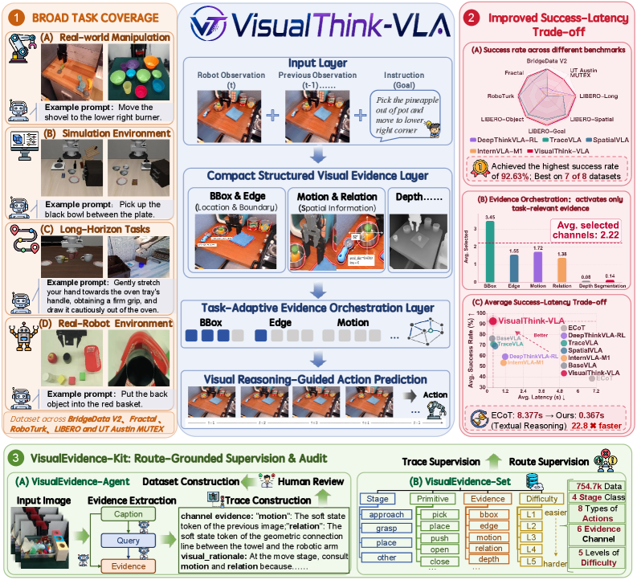
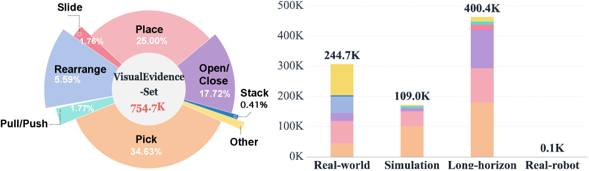
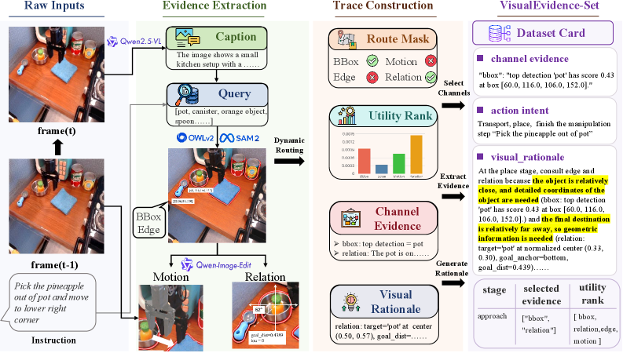
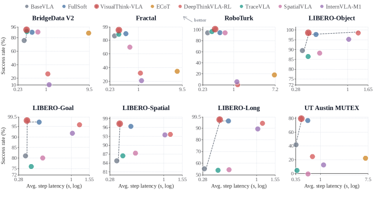

# VisualThink-VLA: 효과적이고 저지연인 VLA 정책을 위한 Visual Intermediate Reasoning — 한국어 기술 번역

- 원문: [VisualThink-VLA: Visual Intermediate Reasoning for Effective and Low-Latency Vision-Language-Action Policies](https://arxiv.org/abs/2605.30011)
- 저자: Mingjian Gao, Wenqiao Zhang, Yuqian Yuan, Yang Dai, Binhe Yu, Zheqi Lv, Haoyu Zheng, Jiaqi Zhu, Zhiqi Ge, Zixuan Wan, Siliang Tang, Yueting Zhuang
- Hugging Face: https://huggingface.co/papers/2605.30011
- 번역 범위: Abstract, Introduction, Method/Benchmark, Experiments/Results, Discussion/Conclusion을 충실히 번역·정리했습니다. Appendix와 세부 ablation 표는 핵심만 요약했습니다.

## 다운로드한 그림
- 
- 
- 
- 
- 
- 
- 
- 

## 그림/표 캡션 요약
- Figure 1: textual reasoning vs visual intermediate reasoning의 latency/grounding trade-off.
- Figure 2: evidence bank, selective router, visual state composer, action decoder pipeline.
- Figure 5: success-latency frontier에서 VisualThink-VLA가 sub-second regime에 가까운 위치를 차지.

## Abstract
최근 VLA policy는 explicit intermediate reasoning을 도입하기 시작했지만 embodied control에서 textual chain-of-thought는 잘 맞지 않는다. 약한 시각 grounding의 text가 action prediction을 방해할 수 있고 autoregressive text decoding은 closed-loop 실행에 너무 느리다. VisualThink-VLA는 compact visual-evidence interface로 action prediction을 bootstrap하여 spatial precision을 보존하면서 decoding overhead를 피한다. selective routing mechanism은 visual evidence token을 task-adaptive하게 선택해 low-latency inference와 high-capacity specialization을 동시에 노린다. VisualEvidence-Kit은 VisualEvidence-Agent가 만든 754.7k VLA instruction supervision/audit set을 제공하며, BridgeData V2 등에서 ECoT의 8.377s step latency를 0.367s로 줄이는 22.8× speedup을 보고한다.

## 1. Introduction
VLA policy는 visual observation과 language instruction을 robot actions로 직접 매핑해 다양한 embodiment/task에서 language-conditioned control을 가능하게 한다. 하지만 distractor resolution, spatial relation grounding, motion tracking, long-horizon progress maintenance가 필요한 manipulation에서는 direct action prediction이 취약하다. Textual CoT는 explicit reasoning trace를 제공하지만 visual grounding이 약하고 closed-loop control에 latency가 너무 크다. VisualThink-VLA는 reasoning을 text가 아니라 visual evidence state로 표현해 이 trade-off를 완화한다.

## 3.1 Method overview
핵심 설계는 prompt-text evidence injection을 피하는 것이다. frozen VLA backbone은 free-form text rationale 대신 learned visual evidence states에 condition된다. pipeline은 six-channel candidate evidence bank를 만들고, low-utility channel 두 개를 제거한 뒤, 남은 네 개 채널을 task-adaptive router로 선택한다. routed evidence는 visual state composer를 통해 small set of learned visual states로 mapping되고, action decoder는 이 state를 사용해 action token distribution을 예측한다.

## 3.2 Candidate evidence bank
각 decision step에서 policy는 현재 RGB observation x_t, previous observation x_{t-1}, language instruction q를 받는다. evidence bank는 object/region, spatial relation, motion/progress, instruction alignment 등 조작에 중요한 visual cues를 channel별로 구성한다. 논문은 모든 evidence를 항상 dense하게 넣기보다, task에 필요한 channel만 route하는 것이 interference와 latency를 줄인다고 본다.

## 3.4 Visual State Composer
Visual State Composer h_ψ는 routed channel vectors를 learned visual states S_t로 투영한다. 중요한 점은 inference time에 online image editing model이나 textual rationale generation을 부르지 않는다는 것이다. 즉, reasoning interface는 lightweight adapter로 남고 closed-loop latency budget을 크게 넘지 않는다.

## 3.5 Training routed interface
sparse hard routing은 discrete choice이기 때문에 학습 안정성이 필요하다. 논문은 FullSoft teacher의 action-token distribution을 temperature τ에서 distillation하고, route supervision/counterfactual utility를 활용해 dynamic loss를 구성한다. inference에서는 soft route 대신 hard route를 사용해 계산량을 낮춘다.

## 4. VisualEvidence-Kit
VisualEvidence-Kit은 VLA control을 위한 route-grounded supervision/audit resource이다. VisualEvidence-Agent는 raw frames와 trajectory metadata를 받아 evidence extraction, route proposal, consistency check, counterfactual audit을 수행한다. VisualEvidence-Set은 observation, instruction context, feature manifest, supervised route target, counterfactual channel utilities, channel-grounded trace를 포함한다. Full-Clean/HQ-Trace/Gold-Faithfulness subset으로 나눠 training과 audit에 사용한다.

## 5. Experimental setup
BridgeData V2, Fractal, RoboTurk, LIBERO, UT Austin MUTEX 등 multi-dataset control benchmark에서 평가한다. baseline은 textual traces(ECoT), image-grounded reasoning(TraceVLA, SpatialVLA), frozen BaseVLA, dense FullSoft, sparse VisualThink-VLA이다. 별도 tabletop platform에서 real-robot closed-loop deployment도 평가한다.

## 6. Results and analysis
VisualThink-VLA는 success-latency frontier를 개선한다. matched BaseVLA 대비 8개 benchmark 중 7개에서 success를 개선하고, BridgeData V2/LIBERO/MUTEX에서 큰 gain을 보인다. ECoT 대비 BridgeData V2 latency를 8.377s→0.367s로 줄이면서 성공률도 개선한다. dense FullSoft teacher의 이득 대부분을 보존하면서 sparse routing으로 latency를 줄인다.

## Conclusion / limitations
논문은 VLA reasoning을 “글로 설명하기”보다 “행동에 필요한 visual evidence를 compact하게 제공하기”로 재정의한다. 다만 evidence channel 설계와 VisualEvidence-Agent 품질에 의존하며, 복잡한 open-world driving/robotics에서 evidence type이 충분한지, visual evidence가 causal하게 action을 guide하는지 추가 검증이 필요하다. Appendix와 상세 ablation 표는 본 번역에서 핵심 위주로 압축했다.

## 생략/압축한 부분
- arXiv HTML에서 본문과 주요 figure는 확인했지만, appendix의 모든 numeric table/ablation row는 원문 링크를 참조하도록 남겼습니다. 본 문서는 학습과 wiki ingestion에 필요한 핵심 기술 내용 위주로 충실히 번역했습니다.
