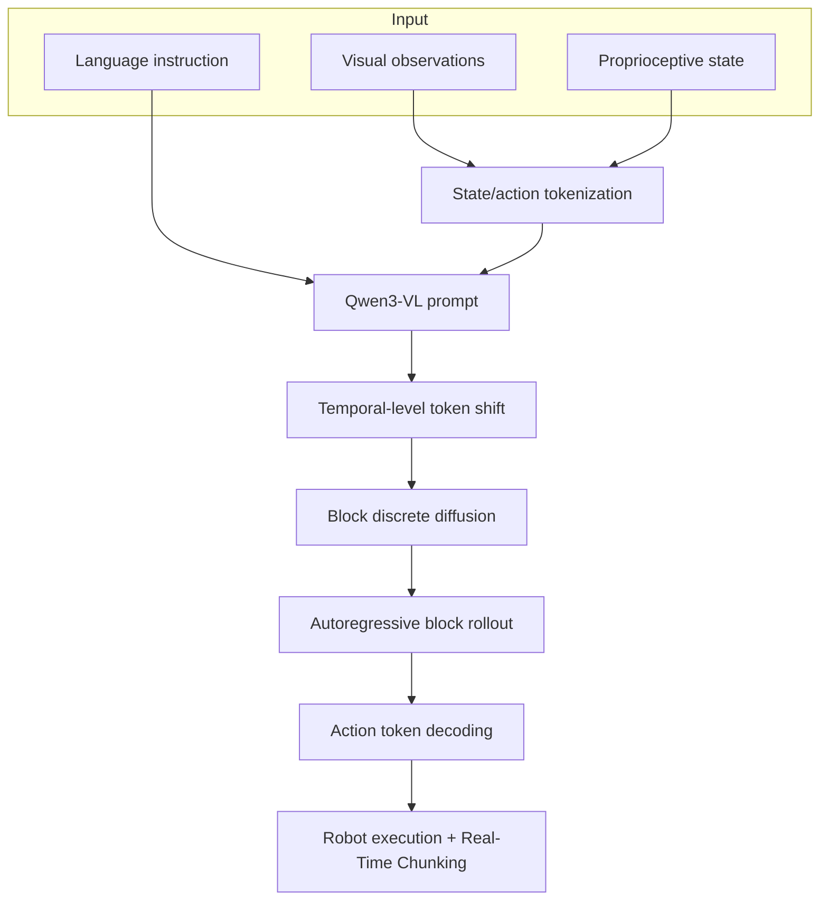

# TBD-VLA 분석

## 한 문장 결론

TBD-VLA는 discrete VLA의 가장 큰 약점인 **autoregressive action-token latency**를 block discrete diffusion으로 줄이면서, pure parallel decoding이 잃기 쉬운 **trajectory temporal dependency**를 block-level autoregression으로 되살린 논문이다.

## 문제 정의

VLA policy가 visual observation과 language instruction을 받아 action sequence를 생성할 때 선택지는 크게 두 가지다.

- continuous action expert를 붙여 빠르고 매끄러운 control을 얻는다.
- action을 token으로 만들어 VLM이 직접 action을 생성하게 한다.

두 번째는 action grounding 해석성이 좋지만 token-by-token generation이 느리다. TBD-VLA는 이 bottleneck을 목표로 한다.

## 핵심 기여

1. **Temporal block diffusion**: action sequence를 block으로 나누고 block 내부는 masked discrete diffusion으로 병렬 생성한다.
2. **Block-level autoregression**: block 간에는 이전 block을 조건으로 두어 trajectory의 시간적 일관성을 유지한다.
3. **Temporal-level token shift**: diffusion objective를 pretrained VLM의 next-token objective와 맞춘다.
4. **Real-Time Chunking 호환성**: 이미 실행 중인 prefix 이후 미래 action block을 temporal in-painting처럼 갱신할 수 있다.
5. **Latency/성능 균형**: 최종 구성에서 SimplerEnv Google Robot 88.7% success, 0.086s inference time을 보고한다.

## Architecture / Pipeline

## Input / Output / Action Representation

| 항목 | 내용 |
|---|---|
| 입력 | RGB visual observation, proprioceptive state, language instruction |
| backbone | Qwen3-VL 2B |
| action 표현 | action feature를 bin으로 discretize한 token sequence |
| 생성 단위 | temporal block |
| 출력 | 미래 robot action chunk |
| 실행 | closed-loop robot manipulation, RTC 가능 |

## Training Recipe

- Proprioception과 action feature를 shared discrete vocabulary로 token화한다.
- action block을 clean/corrupted layout으로 구성한다.
- corrupted block의 masked tokens를 복원하도록 학습한다.
- token shift로 current block logits가 next action block을 예측하게 하여 VLM의 autoregressive pretraining과 정렬한다.
- 최종 inference 구성은 `m=4`, `n_d=2`, expectation sampling이다.

## 평가

| 평가축 | 결과 요약 |
|---|---|
| LIBERO / LIBERO-Plus | multiple task suite와 perturbation에서 strong performance 보고 |
| SimplerEnv | Widow-X/Google Robot 환경에서 discrete VLA baseline과 비교 |
| Real-world FR3 | 평균 67.1% success, π0.5 50.0% 대비 우세 |
| Latency | 최종 inference 0.086s; decode-as-needed/KV cache/VLM compile이 누적 개선 |
| RTC ablation | TBD-VLA without RTC 60.0%; RTC 사용 시 67.1% |

## Open-loop vs Closed-loop

이 논문은 단순 open-loop action prediction보다 closed-loop control latency에 더 초점을 둔다. VLA가 실제 로봇 제어에 들어가려면 action token 생성 품질뿐 아니라 control frequency와 chunk 갱신 가능성이 중요하다. TBD-VLA가 RTC를 강조하는 이유도 여기에 있다.

## 강점

- discrete action token의 interpretability와 VLM 직접 decoding 장점을 유지한다.
- block 내부 parallelism으로 latency를 줄인다.
- block 간 temporal AR로 순수 병렬 diffusion보다 temporal coherence를 잘 보존할 가능성이 있다.
- auxiliary action expert 없이 VLM backbone이 action generation에 직접 관여한다.

## 한계

- 아직 manipulation 중심이고 autonomous driving trajectory planning에 직접 검증된 것은 아니다.
- camera viewpoint OOD처럼 visual fidelity가 중요한 조건에서 실패한다.
- VLM 내부 representation이 어떻게 action grounding으로 변환되는지 해석은 부족하다.
- OpenVLA-OFT 같은 극단적 parallel method보다 latency 자체는 느릴 수 있다.

## 찬호님 관심사와 연결

- VLA for AD에서 trajectory를 token화하는 흐름([[ReflectDrive2]])과 직접 연결된다.
- closed-loop latency를 줄이면서 action grounding을 유지하려는 설계는 자율주행 VLA planner에도 중요하다.
- block diffusion은 future waypoint/trajectory token generation에 적용 가능한 pattern이다.
