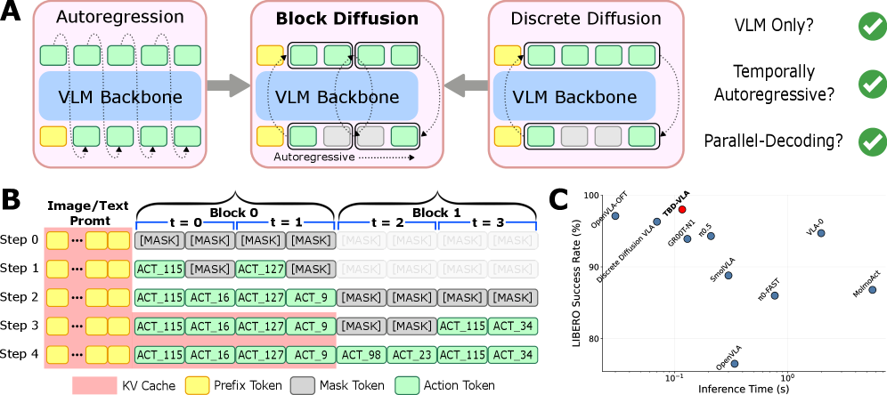
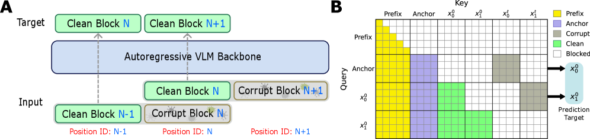
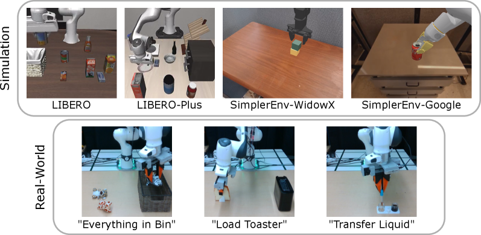
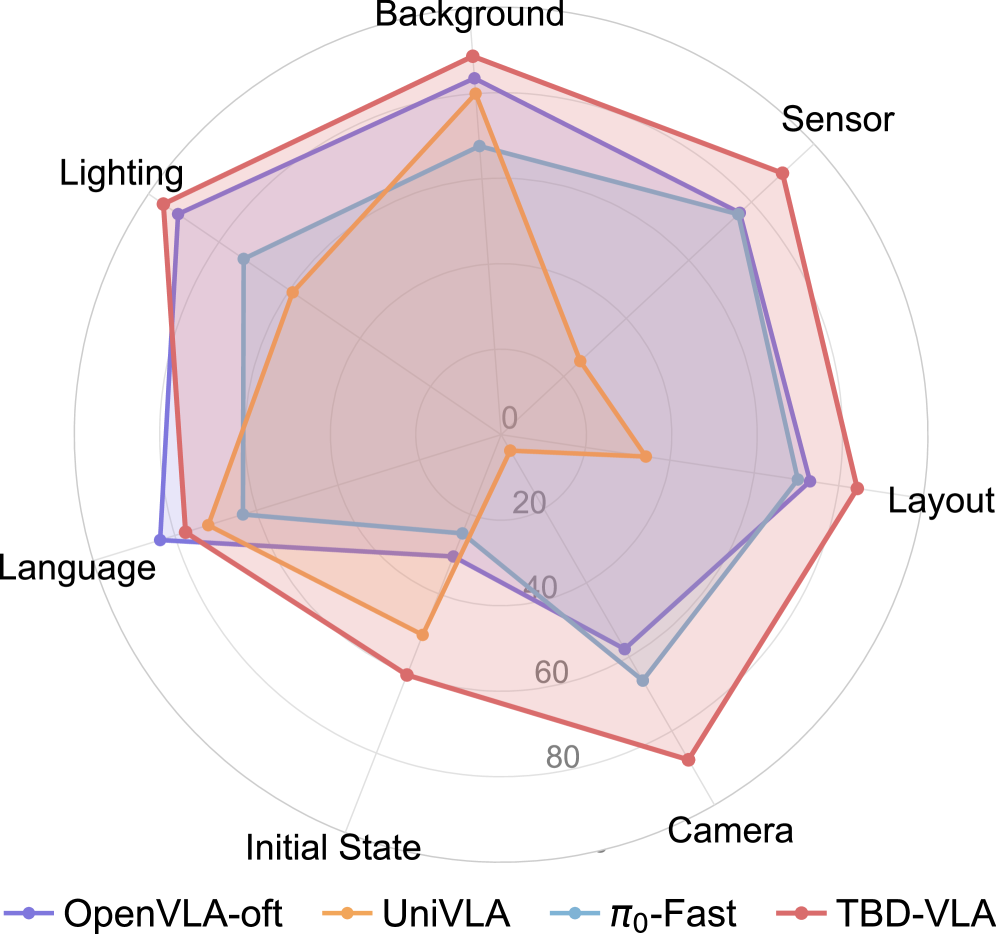
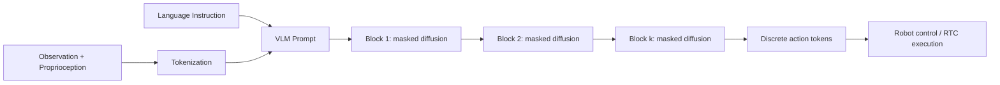

# TBD-VLA: 시간 블록 Diffusion 기반 Vision-Language-Action 모델

- 원제: **TBD-VLA: Temporal Block Diffusion Vision Language Action Model**
- 저자: Sung-Wook Lee; Xuhui Kang; Yen-Ling Kuo
- arXiv: [https://arxiv.org/abs/2606.07895](https://arxiv.org/abs/2606.07895) / HF: [https://huggingface.co/papers/2606.07895](https://huggingface.co/papers/2606.07895)
- 읽기 모드: 본문 전체를 대상으로 하되, 한국어 기술 번역은 Abstract, Introduction, Problem Statement, Method, Experiments, Limitations, Conclusion을 중심으로 심층 번역했다. Appendix/세부 reference list는 `references.md`와 `learning.md`로 분리했다.

## 그림 파일
- 
- 
- 
- 
- 

## Abstract 한국어 번역

기존 discrete Vision-Language-Action(VLA) 모델은 action generation을 보통 discretized action space 위의 next-token prediction으로 공식화한다. 각 action token은 이전 context에 autoregressive하게 조건화되어 생성된다. 이 방식은 효과적이지만, action chunk가 길어질수록 inference latency가 커지고 trajectory 안에 존재하는 시간적 구조를 충분히 활용하지 못한다. 최근 연구들은 parallel decoding으로 속도를 높였지만, action token 사이의 시간 의존성을 명시적으로 모델링하는 장치는 약하다.

TBD-VLA는 block diffusion을 discrete token 기반 VLA에 도입하여 temporal action generation을 수행한다. action sequence를 여러 temporal block으로 나누고, block 내부에서는 masked discrete diffusion으로 병렬 denoising을 수행하며, block 사이에서는 autoregressive generation을 유지한다. 이 설계는 temporal autoregression과 parallel action decoding을 결합하여 시간적 coherence와 inference speed를 동시에 얻는다.

또한 명시적인 temporal modeling 덕분에 Real-Time Chunking(RTC) 같은 asynchronous execution이 가능하다. 이미 실행 중인 action chunk 이후의 미래 block을 temporal in-painting처럼 갱신할 수 있기 때문이다. 논문은 TBD-VLA가 simulation과 real-world manipulation 모두에서 기존 VLA보다 높은 성공률과 경쟁력 있는 latency를 달성한다고 보고한다.

## 1. Introduction 번역·정리

VLA 모델은 visual observation과 natural language instruction을 executable robot action으로 매핑하는 generalist robotic policy로 부상했다. 핵심 설계 질문은 “VLM backbone이 action generation에 어떻게 기여하는가?”이다. 현재 지배적인 방식은 π0.5, GR00T N1.5처럼 VLM 위에 continuous action expert(flow matching head 등)를 붙이는 것이다. 이 방식은 continuous/multimodal action sequence를 자연스럽게 다룰 수 있지만, VLM이 실제 action capability와 generalization에 무엇을 기여하는지 해석하기 어렵다.

다른 접근은 action을 discrete token으로 표현하고 VLM 자체가 action decoder가 되게 하는 것이다. 이는 action을 language처럼 다룰 수 있어 VLM 내부 표현과 action grounding을 더 직접적으로 연결한다. 그러나 long action chunk를 token-by-token autoregressive하게 생성하면 closed-loop/high-frequency robot control에 필요한 latency 요구사항을 만족하기 어렵다.

기존 효율화 방향은 두 가지였다. 첫째, dense timestep-wise action sequence를 더 compact한 action representation으로 바꾸어 token 수를 줄이는 방법이다. 이 방식은 빠르지만 각 token과 특정 timestep 사이의 대응이 약해질 수 있다. 둘째, 여러 action token을 병렬로 생성하는 decoding 방법이다. 이는 latency를 줄이지만 action trajectory의 temporal dependency를 충분히 모델링하지 못한다.

TBD-VLA의 관점은 중간 지점이다. timestep-level action token은 유지하면서 action sequence를 temporal block으로 나눈다. 각 block 내부는 discrete diffusion으로 병렬 복원하고, block 사이 관계는 autoregressive하게 둔다. 따라서 “빠른 병렬 decoding”과 “시간적 순서에 대한 explicit modeling”을 동시에 추구한다.

## 2. 관련 연구 맥락

논문은 VLA action decoding의 세 계열을 대비한다.

1. **Continuous action expert 계열**: π0.5, GR00T N1.x, SmolVLA처럼 VLM은 perception/language reasoning을 담당하고 별도 action head가 continuous control을 생성한다.
2. **Autoregressive discrete action token 계열**: OpenVLA, MolmoAct, VLA-0 등은 action을 token으로 다루지만 latency가 커질 수 있다.
3. **Parallel/diffusion discrete action 계열**: Discrete Diffusion VLA, OpenVLA-OFT 등은 병렬성을 활용하지만 temporal dependency 모델링이 약할 수 있다.

TBD-VLA는 third family에 속하지만 block-level autoregression을 추가해 temporal structure를 되살리는 방식이다. Table 1 기준으로 TBD-VLA는 2B model, block discrete diffusion decoder, 0.117s latency를 보고한다. OpenVLA-OFT(0.031s)보다 느리지만 temporal AR이 있고, OpenVLA(0.344s), VLA-0(1.980s), MolmoAct(5.633s)보다 훨씬 빠르다.

## 3. Problem Statement 번역·정리

문제는 vision-language setting에서 visuomotor policy를 학습하는 것이다. Policy는 observation `o`(visual input + proprioceptive state)와 task specification `g`(language instruction 등)을 받아 미래 action sequence `a_1:H`를 예측한다.

논문은 action feature를 `N_b`개 bin으로 discretize하고, 각 discretized feature를 vocabulary token으로 취급한다. action chunk는 prediction horizon `H_p`와 action dimension `D_a`에 의해 길이 `L_t = H_p · D_a`인 token sequence가 된다.

핵심 factorization은 action sequence likelihood를 temporal action block 단위로 나누는 것이다.

```text
p(a_1:H | o, g) = Π_k pθ(a_{km+1:(k+1)m} | o, g, a_{1:km})
```

여기서 `m`은 temporal block size이고 `K = H_p / m`은 block 수다. 즉, block 안에서는 병렬적으로 denoise하지만 다음 block은 이전 block들을 조건으로 생성한다.

## 4. Method 번역·정리

### 4.1 Model Architecture

TBD-VLA는 Qwen3-VL 2B를 backbone으로 사용한다. 하지만 방법 자체는 다른 VLM backbone에도 적용 가능하다고 설명한다. Tokenizer에는 mask token, placeholder token, action token을 추가한다. Proprioception과 action feature는 동일한 dictionary의 discrete token으로 변환된다.

Prompt template은 다음 구조를 갖는다.

```text
State: {state tokens}, Task: {instruction}, Actions: {placeholder tokens}
```

placeholder token은 생성해야 할 action token 수를 명시적으로 알려주는 역할을 한다.

### 4.2 Temporal-level Token Shift

Discrete diffusion은 원래 corrupted token을 clean token으로 복원하는 self-reconstructive objective와 가깝다. 반면 pretrained VLM은 next-token prediction에 맞추어져 있다. TBD-VLA는 이 간극을 줄이기 위해 temporal-level token shift를 사용한다. 현재 action block의 logits가 다음 action block을 예측하도록 학습하여 VLM의 autoregressive 성질과 block diffusion objective를 정렬한다.

### 4.3 Discrete Block Diffusion

Action token sequence `x^0 = τ(a_1:H)`를 `K`개 block으로 나눈다. 각 block `x_k^0`에 대해 token별 mask probability `t_{k,i} ~ U(0,1)`를 샘플링해 corrupted block `x_k^t`를 만든다. Reverse process는 shifted predictor block `z_k`에 조건화하여 clean token을 예측한다. 첫 block은 anchor block을 사용하고, 이후 block은 앞선 clean block들을 포함한다.

이 구조는 두 가지 효과를 만든다.

- block 내부 token들은 masked diffusion으로 동시에 refine되어 decoding step 수를 줄인다.
- block 간에는 이전 action block의 clean context가 들어가 trajectory의 temporal coherence를 보존한다.

### 4.4 Block-level Attention Masking

논문은 clean block과 corrupted block을 doubled-layout으로 함께 넣고 custom attention mask를 적용한다. Clean/partially masked block을 병렬 처리하면서도 future block 정보 누출을 막는 것이 목적이다. 이는 VLM backbone의 transformer attention 구조를 크게 바꾸지 않고 block diffusion training을 구현하기 위한 engineering trick이다.

### 4.5 Inference: Decode-as-needed, Prefix KV Cache, RTC

Inference에서는 모든 block을 항상 끝까지 생성하지 않는다. 실제 control loop에서 필요한 만큼만 decode하고, prefix KV cache를 사용해 반복 계산을 줄인다. 논문은 baseline 0.185s에서 decode-as-needed로 0.125s, KV cache로 0.113s, VLM compile까지 적용해 0.086s까지 줄어든다고 보고한다.

Real-Time Chunking(RTC)은 실행 중인 action sequence 일부를 유지하면서 미래 block만 재생성하는 방식이다. TBD-VLA는 temporal in-painting을 통해 이미 실행한 prefix 이후의 block을 채울 수 있어 RTC와 잘 맞는다.



## 5. Experiments 번역·정리

### Benchmarks

논문은 LIBERO, LIBERO-Plus, SimplerEnv, 그리고 실제 Franka Research 3 tabletop task에서 평가한다. Simulation은 Franka Panda, Google Robot, Widow-X 등 다양한 robot embodiment를 포함하고, real-world는 perturbation이 있는 tabletop manipulation을 포함한다.

### Simulation results

논문은 LIBERO/LIBERO-Plus/SimplerEnv에서 기존 VLA baseline 대비 강한 성능을 보고한다. 특히 SimplerEnv Google Robot benchmark ablation에서 최종 구성 `m=4`, `n_d=2`, expectation sampling은 success rate 88.7%, inference time 0.086s, VLM forward pass 4회를 보인다. Fully autoregressive에 가까운 `m=1`은 84.6%이지만 0.223s/16 forward pass로 느리고, full-horizon diffusion에 가까운 `m=16`은 84.0%로 temporal modeling이 약하다.

### Real-world results

Figure 5 기준, TBD-VLA는 세 real-world task와 perturbation setting에서 평균 67.1% success rate를 달성했고, π0.5는 50.0%로 보고된다. RTC를 제거하면 TBD-VLA는 60.0%로 하락한다. 즉 RTC와 block temporal modeling이 모두 성능에 기여한다.

## 6. Limitations 번역

논문은 block diffusion을 VLA framework에 적용하는 데 초점을 두었기 때문에 auxiliary VLM objective와의 co-training 등 다른 training strategy는 future work로 남긴다. 또한 VLM-only action decoding이 visual-language representation을 executable action으로 어떻게 변환하는지에 대한 깊은 해석도 추가 연구가 필요하다. TBD-VLA는 perturbation에 대체로 robust하지만 out-of-distribution 조건에서 실패할 수 있다. 예를 들어 “transfer the liquid” task에서는 camera viewpoint 변경이 완전 실패로 이어질 수 있는데, 이는 정밀한 visual fidelity가 필요한 task이기 때문으로 해석된다.

## 7. Conclusion 번역

TBD-VLA는 temporal autoregression과 parallel action decoding을 block discrete diffusion으로 결합한 discrete token 기반 VLA framework다. temporal block 내부에서는 token을 병렬 denoise하고 block 사이에서는 autoregressive dependency를 유지한다. Simulation과 real-world manipulation에서 generalization, robustness, latency가 모두 경쟁력 있게 나타났으며, Real-Time Chunking과 호환된다. 따라서 temporal block diffusion은 low-latency, temporally aware, discrete VLA 모델의 유망한 방향이다.

## Appendix/미번역 범위

논문 Appendix의 세부 task 구성, 추가 ablation, 긴 reference list는 원문이 길어 `references.md`와 `learning.md`에 요약했다. 본 파일은 주요 기술 본문과 실험 결과 중심 번역이다.
