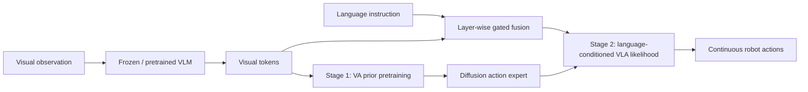

# APT: Action Expert Pretraining으로 VLA의 Instruction Generalization 개선하기 분석

## 한 문장 결론

APT는 VLA policy를 language-agnostic Vision-Action prior와 language-conditioned likelihood로 나누고, 먼저 action expert를 VA prior로 pretraining한 뒤 gated language fusion을 넣어 OOD instruction generalization을 개선한다.

## 왜 선택했나

현재 주(2026-W25) 후보 중 VLA/VLM/action expert 구조를 직접 다루며, continuous action expert가 언어 불균형 때문에 OOD instruction generalization에 실패하는 원인을 Bayesian factorization과 two-stage pretraining으로 분석한다.

## 문제 정의

Continuous action expert 기반 VLA는 visual observation과 language instruction을 받아 연속 action을 생성하지만, 데이터 구조상 language diversity가 낮아 visual shortcut을 학습하기 쉽다. 문제는 강한 VLM을 붙였는데도 action expert가 언어를 제대로 쓰지 않는다는 점이다.

## 핵심 기여

- Bayesian factorization: policy를 VA prior와 language-conditioned likelihood로 분해
- Action Expert PreTraining: frozen VLM visual tokens만으로 action expert를 먼저 pretrain
- Layer-wise gated fusion: learned gate로 VLM feature/language conditioning을 action expert에 안정적으로 주입
- π-style 및 GR00T-style VLA architecture에 모두 적용 가능
- OOD instruction 및 compositional task generalization 향상

## Architecture / Pipeline

## Input / Output / Action Representation

| 항목 | 내용 |
|---|---|
| 입력 | RGB/visual observation, language instruction, robot state |
| backbone | pretrained VLM + continuous action expert |
| 중간 표현 | VA prior, language-conditioned likelihood, gated fusion feature |
| 출력 | continuous action chunk / robot manipulation action |
| 핵심 failure mode | visual shortcut, language imbalance, noisy gradients into VLM |

## Training Recipe

1. VLM backbone을 frozen 또는 안정적 상태로 두고 visual tokens를 추출한다.
2. Action expert를 language 없이 vision-action pair로 pretrain하여 VA prior를 만든다.
3. 새 attention/gated fusion layer로 language token을 주입한다.
4. VLA likelihood를 학습해 instruction이 action prior를 조건부로 선택·수정하게 한다.
5. OOD instruction/compositional task에서 language sensitivity를 검증한다.

## Dataset / Benchmark / Metric

- LIBERO / LIBERO-Plus류 simulation benchmark
- unseen instructions, compositional instructions
- real-world robot single-task/compositional generalization
- success rate 중심, 필요 시 instruction-following failure case 분석

## Open-loop vs Closed-loop

두 논문 모두 offline action prediction보다 실제 closed-loop robot control에 가까운 문제를 다룬다. 다만 autonomous driving closed-loop CARLA/nuPlan이 아니라 manipulation benchmark 중심이다. 자율주행 VLA에 직접 적용하려면 action representation을 waypoint/trajectory/BEV planner output으로 바꾸고 safety verifier를 추가해야 한다.

## 강점

- VLA의 action grounding 병목을 모델 구조/학습 절차 관점에서 직접 다룬다.
- 단순 VLM 성능이 아니라 executable action 생성의 실패 원인을 분리한다.
- robotics manipulation이지만 자율주행 VLA planner에도 transferable한 설계 패턴을 제공한다.

## 한계 / 리스크

- 언어 일반화가 좋아져도 physical safety나 long-horizon planning을 보장하지 않는다.
- Stage 1/2 training recipe가 데이터와 architecture에 민감할 수 있다.
- autonomous driving처럼 map/route/traffic rule이 중요한 domain에는 별도 conditioning 설계가 필요하다.

## 찬호님 관심사와 연결

- VLA for AD에서 language/visual reasoning이 실제 trajectory로 grounding되는 방식을 비교할 수 있다.
- [[ReflectDrive2]], [[TBD-VLA]], [[VisualThink-VLA]]와 함께 읽으면 discrete token, retrieval, continuous action expert의 장단점이 보인다.
- closed-loop latency, safety verifier, retrieval/representation transfer는 자율주행 VLA 연구 map의 핵심 축이다.
