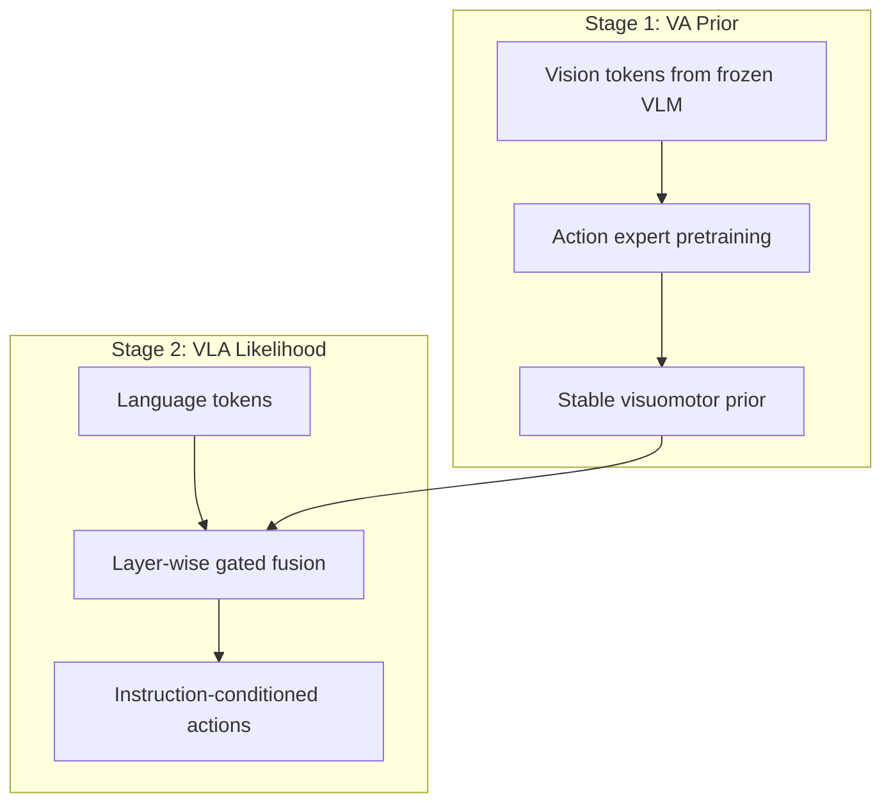

# APT: Action Expert Pretraining으로 VLA의 Instruction Generalization 개선하기 학습 자료

## 1. 선수 지식

- Vision-Language-Action(VLA): visual observation + language instruction → executable action.
- Vision-Action(VA): language 없이 visual/state observation에서 action을 예측.
- World-Action Model(WAM): future visual dynamics와 action generation을 함께 모델링하는 policy/world model.
- Imitation learning, diffusion/flow matching action expert, retrieval-augmented policy 기본 개념.

## 2. Glossary

| 용어 | 설명 |
|---|---|
| action grounding | VLM/VLA의 reasoning이 실제 executable action으로 연결되는 과정 |
| closed-loop | action 실행 후 새 observation을 받아 반복 제어하는 방식 |
| trajectory | 시간 순서가 있는 waypoint/action sequence |
| visual shortcut | language instruction을 무시하고 visual cue만으로 action을 예측하는 실패 모드 |
| embodiment gap | source/human/다른 robot과 target robot 사이의 morphology/action 차이 |
| VA prior | 언어 없이 가능한 행동 분포를 먼저 학습한 prior |
| gated fusion | language/VLM feature를 action expert에 선택적으로 주입하는 gate 구조 |

## 3. Architecture Diagram

## 4. 단계별 이해

1. VLA 데이터는 언어보다 vision-action frame이 압도적으로 많아 언어 불균형이 생긴다.
2. continuous action expert는 random init에서 시작해 noisy gradient로 VLM representation을 흔들 수 있다.
3. 먼저 visual tokens만으로 action expert를 pretrain하면 안정적인 VA prior가 생긴다.
4. 그다음 gated fusion으로 language feature를 넣으면 instruction이 prior를 선택/수정한다.
5. 결과적으로 unseen instruction과 compositional instruction에서 language sensitivity가 높아진다.

## 5. Implementation / Deployment Notes

- 자율주행에 적용하려면 robot end-effector action 대신 waypoint/trajectory/occupancy/BEV planner output으로 action representation을 바꿔야 한다.
- closed-loop deployment에서는 latency budget, safety verifier, uncertainty estimation이 필수다.
- retrieval 방식은 memory freshness와 false retrieval을 감시해야 하며, APT 방식은 stage-wise training data split과 gate saturation을 모니터링해야 한다.

## 6. Study Questions & Answers

1. Q: 이 논문이 해결하는 VLA 병목은 무엇인가?
   A: executable action generation에서 생기는 scaling/generalization 병목이다.
2. Q: autonomous driving VLA와의 연결점은?
   A: 언어/시각 reasoning을 trajectory로 grounding하고 closed-loop latency/safety를 맞춰야 한다는 점이 동일하다.
3. Q: 가장 큰 deployment risk는?
   A: 그럴듯한 reasoning 또는 prior가 실제 안전한 action과 causal하게 연결되지 않을 수 있다는 점이다.

## 7. Reading Roadmap

- 먼저 `analysis.md`로 문제와 기여를 파악한다.
- 그다음 `paper-ko.md`의 Method/Experiments section을 읽는다.
- [[TBD-VLA]], [[ReflectDrive2]], [[VisualThink-VLA]], [[OpenVLA]], [[GR00T-N1]]과 비교해 action representation 관점의 map을 만든다.
