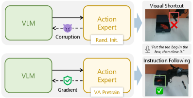
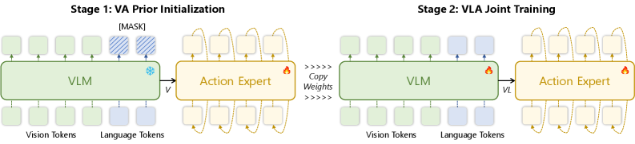
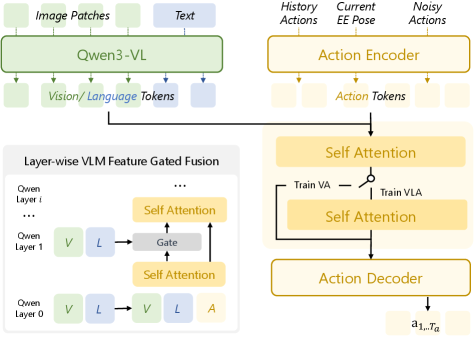
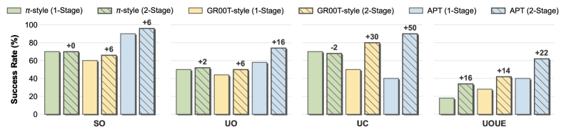
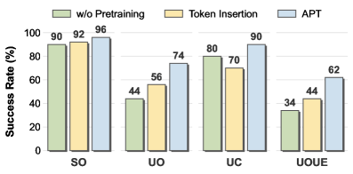
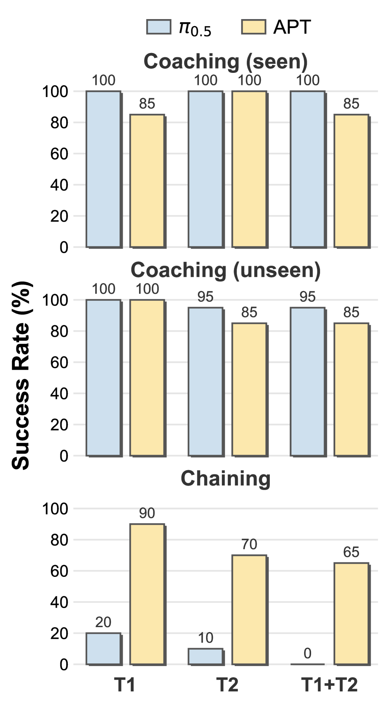
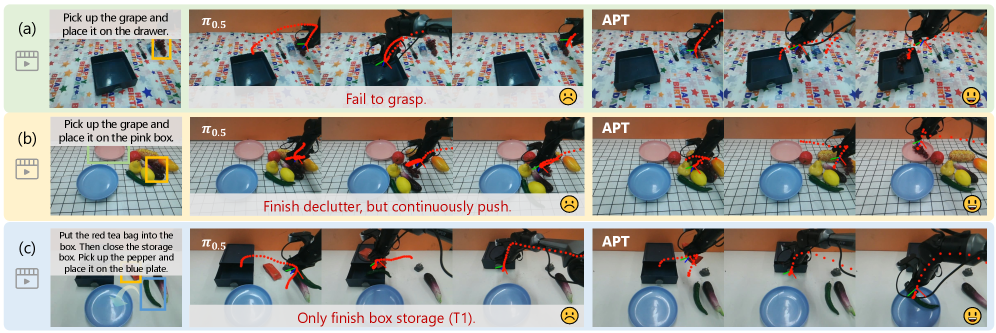
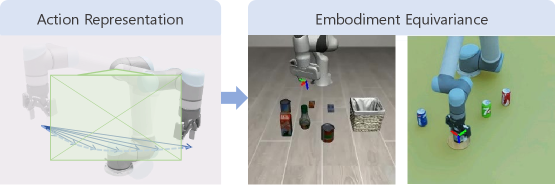
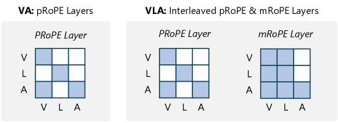
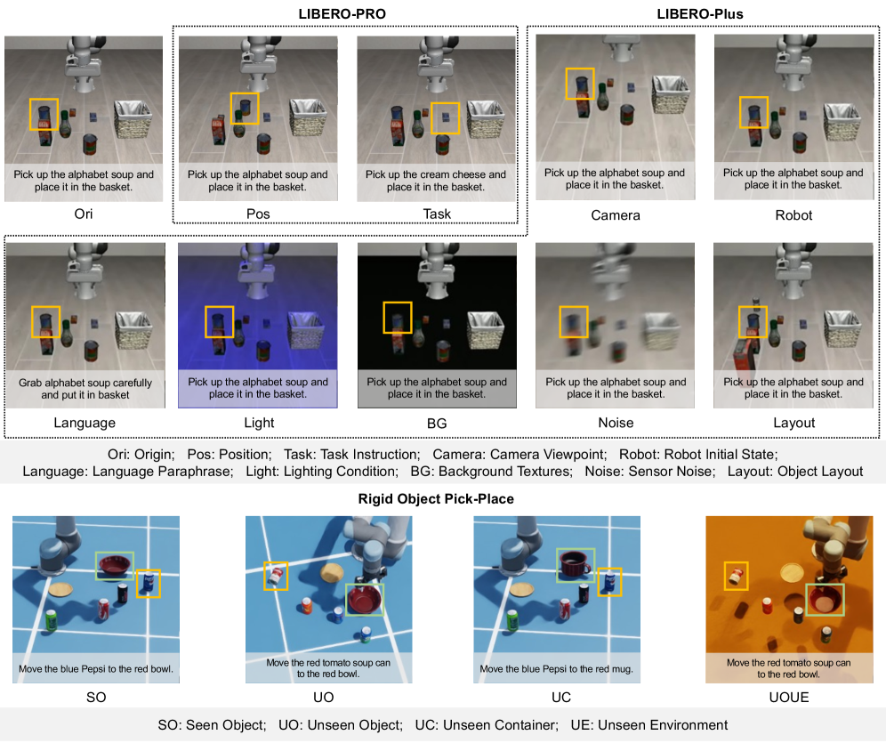

# APT: Action Expert Pretraining으로 VLA의 Instruction Generalization 개선하기

- 원제: **APT: Action Expert Pretraining Improves Instruction Generalization of Vision-Language-Action Policies**
- 저자: Kechun Xu, Zhenjie Zhu, Anzhe Chen, Rong Xiong, Yue Wang
- arXiv: [2606.12366](https://arxiv.org/abs/2606.12366) / HF: [https://huggingface.co/papers/2606.12366](https://huggingface.co/papers/2606.12366)
- Published: 2026-06-10 / Categories: cs.RO
- Project: https://xukechun.github.io/papers/APT/
- 읽기 모드: arXiv HTML 본문을 기준으로 Abstract, Introduction, Method, Experiments, Discussion/Conclusion을 심층 한국어 기술 번역·정리했다. 세부 appendix와 모든 수식/표의 완전 전사는 생략하고, 핵심 appendix 결과와 figure caption은 요약했다.

## 원문 구조

APT: Action Expert Pretraining Improves Instruction Generalization of Vision-Language-Action Policies; 1 Introduction; 2 Related Work; 3 Method; 3.1 Problem Statement; 3.2 Action Pretraining under Bayesian Formulation; 3.3 Action Expert Design; 4 Experiments; 4.1 Simulation Experiments; 4.1.1 Benchmarks; 4.1.2 Baselines; 4.1.3 Main Results; 4.1.4 More Ablation Studies; 4.2 Real-World Experiments; 4.2.1 Experiment Setup; 4.2.2 Single Task Generalization; 4.2.3 Compositional Task Generalization; 5 Conclusion; References; Appendix A Implementation Details; Appendix B Visual Shortcut Analysis; B.1 Shortcut Learning; B.2 Two-stage Conditioning; Appendix C Baseline Details; Appendix D Simulation Experiment Details

## 그림 파일

- Figure 1: 
  - Caption/맥락: Figure 1: Action expert pretraining (APT) enables effective instruction following.
- Figure 2: 
  - Caption/맥락: Figure 2: Overview of APT. In Stage 1, the action expert is pretrained as a VA prior conditioned solely on visual tokens from a frozen VLM backbone. In Stage 2, language tokens are injected, training the full VLA policy to align the pretrained action distribution with the task instruction.
- Figure 3: 
  - Caption/맥락: Figure 3: Action Expert Design. VLM features are injected into action expert via gated fusion. The action expert processes multimodal tokens by self-attention.
- Figure 4: 
  - Caption/맥락: Table 1: Results on LIBERO-PRO (success rate %).
- Figure 5: 
  - Caption/맥락: Table 2: Results on Pick-Place (rate %).
- Figure 6: 
  - Caption/맥락: Figure 4: Action expert pretraining applies to diverse architectures.
- Figure 7: 
  - Caption/맥락: Figure 5: Ablation on large-scale pretraining and language injection mechanism.
- Figure 8: 
  - Caption/맥락: Figure 6: Results on compositional task.
- Figure 9: 
  - Caption/맥락: Table 3: Real-world task generalization results (successes/trials).
- Figure 10: 
  - Caption/맥락: Figure 7: Real-world cases. (a) pick-place task, (b) clutter pick-place task, (c) compositional task chaining.

## Abstract 한국어 번역

VLM과 continuous action expert를 결합한 VLA는 조작 성능은 강하지만, 훈련 분포 밖의 language instruction 일반화가 약하다. 근본 원인 중 하나는 VLA 데이터의 구조적 불균형이다. 긴 vision-action trajectory에 비해 언어 지시는 훨씬 덜 다양하므로, policy가 언어를 무시하고 visual shortcut을 학습하기 쉽다. discrete action token 계열은 vision-language co-training으로 이를 완화하지만, continuous action expert는 random initialization에서 imbalanced data를 바로 학습해 noisy gradient가 VLM을 오염시키고 언어 능력을 충분히 활용하지 못한다. APT는 policy를 language-agnostic VA prior와 language-conditioned VLA likelihood로 Bayesian factorization하고, 1단계에서 frozen VLM의 visual token만으로 action expert를 VA prior로 pretrain한 뒤, 2단계에서 gated fusion으로 language token을 주입한다. π/GR00T-style architecture 모두에 적용 가능하며 unseen instruction과 compositional task에서 일관된 성능 향상을 보인다.

## Section-by-section 한국어 기술 번역

### 1 Introduction

VLA의 실제 배포에서 중요한 능력은 단순히 seen task를 수행하는 것이 아니라, 언어가 바뀌거나 조합형 지시가 들어와도 올바르게 행동하는 OOD instruction generalization이다. 그러나 많은 VLA dataset은 하나의 instruction에 다수의 visual-action frame이 붙는 구조라 언어 다양성이 낮다. 그 결과 모델은 언어를 읽지 않고 scene visual cue만으로 action을 예측하는 visual shortcut을 학습할 수 있다.

### 2 Related Work

논문은 discrete-action VLA와 continuous-action expert VLA를 대비한다. Discrete action token 방식은 VLM의 token prediction objective와 더 잘 맞아 language co-training의 보호를 받지만, continuous action expert는 별도 module이 random initialization에서 시작해 imbalanced data에 노출된다. APT는 continuous expert를 버리지 않고 pretraining 순서를 바꿔 이 문제를 완화한다.

### 3 Method

핵심 공식은 π(a|v,l) ∝ π^p(a|v) · L(l|v,a)이다. 여기서 π^p는 language-agnostic Vision-Action prior, L은 language-conditioned likelihood이다. 먼저 시각 관찰에서 가능한 행동 분포를 안정적으로 학습한 다음, 언어가 그 행동 prior를 어떻게 선택·조정하는지 학습하게 한다.

### 3.2 Action Pretraining under Bayesian Formulation

Stage 1에서는 VLM backbone을 frozen하고 visual token만 action expert에 제공해 VA prior를 학습한다. 이 단계는 언어 불균형을 우회한다. action expert가 먼저 안정적인 visuomotor mapping을 학습하면, Stage 2에서 언어 conditioning이 들어올 때 noisy action gradient가 VLM semantic representation을 망가뜨릴 가능성이 줄어든다.

### 3.3 Action Expert Design

APT는 layer-wise gated fusion을 통해 VLM feature를 action expert에 주입한다. 단순 concat이나 cross-attention보다 중요한 점은 learned gate가 visuomotor prior를 보존하면서 instruction-relevant language feature만 선택적으로 통합한다는 것이다. 따라서 language가 action distribution을 완전히 덮어쓰기보다 prior를 조건부로 reweight한다.

### 4 Experiments

시뮬레이션에서는 LIBERO/LIBERO-Plus류 benchmark, unseen instruction, compositional task를 중심으로 평가하고, π-style 및 GR00T-style architecture 양쪽에서 gain을 확인한다. 실제 로봇 실험은 single-task generalization과 compositional task generalization을 분리해, 단순 visual memorization이 아니라 instruction 변화에 대한 대응을 측정한다.

### 5 Conclusion

APT의 메시지는 continuous action expert VLA에서 action module 학습 순서가 language grounding 품질을 좌우한다는 것이다. 강한 VLM을 붙이는 것만으로 충분하지 않고, action expert가 먼저 안정적인 VA prior가 되어야 언어 조건부 likelihood가 깨끗하게 작동한다.

## 핵심 수식/표현 번역

```text
π(a | v, ℓ) ∝ π^p(a | v) · L(ℓ | v, a)
```

이 식은 VLA policy를 두 부분으로 나눈다. `π^p(a|v)`는 언어 없이 시각 관찰만으로 가능한 행동을 모델링하는 **Vision-Action prior**이고, `L(ℓ|v,a)`는 특정 언어 지시가 그 행동을 얼마나 지지하는지 나타내는 **language-conditioned likelihood**이다. APT는 이 분해를 학습 순서로 구현한다. 먼저 action expert를 VA prior로 안정화하고, 그다음 language token을 gated fusion으로 주입한다.

## Experiments / Results 번역 요약

- Simulation: LIBERO 계열 benchmark에서 unseen instruction 및 compositional task 일반화를 평가한다.
- Architecture generality: π-style, GR00T-style continuous action expert 구조 모두에서 APT gain을 보고한다.
- Real-world: single-task instruction 변형과 compositional instruction 변형을 분리해 테스트한다.
- 핵심 해석: Stage 1 VA prior pretraining이 action expert를 안정화하고, Stage 2 gated language fusion이 visual shortcut 대신 instruction-conditioned action selection을 가능하게 한다.

## Limitations / 생략 범위

- 본 문서는 arXiv HTML 본문을 기반으로 한 한국어 기술 번역·정리이며, appendix의 모든 ablation 표와 bibliography 전체를 줄 단위로 번역하지는 않았다.
- figure는 HTML asset을 가능한 범위에서 저장했으며, 원본 논문의 모든 subfigure 의미는 caption과 본문 설명을 기준으로 요약했다.
- 실제 수치 결과는 원문 표를 우선 확인해야 한다. 이 문서는 weekly study와 llm-wiki ingest를 위한 기술 독해 자료다.
