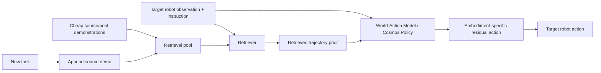

# Retrieve, Don't Retrain: 테스트 시점 검색으로 VLA를 새 태스크에 확장하기 분석

## 한 문장 결론

ReCAP은 새 태스크마다 VLA를 다시 fine-tuning하지 않고, cheap source-embodiment demo를 retrieval pool에 추가해 frozen policy가 test time에 행동 prior를 가져오게 만드는 retrieval-conditioned VLA/WAM 정책이다.

## 왜 선택했나

현재 주(2026-W25) 후보 중 VLA/action policy 관련 점수가 가장 높고, per-task retraining 대신 retrieval pool 확장으로 새 작업을 흡수하는 test-time adaptation 패러다임을 제안해 VLA 스케일링 병목과 직접 연결된다.

## 문제 정의

VLA policy를 새 task에 확장할 때마다 target robot demonstration과 per-task fine-tuning을 요구하면 데이터 수집과 compute 비용이 task 수에 비례해 증가한다. 문제는 새 task knowledge를 parameter update 없이 어떻게 흡수할 수 있는가이다.

## 핵심 기여

- Test-time task extension: 새 task를 retrieval pool update로 추가하고 policy parameter는 frozen 유지
- Retrieval-conditioned residual policy: 검색 trajectory를 coarse motion prior로 사용
- World-Action Model 결합: Cosmos Policy future-image objective로 retrieval-conditioned action의 visual consistency 강화
- Cross-embodiment transfer: human-hand/source embodiment demo를 target robot action에 연결
- PushT, RoboTwin 2.0, real robot으로 retrieval adaptation을 검증

## Architecture / Pipeline

## Input / Output / Action Representation

| 항목 | 내용 |
|---|---|
| 입력 | target robot observation, language instruction, retrieved source-embodiment trajectory |
| backbone | Cosmos Policy 계열 World-Action Model |
| 중간 표현 | retrieval trajectory prior + residual action latent |
| 출력 | target embodiment robot action |
| adaptation 단위 | parameter update가 아니라 retrieval memory update |

## Training Recipe

1. Source/pool embodiment demonstration과 target embodiment demonstration의 paired data로 retrieval-conditioned policy를 학습한다.
2. Retriever가 current context에 맞는 source trajectory를 선택한다.
3. WAM policy는 retrieved trajectory를 coarse prior로 사용하고 residual target action을 예측한다.
4. 학습 후 policy를 frozen한다.
5. deployment의 새 task는 source demonstration을 pool에 추가하는 방식으로 확장한다.

## Dataset / Benchmark / Metric

- PushT: unseen goal angle, motion prior 분석
- RoboTwin 2.0: unseen tasks, cross-embodiment baseline 비교
- real robot: 실제 조작 task 검증
- success rate와 retrieval-conditioned behavior quality 중심

## Open-loop vs Closed-loop

두 논문 모두 offline action prediction보다 실제 closed-loop robot control에 가까운 문제를 다룬다. 다만 autonomous driving closed-loop CARLA/nuPlan이 아니라 manipulation benchmark 중심이다. 자율주행 VLA에 직접 적용하려면 action representation을 waypoint/trajectory/BEV planner output으로 바꾸고 safety verifier를 추가해야 한다.

## 강점

- VLA의 action grounding 병목을 모델 구조/학습 절차 관점에서 직접 다룬다.
- 단순 VLM 성능이 아니라 executable action 생성의 실패 원인을 분리한다.
- robotics manipulation이지만 자율주행 VLA planner에도 transferable한 설계 패턴을 제공한다.

## 한계 / 리스크

- retrieval이 잘못되면 policy가 그럴듯하지만 위험한 trajectory prior를 따를 수 있다.
- memory 규모가 커질수록 retrieval latency와 false-positive retrieval 문제가 생긴다.
- source embodiment와 target embodiment 차이가 큰 경우 residual correction만으로 충분하지 않을 수 있다.

## 찬호님 관심사와 연결

- VLA for AD에서 language/visual reasoning이 실제 trajectory로 grounding되는 방식을 비교할 수 있다.
- [[ReflectDrive2]], [[TBD-VLA]], [[VisualThink-VLA]]와 함께 읽으면 discrete token, retrieval, continuous action expert의 장단점이 보인다.
- closed-loop latency, safety verifier, retrieval/representation transfer는 자율주행 VLA 연구 map의 핵심 축이다.
