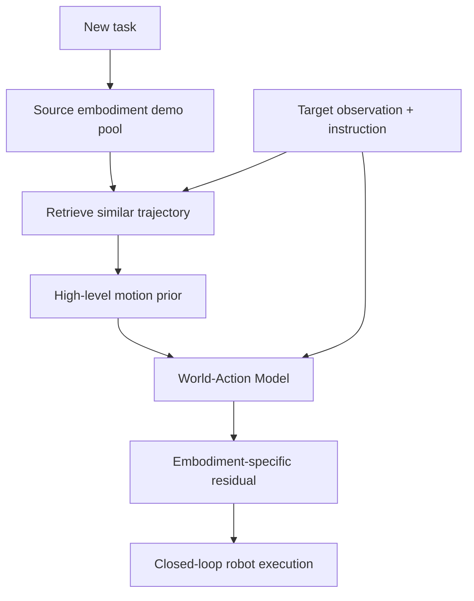

# Retrieve, Don't Retrain: 테스트 시점 검색으로 VLA를 새 태스크에 확장하기 학습 자료

## 1. 선수 지식

- Vision-Language-Action(VLA): visual observation + language instruction → executable action.
- Vision-Action(VA): language 없이 visual/state observation에서 action을 예측.
- World-Action Model(WAM): future visual dynamics와 action generation을 함께 모델링하는 policy/world model.
- Imitation learning, diffusion/flow matching action expert, retrieval-augmented policy 기본 개념.

## 2. Glossary

| 용어 | 설명 |
|---|---|
| action grounding | VLM/VLA의 reasoning이 실제 executable action으로 연결되는 과정 |
| closed-loop | action 실행 후 새 observation을 받아 반복 제어하는 방식 |
| trajectory | 시간 순서가 있는 waypoint/action sequence |
| visual shortcut | language instruction을 무시하고 visual cue만으로 action을 예측하는 실패 모드 |
| embodiment gap | source/human/다른 robot과 target robot 사이의 morphology/action 차이 |
| retrieval pool | 새 task demonstration을 저장하고 test time에 검색하는 memory |
| residual policy | retrieved trajectory 위에 target embodiment 보정을 더하는 policy |

## 3. Architecture Diagram

## 4. 단계별 이해

1. 새 task마다 target robot demo와 fine-tuning을 요구하면 scaling이 막힌다.
2. cheap source embodiment demo를 retrieval pool에 저장한다.
3. 현재 observation/instruction과 유사한 source trajectory를 검색한다.
4. WAM policy가 retrieved trajectory를 coarse prior로 보고 target robot residual action을 생성한다.
5. 새 task 추가는 parameter update가 아니라 retrieval memory update가 된다.

## 5. Implementation / Deployment Notes

- 자율주행에 적용하려면 robot end-effector action 대신 waypoint/trajectory/occupancy/BEV planner output으로 action representation을 바꿔야 한다.
- closed-loop deployment에서는 latency budget, safety verifier, uncertainty estimation이 필수다.
- retrieval 방식은 memory freshness와 false retrieval을 감시해야 하며, APT 방식은 stage-wise training data split과 gate saturation을 모니터링해야 한다.

## 6. Study Questions & Answers

1. Q: 이 논문이 해결하는 VLA 병목은 무엇인가?
   A: executable action generation에서 생기는 scaling/generalization 병목이다.
2. Q: autonomous driving VLA와의 연결점은?
   A: 언어/시각 reasoning을 trajectory로 grounding하고 closed-loop latency/safety를 맞춰야 한다는 점이 동일하다.
3. Q: 가장 큰 deployment risk는?
   A: 그럴듯한 reasoning 또는 prior가 실제 안전한 action과 causal하게 연결되지 않을 수 있다는 점이다.

## 7. Reading Roadmap

- 먼저 `analysis.md`로 문제와 기여를 파악한다.
- 그다음 `paper-ko.md`의 Method/Experiments section을 읽는다.
- [[TBD-VLA]], [[ReflectDrive2]], [[VisualThink-VLA]], [[OpenVLA]], [[GR00T-N1]]과 비교해 action representation 관점의 map을 만든다.
