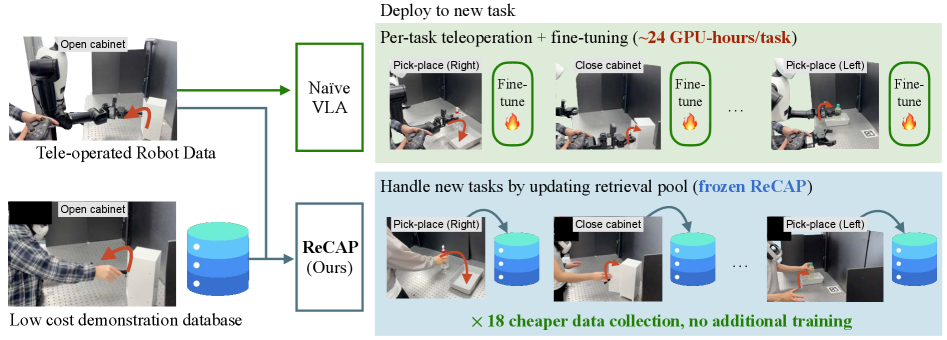
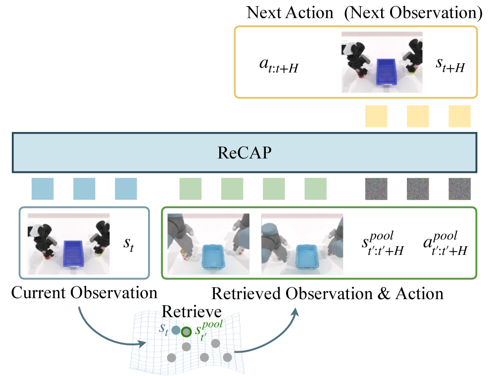
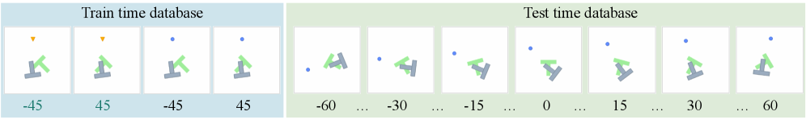
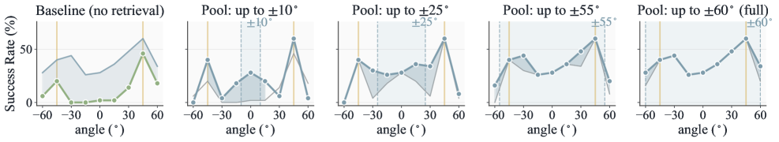
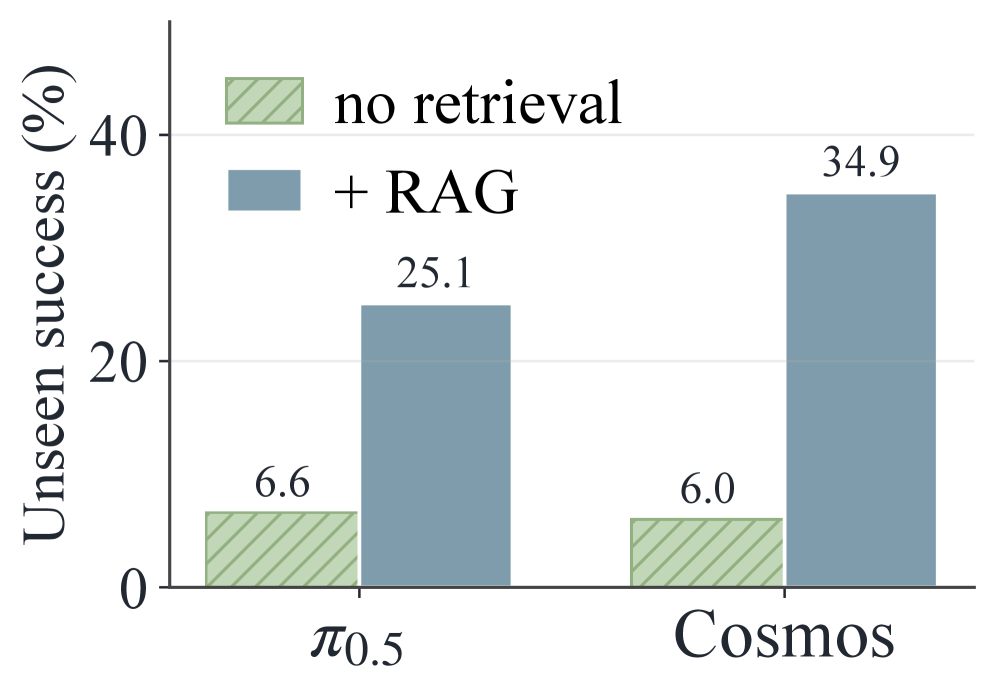
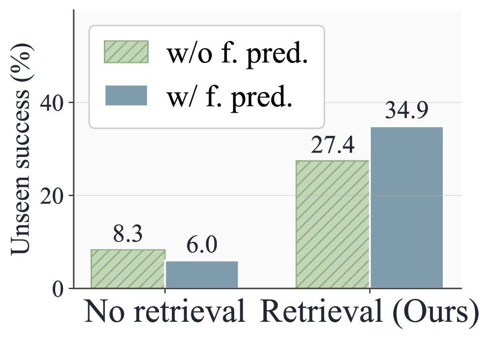
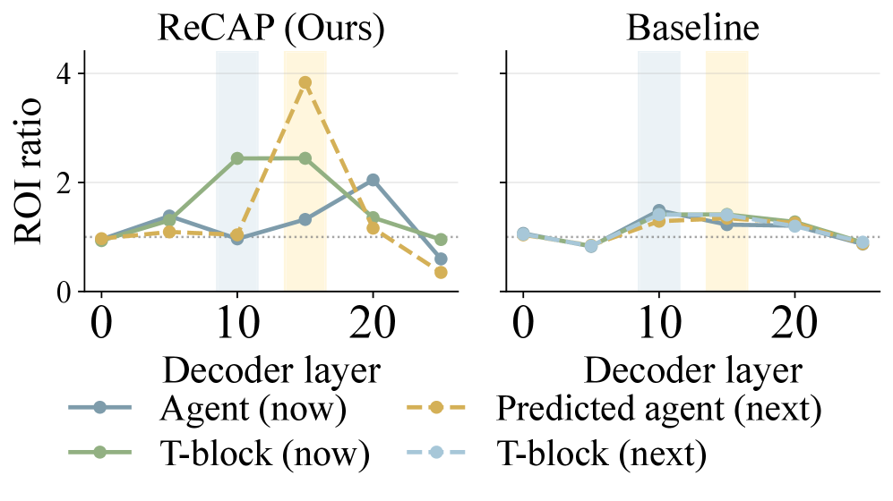
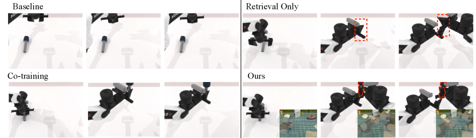
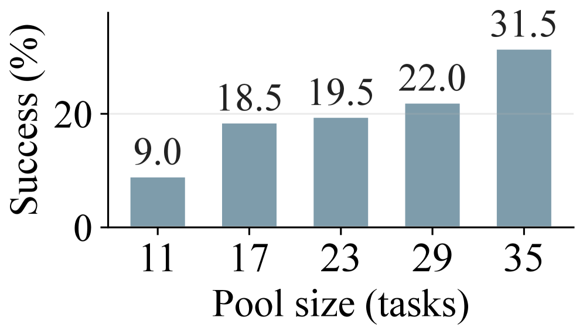
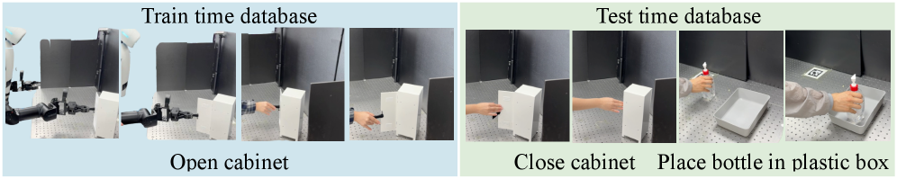

# Retrieve, Don't Retrain: 테스트 시점 검색으로 VLA를 새 태스크에 확장하기

- 원제: **Retrieve, Don't Retrain: Extending Vision Language Action Models to New Tasks at Test Time**
- 저자: Jeongeun Park, Juhan Park, Taekyung Kim, Sungjoon Choi, Dongyoon Han, Sangdoo Yun
- arXiv: [2606.15631](https://arxiv.org/abs/2606.15631) / HF: [https://huggingface.co/papers/2606.15631](https://huggingface.co/papers/2606.15631)
- Published: 2026-06-14 / Categories: cs.RO, cs.AI
- Project: https://recap-robot.github.io/
- 읽기 모드: arXiv HTML 본문을 기준으로 Abstract, Introduction, Method, Experiments, Discussion/Conclusion을 심층 한국어 기술 번역·정리했다. 세부 appendix와 모든 수식/표의 완전 전사는 생략하고, 핵심 appendix 결과와 figure caption은 요약했다.

## 원문 구조

Retrieve, Don’t Retrain: Extending Vision-Language-Action Models to New Tasks at Test Time; 1 Introduction; 2 Related Work; 3 Problem Formulation; 4 Proposed Method; 4.1 Retrieval-Augmented World Action Model; 4.2 Retrieval; 5 Experiments; 5.1 Experiment Setup; 5.2 PushT Experiments; 5.3 RoboTwin Simulation Experiments; 5.4 Real Robot Experiments; 6 Discussions; References; Appendix A Additional PushT Results; Comparison with prior cross-embodiment recipes.; Full action-parameterization × \times next-state ablation.; Appendix B PushT Mechanism Analysis; Probe protocol.; Two-stage routing: L10 intake, L15 commit.; Both axes require retrieval.; Both axes are causally necessary.; Appendix C PushT Failure Case Analysis; Axis 1 (L15 commit): weakened on every failure.; Axis 2 (L10 intake): an under-/over-anchoring spectrum.

## 그림 파일

- Figure 1: 
  - Caption/맥락: Figure 1: ReCAP overview. Instead of teleoperating each new task and fine-tuning the policy (top, ∼ \sim 24 GPU-hours/task for Cosmos Policy [ 10 ] ), ReCAP appends cheap human-hand demonstrations to a retrieval pool while keeping the policy frozen (bottom), 18 × \times cheaper [ 24 , 26 ] , no additional training.
- Figure 2: 
  - Caption/맥락: Figure 2: ReCAP framework. The current observation retrieves a matching state-action chunk from the pool database; the retrieved chunk and the current observation then condition a world action model that denoises the next action and next observation in one video sequence.
- Figure 3: 
  - Caption/맥락: Figure 3: PushT cross-embodiment pool database setting. The training set pairs the triangle (target) and disc (pool) at ± 45 ∘ \pm 45^{\circ} . The test set is a pool database of disc-pusher demonstrations spanning all goal angles, which the frozen triangle policy retrieves from on the seven unseen angles.
- Figure 4: 
  - Caption/맥락: Figure 4: Test-time pool progression on PushT. The leftmost panel is the no-retrieval baseline with our full-pool curve overlaid (shaded gap). The other panels show per-angle success as the pool grows with no retraining, with the previous snapshot in gray and the incremental gain shaded.
- Figure 5: 
  - Caption/맥락: (a) Backbone comparison.
- Figure 6: 
  - Caption/맥락: (b) Joint training (Cosmos).
- Figure 7: 
  - Caption/맥락: (c) ROI ratio across layers.
- Figure 8: 
  - Caption/맥락: Figure 5: Comparative analyses of ReCAP and baseline on PushT. (a) Unseen-angle success with and without retrieval on a π 0.5 \pi_{0.5} and a Cosmos (WAM) backbone; retrieval helps both, and the WAM benefits more. (b) The future-image objective improves unseen success only when paired with retrieval. (c) Action-slot attention across decoder layers, which peaks on the T-block and then on the predicted next position under retrieval but stays near uniform without it.
- Figure 9: 
  - Caption/맥락: Table 1: Quantitative analysis on RoboTwin. We report per-task success rate ( % \% ) on RoboTwin, with Aloha-Agilex as the target embodiment and UR5 as the retrieval pool. The left block shows seen tasks, and the right block shows unseen tasks.
- Figure 10: 
  - Caption/맥락: Figure 6: Qualitative comparison on the held-out hand-over-mic task. Baseline (top-left) and Co-training (bottom-left) fail to grasp the microphone; Retrieval Only (top-right) knocks it over (red box); Ours (bottom-right) grasps it successfully. Each inset shows the retrieved UR5 chunk that the policy conditions on.

## Abstract 한국어 번역

VLA 정책을 새 태스크에 확장하려면 보통 target embodiment에서 teleoperation demonstration을 모으고 태스크별 fine-tuning을 수행해야 한다. 이 논문은 그 비용을 retrieval로 대체할 수 있음을 보인다. ReCAP은 target embodiment(query)와 더 저렴한 source/pool embodiment(예: 인간 손 비디오) 사이의 paired demonstration으로 한 번 학습한 뒤 frozen 상태로 둔다. 이후 새 태스크는 pool-side demonstration을 retrieval memory에 추가하는 것만으로 흡수된다. 정책은 매 control step마다 검색된 trajectory에 조건화되며, retrieval은 coarse task progression을 제공하고 Cosmos Policy 같은 World-Action Model(WAM)은 future-image objective로 시각적 일관성을 보강한다. PushT, RoboTwin 2.0, 실제 로봇 실험에서 cross-embodiment generalization과 unseen-task 성능 향상을 보고한다.

## Section-by-section 한국어 기술 번역

### 1 Introduction

일반-purpose robot policy는 자연어 지시와 시각 관찰에서 조작 행동을 생성해야 하지만, 새 embodiment나 새 task가 등장할 때마다 target robot demo와 fine-tuning이 필요하다는 문제가 있다. 저자들은 인간 손 비디오처럼 싸고 풍부한 source embodiment 행동 지식을 검색 가능한 memory로 두고, target robot policy가 이를 step마다 참조하면 per-task optimization 없이도 행동 coverage를 늘릴 수 있다고 주장한다. 핵심은 policy parameter를 업데이트하지 않고 retrieval index만 업데이트한다는 점이다.

### 2 Related Work

논문은 OpenVLA, π0.5, GR00T 계열처럼 language/vision backbone에 action head를 붙이는 VLA와, Cosmos Policy·DreamZero·Fast-WAM처럼 video/world model 안에 action을 통합하는 World-Action Model 계열을 구분한다. ReCAP은 후자에 retrieval을 결합한다. 기존 retrieval imitation learning이 single embodiment나 offline nearest neighbor에 머물렀다면, 이 논문은 cross-embodiment source pool을 target policy 실행 중에 계속 조건으로 주는 점이 다르다.

### 3 Problem Formulation

입력은 target robot의 현재 observation, language instruction, 그리고 retrieval pool의 source-embodiment demonstration이다. 목표는 target robot action을 생성하는 것이다. 새 태스크가 들어와도 target robot demonstration이나 gradient update를 요구하지 않고, source pool에 cheap demo만 추가한다고 가정한다. 따라서 learning problem은 'source trajectory가 target robot 실행에 유용한 high-level motion prior가 되도록 policy를 학습하는 것'으로 바뀐다.

### 4 Proposed Method

ReCAP은 retrieval-conditioned residual policy로 설계된다. Retrieval은 high-level motion과 task progression을 제공하고, policy는 retrieved trajectory와 target observation 사이의 embodiment-specific correction을 학습한다. WAM의 future-image prediction objective는 검색된 trajectory가 실제 다음 관찰과 맞도록 visual consistency signal을 제공한다. 즉 retrieval은 coarse plan, WAM은 physical/visual feasibility, action head는 target embodiment control을 담당한다.

### 4.1 Retrieval-Augmented WAM

Cosmos Policy 기반 WAM은 future visual latent와 action latent를 함께 다루므로, 검색된 demonstration을 단순 prompt가 아니라 trajectory prior로 주입할 수 있다. action latent를 retrieved trajectory에 대한 residual로 parameterize하면 policy가 새 태스크의 전체 motion을 처음부터 생성하지 않아도 된다.

### 4.2 Retrieval

검색은 task instruction과 현재 visual context에 맞는 source-embodiment trajectory를 찾는다. deployment에서 새 태스크를 추가할 때 필요한 일은 새 source demonstration을 pool에 indexing하는 것이다. 이 구조는 parameter update가 아니라 memory update로 adaptation을 수행한다.

### 5 Experiments

평가는 PushT, RoboTwin 2.0 simulation, real robot으로 구성된다. PushT에서는 unseen goal angle에 대한 cross-embodiment generalization과 retrieval이 reusable high-level motion prior를 주는지를 분석한다. RoboTwin 2.0에서는 unseen tasks에서 cross-embodiment baseline을 능가한다고 보고한다. 실제 로봇 실험은 retrieval-conditioned policy가 simulation 밖에서도 동작함을 보여주기 위한 sanity check 역할을 한다.

### 6 Discussion

가장 중요한 시사점은 VLA scaling을 '모델을 계속 재학습하는 문제'가 아니라 'cheap behavior memory를 잘 구축하고 검색하는 문제'로 일부 전환한다는 점이다. 단, retrieval 품질, source-target embodiment gap, memory 규모에 따른 latency, 잘못 검색된 trajectory의 safety risk가 실제 배포 병목이 될 수 있다.

## 핵심 수식/표현 번역

```text
Target action ≈ retrieved source-embodiment trajectory + embodiment-specific residual
New task adaptation = append demonstrations to retrieval pool, not update parameters
```

이 표현은 ReCAP의 핵심을 압축한다. 검색된 trajectory가 coarse high-level motion prior를 제공하고, target policy는 실제 robot embodiment에 맞는 residual correction을 생성한다. 따라서 새 task에 필요한 업데이트는 gradient step이 아니라 retrieval memory 확장이다.

## Experiments / Results 번역 요약

- PushT: unseen goal angle과 cross-embodiment source demonstration 활용을 분석한다. Retrieval은 reusable high-level motion prior로 작동한다.
- RoboTwin 2.0: unseen tasks에서 cross-embodiment baseline보다 높은 성능을 보고한다.
- Real robot: simulation에서만이 아니라 실제 robot에서도 retrieval-conditioned behavior가 작동함을 보인다.
- 핵심 해석: retrieval은 coarse progression, WAM future-image objective는 visual consistency, residual action policy는 embodiment-specific execution을 담당한다.

## Limitations / 생략 범위

- 본 문서는 arXiv HTML 본문을 기반으로 한 한국어 기술 번역·정리이며, appendix의 모든 ablation 표와 bibliography 전체를 줄 단위로 번역하지는 않았다.
- figure는 HTML asset을 가능한 범위에서 저장했으며, 원본 논문의 모든 subfigure 의미는 caption과 본문 설명을 기준으로 요약했다.
- 실제 수치 결과는 원문 표를 우선 확인해야 한다. 이 문서는 weekly study와 llm-wiki ingest를 위한 기술 독해 자료다.
