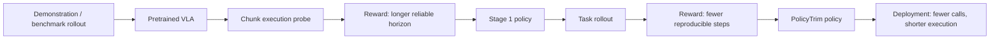

# PolicyTrim: VLA의 intrinsic policy efficiency를 높이는 RL post-training 분석

## 한 문장 결론

PolicyTrim은 action chunk tail degradation과 redundant steps를 줄여 VLA 실행 호출 수를 감소시키는 RL 기반 post-training 프레임워크다.

## 왜 선택했나

현재 주(2026-W26) 후보 중 VLA deployment의 실제 병목인 action chunk 신뢰도와 redundant physical step을 정면으로 다루며, RL post-training으로 end-to-end 속도를 높이는 방법을 제시한다.

## 문제 정의

VLA는 action chunk를 예측하지만 tail prediction이 불안정해 실제 실행에서는 짧게 잘라 쓰거나 자주 재추론한다. 또한 성공 가능한 task에서도 redundant physical steps가 많아 deployment 속도가 떨어진다.

## 핵심 기여

- policy efficiency를 compute efficiency와 분리해 정의
- reliable action chunk length를 RL로 점진 확장
- redundancy-aware reward로 성공률을 유지하며 physical steps 감소
- π0.5, OpenVLA-OFT, GR00T 등 cross-architecture 적용
- action chunk utilization 3배, physical steps 51.4% 감소, 최대 5.83배 speedup 보고

## Architecture / Pipeline

## Input / Output / Action Representation

| 항목 | 내용 |
|---|---|
| 입력 | visual observation, language instruction, proprioception/state |
| 출력 | action chunk / robot manipulation action sequence |
| 최적화 대상 | executable chunk length, total physical steps, success rate |
| deployment 지표 | forward inference calls, physical execution time, speedup |

## Training Recipe

1. pretrained VLA policy를 준비한다.
2. chunk horizon을 변화시키며 rollout한다.
3. 긴 chunk를 성공적으로 실행하면 reward를 부여한다.
4. task success를 유지하며 step 수가 줄어드는 rollout을 보상한다.
5. shortcut/불안정 행동은 penalty로 억제한다.
6. 여러 benchmark/model에서 SR과 speedup을 함께 검증한다.

## Dataset / Benchmark / Metric

- LIBERO subsets
- ManiSkill, Meta-World
- real-world robot manipulation task
- metrics: SR, average physical steps, action chunk execution length, end-to-end speedup

## Open-loop vs Closed-loop

PolicyTrim은 offline action prediction보다 closed-loop deployment에 가까운 문제를 다룬다. 실제 rollout에서 chunk tail reliability와 redundant action을 측정하기 때문이다. 다만 autonomous driving benchmark가 아니라 manipulation 중심이다.

## 강점

- latency를 model inference 시간만이 아니라 policy behavior 관점에서 본다.
- 추가 demonstration 없이 post-training으로 적용 가능하다.
- action chunk 기반 VLA의 실전 병목을 직접 겨냥한다.

## 한계 / 리스크

- reward 설계가 benchmark/task에 민감할 수 있다.
- step 수 감소가 safety margin 감소로 이어지지 않도록 verifier가 필요하다.
- driving으로 옮길 때는 comfort, traffic rule, collision risk, jerk/acceleration constraint를 함께 reward에 넣어야 한다.

## 찬호님 관심사와 연결

자율주행 VLA/E2E planner에서도 “한 번 예측한 trajectory를 얼마나 오래 믿을 수 있는가”와 “불필요한 control correction을 줄일 수 있는가”는 핵심 deployment 문제다. PolicyTrim은 robot manipulation 논문이지만 VLA action grounding과 closed-loop efficiency를 공부하는 데 좋은 사례다.
