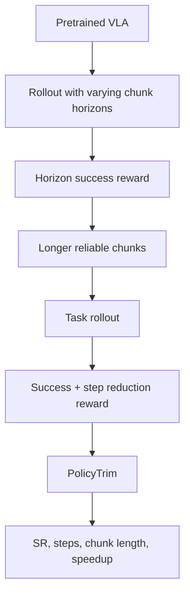

# PolicyTrim: VLA의 intrinsic policy efficiency를 높이는 RL post-training 학습 자료

## Prerequisites

- VLA policy와 action chunk
- Closed-loop rollout evaluation
- Reinforcement learning / reward design
- Robot manipulation benchmark(LIBERO, ManiSkill, Meta-World)

## Glossary

| 용어 | 설명 |
|---|---|
| Intrinsic policy efficiency | model architecture가 아니라 policy behavior 자체가 task를 효율적으로 끝내는 정도 |
| Action chunk | 한 번의 inference로 예측하는 여러 step의 action sequence |
| Tail degradation | action chunk 뒤쪽 action의 신뢰도가 떨어지는 현상 |
| Physical steps | 실제 robot/environment에서 수행되는 action step 수 |
| Redundancy-aware reward | 성공을 유지하면서 불필요 step을 줄이도록 설계한 reward |

## Architecture Diagram



## Step-by-step 설명

1. baseline VLA가 action chunk를 얼마나 길게 안전하게 실행할 수 있는지 측정한다.
2. chunk horizon을 늘려 성공한 rollout에 보상을 준다.
3. policy가 더 긴 chunk tail을 신뢰할 수 있게 된다.
4. 이후 task 완료 step 수를 줄이는 reward를 추가한다.
5. 단순 shortcut이 아니라 재현 가능한 짧은 trajectory를 선호하게 만든다.
6. success rate가 유지되는지 반드시 함께 확인한다.

## Key Equations / Representations

개념적으로 전체 실행 비용은 다음처럼 볼 수 있다.

```text
Total inference calls ≈ Total physical steps / Effective executable chunk length
Deployment speed ∝ fewer physical steps + longer reliable chunks
```

즉 VLA가 한 번에 더 긴 action chunk를 안정적으로 실행하고, task 자체를 더 적은 step으로 끝내면 forward pass 수와 wall-clock execution time이 함께 줄어든다.

## Implementation / Deployment Notes

- reward가 safety margin을 줄이지 않도록 collision/contact/constraint penalty를 같이 넣어야 한다.
- real robot에서는 dynamic perturbation에서도 success를 확인해야 한다.
- autonomous driving 적용 시 jerk, acceleration, lane rule, collision risk, comfort metric을 reward에 포함해야 한다.
- action chunk가 길어질수록 monitoring/fallback controller가 필요하다.

## Study Questions

**Q1. PolicyTrim이 pruning/quantization과 다른 점은?**  
A. pruning/quantization은 한 번의 inference를 빠르게 하지만, PolicyTrim은 필요한 inference 횟수와 physical step 수를 줄인다.

**Q2. action chunk를 무조건 길게 실행하면 좋은가?**  
A. 아니다. tail degradation이 있으면 실패한다. PolicyTrim은 성공 가능한 reliable horizon을 찾아 점진적으로 늘린다.

**Q3. 자율주행에 적용할 때 가장 조심할 점은?**  
A. step 수나 재계획 횟수 감소가 safety margin 감소로 이어질 수 있다. closed-loop safety verifier와 fallback planner가 필수다.

## Reading Roadmap

- Day 1: Abstract, Figure 1로 policy inefficiency 이해
- Day 2: Method 3.1–3.3으로 두 단계 RL objective 분석
- Day 3: Tables로 SR/steps/speedup trade-off 확인
- Day 4: driving trajectory planner에 reward를 어떻게 바꿀지 설계
