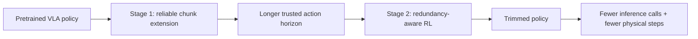
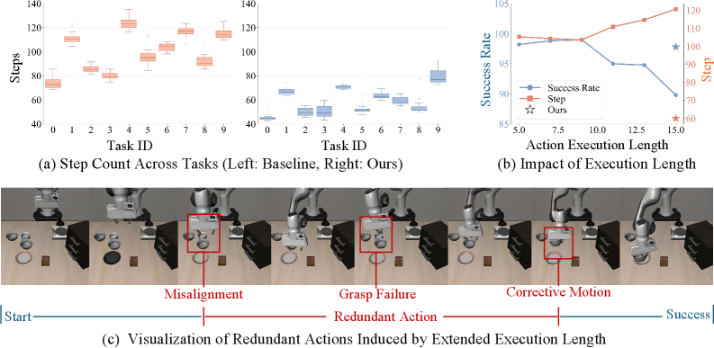
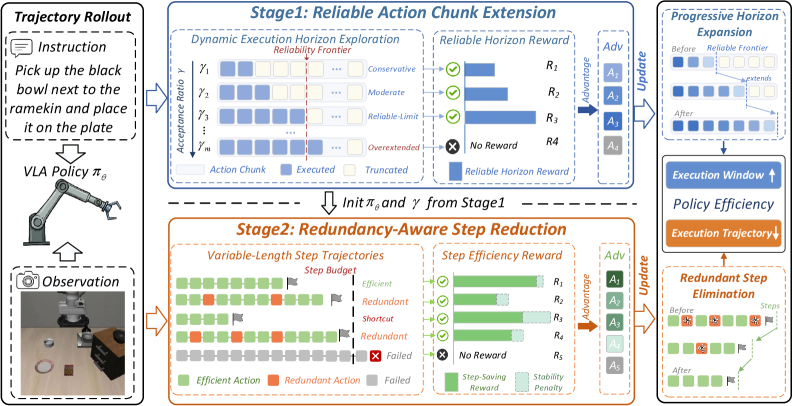
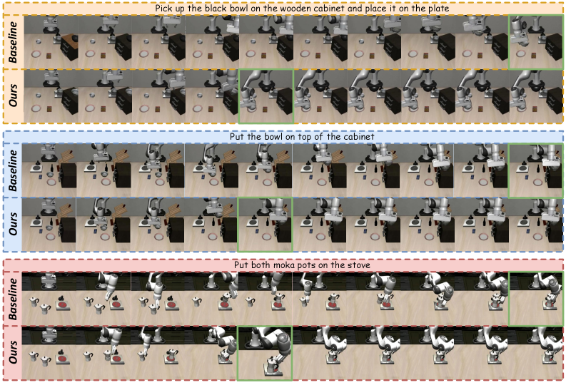
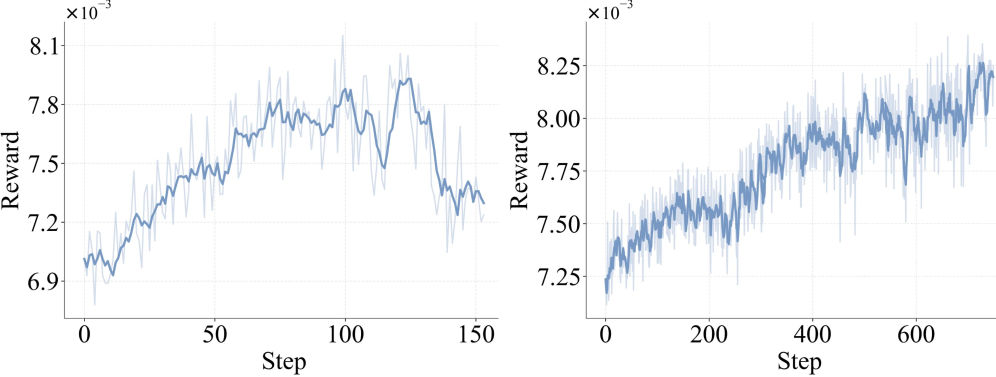

# PolicyTrim: VLA의 intrinsic policy efficiency를 높이는 RL post-training

> 원문: https://arxiv.org/abs/2606.22540  
> 프로젝트: https://inceptionwang.github.io/PolicyTrim/  
> 주의: 이 문서는 한국어 기술 번역/정리본이다. Abstract, Introduction, Method, Experiments, Figures/Captions, Discussion, Conclusion을 중심으로 충실히 옮기고, 부록/세부 hyperparameter 표는 핵심만 요약했다.

## Abstract 한국어 번역

Vision-Language-Action(VLA) model은 robotic manipulation을 위한 통합 paradigm을 제공하지만, 실제 deployment에서는 execution efficiency가 병목이 된다. 기존 연구는 주로 per-step inference latency를 줄이는 compute-centric efficiency에 집중했지만, 모델 policy 자체가 얼마나 효율적으로 task를 끝내는지, 즉 intrinsic policy efficiency는 충분히 연구되지 않았다.

Policy efficiency는 두 요소에 의해 결정된다. 첫째는 predicted action chunk 중 실제로 안정적으로 실행할 수 있는 effective executable length이고, 둘째는 task를 완료하는 데 필요한 total physical steps다. 이 둘은 전체 forward inference call 수를 함께 결정한다. 현재 VLA policy는 planning unreliability와 action redundancy에 취약하다. action chunk 뒤쪽 tail에서 prediction이 급격히 나빠지고, 필요 이상의 redundant physical step을 생성하는 경향이 있다.

PolicyTrim은 이를 해결하기 위한 reinforcement learning 기반 post-training framework다. 첫 번째 단계에서는 dynamic exploration strategy로 더 긴 executable length를 성공적으로 완료하도록 reward를 주어 reliable action chunk length를 확장한다. 두 번째 단계에서는 redundancy-aware reward를 설계해 성공을 유지하면서 더 적은 physical step으로 task를 끝내도록 유도하고, 재현 불가능한 shortcut은 penalize한다. 세 benchmark와 세 VLA model에서 PolicyTrim은 action chunk utilization을 3배 높이고 physical execution step을 51.4% 줄였으며, task success rate를 유지하면서 최대 5.83배 end-to-end deployment speedup을 달성했다.

## 1. Introduction — 문제의식

VLA deployment의 속도 문제는 단순히 한 번의 forward pass가 느리기 때문만이 아니다. policy가 짧은 chunk만 믿고 자주 재계산하거나, 같은 목표를 불필요하게 많은 micro-action으로 수행하면 전체 실행 시간이 길어진다. PolicyTrim은 이 문제를 **compute efficiency**와 구분되는 **policy efficiency** 문제로 정의한다.

- compute-centric efficiency: model pruning, token reduction, quantization 등으로 한 step inference를 빠르게 함
- intrinsic policy efficiency: 같은 success rate를 유지하면서 더 긴 action chunk를 믿고 실행하고, 더 적은 physical step으로 task를 완료함

자율주행으로 비유하면, planner가 매 프레임 지나치게 보수적으로 waypoint를 재계산하거나 불필요한 steering/braking correction을 반복하면 latency가 늘고 ride comfort/safety가 나빠지는 것과 같다.

## 2. Related Work 요약

논문은 VLA model, efficient VLA, RL for VLA를 배경으로 둔다. 기존 VLA는 language instruction과 visual observation을 action chunk로 바꾸지만, action chunk 끝부분의 신뢰성이 낮아 실제 deployment에서는 짧게 잘라 실행하는 경우가 많다. 효율화 연구는 token/pruning/architecture 측면이 많았고, RL fine-tuning은 success rate 개선에 집중하는 경우가 많았다. PolicyTrim은 success rate와 함께 **실행 호출 수 / physical step 수 / reliable horizon**을 직접 최적화한다는 점이 다르다.

## 3. Method

### 3.1 Overview

PolicyTrim은 두 단계 post-training이다.

1. **Reliable Action Chunk Extension**: 현재 policy가 안정적으로 실행할 수 있는 chunk horizon을 점진적으로 늘린다.
2. **Redundancy-Aware Step Reduction**: task success를 유지하면서 전체 physical step을 줄이는 reward를 사용한다.

### 3.2 Reliable Action Chunk Extension

많은 VLA는 한 번에 여러 action을 예측하지만, 실제로는 앞부분만 안정적이고 tail은 task failure를 유발한다. PolicyTrim은 dynamic exploration으로 더 긴 chunk 실행을 시도하고, 성공적으로 완료된 longer executable length에 reward를 준다. 이렇게 empirical limit까지 trustworthy prediction horizon을 밀어 올린다.

### 3.3 Redundancy-Aware Step Reduction

단순히 빠르게 움직이라고 보상하면 shortcut이나 불안정한 동작이 생길 수 있다. PolicyTrim은 task success를 유지하면서 step 수를 줄이는 reward를 사용하고, 재현되지 않는 shortcut은 penalize한다. 목표는 “무작정 빠르게”가 아니라 “성공 가능한 최소한의 불필요 동작 제거”다.

### 3.4 Experimental Setup

평가는 LIBERO, ManiSkill, Meta-World 계열 benchmark와 cross-architecture setting, real-world deployment를 포함한다. 대상 VLA model은 π0.5, OpenVLA-OFT, GR00T 등으로 보고된다. Metric은 success rate(SR), average physical steps, action chunk execution length, end-to-end speedup이다.

## 4. Figures / Captions 번역

- Figure 1: Figure 1 : Intrinsic policy inefficiency in deployed VLA models manifests along two dimensions. (a) Repeated rollouts on identical tasks reveal substantial variance in step counts, indicating concise execution paths exist but emerge only by chance. (b) Forcing longer action chunk execution simultaneously degrades success rates and inflates physical steps, confirming that unreliable tail predictions are a key factor. (c) A visualization of how tail prediction errors trigger misalignment and grasp failures, compelling the robot into redundant corrective actions before eventual task completion.

- Figure 2: Figure 2 : Overview of PolicyTrim. PolicyTrim is a two-stage RL post-training framework that enhances intrinsic policy efficiency of VLA models. The first stage progressively extends the reliable action chunk horizon by rewarding successful execution of longer chunks. The second stage eliminates redundant physical steps via a step-saving reward coupled with group-anchored stability regularization. Together, the two stages jointly reduce the total number of forward inference calls required to complete a task.

- Figure 3: Table 1 : Evaluation of π 0.5 \pi_{0.5} , OpenVLA-OFT, and GR00T on the four subsets of the LIBERO benchmark. We report average success rate (SR), average physical steps ( S total S_{\text{total}} ), average action chunk execution length ( h chunk h_{\text{chunk}} ), and end-to-end execution Speedup (Spd).

- Figure 4: Table 2 : Evaluation on ManiSkill and Meta-World. We report average success rate (SR), average physical steps ( S total S_{\text{total}} ), average action chunk execution length ( h chunk h_{\text{chunk}} ), and end-to-end execution Speedup (Spd).

- Figure 5: Figure 3 : Qualitative comparison on randomly sampled LIBERO tasks. Under identical configurations, the baseline incurs redundant physical actions, whereas PolicyTrim achieves task completion in roughly half the steps.

- Figure 6: Table 3 : Cross-architecture results. We report success rate (SR), average physical steps, action horizon h h , and end-to-end speedup.

- Figure 7: Table 4 : Real-world deployment results. Standard uses a fixed target pose, while Dynamic perturbs the target during grasping. Values under Standard and Dynamic are success rates in %, and Time is measured in seconds.

- Figure 8: Table 5 : Ablation study of different components on LIBERO-Spatial benchmarks.

- Figure 9: Table 6 : Ablation of Dynamic Execution Horizon Exploration on LIBERO-Object using π 0.5 \pi_{0.5} with H = 20 H\!=\!20 . Fixed- γ \gamma variants replace diverse ratio sampling with a single acceptance ratio.

- Figure 10: Figure 4 : Training reward curves without (Left) and with (Right) Group-Anchored Regularization on LIBERO-Spatial ( π 0.5 \pi_{0.5} ).

## 5. Main Results 한국어 정리

PolicyTrim은 성공률을 유지하면서 실행 step을 크게 줄인다. 논문이 강조하는 수치는 action chunk utilization 약 3배 개선, physical execution steps 51.4% 감소, 최대 5.83배 end-to-end speedup이다. 중요한 점은 architecture-specific trick이 아니라 post-training framework로 여러 VLA backbone에 적용했다는 것이다.

## 6. Discussion

PolicyTrim은 VLA deployment에서 “정답 action을 예측했는가?”뿐 아니라 “얼마나 안정적으로 오래 실행할 수 있는가?”, “불필요한 motion 없이 task를 끝냈는가?”를 직접 최적화한다. 이는 real robot deployment와 자율주행 closed-loop planning 모두에 중요한 관점이다.

## 7. Conclusion 한국어 번역

PolicyTrim은 intrinsic policy efficiency를 VLA deployment의 핵심 병목으로 정의하고, reliable action chunk extension과 redundancy-aware step reduction을 결합한 RL post-training으로 해결한다. 이 방식은 추가 demonstration이나 architecture 변경 없이 VLA가 더 긴 action horizon을 신뢰하고 더 적은 physical step으로 task를 완료하게 만든다.

## Appendix 처리 메모

원문 부록의 hyperparameter sensitivity, failure case, 세부 benchmark 표는 학습 목적상 핵심 경향만 요약했다. 실제 재현 실험을 할 때는 원문 Table 1–5와 appendix 설정을 직접 확인해야 한다.
