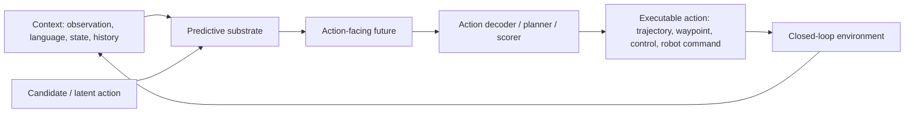

# World Action Models: A Survey — 미래를 덜 꿈꾸고 행동을 더 잘하게 만드는 WAM 서베이 분석

## 한 문장 결론

WAM은 단순 video generation이 아니라, 예측된 미래 표현이 action 선택 경로 안에 남아 제어 의사결정에 쓰이는 predictive-action model이다.

## 왜 선택했나

현재 주(2026-W26) 후보 중 VLA와 world model의 경계를 직접 정리하고, World Action Model(WAM)을 action-facing predictive model로 정의해 VLA for AD/robotics 학습 로드맵에 기준 taxonomy를 제공한다.

## 문제 정의

WAM, VLA, video world model, broad world model이 모두 “미래 예측”과 “action”을 말하지만 실제로는 다른 대상을 최적화한다. 이 논문은 미래 예측이 action decision path 안에 남아야 WAM이라고 정의해 용어 혼선을 줄인다.

## 핵심 기여

- WAM을 action-facing predictive model로 정의
- Render-and-Decode, Latent-Only, Video-Generation-Free의 3분류 taxonomy 제시
- predictive substrate, backbone, action coupling, deployment regime의 4축 anatomy 제시
- evaluation을 visual quality가 아니라 action utility, causality, latency, generalization으로 재정렬
- VLA와 world model 연구를 robotics/autonomous driving deployment 관점에서 연결

## Architecture / Pipeline

## Input / Output / Action Representation

| 항목 | 내용 |
|---|---|
| 입력 | observation, language/instruction, state/history, candidate action |
| 중간 표현 | rendered future, latent future, language/geometric state, action-conditioned rollout |
| 출력 | action score, action chunk, trajectory, waypoint, low-level control |
| 핵심 질문 | 미래 표현이 action selection에 실제로 쓰이는가? |

## Training / Evaluation 관점

- video generation pretraining을 action-conditioned setting으로 재사용할 수 있다.
- VLM/LLM backbone은 video 없이도 action-relevant reasoning substrate가 될 수 있다.
- 평가는 FVD/visual fidelity보다 closed-loop success, policy speed, safety, causal intervention, latency를 봐야 한다.

## 강점

- VLA for AD/world model 연구를 정리할 taxonomy를 제공한다.
- “영상 생성이 좋다 = control이 좋다”는 단순화를 경계한다.
- latency와 action-label cost를 taxonomy 안에 포함한다.

## 한계 / 리스크

- 서베이 특성상 새 benchmark 실험을 제공하지 않는다.
- WAM의 경계가 실제 구현에서는 여전히 모호할 수 있다.
- autonomous driving 전용 benchmark보다 robotics/VLA/world model 전반을 폭넓게 다룬다.

## 찬호님 관심사와 연결

자율주행 VLA에서는 world model이 closed-loop trajectory 선택, risk-aware planning, scenario simulation에 연결되어야 한다. 이 논문은 ReflectDrive, OmniDreams, TBD-VLA, VisualThink-VLA 같은 기존 노트를 비교할 기준축을 제공한다.
