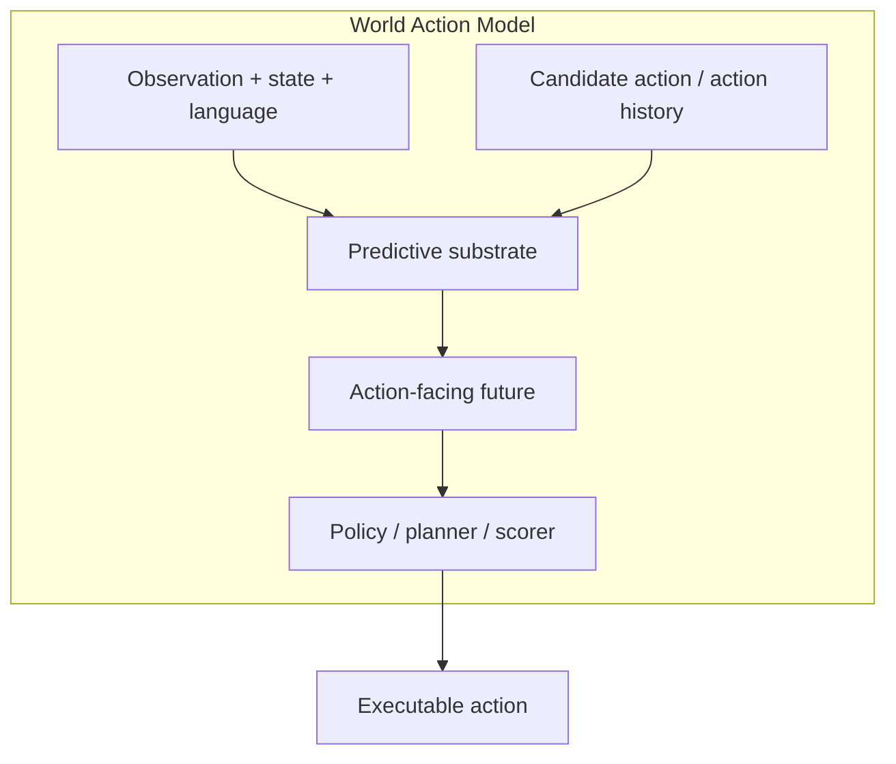

# World Action Models: A Survey — 미래를 덜 꿈꾸고 행동을 더 잘하게 만드는 WAM 서베이 학습 자료

## Prerequisites

- VLA / VLM 기본 구조
- World model과 model-predictive control(MPC)
- Diffusion/video generation model의 latency 특성
- Closed-loop evaluation과 open-loop metric 차이

## Glossary

| 용어 | 설명 |
|---|---|
| WAM | 미래 예측을 action 선택 경로에 남기는 predictive-action model |
| Predictive substrate | 미래가 표현되는 공간: pixel, latent, language, geometry 등 |
| Action coupling | action이 미래 예측에 들어가고 action decoder로 나오는 방식 |
| Render-and-Decode | 미래 영상을 만들고 그 결과에서 action을 뽑는 방식 |
| Latent-Only | pixel 복원 없이 latent future로 action을 만드는 방식 |
| Video-Generation-Free | 영상 생성 없이 reasoning/geometry/state로 action-facing future를 구성하는 방식 |

## Architecture Map

## Step-by-step 이해

1. 먼저 이 모델이 단순 VLA인지, world model인지, WAM인지 구분한다.
2. 미래 표현이 어디에 있는지 본다: pixel인가 latent인가 language/geometric state인가.
3. action이 미래 예측을 condition하는지 확인한다.
4. 예측된 미래가 action decoder/planner/scorer에 들어가는지 확인한다.
5. closed-loop latency와 safety metric이 있는지 확인한다.

## Study Questions

**Q1. WAM과 일반 video generation model의 차이는?**  
A. video generation model은 그럴듯한 미래 영상을 만드는 데 초점이 있을 수 있지만, WAM은 그 미래 표현이 action decision에 직접 쓰여야 한다.

**Q2. 자율주행에서 WAM 평가가 어려운 이유는?**  
A. visual fidelity가 높아도 trajectory choice, safety margin, causal reaction이 틀릴 수 있다. closed-loop에서 ego action과 traffic response가 함께 평가되어야 한다.

**Q3. 왜 “dream less, act more”인가?**  
A. 모든 pixel 미래를 생성하는 것보다 control에 필요한 compact future evidence를 만드는 편이 latency와 robustness에 유리할 수 있기 때문이다.

## Reading Roadmap

- Day 1: Abstract/Introduction과 Figure 1–2로 정의와 taxonomy 이해
- Day 2: Section 3의 세 설계 철학 비교
- Day 3: Section 4 anatomy를 기존 VLA 논문에 적용
- Day 4: Evaluation/open challenges를 자율주행 closed-loop benchmark와 연결
