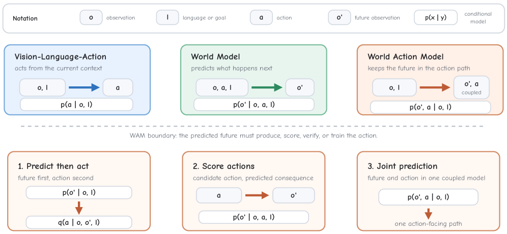
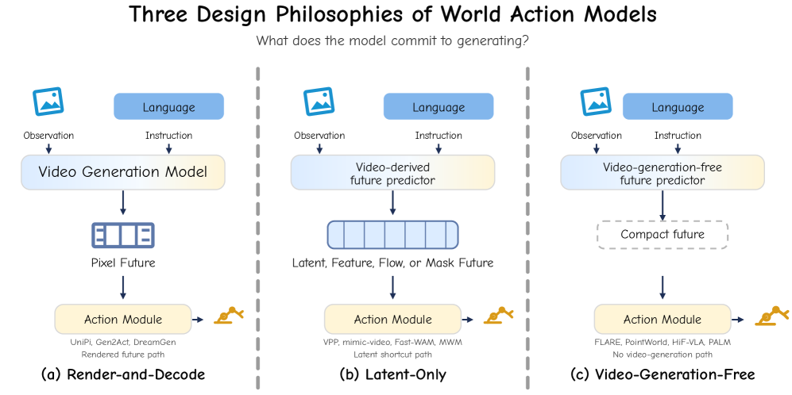
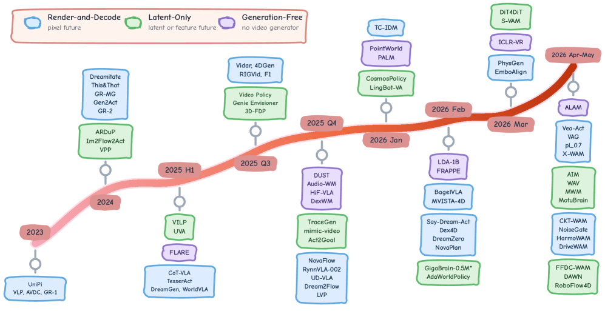
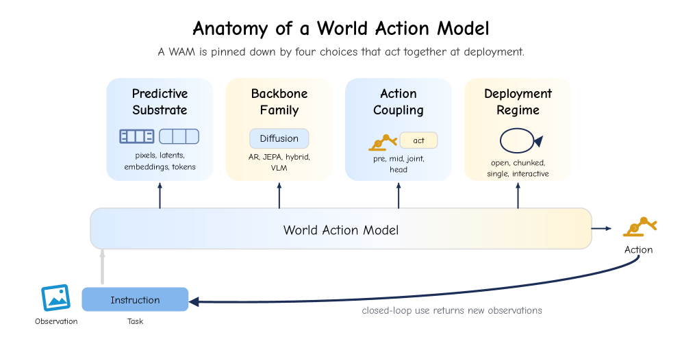
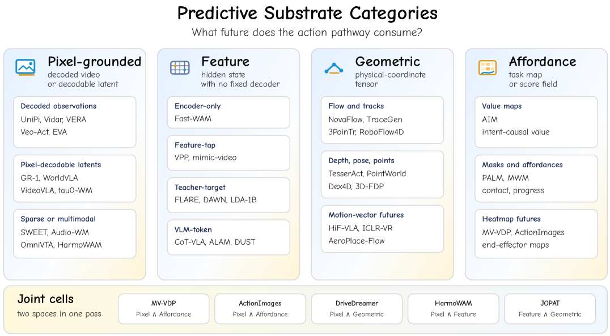
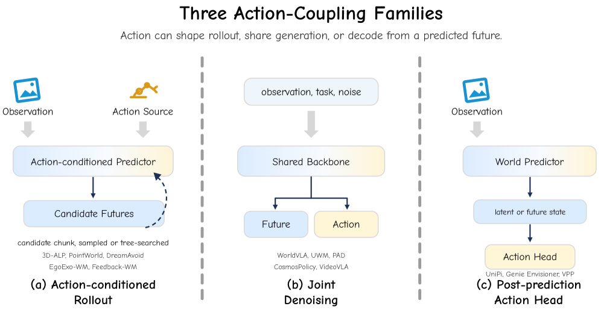

# World Action Models: A Survey — 미래를 덜 꿈꾸고 행동을 더 잘하게 만드는 WAM 서베이

> 원문: https://arxiv.org/abs/2606.20781  
> 프로젝트: https://world-action-models.github.io/  
> 주의: 이 문서는 논문 전체를 한국어 학습용으로 옮긴 기술 번역/정리본이다. 서베이 논문이 매우 길기 때문에 Abstract, Introduction, taxonomy, design anatomy, evaluation/open challenges, figures/captions, conclusion을 중심으로 충실히 번역·재구성했고, 대형 census table과 세부 appendix성 열거는 핵심 축으로 요약했다.

## Abstract 한국어 번역

World Action Model(WAM)은 embodied predictive-action model이다. 핵심은 미래를 예측하는 것 자체가 아니라, 그 예측된 미래가 action 선택에 실제로 사용될 수 있게 action 경로 안에 남는다는 점이다. 최근 WAM은 large video generation model을 재사용하는 흐름과, video-generation core 없이 language 또는 vision-language backbone에 의존하는 흐름으로 빠르게 확장됐다. 그 결과 broad world model, video generation model, action-grounded video world model, Vision-Language-Action(VLA) policy, WAM 사이의 경계가 흐려졌다.

이 서베이는 먼저 이 경계를 정리한 뒤 두 가지 관점으로 기존 연구를 조직한다. 첫 번째 관점은 각 방법이 action을 위해 무엇을 생성해야 하는가를 묻는다. 여기에는 rendered future, latent future, video-generation-free action reasoning이 포함된다. 두 번째 관점은 predictive substrate, backbone, action coupling, deployment regime으로 각 방법을 해부한다. 이 anatomy는 interactability, causality, persistence, physical plausibility, generalization, data, evaluation, open challenge를 통합적으로 논의하게 한다. 결론적으로 WAM은 단순히 video generator에 action head를 붙인 것이 아니라, representational richness와 compute/memory/latency/action-label cost 사이의 trade-off를 설계하는 predictive-action method다. 분야는 점점 더 적은 미래를 생성하면서도 control에 필요한 정보는 보존하는 방향으로 이동하고 있다.

## 1. Introduction — 문제의식

VLA policy는 현재 observation과 language instruction에서 바로 action을 예측한다. 반면 일반 world model은 미래 observation이나 latent dynamics를 예측하지만, 그 미래가 반드시 action decision에 연결되지는 않는다. WAM은 이 둘 사이의 긴장을 다룬다. 모델이 미래를 상상한다면 그 상상이 action selection, action scoring, planner guidance, policy rollout에 실제로 영향을 주어야 한다.

이 관점은 자율주행과 robotics에서 중요하다. autonomous driving에서는 closed-loop simulation, trajectory planning, counterfactual rollout, safety verification이 필요하고, robot manipulation에서는 next-frame visual fidelity보다 contact-relevant state, object motion, feasible action이 중요하다. 따라서 WAM의 질문은 “얼마나 그럴듯한 영상을 만들 수 있는가?”가 아니라 “그 미래 표현이 action을 더 안전하고 빠르고 일반화 가능하게 만드는가?”다.

## 2. 경계 정리: VLA, World Model, Video Model, WAM

| 구분 | 입력 | 출력/중간 표현 | action과의 관계 | 핵심 위험 |
|---|---|---|---|---|
| VLA policy | vision/language/state | action chunk, waypoint, trajectory, control | 바로 action 생성 | language hallucination, action grounding 실패 |
| Broad world model | state/action/history | future state/observation/latent | action과 느슨하게 연결될 수 있음 | 예측은 좋지만 control과 무관할 수 있음 |
| Video generation model | text/image/video prompt | rendered video | 보통 action-free 또는 weak action condition | visual fidelity에 capacity 소모 |
| Action-grounded video model | action condition + observation | action-conditioned video | action을 조건으로 미래를 그림 | dense video latency, causal validity |
| WAM | context + candidate/latent action | action-facing future/action evidence | 미래 표현이 action 경로에 남음 | compute와 control relevance의 trade-off |

논문은 WAM을 “future prediction을 action decision에 사용할 수 있도록 설계된 모델”로 좁게 정의한다. 이 정의 덕분에 단순 benchmark video generation과 robot policy learning이 같은 이름으로 섞이는 문제를 줄인다.

## 3. 세 가지 설계 철학

### 3.1 Render-and-Decode WAM

미래를 pixel/video 형태로 생성한 뒤 그 결과에서 action을 decoding한다. 장점은 사람이 해석하기 쉽고 visual plausibility를 직접 볼 수 있다는 점이다. 단점은 dense video generation의 compute/memory/latency 비용이 크고, action에 불필요한 texture/detail까지 생성하느라 capacity가 낭비될 수 있다는 점이다.

### 3.2 Latent-Only WAM

미래를 pixel로 복원하지 않고 latent/feature space에서 유지한다. action decoder는 이 latent future를 사용한다. 이 방식은 rendered video보다 가볍고 action-relevant representation에 집중할 수 있지만, latent가 실제 물리적 causal structure를 얼마나 담는지 검증이 어렵다.

### 3.3 Video-Generation-Free WAM

video generator를 predictive path에서 제거하고, language/vision-language/geometry/trajectory representation으로 action-facing future를 구성한다. 이 흐름은 “미래를 꼭 영상으로 꿈꿀 필요가 있는가?”라는 질문과 맞닿아 있다. 특히 실시간 제어에서는 rendered future보다 compact causal evidence가 더 중요할 수 있다.

## 4. WAM Anatomy

논문은 각 WAM을 네 축으로 해부한다.

1. **Predictive substrate**: 미래가 pixel, pixel-decodable latent, abstract latent, language/geometric state 중 어디에 표현되는가?
2. **Backbone / function family**: diffusion/video generator, transformer, VLM/LLM, geometry foundation model, policy network 중 무엇이 예측을 담당하는가?
3. **Action coupling**: action이 미래 예측에 어떻게 들어가고 어떻게 나오는가? predict-then-act, action-scoring rollout, joint future-action prediction 등이 있다.
4. **Deployment regime**: offline planning aid인지, closed-loop policy인지, simulation/evaluation tool인지, real-time control인지.

이 anatomy는 찬호님의 VLA for AD study에서 중요한 기준이 된다. 예를 들어 자율주행 world model이 camera video를 예측하더라도, 그 예측이 planner의 trajectory choice나 risk assessment에 연결되지 않으면 WAM이라고 부르기 어렵다.

## 5. Figures / Captions 번역

- Figure 1: Figure 1: Definition of a World Action Model. A direct VLA predicts action from the present context, and a world model predicts a future observation. A WAM requires that future to stay in the action path, either through predict-then-act cascades, action-scoring rollouts, or joint future-action prediction.

- Figure 2: Figure 2: Three design philosophies of World Action Models. The columns separate the last future representation required before action is decoded: a rendered pixel future, an intermediate video-derived latent or feature, or a non-video-generation representation. The categorization is exhaustive over the WAM census and separable from the action-coupling and backbone choices treated in Section 4 .

- Figure 3: Figure 3: Chronological stream of representative WAMs grouped by design philosophy. The timeline uses coarse bins for 2023, 2024, and 2025 H1, then finer bins for the denser late-2025 and early-2026 period through May. Each date marker attaches a compact vertical stack to the curve, alternating above and below the stream. Dense periods retain early or central verified WAMs so labels remain legible. Stacks above the curve place the widest block nearest the stream, while stacks below the curve begin with the narrowest block. Render-and-Decode appears earliest, Latent-Only emerges as the field starts to drop pixel decoding from the control path, and Video-Generation-Free entries appear as LLM, VLM, JEPA, and non-video diffusion or hybrid backbones begin to carry the predictive component without a video-generation core.

- Figure 4: Figure 4: The anatomy of a world action model. Any existing WAM can be specified by four separable but interacting choices: what it predicts (Section 4.2 ), how action is coupled to that prediction (Section 4.3 ), the function family that produces the prediction (Section 4.4 ), and the deployment regime it is intended for (Section 4.5 ). Two methods with the same labels but different choices on any one axis behave very differently in practice.

- Figure 5: Figure 5: The four predictive-substrate categories of Section 4.2 , classified by the representational space in which the WAM forms its future. Pixel-grounded substrates include decoded observations and pixel-decodable latents, with Audio-WM treated as a rare acoustic observation-latent edge case ( unipi , GR-1 , WorldVLA , tau0wm2026 , learningrobotmanipulation2025 ). Feature substrates include encoder-only, feature-tap, teacher-target, and VLM-token futures with no fixed observation decoder ( FastWAM , hu2024vpp , FLARE , dawnworldaction2026 , alamalgebraicallyconsistent2026 ). Geometric substrates expose flow, point clouds, depth, polylines, or motion vectors ( TesserAct1 , pointworldscaling3d2026 , hifvlahindsight2025 ). Affordance substrates expose value maps, masks, affordances, or heatmaps ( AIM , lou2026mwm , palmprogressaware2026 ). Joint cells use the ∧ \wedge separator when one forward pass predicts futures in two categories.

- Figure 6: Figure 6: Three common action-coupling families in existing WAMs. The arrangements differ in where the action representation is bound to the substrate prediction, and that binding is what determines latency, controllability, and per-step inference cost.

- Figure 7: Table 1: Census of World Action Models in the Render-and-Decode and Latent-Only philosophies of Section 3 . The upper band lists Render-and-Decode methods and the lower band lists Latent-Only methods. Columns give the four-axis anatomy of Section 4 , locating each work on the design tuple of Equation 37 , and within each band rows follow arXiv first-submission date.

- Figure 8: Table 2: Census of Video-Generation-Free World Action Models, the third design philosophy of Section 3 . No video-generation backbone is in the predictive path. Columns match Table LABEL:tab:wams-video , locating each work on the design tuple of Equation 37 , and rows follow arXiv first-submission date.

## 6. Evaluation 관점

WAM 평가는 단순 video quality metric(FVD, CLIP score 등)에 머물면 부족하다. 논문이 강조하는 평가는 다음과 같다.

- **Action utility**: 예측된 future/latent가 실제 policy success rate, closed-loop reward, planning safety를 개선하는가?
- **Causality**: action을 바꾸면 미래 표현이 물리적으로 타당하게 바뀌는가?
- **Interactability**: candidate action을 비교하거나 planner가 intervene할 수 있는가?
- **Persistence**: long-horizon에서 객체, agent, map, goal 상태가 유지되는가?
- **Latency / memory**: control loop 안에서 사용할 수 있을 만큼 빠른가?
- **Generalization**: 새로운 task, embodiment, scene, geography에서 미래-action coupling이 유지되는가?

## 7. 자율주행 VLA와의 연결

자율주행에서는 WAM이 세 가지 방식으로 중요하다.

1. **Closed-loop simulation**: ego action이 future traffic scene에 미치는 영향을 예측한다.
2. **Planner guidance**: 여러 candidate trajectory의 future risk/cost를 scoring한다.
3. **Language-grounded reasoning**: traffic rule, route instruction, scene explanation을 action-facing representation에 연결한다.

따라서 VLA for AD에서 좋은 WAM은 단순히 dashcam 영상을 잘 생성하는 모델이 아니라, lane change, braking, yielding, cut-in 대응 같은 executable decision을 더 잘 만들게 해야 한다.

## 8. Conclusion 한국어 번역

WAM 분야의 큰 흐름은 “더 풍부한 미래를 생성할수록 좋은가?”에서 “control에 필요한 만큼만 미래를 표현하고 action과 단단히 결합할 수 있는가?”로 이동하고 있다. Rendered future는 해석 가능하지만 비싸고, latent future는 효율적이지만 검증이 어렵고, video-generation-free 방식은 빠르지만 physical grounding을 별도로 보장해야 한다. 이 서베이의 핵심 기여는 흩어진 VLA, world model, video generation, action policy 연구를 action-facing prediction이라는 하나의 좌표계에 올려놓은 것이다.

## Appendix / Table 처리 메모

원 논문의 대형 census table은 수십 개 WAM을 네 축 anatomy로 분류한다. 본 학습 번역에서는 표 전체 행을 반복 번역하지 않고, 분류 기준과 읽는 법을 보존했다. 실제 연구 map을 만들 때는 원문 Table 1/2와 프로젝트 페이지의 awesome list를 병행해 업데이트하면 된다.
