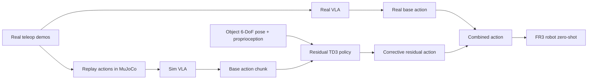

---
    title: "Object-Centric Residual RL for Zero-Shot Sim-to-Real VLA Enhancement — Korean analysis"
    source_url: "https://arxiv.org/abs/2606.18953"
    hf_url: "https://huggingface.co/papers/2606.18953"
    arxiv_id: "2606.18953"
    arxiv_url: "https://arxiv.org/abs/2606.18953"
    pdf_url: "https://arxiv.org/pdf/2606.18953"
    week: "2026-W27"
    category: "raw/Robotics/HuggingFaceWeeklyPapers"
    ingested_at_kst: "2026-07-01 09:40:38 KST"
    selected_reason: "Vision-Language-Action 정책의 real-world robustness와 zero-shot sim-to-real residual RL을 직접 다루는 신규 VLA 논문."
    ---

# Object-Centric Residual RL 분석

## 한 문장 결론
Simulation에서 학습한 object-centric residual policy를 frozen VLA action 위에 더하면, real-world VLA manipulation success rate를 zero-shot으로 42%에서 76%까지 높일 수 있다.

## Problem
VLA는 broad generalization을 갖지만 imitation learning 특성상 precise contact, grasp, placement에서 compounding error가 누적된다. Real-world RL은 위험하고 비싸며, image-based sim-to-real은 visual gap이 크다.

## Contributions
1. **Object-centric residual observation**: object 6-DoF pose + proprioception + base VLA action.
2. **Paired sim/real VLA**: 같은 teleoperation action을 현실과 simulation에 적용해 base failure mode를 맞춘다.
3. **Simulation-only residual TD3**: pose noise/dropout으로 real pose estimator error에 robust하게 학습.
4. **Zero-shot real deployment**: real robot fine-tuning 없이 평균 success 42%→76%.
5. **Self-improvement loop**: residual-corrected rollout으로 base VLA SFT 가능.

## Architecture / Pipeline

## Input / Output / Action Representation
- Base VLA input: RGB observation + language instruction.
- Residual input: `s_t = [object pose, proprioception, base action]`.
- Output: corrective action added to base VLA action chunk.
- Action grounding: language/vision reasoning은 base VLA가 담당하고, residual은 object-centric physical correction을 담당한다.

## Training Recipe
- Base VLA: teleoperation data로 imitation/SFT.
- Sim VLA: 같은 teleoperation action을 simulation replay로 paired training.
- Residual: TD3 off-policy RL, dense shaped reward, clipped exploration noise.
- Robustness: pose noise injection, pose dropout, deployment confidence gating.

## Datasets / Benchmarks / Metrics
- Tasks: Cube Lift, Pick-and-Place, Stack Cube, Close Drawer, Stand Plate.
- Environment: MuJoCo simulation + real FR3 robot.
- Metrics: task success rate, episode length, ablation success across robustness/observation choices.

## Open-loop vs Closed-loop
Base VLA는 imitation/open-loop supervised signal로 학습되지만 residual은 closed-loop RL로 task success를 직접 optimize한다. 이 조합이 precision recovery를 만든다.

## Strengths
- Real-world RL 없이 robustness 향상.
- Image sim-to-real gap을 object pose abstraction으로 우회.
- 다른 VLA backbone(π0.5)에도 적용 가능.
- Residual-corrected rollout이 base model 개선 data가 됨.

## Limitations
- 6-DoF pose estimator와 task-relevant object specification에 의존.
- Full occlusion, clutter, specular reflection에서 실패 가능.
- Dynamics gap은 완전히 해결하지 못함.
- Open-world manipulation에서는 object discovery/attention이 추가로 필요.

## 안전/지연/배포 함의
Residual policy는 작고 빠르지만 pose estimation latency가 병목이 될 수 있다. Safety 측면에서는 residual correction이 잘못된 pose에 반응하면 위험하므로 confidence gating과 fallback이 필수다.

## 왜 중요한가
VLA research가 “큰 generalist policy”만으로 real robot precision을 해결하기 어렵다는 점을 보여주며, object-centric closed-loop correction을 붙이는 hybrid design이 실용적 대안임을 제시한다.
