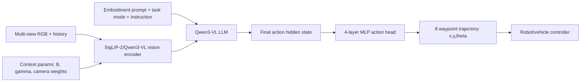

---
    title: "Qwen-RobotNav Technical Report: A Scalable Navigation Model Designed for an Agentic Navigation System — Korean analysis"
    source_url: "https://arxiv.org/abs/2606.18112"
    hf_url: "https://huggingface.co/papers/2606.18112"
    arxiv_id: "2606.18112"
    arxiv_url: "https://arxiv.org/abs/2606.18112"
    pdf_url: "https://arxiv.org/pdf/2606.18112"
    week: "2026-W27"
    category: "raw/Robotics/HuggingFaceWeeklyPapers"
    ingested_at_kst: "2026-07-01 09:40:38 KST"
    selected_reason: "2026-W27 후보 중 자율주행·navigation·VLM/VLA 접점이 가장 직접적이며, NAVSIM closed-loop autonomous driving까지 평가한 Qwen3-VL 기반 scalable navigation model."
    ---

# Qwen-RobotNav 분석

## 한 문장 결론
Qwen-RobotNav는 Qwen3-VL backbone에 task-adaptive observation interface와 waypoint action head를 붙여 instruction following, object search, target tracking, autonomous driving을 하나의 scalable navigation model로 묶은 논문이다.

## Problem
기존 navigation model은 task별 입력 구조와 memory horizon이 달라 통합이 어렵다. 자율주행까지 포함하면 multi-view camera, route/traffic rule, safety metric, trajectory output을 동시에 처리해야 한다.

## Contributions
1. **Parameterized navigation interface**: task mode, token budget, temporal decay, camera weights, frame sampling을 inference time에 조절.
2. **Qwen3-VL 기반 action grounding**: VLM hidden state를 8-waypoint trajectory로 회귀.
3. **Vision-language co-training**: trajectory-only collapse를 막고 reasoning ability를 유지.
4. **15.6M mixed navigation corpus**: VLN, PointNav, ObjNav, tracking, autonomous driving, synthetic video-generated data.
5. **Agentic navigation harness**: upper planner가 sub-goal과 observation configuration을 동적으로 바꾸는 module interface.

## Architecture / Pipeline

## Input → Output / Action Representation
- Input: multi-view RGB, temporal history, natural-language instruction/goal, embodiment prompt, task mode, context parameters.
- Output: `K=8` waypoint sequence, each waypoint `(x, y, θ)`.
- AD relevance: NAVSIM에서는 closed-loop future trajectory quality를 PDMS 등으로 평가.

## Training Recipe
- Composite loss: `L = L_traj + λ L_VL`.
- Trajectory regression은 waypoint MSE.
- Vision-language data를 함께 사용해 language reasoning과 scene understanding을 유지.
- Training-time randomization over context parameters로 inference-time reconfiguration에 견고하게 만듦.

## Datasets / Benchmarks / Metrics
- VLN-CE R2R/RxR: navigation error, success rate, SPL 등.
- OVON/HM3D/MP3D: object-goal navigation SR/SPL.
- EVT-Bench: tracking rate, collision rate, success rate.
- NAVSIM: Navigation Compliance, DAC, TTC, Comfort, Ego Progress, PDMS.

## Open-loop vs Closed-loop
논문은 trajectory regression을 학습하지만, 평가에는 closed-loop navigation/driver metrics가 포함된다. 특히 NAVSIM PDMS는 trajectory가 simulated closed-loop에서 얼마나 안전하고 규칙을 지키는지 반영한다.

## Strengths
- Task-specific head explosion 없이 다양한 navigation family를 통합.
- AD 포함 cross-embodiment training으로 VLA for AD 연구자가 참고할 만한 interface 제시.
- Edge deployment/FP8/TensorRT latency까지 다룸.

## Limitations
- Waypoint output은 low-level control보다 planner/controller dependency가 남는다.
- Prompt/context parameter 설계가 강력하지만, 잘못된 upper-level planner decision이 safety issue로 이어질 수 있다.
- NAVSIM/benchmark 성능이 실제 도로 generalization을 보장하지 않는다.

## 왜 중요한가
VLA for AD에서 핵심은 “language/vision reasoning이 어떻게 executable trajectory로 바뀌는가”이다. Qwen-RobotNav는 VLM backbone을 유지하면서 task-conditioned observation consumption과 waypoint action grounding을 결합한 최신 대규모 사례다.
