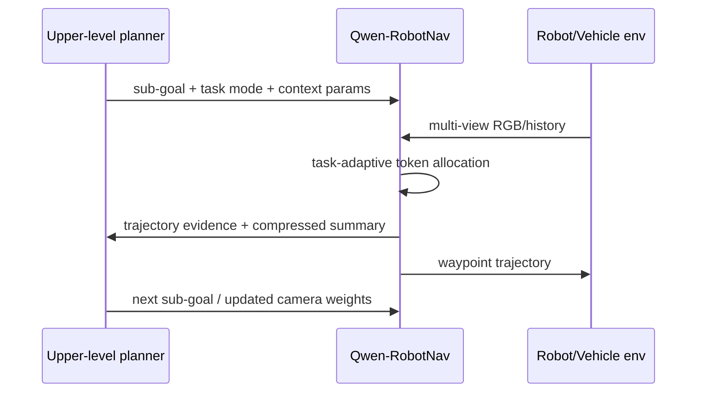

---
    title: "Qwen-RobotNav Technical Report: A Scalable Navigation Model Designed for an Agentic Navigation System — learning guide"
    source_url: "https://arxiv.org/abs/2606.18112"
    hf_url: "https://huggingface.co/papers/2606.18112"
    arxiv_id: "2606.18112"
    arxiv_url: "https://arxiv.org/abs/2606.18112"
    pdf_url: "https://arxiv.org/pdf/2606.18112"
    week: "2026-W27"
    category: "raw/Robotics/HuggingFaceWeeklyPapers"
    ingested_at_kst: "2026-07-01 09:40:38 KST"
    selected_reason: "2026-W27 후보 중 자율주행·navigation·VLM/VLA 접점이 가장 직접적이며, NAVSIM closed-loop autonomous driving까지 평가한 Qwen3-VL 기반 scalable navigation model."
    ---

# Qwen-RobotNav 학습 노트

## 선수 지식
- Vision-language navigation (VLN), ObjectNav, PointNav
- VLM backbone: SigLIP, Qwen3-VL, multimodal tokenization
- Waypoint trajectory planning
- Closed-loop autonomous-driving metrics (TTC, drivable area, progress)

## 핵심 용어
| 용어 | 설명 |
|---|---|
| Task-adaptive observation encoding | task mode와 context parameter에 따라 visual history/token allocation을 조절하는 방식 |
| Temporal decay γ | 오래된 frame 대비 최신 frame에 얼마나 weight를 줄지 결정 |
| Camera weight w_c | multi-view camera별 중요도 |
| Action grounding | VLM hidden state를 waypoint trajectory로 변환하는 과정 |
| PDMS | NAVSIM의 PDM score; progress/safety/rule compliance 성격의 closed-loop metric |

## 단계별 이해
1. Navigation tasks는 observation history 요구가 서로 다르다.
2. 고정 context 대신 `B, γ, w_c`를 외부에서 지정한다.
3. Vision encoder가 frame/camera별 token을 만들고, natural-language tag가 viewpoint/time identity를 제공한다.
4. LLM backbone이 instruction + visual context를 통합한다.
5. MLP action head가 8-step waypoint를 출력한다.
6. Upper planner는 sub-goal마다 다른 context strategy로 Qwen-RobotNav를 호출한다.

## Architecture Map

## 구현/배포 메모
- Edge deployment를 목표로 하면 visual token budget과 quantization이 핵심 병목이다.
- AD용으로 확장할 때는 route command, map prior, ego state, traffic-light state를 prompt 또는 structured input으로 넣는 설계가 필요하다.
- Closed-loop safety metric은 open-loop trajectory loss보다 더 중요하다.

## 학습 질문과 답
1. **왜 trajectory-only training이 위험한가?**  
   language/scene reasoning을 잃고 observation-to-action reactive mapper가 될 수 있다.
2. **AD에서 camera weight가 왜 중요한가?**  
   lane following, intersection, merge, rear vehicle awareness 등 상황별 camera importance가 바뀐다.
3. **이 모델은 순수 VLA인가?**  
   robot manipulation VLA와 달리 navigation/action trajectory 모델이지만, vision-language backbone이 executable waypoint를 생성한다는 점에서 VLA/AD 연구에 매우 가깝다.

## 다음 읽을 논문
- ABot-N0: VLA foundation model for embodied navigation
- TrackVLA / EVT-Bench: active visual tracking
- NAVSIM 및 planning-aligned token compression for long-context AD
