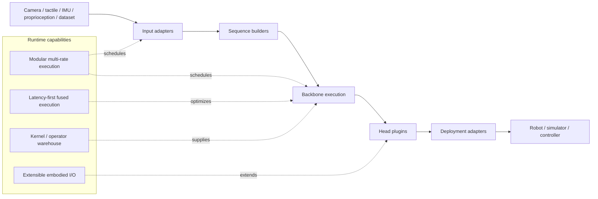

# Embodied.cpp 분석

## 한 문장 결론

**Embodied.cpp는 VLA/WAM 모델을 “논문 checkpoint”에서 “robot-side closed-loop system”으로 옮길 때 필요한 runtime contract를 multi-rate, latency-first, extensible I/O라는 세 축으로 정리하고, 이를 C++ five-layer runtime으로 구현하려는 deployment paper다.**

## 문제 정의

VLA와 WAM 연구는 빠르게 발전했지만 실제 배포는 여전히 다음 문제에 막힌다.

- 모델마다 Python research stack과 custom wrapper가 다르다.
- 일반 LLM/VLM serving runtime은 token request-response를 가정하며 robot closed-loop를 직접 지원하지 않는다.
- robot deployment는 batch-1, low jitter, sensor/action interface, simulator/robot adapter, heterogeneous hardware가 동시에 필요하다.
- WAM은 action뿐 아니라 predicted future 또는 latent future까지 runtime object로 다뤄야 한다.

## 핵심 기여

1. **Architecture taxonomy**: VLA와 WAM을 runtime 관점에서 분류한다.
2. **Five-layer runtime**: input adapters, sequence builders, backbone execution, head plugins, deployment adapters로 공통 실행 경로를 제안한다.
3. **Multi-rate execution**: perception, backbone, prediction branch, action head의 refresh rate를 분리할 수 있게 한다.
4. **Latency-first batch-1 optimization**: robot closed-loop를 위한 low latency / low jitter / buffer reuse / backend abstraction을 강조한다.
5. **Deployment evaluation**: HY-VLA, π0.5, LingBot-VA block benchmark로 C++ path의 실행 가능성을 보인다.

## Architecture / pipeline

## Input-output / action representation

| 구분 | 내용 |
|---|---|
| 입력 | RGB/multi-view image, language instruction, proprioception, force/tactile, IMU, simulator state, history |
| 중간 상태 | subgoal, buffered context, predicted future, latent future, action feature |
| 출력 | discrete action token, continuous action vector, action chunk, world prediction, intermediate control representation |
| 대상 모델 | VLA, WAM, hierarchical VLA, asynchronous VLA, latent-space WAM |

## Training recipe

이 논문은 새로운 model training recipe보다 **runtime design/deployment** 논문이다. 모델 자체는 기존 HY-VLA, π0.5, LingBot-VA component를 사용한다. 핵심은 checkpoint를 C++ runtime으로 변환·실행하고, 일부 WAM block은 GGUF Q4_K quantization으로 메모리를 줄이는 것이다.

## Datasets / Benchmarks / Metrics

| 평가 | 모델 | 환경/벤치마크 | Metric | 결과 |
|---|---|---|---|---|
| VLA closed-loop | HY-VLA | RoboTwin place_empty_cup | success rate, latency, VRAM | 100.0% success, 6850 MiB |
| VLA closed-loop | π0.5 | C++ deployment config | success rate, latency, VRAM | 91.0% success, 6546 MiB |
| WAM microbenchmark | LingBot-VA block | random input 100개 | latency, memory, MAE, cosine | 312.2→88.1 MiB, cosine >0.9997 |

## Open-loop vs closed-loop

이 논문의 초점은 closed-loop deployment다. 일반 LLM serving은 request-response open interaction에 가깝지만, robot control은 sensor feedback과 action output이 반복되는 closed-loop다. Embodied.cpp의 가치도 action quality 자체보다 **closed-loop 안에서 모델이 안정적으로 호출되고, latency/jitter가 통제되며, robot adapter까지 연결되는가**에 있다.

## 강점

- VLA/WAM을 runtime 관점에서 명확히 분류한다.
- “모델 성능”이 아니라 “실제 robot-side runtime contract”를 문제로 삼는다.
- VLA뿐 아니라 WAM까지 대상으로 하여 future prediction 경로를 runtime object로 다룬다.
- heterogeneous hardware, edge execution, simulator/robot adapter까지 논의한다.

## 한계

- WAM 평가는 full closed-loop가 아니라 single Transformer block microbenchmark다.
- 논문 revision 기준으로 full LingBot-VA closed-loop는 constrained local edge setup에서 안정적이지 않다고 밝힌다.
- hardware별 detailed NPU/accelerator backend 실험은 아직 제한적이다.
- C++ runtime 통합이 실제 다양한 robot stack에서 얼마나 유지보수 가능한지는 장기 검증이 필요하다.

## Safety / latency / deployment implications

- 자율주행 VLA/E2E AD로 확장하면, runtime은 단순 inference server가 아니라 safety-critical control loop의 일부가 된다.
- latency 평균뿐 아니라 jitter, worst-case latency, watchdog/recovery behavior가 중요하다.
- NPU/edge accelerator 관점에서는 action head, perception encoder, world prediction branch를 서로 다른 device에 나누는 heterogeneous scheduling이 핵심이 될 수 있다.
- WAM이 predicted future를 생성한다면 runtime은 prediction cache, latent future validity, stale prediction invalidation까지 다뤄야 한다.

## 왜 찬호님의 관심사에 중요한가

- VLA for AD에서 모델 architecture만 보면 충분하지 않다. 실제 차량/로봇에서는 perception, planning, action module이 서로 다른 주기로 돌아가고, edge accelerator 제약이 크다.
- Embodied.cpp는 VLA/WAM을 **실시간 closed-loop system**으로 구현할 때 필요한 시스템 언어를 제공한다.
- 특히 NPU/accelerator 관점에서 “어떤 layer를 어떤 device에서 얼마나 자주 실행할 것인가”라는 deployment research question으로 이어진다.
