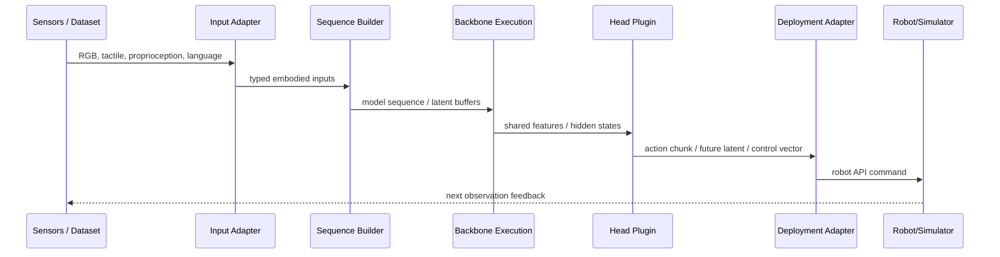

# Embodied.cpp 학습 노트

## 선수 지식

- Transformer/VLM 추론 구조: tokenizer, vision encoder, projector, backbone, KV cache.
- Robot control loop: sensor observation → policy inference → action execution → feedback.
- VLA action representation: action token, continuous vector, action chunk.
- WAM/world model: future state 또는 latent future를 예측해 action에 반영.
- Edge inference: batch-1 latency, memory bandwidth, quantization, backend dispatch.

## 용어집

| 용어 | 설명 |
|---|---|
| Runtime contract | 런타임이 만족해야 하는 실행 가정과 인터페이스. Embodied AI에서는 closed-loop, multi-rate, low jitter, robot I/O가 포함된다. |
| Multi-rate execution | perception, planning, prediction, action head를 서로 다른 주기로 실행하는 방식. |
| Latency-first | throughput보다 control latency와 jitter를 우선하는 최적화 목표. |
| Batch-1 inference | 단일 robot/agent가 매 control step마다 호출하는 소규모 추론. |
| Head plugin | action head, world prediction head 등 모델별 출력 모듈을 pluggable하게 만드는 구조. |
| Deployment adapter | runtime 출력을 robot controller 또는 simulator API로 변환하는 계층. |
| WAM | World-Action Model. future state/action을 함께 모델링하는 embodied model family. |

## 전체 구조 이해

## Step-by-step 설명

1. **Input adapters**: 다양한 sensor와 dataset sample을 하나의 typed interface로 변환한다.
2. **Sequence builders**: 모델 family에 맞는 sequence, context, latent buffer를 구성한다.
3. **Backbone execution**: VLM/Transformer/WAM backbone을 backend abstraction으로 실행한다.
4. **Head plugins**: action token decoder, continuous action head, future prediction head 등을 plug-in으로 실행한다.
5. **Deployment adapters**: 출력 action을 simulator 또는 robot controller가 이해하는 command로 바꾼다.

## 핵심 representation

- VLA: `observation + language -> action/action chunk`
- Hierarchical VLA: `observation + language -> subgoal/plan -> low-level action`
- Asynchronous VLA: modality별 latent buffer가 서로 다른 refresh rate로 업데이트됨.
- WAM: `observation + action/context -> predicted future/latent future -> action`

## 구현/deployment 체크리스트

- [ ] Control frequency와 policy-call frequency를 분리했는가?
- [ ] perception encoder와 action head의 refresh rate가 configurable한가?
- [ ] action chunk output을 robot controller command로 안전하게 변환하는가?
- [ ] backend별 memory layout과 quantization error를 검증했는가?
- [ ] latency 평균뿐 아니라 tail latency와 jitter를 측정했는가?
- [ ] stale prediction/action을 무효화하는 watchdog이 있는가?
- [ ] simulator와 real robot adapter가 동일 semantic contract를 공유하는가?

## 자율주행 VLA로 확장할 때의 질문

| 질문 | 왜 중요한가 |
|---|---|
| BEV/occupancy encoder는 몇 Hz로 refresh할 것인가? | perception은 무겁고 control은 빠르다. |
| route command/language instruction은 언제 갱신되는가? | slow semantic context와 fast control을 분리해야 한다. |
| trajectory planner와 VLM reasoning을 같은 device에서 돌릴 것인가? | NPU/GPU/CPU partitioning 문제가 생긴다. |
| world model prediction은 stale해지면 어떻게 폐기할 것인가? | closed-loop safety와 직결된다. |
| worst-case latency가 safety envelope 안에 있는가? | 평균 latency만으로는 차량 제어를 보장할 수 없다. |

## 학습 문제와 답

### Q1. 왜 일반 LLM serving runtime으로 충분하지 않은가?

A. 일반 serving runtime은 request-response, throughput, uniform token I/O를 중심으로 설계된다. Robot control은 sensor feedback, action output, persistent state, batch-1 low latency, simulator/robot adapter가 필요하므로 contract가 다르다.

### Q2. Embodied.cpp의 five-layer 구조는 무엇인가?

A. Input adapters, sequence builders, backbone execution, head plugins, deployment adapters다. 이 구조는 공통 backbone path를 재사용하면서 모델별 head와 deployment target을 plug-in으로 분리한다.

### Q3. WAM이 runtime을 더 어렵게 만드는 이유는?

A. WAM은 단순 action output뿐 아니라 predicted future, latent future, world-model branch 같은 intermediate prediction을 online control에 포함한다. 따라서 scheduling, caching, invalidation, action coupling이 필요하다.

### Q4. NPU/accelerator 관점에서 핵심 문제는?

A. 모든 module을 같은 device/주기로 실행하는 것이 최적이 아닐 수 있다. Perception은 NPU, backbone은 GPU, action head는 CPU/GPU, safety monitor는 CPU 등으로 나뉠 수 있고, 데이터 이동 비용과 latency jitter를 함께 최적화해야 한다.

## 읽기 로드맵

1. Embodied.cpp 논문 Abstract/Introduction으로 runtime contract 이해.
2. VLA/WAM taxonomy 표를 보고 모델 family별 실행 경로 차이 정리.
3. DAM-VLA, LaWAM, World Action Models survey로 multi-rate/WAM 배경 학습.
4. vla.cpp와 llama.cpp/ONNX Runtime 비교로 runtime 설계 차이 이해.
5. 자율주행 VLA에 적용해 perception-planning-action frequency diagram을 직접 그려보기.
