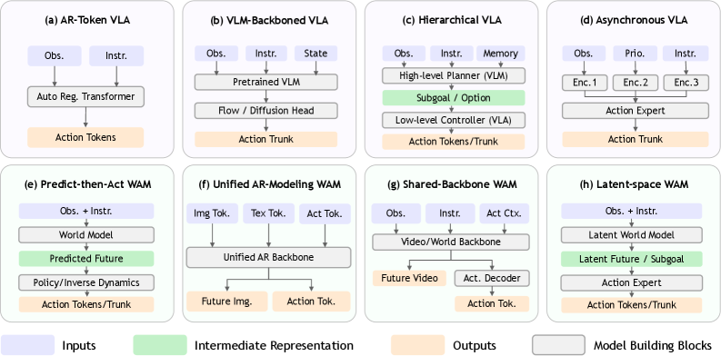

# Embodied.cpp: 이기종 로봇을 위한 Embodied AI 모델의 휴대형 추론 런타임

- 원문: [arXiv:2607.02501](https://arxiv.org/abs/2607.02501)
- Hugging Face Papers: <https://huggingface.co/papers/2607.02501>
- 코드: <https://github.com/SEU-PAISys/Embodied.cpp>
- 저자: Ling Xu, Chuyu Han, Borui Li, Hao Wu, Shiqi Jiang, Ting Cao, Chuanyou Li, Sheng Zhong, Shuai Wang

> 주: arXiv HTML에서 본문·표·그림을 추출해 한국어로 기술 번역했다. 수식/표는 의미 보존을 우선했고, arXiv HTML 변환상 references 영역은 일부 누락되어 `references.md`에서 Semantic Scholar 기반으로 보완했다.

## Abstract 번역

Embodied AI 모델은 이제 Vision-Language-Action(VLA) 모델과 World-Action Model(WAM)까지 확장되었지만, 실제 배포는 모델별 Python stack, backend 가정, 로봇 측 glue code에 파편화되어 있다. 특히 heterogeneous edge device에서는 이 문제가 더 심각하다. 기존 추론 런타임은 주로 request-response serving을 위해 설계되어, embodied deployment가 요구하는 runtime contract—closed-loop control 안의 multi-rate execution, heterogeneous hardware에서 latency-first batch-1 inference, 고정 token I/O를 넘어서는 embodied interface 확장성—을 만족하지 못한다.

본 논문은 embodied model을 위한 휴대형 C++ 추론 런타임인 **Embodied.cpp**를 제안한다. 대표적인 VLA 모델과 WAM을 아키텍처 관점에서 분석한 뒤, 공통 실행 경로를 포착하고 이를 다섯 계층으로 조직한다: **input adapters, sequence builders, backbone execution, head plugins, deployment adapters**. 런타임은 modular multi-rate execution, latency-first fused inference, 확장 가능한 operator 및 I/O 지원을 제공하여, 하나의 backend abstraction으로 다양한 device, robot, simulator에 배포할 수 있게 한다.

평가는 두 VLA 모델(HY-VLA, π0.5)과 LingBot-VA Transformer block 기반의 preliminary WAM benchmark에서 수행되었다. VLA 배포는 각각 100.0%, 91.0% task success rate로 closed-loop 실행에 성공했고, WAM benchmark에서는 block memory를 312.2 MiB에서 88.1 MiB로 줄였다. 결과적으로 Embodied.cpp는 다양한 embodied model architecture에서 정확도를 유지하면서 deployment efficiency를 높일 수 있음을 보인다.

## 1. Introduction 번역

학계와 산업계는 이미 빠르게 증가하는 embodied model 생태계를 만들어 왔다. 최근 시스템은 VLA 모델과 WAM을 포함하며, OpenVLA, π0/π0.5, GR00T N1, LingBot-VA, WAM survey 계열 연구에서 모델 architecture와 capability가 크게 발전했다. 동시에 LeRobot, Open X-Embodiment, ManiSkill, LIBERO, Isaac Sim 같은 데이터·학습·시뮬레이션 생태계도 성숙했다. 그러나 practical impact는 모델 구축에서 끝나지 않는다. 신뢰 가능한 robot-side system이 되려면 이러한 모델이 Jetson, RK 계열 보드, x86 edge box, workstation-class robot 등 heterogeneous하고 resource-constrained한 장치에서 동작해야 하며, 모델 family가 바뀔 때마다 software stack 전체를 다시 구축하지 않아야 한다.

이를 위해서는 unified inference runtime이 필요하다. 하지만 기존 LLM/VLM runtime은 request-response serving, 비교적 균일한 token interface, throughput-oriented optimization을 전제로 한다. 반면 embodied inference는 robot/simulator 의존성을 가진 closed-loop interaction process 안에서 실행된다. 따라서 강력한 checkpoint가 있어도, 실제 로봇에서 act하려면 Python 연구 코드, backend-specific inference path, handwritten sensor wrapper, platform-specific control logic을 이어 붙여야 한다. Embodied architecture가 다양해질수록 이 integration burden은 커지고, embodied AI 모델을 위한 portable inference runtime의 필요성은 더 커진다.

Embodied deployment는 기존 deployment와 다른 runtime contract를 요구한다. 첫째, **multi-rate execution**이 필요하다. Perception encoder, transformer backbone, predictive branch, action head는 동일한 frequency로 실행될 필요가 없으며, hierarchical/fast-slow VLA와 WAM에서는 서로 다른 rate로 실행되는 모듈이 자연스럽다. 둘째, **latency-first closed-loop control**이다. 최적화 목표는 throughput이 아니라 stable control이며, 낮은 latency, 낮은 jitter, heterogeneous edge hardware에서의 효율적 batch-1 execution이 중요하다. 셋째, **extensible embodied interfaces**가 필요하다. 입력은 image, language, proprioception, history, force/tactile, simulator state를 포함할 수 있고, 출력은 discrete action token, continuous action vector, action chunk, predicted future 등 다양하다.

Embodied.cpp는 이러한 요구를 직접 겨냥한 portable C++ inference runtime이다. 핵심 설계는 다음 세 가지다.

1. 서로 다른 refresh frequency를 가진 component를 분리하는 **modular multi-rate execution**.
2. heterogeneous device에서 예측 가능한 small-batch control을 목표로 하는 **latency-first fused execution**.
3. model-specific head/interface/backend를 pluggable runtime module로 만드는 **extensible operator and embodied I/O support**.

이 원칙은 input adapters, sequence builders, backbone execution, head plugins, deployment adapters라는 five-layer architecture로 구현된다.

## 2. Related Work and Motivation 번역

### 2.1 Embodied AI 모델과 아키텍처 분석

추론 런타임 관점에서 최근 embodied model은 온라인 실행 패밀리로 크게 두 가지로 나눌 수 있다.

- **VLA 모델**: perception-to-action 경로가 중심이다.
- **WAM**: future prediction을 online control의 명시적 구성요소로 포함한다.

VLA 내부에서도 architecture는 단일 action generation에서 점차 구조화된 modular execution으로 이동하고 있다. RT-2와 OpenVLA 같은 AR-token VLA는 하나의 shared backbone으로 action token을 autoregressive하게 생성한다. Octo, π0, π0.5, MuseVLA 같은 VLM-backboned VLA는 강한 vision-language backbone에 continuous action head를 붙인다. 더 최근에는 semantic planning과 low-level control을 분리하는 hierarchical VLA(Hi Robot, GeneralVLA, RT-H, Gemini Robotics 1.5)와, execution time scale을 분리하는 asynchronous VLA(GR00T N1, Fast-in-Slow, DAM-VLA)가 등장했다. 런타임 관점의 핵심은 VLA조차 더 이상 단일 synchronous forward pass가 아니라는 점이다.

WAM family는 future prediction이 action generation과 어떻게 결합되는지에 따라 나뉜다. Predict-then-Act WAM은 world model이 미래 state를 예측하고 downstream action expert가 이를 소비한다. Unified AR-modeling WAM은 future world와 robot action을 하나의 autoregressive token space에서 함께 생성한다. Shared-backbone WAM은 world modeling과 action generation이 backbone을 공유하되 auxiliary block을 분리할 수 있다. Latent-space WAM은 future/subgoal을 compact latent로 압축해 action expert가 소비하도록 한다.

논문은 이를 통해 세 가지 runtime implication을 도출한다.

1. Structural organization이 model property가 되었다. planner, backbone, world-model, action module이 상호작용한다.
2. Subgoal, buffered context, predicted future, latent future 같은 intermediate state가 explicit runtime object가 되었다.
3. Timing structure가 model-defined가 되었으므로, practical runtime은 stateful multi-component orchestration을 지원해야 한다.

### 2.2 기존 AI 추론 런타임

llama.cpp, ONNX Runtime, SGLang, vLLM-Omni 등은 공통 실행 substrate를 잘 다룬다. 그러나 이들은 대부분 request-response workload와 uniform interface를 목표로 한다. Simulation platform인 ManiSkill, LIBERO, Isaac Sim은 training/benchmarking에 중요하지만 embodied inference runtime 자체는 아니다. 가장 가까운 최근 작업은 여러 VLA architecture를 portable C++ runtime으로 가져온 vla.cpp이지만, 여전히 VLA 중심이다.

논문 표 2의 비교에 따르면 Embodied.cpp는 VLA, WAM, modular model optimization, edge execution, heterogeneous hardware, robot, simulator를 모두 first-class로 지원하는 방향을 제시한다.

## 3. Project Overview 번역

### 3.1 Challenges

Embodied.cpp가 다루는 세 가지 실질적 시스템 challenge는 다음과 같다.

#### 1) Multi-rate execution

현대 embodied system은 perception encoder, transformer backbone, predictive branch, action head 등 여러 모듈로 구성된다. 모든 모듈을 매 step 실행할 필요는 없다. Perception stack은 낮은 frequency로 refresh될 수 있고, predictive branch는 future estimation이 필요할 때만 실행될 수 있으며, action head는 훨씬 높은 control rate로 실행되어야 할 수 있다.

#### 2) Latency-first closed-loop control

로봇 deployment는 대부분 batch-1이다. 단일 robot 또는 simulator가 action을 지속적으로 받아야 하므로 낮은 latency와 jitter가 필수다. 또한 Jetson, RK-based platform, x86 edge box, workstation 등 hardware가 다양하다. 따라서 small-batch inference를 효율화하는 backend-specific fusion, graph replay, buffer reuse, host-device data movement 최적화가 중요하다.

#### 3) Extensible embodied interfaces

Embodied runtime은 scheduling 문제만이 아니다. 새로운 모델 family는 custom operator, 새로운 dependency stack, 새로운 input/output convention을 도입한다. 실용적 runtime은 camera, force/tactile, IMU, proprioception, history, simulator state 같은 입력과 action token, continuous action vector, action chunk, world prediction 같은 출력을 typed interface로 흡수해야 한다.

### 3.2 Design Principles and Runtime Architecture

Embodied.cpp의 설계 원칙은 다음과 같다.

1. **Modular multi-rate execution**: 명시적 execution unit, pluggable module, shared state/feature pool, configurable refresh policy를 제공한다.
2. **Latency-first fused execution**: graph replay, buffer reuse, operator fusion, backend-specific dispatch, host-device movement 제어를 통해 stable control performance를 우선한다.
3. **Extensible operator and I/O support**: typed embodied interface, pluggable head, deployment adapter, operator/kernel warehouse를 제공한다.

Figure 2는 입력 adapter가 online sensor stream과 offline dataset sample을 흡수하고, 중앙의 embodied-model execution zone이 VLA/WAM/future variants를 실행하며, 출력 adapter가 simulator와 robot software stack으로 연결하는 전체 구조를 보여준다. 하위 subsystem은 modular multi-rate execution, latency-first batch-1 execution, embodied AI kernel warehouse로 구성된다.

## 4. Evaluation 번역

논문은 두 종류의 evidence를 보고한다.

1. HY-VLA와 π0.5 두 VLA 모델의 closed-loop 결과.
2. LingBot-VA에 대한 preliminary WAM microbenchmark.

### 4.1 VLA 모델 평가

HY-VLA는 RoboTwin `place_empty_cup` task에서 해당 checkpoint로 테스트했고, π0.5는 해당 C++ deployment configuration으로 테스트했다. 보고 metric은 success rate, action chunk length, server-side inference latency, amortized environment-step latency, peak GPU memory다.

| Deployed Model | Backbone | Action Chunk | Success Rate | Step Latency | Inference Latency | VRAM |
|---|---:|---:|---:|---:|---:|---:|
| HY-VLA | Hunyuan-VL | 20 | 100.0% [83.9, 100.0] | 735.9 ms | 1340.3 ms | 6850 MiB |
| π0.5 | PaliGemma | 50 | 91.0% [86, 94] | 56.85 ms | 266.6 ms | 6546 MiB |

두 모델 모두 C++ runtime을 통해 정상 실행되며 task behavior를 보존했다. HY-VLA는 100.0% success rate를 보였지만, Hunyuan-VL backbone, 3-view input, video-history/MEM vision path 때문에 latency가 더 높다. π0.5는 lighter PaliGemma backbone과 더 긴 action chunk 덕분에 amortized step cost가 낮다.

### 4.2 WAM 평가

LingBot-VA의 full model은 constrained local edge setup에서 아직 안정적이지 않아, 첫 번째 Transformer block만 benchmark했다. Python BF16 original과 Embodied.cpp GGUF Q4_K quantized block을 비교했다.

| Runtime | Quantization | Latency / block | Memory / block | MAE ↓ | Cosine ↑ |
|---|---:|---:|---:|---:|---:|
| Python original | BF16 | 3.236 ms | 312.2 MiB | 0 | 1 |
| Embodied.cpp | Q4_K | 3.171 ms | 88.1 MiB | < 3.3×10^-2 | > 9.997×10^-1 |

100개의 random input sample로 비교했을 때, Q4_K C++ block은 resident weight memory를 312.2 MiB에서 88.1 MiB로 줄이면서도 output drift를 작게 유지했다. 이는 full WAM closed-loop 결과는 아니지만, Embodied.cpp가 WAM-side Transformer component를 hosting/validation할 수 있음을 보여주는 초기 evidence다.

## 5. Conclusion 번역

최근 embodied model의 evidence는 한 방향을 가리킨다. 모델 family가 계속 다양해져도 embodied deployment는 shared execution path로 수렴하고 있다. Embodied.cpp는 이 수렴을 inference runtime으로 포착한다. 공통 경로는 infrastructure로, 달라지는 부분은 plugin으로 다룬다. Five-layer architecture는 interaction pattern, I/O semantics, objective, deployment boundary를 명시화하고, 동일 backbone execution path를 여러 paradigm에 재사용한다. 현재 revision은 두 VLA 모델에서 C++ inference path를 정량적으로 검증하고, WAM은 architecture analysis와 preliminary block benchmark로 위치시킨다. 새로운 embodied model variants가 등장할수록 stable core와 pluggable task-specific component의 분리는 더 큰 가치를 갖게 될 것이다.

## Figure notes

- `figures/figure-04.png`: 논문 Figure 2에 해당하는 project overview로, input adapters → embodied-model runtime → deployment adapters 구조를 보여준다.
- `figures/figure-05.png`: evaluation 관련 figure/table snapshot이다.
- arXiv HTML에서 5개 PNG figure를 다운로드했다. 일부 앞 번호 이미지는 로고/소형 그래픽 성격이어서 본문에서는 핵심 구조도 중심으로 참조했다.
