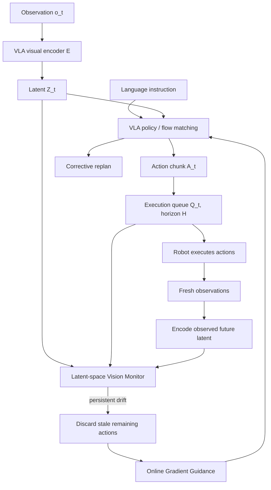

# VLA-Corrector 분석

## 한 문장 결론

**VLA-Corrector는 action chunking의 latency 이점은 유지하면서, latent visual dynamics monitor로 stale chunk를 중단하고 OGG로 recovery action을 유도해 VLA를 event-triggered adaptive closed-loop system에 가깝게 만든다.**

## 문제

Generative VLA는 action quality가 좋지만 inference가 비싸다. 그래서 한 번에 여러 action을 생성하는 action chunking을 사용한다. 문제는 chunk execution 동안 fresh observation을 무시하는 open-loop blind spot이 생긴다는 점이다.

- 긴 horizon: policy call은 줄지만 error가 누적된다.
- 짧은 horizon: closed-loop reactivity는 좋지만 inference cost가 커진다.
- fixed horizon: task phase, disturbance, sim-to-real mismatch에 따라 최적값이 계속 바뀐다.

## 핵심 기여

1. Fixed action horizon이 VLA robustness와 policy-call efficiency 사이에 만드는 trade-off를 체계적으로 측정했다.
2. Frozen VLA backbone에 external Latent-space Vision Monitor(LVM)를 붙여 visual dynamics drift를 감지한다.
3. Persistent drift가 발생하면 stale action queue를 truncation해 adaptive horizon을 만든다.
4. Online Gradient Guidance(OGG)로 post-interrupt replan을 recovery 방향으로 유도한다.
5. MetaWorld, LIBERO, AgileX PiPER real robot에서 success-per-call efficiency와 robustness 향상을 보였다.

## Architecture / pipeline

## Input-output / action representation

| 항목 | 내용 |
|---|---|
| 입력 | visual observation, language instruction, executed action, fresh observation stream |
| backbone | π0.5, SmolVLA, X-VLA 등 generative VLA |
| action | continuous action chunk, horizon H만 실행 |
| monitor signal | expected latent residual vs actual latent residual의 cosine mismatch |
| output | interrupt event, adaptive horizon, OGG-guided corrective action chunk |

## Language role

Language는 VLA policy의 task instruction으로 사용된다. VLA-Corrector 자체는 language reasoning을 새로 하지 않는다. 대신 language-conditioned VLA가 생성한 action chunk가 visual dynamics 측면에서 계속 타당한지 감시한다. 따라서 이 논문은 “language reasoning 강화”보다 **language-conditioned action execution의 closed-loop reliability**에 초점을 둔다.

## Action grounding

Action grounding은 세 단계로 이루어진다.

1. VLA가 `observation + language`에서 action chunk를 생성한다.
2. External corrector가 `(latent, action)`이 유발해야 할 visual latent residual을 예측한다.
3. 실제 observation 변화가 예측과 어긋나면 action chunk의 remaining part를 더 이상 grounded하다고 보지 않고 폐기한다.

즉 action grounding을 “생성 시점의 semantic plausibility”가 아니라 “실행 중 visual dynamics consistency”로 검증한다.

## Training recipe

- 먼저 VLA backbone을 benchmark training set으로 fine-tune한다.
- VLA backbone을 freeze한다.
- Demonstration trajectory에서 visual latent residual `ΔZ*`를 추출한다.
- 약 40M parameter MLP corrector `M_ϕ`를 residual prediction objective로 학습한다.
- Deployment에서는 LVM forward를 매 monitoring step 수행하고, interrupt 직후 한 번만 OGG gradient guidance를 적용한다.

## Datasets / benchmarks / metrics

| 벤치마크 | 목적 | 주요 metric |
|---|---|---|
| MetaWorld | contact-rich manipulation, difficulty split | success rate, policy calls, success-per-call |
| LIBERO | language-conditioned long-horizon tasks | success rate, sample efficiency |
| AgileX PiPER real robot | pick-place, alignment, disturbance recovery | success rate with CI |

## Open-loop vs closed-loop

VLA-Corrector의 핵심은 **open-loop chunk execution을 완전히 버리지 않고, 필요한 순간만 closed-loop로 전환**하는 것이다.

- Stable phase: long horizon 유지 → policy call 절약.
- Critical/drift phase: interrupt → short adaptive horizon → corrective replan.
- OGG: 단순 re-query가 아니라 recovery 방향으로 velocity field를 guide.

## 주요 결과

- MetaWorld π0.5 average success: 48.70 → 64.35 (+15.65).
- LIBERO few-shot + corrector: 94.00 → 97.80, full fine-tuned baseline 96.95 초과.
- Real robot average success: 55.6 → 73.3 (+17.7).
- Disturbance recovery real robot: 40.0 → 68.3 (+28.3).
- Truncation only: 48.70 → 60.35, Truncation+OGG: 64.35.

## 강점

- VLA backbone retraining 없이 inference-time robustness를 높인다.
- Efficiency metric을 policy calls와 success-per-call로 함께 본다.
- LVM이 critical phase에 주로 trigger됨을 보여 adaptive horizon intuition을 검증한다.
- Real robot disturbance recovery에서 큰 gain을 보여 실전 의미가 있다.

## 한계

- Demonstration trajectory로 corrector를 학습해야 하므로 완전 training-free는 아니다.
- Domain-matched corrector가 cross-domain corrector보다 훨씬 좋다.
- External LVM/OGG가 추가 module과 gradient computation을 요구한다.
- 자율주행처럼 safety-critical 고속 환경에서는 interrupt latency와 false negative/false positive cost를 더 엄격히 분석해야 한다.

## Safety / latency / deployment implications

- 자율주행 E2E AD에서 trajectory chunk 또는 waypoint sequence를 open-loop로 실행할 때도 유사한 stale-action 문제가 생긴다.
- LVM 같은 latent dynamics monitor는 planned trajectory와 observed scene evolution의 consistency monitor로 확장 가능하다.
- OGG는 직접 steering/brake 값을 perturb하기보다는 planner/action generator의 latent objective를 guide하는 방식으로 해석할 수 있다.
- Safety-critical system에서는 monitor threshold, patience, cooldown을 formal safety envelope와 연결해야 한다.

## 왜 중요한가

VLA 연구는 종종 “더 좋은 action generator”에 집중하지만, 실제 deployment에서는 action이 실행되는 동안 환경이 변한다. VLA-Corrector는 **action generation 이후의 execution monitoring과 recovery**를 VLA architecture의 핵심 문제로 끌어올린다. 이는 자율주행, mobile robot, manipulation 모두에서 필요한 방향이다.
