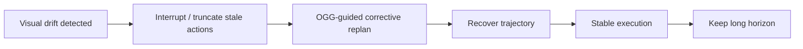

# VLA-Corrector 학습 노트

## 선수 지식

- VLA policy: `vision + language -> action` mapping.
- Diffusion / flow matching policy: action chunk를 denoising 또는 velocity field로 생성.
- Closed-loop control: observation feedback을 이용해 반복적으로 replan.
- Action chunking: 한 번에 여러 action을 예측해 policy call을 줄이는 기법.
- Latent representation: visual encoder가 만든 feature space.

## 용어집

| 용어 | 의미 |
|---|---|
| Action chunk | 한 번의 policy inference로 생성한 여러 future actions. |
| Action horizon H | chunk 중 실제 re-query 없이 실행하는 step 수. |
| Open-loop blind spot | horizon 동안 fresh observation을 policy가 사용하지 못하는 구간. |
| LVM | Latent-space Vision Monitor. expected vs actual visual latent evolution mismatch를 측정한다. |
| OGG | Online Gradient Guidance. interrupt 이후 recovery replan을 latent corrective direction으로 guide한다. |
| Success-per-call | 성공률을 policy call 수로 나눈 efficiency 관점. |
| Adaptive horizon | fixed H가 아니라 drift가 생기면 event-triggered로 짧아지는 horizon. |

## 핵심 intuition

Action chunking은 “계속 믿어도 되는 구간”에서는 매우 효율적이다. 문제는 chunk가 stale해졌는데도 계속 실행할 때 생긴다. VLA-Corrector의 핵심은 chunk를 무조건 짧게 만들지 않고, **신뢰할 수 없게 된 순간만 감지해서 짧게 만드는 것**이다.

## 수식으로 보는 방법

### 1. Action chunk 생성

\[
A_t=[a_t,a_{t+1},...,a_{t+C-1}] \sim \pi_θ(\cdot \mid Z_t^{real},l)
\]

### 2. Expected visual latent residual

\[
\Delta Z_{t+k}^{exp}=M_ϕ(Z_t^{real},a_t)
\]

### 3. Actual visual latent residual

\[
\Delta Z_{t+k}^{real}=Z_{t+k}^{real}-Z_t^{real}
\]

### 4. Inconsistency score

\[
E_t=1-CosSim(\Delta Z_{t+k}^{exp},\Delta Z_{t+k}^{real})
\]

### 5. Robust event threshold

\[
T_{on}=M_e+\lambda_{on}MAD, \quad T_{off}=M_e+\lambda_{off}MAD
\]

`E_t > T_on`이 여러 step 지속되면 interrupt한다.

### 6. OGG guidance

\[
L_{OGG}=1-CosSim(\Delta \hat{Z}_{act},\Delta Z_{corr})
\]

\[
v_τ^{guide}=v_τ-η∇_{v_τ}L_{OGG}
\]

## 구현 절차

1. 기존 VLA backbone을 준비하고 task dataset으로 fine-tune한다.
2. Backbone을 freeze한다.
3. Demonstration trajectory에서 `(Z_t, a_t, Z_{t+k})`를 추출한다.
4. Lightweight residual MLP corrector를 학습한다.
5. Deployment 중 매 step 또는 일정 interval마다 LVM score를 계산한다.
6. Sliding window median/MAD로 robust threshold를 갱신한다.
7. Persistent drift가 감지되면 action queue를 clear한다.
8. 다음 policy call에만 OGG를 적용해 recovery replan을 만든다.
9. 이후 normal inference로 돌아간다.

## 자율주행 VLA/E2E AD로 연결하기

| Manipulation VLA-Corrector | Autonomous driving analog |
|---|---|
| Action chunk | waypoint/trajectory segment |
| Visual latent drift | perceived scene evolution vs predicted ego/world evolution mismatch |
| Truncation | planned trajectory invalidation |
| OGG-guided replan | cost/latent-guided trajectory re-optimization |
| Critical phase | cut-in, pedestrian appearance, occlusion, tight merge, low-friction segment |

자율주행에서는 action horizon이 trajectory planning horizon으로 나타날 수 있다. 고속 주행에서는 false negative가 위험하고, false positive는 불필요한 jerky replanning을 만들 수 있다. 따라서 monitor threshold를 safety margin과 연결해야 한다.

## Implementation / deployment notes

- LVM은 frozen VLA feature를 사용하므로 backbone behavior를 망치지 않는다.
- OGG는 매 call 적용하는 것이 아니라 interrupt 직후 한 번만 적용해 overhead를 제한한다.
- Window size, `λ_on`, `λ_off`, patience `p`, cooldown은 environment dynamics와 latency에 맞게 조정해야 한다.
- Real-time deployment에서는 LVM forward latency와 image encoding latency를 별도로 측정해야 한다.
- Real robot에서는 disturbance recovery task를 별도로 만들어 monitor가 실제로 필요한 순간 trigger되는지 확인해야 한다.

## 학습 문제와 답

### Q1. 왜 fixed action horizon이 문제인가?

A. Horizon이 길면 policy call은 줄지만 fresh observation을 반영하지 못해 stale action이 실행된다. Horizon이 짧으면 반응성은 좋지만 inference cost가 커진다. Task phase와 disturbance에 따라 최적 horizon이 변하므로 fixed value가 비효율적이다.

### Q2. LVM은 무엇을 비교하는가?

A. Executed action이 유발해야 할 expected latent residual과 실제 observation에서 관측된 actual latent residual을 cosine mismatch로 비교한다.

### Q3. Truncation만으로 충분하지 않은 이유는?

A. Stale action을 멈춰도 다음 replan이 drifted state에서 다시 잘못된 action을 낼 수 있다. OGG는 corrective latent direction을 이용해 recovery action을 더 직접적으로 유도한다.

### Q4. Decoupled LVM이 internal auxiliary head보다 나은 이유는?

A. Internal head는 VLA backbone representation을 바꿔 action generation 능력에 악영향을 줄 수 있다. Decoupled LVM은 frozen feature 위에서 별도로 학습되어 policy를 덜 교란한다.

### Q5. 이 논문의 핵심 safety insight는?

A. Action generator가 강하더라도 execution 중 action이 계속 valid한지 검증해야 한다. VLA deployment는 generation뿐 아니라 monitoring, invalidation, recovery를 포함해야 한다.

## 읽기 로드맵

1. Action chunking과 fixed horizon trade-off를 먼저 이해한다.
2. Figure 1–3으로 open-loop failure, performance-efficiency curve, VLA-Corrector pipeline을 본다.
3. LVM 수식 `E_t`와 event-triggered threshold를 직접 구현해본다.
4. OGG가 flow matching velocity를 어떻게 수정하는지 확인한다.
5. MetaWorld/LIBERO/real robot 결과에서 “성공률”과 “policy call 수”를 함께 비교한다.
6. 자율주행 trajectory replanning 문제로 analog를 그려본다.
