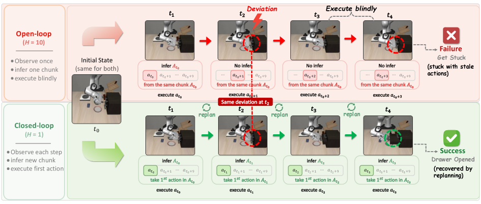

# VLA-Corrector: Adaptive Action Horizon을 위한 경량 Detect-and-Correct 추론

- 원문: [arXiv:2607.01804](https://arxiv.org/abs/2607.01804)
- Hugging Face Papers: <https://huggingface.co/papers/2607.01804>
- Project: <https://zju-omniai.github.io/vla-corrector/>
- Code: <https://github.com/ZJU-OmniAI/vla-corrector>
- 저자: Yi Pan, Miao Pan, Qi Lu, Jiaming Huang, Man Zhang, Siteng Huang, Xin Li, Jie Zhang, Yongliang Shen, Xuhong Zhang, Wenqi Zhang

> 주: 본문 구조(Abstract, Introduction, Preliminaries, Method, Experiments, Ablations, Appendix 핵심)를 한국어로 기술 번역했다. 부록의 세부 표는 핵심 수치 위주로 보존했다.

## Abstract 번역

Vision-Language-Action(VLA) foundation model은 embodied intelligence에서 큰 진전을 보였다. Policy-call frequency를 줄이면서 temporal coherence를 유지하기 위해 대부분의 generative policy는 **action chunk** mechanism을 채택한다. 즉, fixed action horizon 동안 여러 미래 action을 open-loop로 실행한다. 그러나 이러한 “predict-then-blindly-execute” paradigm은 closed-loop reactivity를 희생한다. Contact-rich physical interaction에서는 작은 local perturbation도 open-loop blind spot 안에서 빠르게 증폭되어 compounding error를 만들고 task failure로 이어질 수 있다.

이를 해결하기 위해 논문은 **VLA-Corrector**를 제안한다. 이는 action-chunked VLA policy를 위한 lightweight corrective inference framework다. VLA backbone weight를 수정하지 않고, VLA-Corrector는 lightweight **Latent-space Vision Monitor(LVM)**를 도입해 predicted visual feature evolution과 actual visual feature evolution을 지속적으로 비교한다. Persistent deviation이 감지되면 system은 truncation event를 trigger하고, 남아 있는 stale action을 폐기한 뒤 **Online Gradient Guidance(OGG)**로 corrective replanning을 수행한다.

VLA-Corrector의 detect-and-correct mechanism은 event-triggered adaptive action horizon을 자연스럽게 만든다. Current chunk가 reliable할 때는 long-horizon execution을 유지하고, execution drift가 시작되면 short-horizon corrective replanning을 호출한다. 이를 통해 static horizon이 강요하는 robustness와 policy-call frequency 사이의 trade-off를 완화한다. VLA-Corrector는 VLA backbone을 추가 retraining하지 않고 다양한 VLA 모델에 통합될 수 있으며, action chunking의 efficiency benefit을 상당 부분 보존하면서 long-horizon, contact-rich robotic manipulation task의 robustness를 크게 높인다.

## 1. Introduction 번역

VLA foundation model은 perception, language, action generation을 하나의 framework로 통합하여 general-purpose robot control의 유망한 경로가 되었다. Modern VLA policy는 continuous robot action의 high-dimensional, multi-modal 특성을 포착하기 위해 diffusion model이나 flow matching 같은 generative action model을 많이 사용한다. 그러나 generative model의 per-step latency는 매 control step마다 closed-loop replanning을 수행하기 어렵게 만들고, action expressiveness와 high-frequency feedback control 사이의 근본적 긴장을 만든다.

일반적인 engineering compromise는 **action chunk**를 사용하는 것이다. 하나의 forward pass에서 policy는 미래 action sequence를 예측하고, controller는 그중 처음 `H` step을 action horizon으로 순차 실행한다. 이 방식은 policy-call frequency를 amortize하고 temporal smoothness를 높인다. 하지만 동시에 **open-loop blind spot**을 만든다.

1. Fresh observation이 매 control step 들어오지만, horizon이 끝날 때까지 policy가 이를 사용하지 않기 때문에 slippage, collision, pose drift에 즉각 반응하지 못한다.
2. Deviation이 충분히 오래 방치되면 robot이 training distribution 밖의 state로 이동하여, 다음 replanning call이 와도 intended trajectory로 돌아오지 못할 수 있다.

Horizon이 길수록 이러한 위험은 커진다. 논문 Figure 1은 `H=10`에서 drawer-opening task 중 stale action이 계속 실행되어 robot이 stuck되는 사례와, `H=1` strict closed-loop 실행이 같은 error accumulation을 피하는 사례를 비교한다. 그러나 `H=1`은 매 control step마다 full VLA inference가 필요해 action chunking의 efficiency gain을 없앤다. 따라서 핵심은 더 나은 fixed horizon을 고르는 것이 아니라, **current chunk를 언제 더 이상 신뢰하지 말아야 하는지 결정하는 것**이다.

논문은 두 질문을 제기한다.

1. Execution deviation을 제때 감지하여 stale action을 recovery 불가능한 수준으로 compounding되기 전에 종료할 수 있는가?
2. Truncation 이후 단순 replanning이 아니라, trajectory를 의도한 방향으로 correction할 수 있는가?

VLA-Corrector는 이를 위해 두 메커니즘을 결합한다.

- **LVM-triggered truncation**: predicted vs observed latent visual dynamics mismatch를 감지해 stale action queue를 중단한다.
- **OGG-guided re-inference**: mismatch에서 corrective latent direction을 만들고, flow-matching velocity에 gradient guidance를 주어 recovery replan을 유도한다.

π0.5 horizon 50에서 success는 48.7% → 58.7%로 상승하고, average policy call은 5.15 → 4.98로 감소하여 +24.6% success-per-call efficiency gain을 보인다. LIBERO few-shot setting에서는 VLA-Corrector를 붙인 모델이 97.8% average success로 full fine-tuned baseline 96.9%를 넘는다.

## 2. Preliminaries 번역

Action chunk를 사용하는 VLA policy에서 현재 observation `o_t`는 visual encoder `E`를 통해 latent representation으로 변환된다.

\[
Z_t^{real}=E(o_t)
\]

VLA policy `π_θ`는 language instruction `l`과 latent state를 조건으로 action chunk를 생성한다.

\[
A_t=[a_t,a_{t+1},...,a_{t+C-1}] \sim \pi_θ(\cdot \mid Z_t^{real}, l)
\]

Deployment에서는 chunk 전체 `C` 중 처음 `H ≤ C`개의 action만 순차 실행한다.

\[
Q_t=[a_t,a_{t+1},...,a_{t+H-1}]
\]

이 `H`가 action horizon이다. Horizon 동안 controller는 VLA policy를 다시 query하지 않는다.

## 3. VLA-Corrector 방법 번역

VLA-Corrector는 action generation과 execution monitoring을 분리한다. VLA backbone은 action chunk를 생성하고, corrector는 execution이 on-track인지 감시한다. Drift가 감지될 때만 intervention한다.

### 3.1 External Latent Dynamics Corrector 학습

VLA policy가 이미 학습된 뒤, VLA-Corrector를 별도로 학습한다. 먼저 VLA backbone을 benchmark training set으로 fine-tune한 뒤 freeze한다. Visual encoder `E`를 사용해 demonstration trajectory에서 visual latent를 추출한다.

Transition `(o_t, a_t, o_{t+k})`에 대해:

\[
Z_t^{real}=E(o_t), \quad Z_{t+k}^{real}=E(o_{t+k}), \quad \Delta Z_{t+k}^{*}=Z_{t+k}^{real}-Z_t^{real}
\]

여기서 `ΔZ*`는 action이 유발한 short-horizon visual latent evolution이다. Lightweight external dynamics corrector `M_ϕ`는 다음 residual을 예측한다.

\[
\Delta \hat{Z}_{t+k}=M_ϕ(Z_t^{real}, a_t)
\]

학습 objective는 magnitude matching과 directional consistency를 결합한다.

\[
L_{corr}=\|\Delta \hat{Z}_{t+k}-\Delta Z_{t+k}^{*}\|_2^2 + \beta[1-CosSim(\Delta \hat{Z}_{t+k}, \Delta Z_{t+k}^{*})]
\]

중요한 점은 VLA policy를 다시 최적화하지 않는다는 것이다. 약 40M parameter의 MLP corrector만 frozen VLA feature 위에서 학습한다.

### 3.2 LVM: 온라인 anomaly detection

Execution 중 LVM은 expected latent visual evolution과 실제 observed evolution을 비교한다.

- Expected residual:

\[
\Delta Z_{t+k}^{exp}=M_ϕ(Z_t^{real},a_t)
\]

- Actual residual:

\[
\Delta Z_{t+k}^{real}=Z_{t+k}^{real}-Z_t^{real}
\]

- Inconsistency score:

\[
E_t=1-CosSim(\Delta Z_{t+k}^{exp},\Delta Z_{t+k}^{real})
\]

`E_t`가 클수록 predicted visual dynamics와 observed visual dynamics가 다르다는 뜻이다.

### 3.3 Event-triggered truncation

단순 threshold는 noisy하므로 sliding window 기반 robust statistic을 사용한다. 최근 score window `E_W`의 median `M_e`와 median absolute deviation(MAD)을 계산한다.

\[
MAD=median(|E_i-M_e|), \quad E_i \in E_W
\]

두 threshold를 둔다.

\[
T_{on}=M_e+\lambda_{on}MAD, \quad T_{off}=M_e+\lambda_{off}MAD, \quad \lambda_{on}>\lambda_{off}
\]

`E_t > T_on`이 `p` step 연속이면 interrupt event가 trigger된다. 그러면 current queue의 남은 action은 버리고, adaptive horizon은 다음과 같이 짧아진다.

\[
H_{adaptive}=h < H
\]

즉 stable phase에서는 long horizon을 유지하고, persistent visual drift가 나타날 때만 horizon을 동적으로 줄인다.

### 3.4 Online Gradient Guidance(OGG)

Truncation은 stale action을 멈추지만, recovery는 다음 replan의 품질에 달려 있다. OGG는 interrupt 직후 **단 한 번의 policy call**에만 적용된다.

Flow matching denoising step `τ`에서 noisy action chunk `A^τ`에 대해 VLA는 velocity field를 예측한다.

\[
v_τ=\pi_θ(A^τ,Z_t^{real},τ)
\]

clean chunk estimate는 다음과 같다.

\[
\hat{A}_0=A^τ-τv_τ
\]

그 첫 action `\hat{a}_t`가 만들 latent effect를 corrector로 예측한다.

\[
\Delta \hat{Z}_{act}=M_ϕ(Z_t^{real},\hat{a}_t)
\]

마지막 stable step `t-k`의 expected residual과 현재 accumulated deviation으로 corrective latent direction을 만든다.

\[
\Delta Z_{corr}=\Delta Z_{exp}-\Delta Z_{dev}
\]

OGG loss는 다음 cosine alignment다.

\[
L_{OGG}=1-CosSim(\Delta \hat{Z}_{act},\Delta Z_{corr})
\]

이 gradient를 flow-matching velocity에 주입한다.

\[
v_τ^{guide}=v_τ-η∇_{v_τ}L_{OGG}, \quad A^{τ-\Delta τ}=A^τ-\Delta τ v_τ^{guide}
\]

Action coordinate를 직접 perturb하지 않고 velocity field를 수정하므로 smoother corrective replanning을 얻는다.

## 4. Experiments 번역

평가는 MetaWorld, LIBERO, AgileX PiPER real robot에서 수행했다. Main backbone은 π0.5이며, SmolVLA와 X-VLA로 cross-architecture evaluation을 했다.

### 4.1 Main Results

#### MetaWorld cross-architecture

| Backbone | Baseline Avg | + VLA-Corrector Avg | Improvement |
|---|---:|---:|---:|
| π0.5 | 48.70 | 64.35 | +15.65 |
| SmolVLA | 61.90 | 66.65 | +4.75 |
| X-VLA | 55.55 | 59.60 | +4.05 |

Harder tasks에서 gain이 더 크며, π0.5 Very Hard split은 41.0% → 65.0%로 상승한다.

#### LIBERO sample efficiency

| Model | Avg success |
|---|---:|
| π0.5 full fine-tuned | 96.95 |
| π0.5 few-shot fine-tuned | 94.00 |
| π0.5 few-shot + VLA-Corrector | 97.80 |

Corrector는 drifted state/recovery behavior를 backbone에 더 많이 학습시키는 대신, inference time에 error accumulation을 조기 중단하고 corrective replanning을 유도해 data efficiency를 높인다.

#### Success-per-call efficiency

π0.5 horizon 50에서 baseline은 48.72% success, 5.15 calls였고, VLA-Corrector는 58.70% success, 4.98 calls였다. 성공률은 높아지고 policy call은 줄어 +24.6% efficiency gain을 얻었다. SmolVLA horizon 10에서는 +45.3%, X-VLA horizon 4에서는 +39.1% gain을 보고한다.

### 4.2 Mechanism analysis

- LVM score `E_t`는 failed episode에서 high-score tail이 더 무겁고 interrupt event도 더 자주 발생한다.
- Truncation의 83.7%는 grasping/alignment 같은 critical phase에서 발생하고, non-critical phase에서는 16.3%만 발생한다. 이는 horizon을 무조건 줄이는 것이 아니라 error-sensitive phase에서만 closed-loop responsiveness를 복원한다는 의미다.
- OGG-guided inference는 standard re-inference보다 post-interrupt recovery rate를 평균 0.23 높인다.

### 4.3 Real-world evaluation

AgileX PiPER 6-DoF arm과 π0.5 backbone으로 세 task group을 평가했다.

| Method | Pick-place | Alignment | Disturbance | Avg |
|---|---:|---:|---:|---:|
| π0.5 baseline | 70.0±11.6 | 56.7±12.5 | 40.0±12.4 | 55.6±7.3 |
| + VLA-Corrector | 78.3±10.4 | 73.3±11.2 | 68.3±11.8 | 73.3±6.5 |

가장 큰 gain은 disturbance recovery(+28.3)에서 나타났다. 이는 object/target이 execution 중 바뀌어 current action chunk가 outdated되는 상황에서 VLA-Corrector가 특히 유용하다는 점을 보여준다.

### 4.4 Ablation

| Variant | Avg success |
|---|---:|
| Baseline open-loop | 48.70 |
| + Truncation only | 60.35 |
| + Truncation + OGG | 64.35 |

Truncation만으로도 stale action 중단 효과가 크고, OGG가 recovery replan 품질을 추가로 높인다. Coupled internal detector보다 decoupled LVM이 훨씬 높은 average success(49.55% vs 64.35%)를 보여, policy representation을 건드리지 않는 external monitor의 이점도 확인된다.

## 5. Conclusion 번역

이 논문은 action-chunked VLA policy의 open-loop blind spot을 연구한다. Fixed horizon은 policy-call efficiency를 높이지만 stale action이 error를 누적하게 만든다. VLA-Corrector는 latent visual dynamics를 감시하고, drift가 지속되면 stale action을 truncation하며, 다음 inference를 recovery 방향으로 guide하는 lightweight detect-and-correct layer로 이 문제를 다룬다. 결과는 작은 inference-time module이 VLA backbone retraining 없이 targeted robustness gain을 줄 수 있음을 보여준다. VLA-Corrector는 action chunking을 대체하지 않고 adaptive하게 만든다. Reliable할 때는 long-horizon execution을 유지하고, current chunk를 더 이상 신뢰할 수 없을 때만 corrective replanning을 호출한다.

## Figure notes

- `figures/figure-01.png`: long horizon open-loop failure와 strict closed-loop success 비교.
- `figures/figure-02.png`: fixed action horizon의 performance-efficiency trade-off.
- `figures/figure-03.png`: VLA-Corrector 전체 pipeline(LVM interrupt + OGG-guided replan).
- `figures/figure-08.png`: performance-efficiency analysis.
- `figures/figure-09.png`: real-world disturbance recovery demo.
