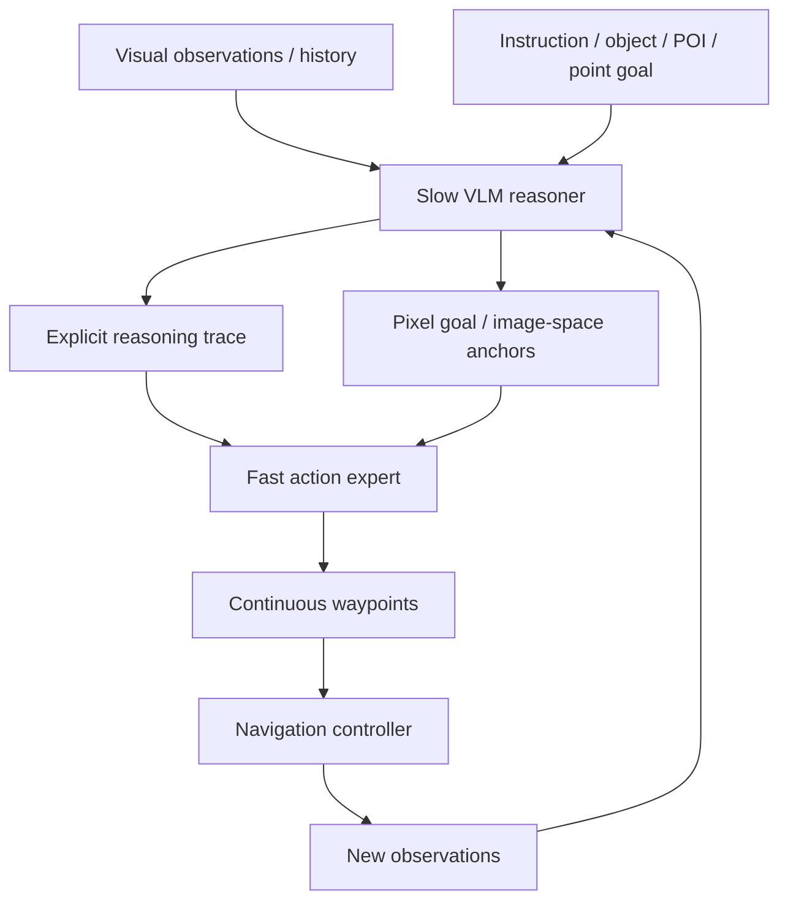

# ABot-N1: Toward a General Visual Language Navigation Foundation Model 분석

## 한 문장 결론

**ABot-N1은 VLM이 직접 wheel command를 내리는 대신 pixel goal을 생성하고 fast action expert가 continuous waypoint로 grounding하는 slow-fast VLA/VLN 구조다.**

## 문제

general navigation에서 semantic reasoning, long-tail robustness, continuous control, interpretability를 동시에 만족하기 어렵다.

## 핵심 기여

1. 다섯 navigation task를 하나의 goal-conditioned visual-control framework로 통합
2. slow VLM reasoner가 CoT와 pixel goal을 생성하는 cognition/control decoupling
3. fast action expert가 pixel guidance와 text cue를 continuous waypoint로 변환
4. ABotN-PointBench/POIBench 공개
5. simulation 및 real-world urban-scale navigation SOTA 보고

## VLA/AD taxonomy 위치

VLA taxonomy 기준으로는 Explicit Action Guidance + Numerical Action Generator 중간에 위치한다. 언어 reasoning이 직접 action token을 생성하지 않고 pixel anchor를 통해 waypoint generation을 guide한다.

## Architecture / pipeline

## Input → Reasoning/Modeling → Action representation

| 항목 | 내용 |
|---|---|
| 입력 | multi-view/egocentric visual observation, navigation history, instruction/object/POI/point/person target |
| 출력 | pixel goal, textual reasoning cue, continuous waypoints |
| action grounding | language reasoning → pixel anchor → fast waypoint decoder |

## Training recipe

- Pretraining/initial training은 paper-specific dataset mixture 또는 logged traffic/trajectory data에서 수행된다.
- Post-training은 task reward, closed-loop rollout, GRPO/entropy regularization 등으로 downstream behavior를 조정한다.
- 핵심은 representation을 action으로 바로 내보내지 않고, 중간 guidance(pixel goal 또는 flow action)를 물리적 실행 가능성에 맞게 변환하는 것이다.

## Dataset / benchmark / metric

VLN-CE R2R/RxR, OVON, ABotN-PointBench, ABotN-POIBench, EVT-Bench, real-world indoor/outdoor/urban deployment; SR, SPL/arrival-style metrics, robustness across task types.

## Open-loop vs closed-loop

- Open-loop: logged trajectory 또는 held-out annotation과의 정적 일치도를 확인한다.
- Closed-loop: model output이 다음 상태 분포를 바꾸는 상황에서 error accumulation, covariate shift, safety/arrival/success rate를 확인한다.
- 이 논문은 closed-loop 성능을 특히 강조한다. ABot-N1은 실제 navigation rollout, Flow-ERD는 simulator rollout distribution을 다룬다.

## 강점

- 고수준 semantic reasoning과 저수준 executable action 사이의 interface를 명확히 만든다.
- benchmark/metric을 통해 단순 accuracy가 아니라 robustness, diversity, deployment 가능성을 본다.
- VLA/E2E AD 연구에서 자주 흐려지는 “language/representation이 어떻게 action으로 grounded되는가”를 직접 다룬다.

## 한계와 리스크

- reported benchmark가 실제 도로 안전성을 보장하지 않는다.
- large VLM/flow model은 latency, memory, edge deployment 문제가 남는다.
- closed-loop success가 causal safety guarantee는 아니며, long-tail failure와 hallucinated reasoning/trajectory drift를 별도로 감시해야 한다.

## 찬호님 관심 주제와의 연결

자율주행에서는 slow planner가 route/semantic intent를 만들고 fast planner가 BEV waypoint/trajectory를 생성하는 dual-system E2E AD 설계에 참고할 수 있다. 단, pixel-space anchor를 차량 BEV/map coordinate로 옮길 때 calibration과 safety envelope가 중요하다.
