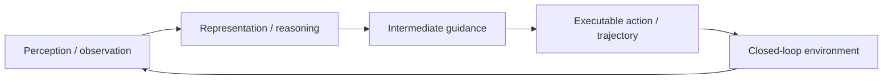

# 학습 노트: ABot-N1: Toward a General Visual Language Navigation Foundation Model

## 선수 지식

- VLM/VLA의 기본 구조: visual encoder, language model/reasoner, action decoder.
- imitation learning, closed-loop rollout, waypoint/trajectory representation.
- 자율주행 또는 robotics benchmark에서 success rate와 trajectory metric이 무엇을 의미하는지.

## Glossary

- **VLN**: Vision-Language Navigation. 언어/목표와 visual observation으로 navigation action을 결정하는 문제.
- **Pixel goal**: 이미지 공간에서 다음 이동 목표를 지정하는 anchor point.
- **Slow-fast architecture**: 느린 reasoning system과 빠른 action/control system을 분리하는 구조.
- **Waypoint**: controller가 따라갈 연속 공간의 중간 목표점.

## Architecture map

## 단계별 이해

1. **문제 정의**: 단일 observation-action mapping이 왜 일반화/안전/다양성에서 부족한지 확인한다.
2. **중간 표현 확인**: pixel goal, flow action, waypoint 같은 action grounding bridge가 무엇인지 찾는다.
3. **closed-loop 조건 확인**: 예측이 다음 입력을 바꿀 때 어떤 error가 누적되는지 본다.
4. **metric 분해**: success/arrival/realism/diversity가 각각 무엇을 보상하고 무엇을 놓치는지 나눈다.
5. **배포 제약**: latency, edge memory, control frequency, safety monitor가 실제 적용의 병목인지 확인한다.

## 핵심 식/표현

- Goal-conditioned policy: `pi(a_t | o_<=t, g, h)`.
- Intermediate guidance: `z_t = f_VLM(o_t, g)` 또는 flow action sample `u_t`.
- Closed-loop rollout: `s_next = T(s_t, a_t)`이며 모델의 `a_t`가 다음 observation distribution을 바꾼다.
- Robustness 관점: 평균 성능뿐 아니라 long-tail scenario, off-distribution object/POI/agent behavior를 봐야 한다.

## 구현/배포 메모

- reasoning module과 action module을 분리하면 해석성과 latency control이 좋아질 수 있다.
- 단, 중간 guidance coordinate가 sensor calibration/BEV map과 맞지 않으면 drift가 생긴다.
- closed-loop simulator는 diversity를 보존해야 rare scenario coverage를 늘릴 수 있다.

## Study questions

### Q1. 왜 VLM이 직접 action을 출력하지 않고 pixel goal을 거치나?
pixel goal은 task-agnostic compact interface라 여러 navigation task를 묶고 fast controller가 높은 주기로 실행 가능한 waypoint를 만들 수 있다.
### Q2. 자율주행으로 옮기면 무엇이 달라지나?
pixel coordinate 대신 BEV/map/route anchor를 써야 하며, collision checking과 traffic-rule constraint가 필수다.

## Reading roadmap

1. DriveVLM/Senna/DualAD 같은 dual-system AD-VLA 논문과 비교한다.
2. LMDrive/ORION의 waypoint/action-token 방식과 output representation을 비교한다.
3. ABotN-POIBench의 metric을 자율주행 POI/route following benchmark와 연결해 본다.
