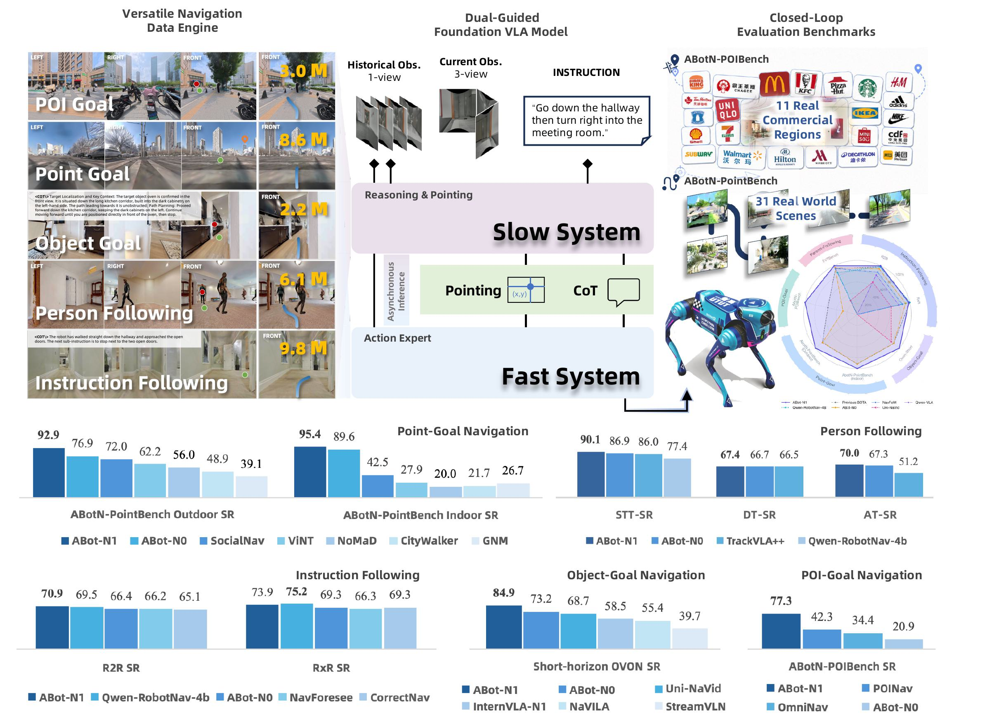
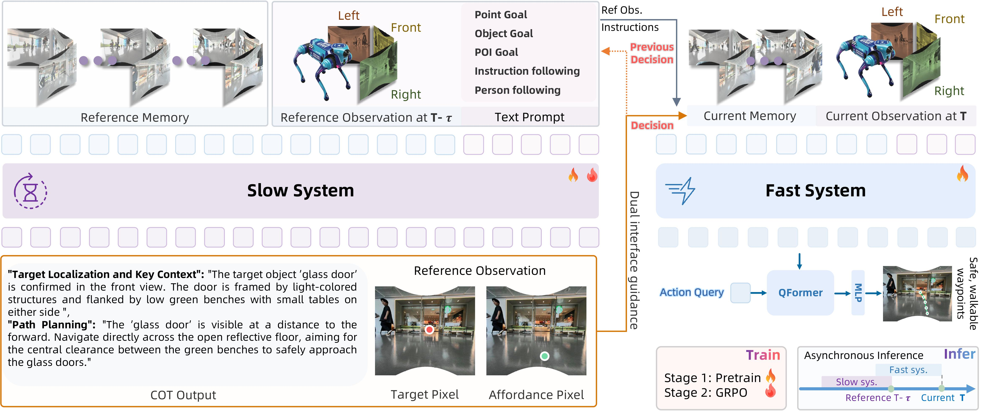
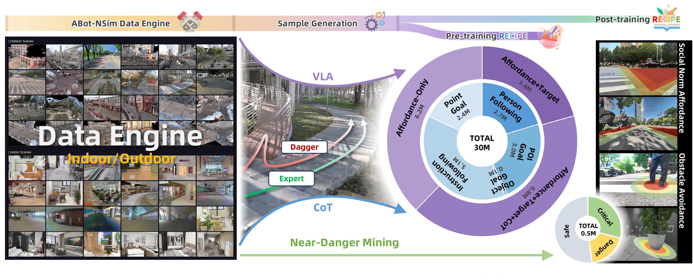
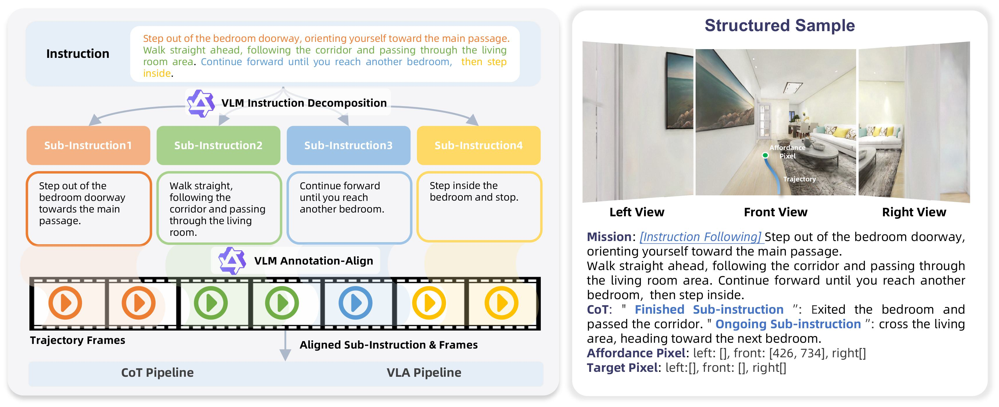
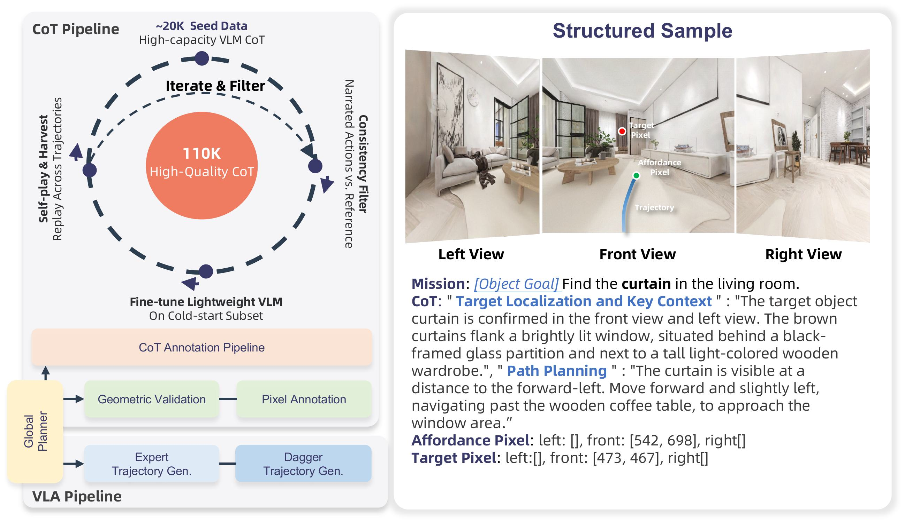
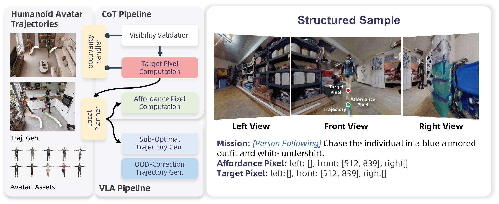
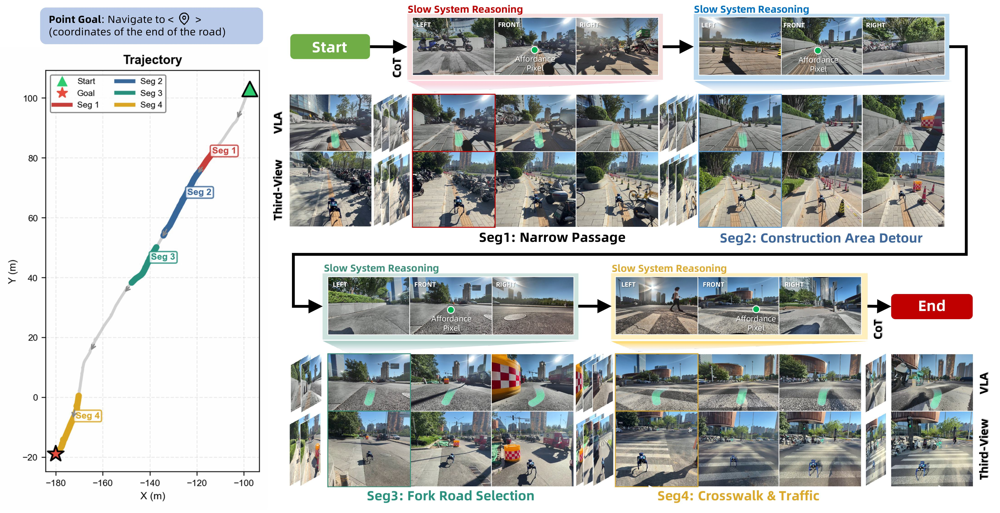

# ABot-N1: 범용 Visual Language Navigation foundation model을 향하여

- 원제: **ABot-N1: Toward a General Visual Language Navigation Foundation Model**
- 저자: Ruiyan Gong, Yingnan Guo, Junjun Hu, Jintao Kong, Xiaoxu Leng, Tianlun Li, Weize Li, Fei Liu, Zhicheng Liu, Jia Lu, Minghua Luo, Chenlin Ming, Yanfen Shen, Jiyue Tao, Zhengbo Wang, Mingyang Yin, Minqi Gu, Zihao Guan, Wei Guo, Guoqing Liu, Huachong Pang, Menglin Yang, Zeqian Ye, Xiaoxiao Geng, Zhining Gu, Honglin Han, Di Jing, Hongyu Pan, Mingchao Sun, Kuan Yang, Jianfang Zhang, Yanghong Chen, Ye He, Wei Mei, Jiahao Shi, Xiangpo Yang, Yanqing Zhu, Zedong Chu, Xiaolong Wu, Mu Xu
- Hugging Face: https://huggingface.co/papers/2607.10383
- arXiv: https://arxiv.org/abs/2607.10383
- Project: https://amap-cvlab.github.io/ABot-Navigation/ABot-N1/

> 번역 범위: arXiv HTML 본문을 기준으로 Abstract, Introduction, Related Work, Preliminaries, Method, Experiments, Conclusion을 중심으로 기술 번역했다. 수식·표·appendix 전체의 줄 단위 완역은 생략했으며, 핵심 architecture/metric/실험 주장과 figure caption은 학습용으로 보존했다.

## Abstract — 한국어 번역

Visual Language Navigation(VLN) foundation model은 grounded spatial decision을 위한 깊은 reasoning과 다양한 embodied navigation task에 대한 범용성을 동시에 요구한다. 기존 방식은 observation을 action으로 직접 매핑하는 monolithic policy가 많아 coordinate drift, long-tail semantic 처리 실패, black-box 불투명성을 겪는다. ABot-N1은 cognition과 control을 slow-fast architecture로 분리한다. slow vision-language reasoner는 explicit Chain-of-Thought reasoning과 함께 pixel goal, 즉 이미지 공간 anchor point를 생성하고, fast action expert는 이 pixel guidance와 textual cue를 사용해 native control frequency에서 continuous waypoint를 출력한다. 이 구조는 point-goal, object-goal, POI-goal, instruction-following, person-following을 하나의 인터페이스로 묶고, complex indoor/outdoor 및 urban-scale navigation에서 큰 성공률 향상을 보고한다.

## Introduction — 한국어 기술 번역/정리

논문은 navigation foundation model이 단순한 visual policy가 아니라, 장면을 이해하고 목표를 언어적으로 해석하며 물리적으로 실행 가능한 waypoint로 내려보내는 계층적 시스템이어야 한다고 본다. 핵심 문제는 고수준 semantic intent와 저수준 continuous control 사이의 interface이다. monolithic VLA/VLN policy는 학습 데이터 안에서는 강하지만, 목표 좌표가 조금 어긋나거나 장면이 long-tail object/POI를 포함하면 drift가 누적된다. ABot-N1은 pixel-grounded anchor를 중간 표현으로 사용해 이 간극을 줄인다.

## Related Works — 한국어 기술 번역/정리

관련 연구는 일반 navigation foundation model, brain-body decoupling 기반 dual-system VLN, 그리고 embodied reasoning으로 나뉜다. 기존 VLN은 instruction following에 집중했고, object-goal이나 point-goal은 별도 policy로 다뤄지는 경우가 많았다. ABot-N1은 여러 navigation task를 “goal-conditioned visual control” 문제로 통합하며, VLM reasoning trace를 action expert가 사용할 수 있는 compact guidance로 변환한다.

## Preliminaries — 한국어 기술 번역/정리

논문은 embodied navigation을 현재 visual observation, history, language/goal condition에서 다음 continuous action 또는 waypoint를 예측하는 문제로 정식화한다. 다섯 task(point-goal, object-goal, POI-goal, instruction-following, person-following)는 목표 표현은 다르지만 결국 이미지 공간에서 “어디로 가야 하는가”를 안정적으로 지정해야 한다는 공통점을 갖는다.

## Methods — 한국어 기술 번역/정리

ABot-N1의 slow system은 scene observation과 goal/instruction을 입력받아 Chain-of-Thought reasoning, textual cues, pixel goal을 생성한다. fast system은 이 pixel guidance를 lightweight action expert에 전달해 continuous waypoint를 높은 주기로 생성한다. 두 모듈은 asynchronous inference로 결합되어, 느린 VLM reasoning latency가 control loop를 막지 않도록 설계된다. pretraining은 여러 navigation dataset/task를 혼합하고, post-training은 GRPO-style optimization과 target alignment, safety clearance reward를 이용해 waypoint 품질과 일반성을 보정한다.

## Benchmarks and Experiments — 한국어 기술 번역/정리

논문은 ABotN-PointBench와 ABotN-POIBench를 새로 제안하여 point goal/POI navigation을 체계적으로 평가한다. simulation에서는 VLN-CE R2R/RxR, OVON, EVT-Bench 등 다양한 instruction/object/person following setting을 다루며, real-world deployment에서는 edge deployment scheme과 indoor/outdoor/urban-scale navigation 결과를 보고한다. 특히 POI arrival은 35.0%p 향상되어 77.3%에 도달하고, complex indoor/outdoor scene에서 95.4%/92.9% SR을 달성했다고 요약된다.

## Conclusion — 한국어 기술 번역/정리

ABot-N1의 결론은 “범용 navigation foundation model은 느린 language reasoning과 빠른 control을 분리하되, pixel-grounded action interface로 연결해야 한다”는 것이다. 자율주행 관점에서는 BEV waypoint나 route anchor로 확장 가능한 slow-fast VLA 설계 패턴을 보여준다.

## Figures / Captions

- Figure 1 caption: Figure 1 : Overview of ABot-N1. The model trained on 30M samples across five tasks adopts a slow–fast control architecture: a slow system performs CoT reasoning and emits pixel goals, while a fast action expert consumes this dual language-and-vision guidance to execute safe waypoints. Closed-loop evaluation is conducted on our newly proposed ABotN-PointBench and ABotN-POIBench, together with three established benchmarks (VLN-CE R2R/RxR, Short-Horizon OVON, and EVT-Bench). ABot-N1 achieves leadin

- Figure 2 caption: Figure 2 : The Slow-Fast Dual-System Architecture of ABot-N1. Navigation is decoupled into asynchronous cognition and high-frequency control. Slow System (left): A vision-language reasoner processes historical frames and task prompts at low frequency, producing explicit CoT reasoning and visual anchors (Target Pixel and Affordance Pixel). Dual Vision-Language Interface (middle): The language and visual outputs form a unified bridge between the two systems. Fast System (right): A lightweight-VLM-

- Figure 3 caption: Figure 3 : Data Pipeline and Composition. The data engine (left) provides diverse indoor and outdoor simulation scenes; trajectory generation (middle) produces expert and Dagger rollouts; the resulting samples (right) span both stages—the five pre-training navigation tasks broken down by slow-system (high-level) and fast-system (low-level) counts, together with the post-training composition stratified into Safe, Critical, Danger, and discarded data.

- Figure 4 caption: Figure 4 : Data Construction Pipeline for the Point-Goal Corpus. Left: the data construction pipeline in two parts. The top half is the CoT data construction, which generates affordance pixels from the traversability and road-graph annotations and perturbs the target coordinate; the bottom half is the VLN data construction, comprising sub-optimal trajectory and OOD-correction trajectory synthesis. Right: an example structured sample with tri-view observations and affordance pixel annotation.

- Figure 5 caption: Figure 5 : Data Construction Pipeline for the Instruction-Following Corpus. Left: a three-stage pipeline that decomposes long natural-language instructions into short sub-instructions, aligns each sub-instruction to its corresponding frame range along the milestone path, and generates and verifies affordance and target pixels for CoT and VLN data. Right: an example structured sample showing tri-view observations with the language instruction and pixel-level annotations for affordance and target.

- Figure 6 caption: Figure 6 : Data Construction Pipeline for the Object-Goal Corpus. The left panel comprises two parts: the top half illustrates the iterative data flywheel that constructs the CoT rationales, scaling high-capacity VLM data seeds to 110 K high-quality structured samples through A ∗ {}^{\!*} consistency filtering and self-play harvesting; the bottom half depicts the VLN pipeline that produces the low-level supervision, including pixel annotation and OOD-correction trajectory generation. The right p

- Figure 7 caption: Figure 7 : The Data Construction Pipeline for the POI-Goal Corpus . Left: the three-stage construction flow—generating geometric seed annotations via monocular depth (Stage 1), scaling and filtering 31 M street-view pairs using a distilled VLM (Qwen-3.5-4B) to yield 8 M valid paths (Stage 2), and synthesizing tri-view episodes into positive and negative sample pairs that harden the system’s rejection capability under missing-target conditions (Stage 3). Right: an example structured sample.

- Figure 8 caption: Figure 8 : Data Construction Pipeline for the Person-Following Corpus. Left: the data construction pipeline covering both CoT and VLN data. The pixel (CoT) data derives affordance and target pixels from human avatar trajectories through A ∗ waypoint planning, visibility detection, and stochastic prediction perturbation, while the VLN data comprises sub-optimal trajectory and OOD-correction trajectory synthesis. Right: an example structured sample showing tri-view observations with affordance and

- Figure 9 caption: Figure 9 : Overview of the ABotN Benchmark Suites and their Unified Scene Construction Pipeline. Top: Dataset statistics and hierarchical distance splits for ABotN-PointBench (left) and ABotN-POIBench (right). Bottom: The unified three-stage generation pipeline: (1) high-fidelity data collection via LiDAR-inertial SLAM; (2) photorealistic 3DGS scene modeling initialized by aligned dense point clouds; and (3) traversability-aware query sampling and ground-truth reference trajectory generation usi

- Figure 10 caption: Figure 10 : Point-Goal Deployment. Four segments of a long-range outdoor episode showcasing obstacle avoidance on narrow roads, construction area detour, correct fork selection, and traffic-light-compliant crosswalk traversal.

## 생략 및 확인 필요

- Appendix, 전체 수식 전개, 모든 ablation table의 세부 숫자는 원문 PDF/HTML에서 추가 확인해야 한다.
- 이 번역은 주간 학습과 llm-wiki ingest를 위한 기술 번역/정리본이며, 인용 시 원문 arXiv 버전(2607.10383)을 기준으로 확인한다.
