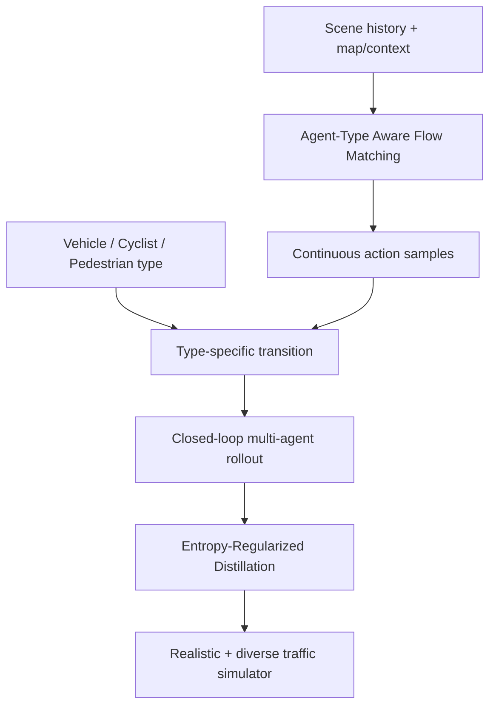

# Flow-ERD: Agent-type Aware Flow Matching with Entropy-Regularized Distillation for Diverse Traffic Simulation 분석

## 한 문장 결론

**Flow-ERD는 flow matching의 다양한 trajectory 생성 능력을 agent-type kinematics와 entropy-preserving closed-loop distillation으로 묶어 자율주행 traffic simulator의 realism-diversity trade-off를 완화한다.**

## 문제

AD traffic simulation benchmark가 realism 중심이라 diverse plausible futures와 closed-loop covariate shift를 동시에 다루기 어렵다.

## 핵심 기여

1. Agent-Type Aware Flow Matching(AFM) backbone
2. vehicle/cyclist/pedestrian type-specific state transition
3. transition-consistent action target
4. entropy-regularized reverse-KL distillation으로 closed-loop 보정
5. WOSAC realism 및 log-free diversity Pareto 개선

## VLA/AD taxonomy 위치

자율주행 VA/VLA taxonomy에서는 world model/traffic simulator 및 closed-loop evaluation infrastructure에 해당한다. 직접 language-action model은 아니지만 E2E AD와 VLA policy의 robustness 평가에 중요하다.

## Architecture / pipeline

## Input → Reasoning/Modeling → Action representation

| 항목 | 내용 |
|---|---|
| 입력 | traffic-agent history, map/context, agent type |
| 출력 | multi-agent future actions/states/trajectories |
| action grounding | sampled flow action → type-specific kinematic transition → closed-loop rollout |

## Training recipe

- Pretraining/initial training은 paper-specific dataset mixture 또는 logged traffic/trajectory data에서 수행된다.
- Post-training은 task reward, closed-loop rollout, GRPO/entropy regularization 등으로 downstream behavior를 조정한다.
- 핵심은 representation을 action으로 바로 내보내지 않고, 중간 guidance(pixel goal 또는 flow action)를 물리적 실행 가능성에 맞게 변환하는 것이다.

## Dataset / benchmark / metric

WOSAC realism metrics plus log-free diversity; realism-diversity Pareto frontier and ablations for AFM/ERD.

## Open-loop vs closed-loop

- Open-loop: logged trajectory 또는 held-out annotation과의 정적 일치도를 확인한다.
- Closed-loop: model output이 다음 상태 분포를 바꾸는 상황에서 error accumulation, covariate shift, safety/arrival/success rate를 확인한다.
- 이 논문은 closed-loop 성능을 특히 강조한다. ABot-N1은 실제 navigation rollout, Flow-ERD는 simulator rollout distribution을 다룬다.

## 강점

- 고수준 semantic reasoning과 저수준 executable action 사이의 interface를 명확히 만든다.
- benchmark/metric을 통해 단순 accuracy가 아니라 robustness, diversity, deployment 가능성을 본다.
- VLA/E2E AD 연구에서 자주 흐려지는 “language/representation이 어떻게 action으로 grounded되는가”를 직접 다룬다.

## 한계와 리스크

- reported benchmark가 실제 도로 안전성을 보장하지 않는다.
- large VLM/flow model은 latency, memory, edge deployment 문제가 남는다.
- closed-loop success가 causal safety guarantee는 아니며, long-tail failure와 hallucinated reasoning/trajectory drift를 별도로 감시해야 한다.

## 찬호님 관심 주제와의 연결

E2E AD/VLA policy는 closed-loop simulator에서 rare but plausible behavior를 경험해야 한다. Flow-ERD는 evaluator/world-model 역할을 하며, planner가 single logged future에 과적합되는지 점검할 수 있다.
