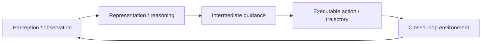

# 학습 노트: Flow-ERD: Agent-type Aware Flow Matching with Entropy-Regularized Distillation for Diverse Traffic Simulation

## 선수 지식

- VLM/VLA의 기본 구조: visual encoder, language model/reasoner, action decoder.
- imitation learning, closed-loop rollout, waypoint/trajectory representation.
- 자율주행 또는 robotics benchmark에서 success rate와 trajectory metric이 무엇을 의미하는지.

## Glossary

- **Flow matching**: 분포 사이를 잇는 vector field를 학습해 sample을 생성하는 generative modeling 방법.
- **Agent-type aware**: vehicle/cyclist/pedestrian 등 type별 kinematics와 action semantics를 분리해 모델링하는 접근.
- **Covariate shift**: closed-loop rollout에서 모델 예측이 다음 입력 분포를 바꾸며 학습 분포와 달라지는 현상.
- **Entropy regularization**: distillation 중 mode collapse를 막기 위해 출력 분포의 다양성을 유지하는 규제.

## Architecture map

## 단계별 이해

1. **문제 정의**: 단일 observation-action mapping이 왜 일반화/안전/다양성에서 부족한지 확인한다.
2. **중간 표현 확인**: pixel goal, flow action, waypoint 같은 action grounding bridge가 무엇인지 찾는다.
3. **closed-loop 조건 확인**: 예측이 다음 입력을 바꿀 때 어떤 error가 누적되는지 본다.
4. **metric 분해**: success/arrival/realism/diversity가 각각 무엇을 보상하고 무엇을 놓치는지 나눈다.
5. **배포 제약**: latency, edge memory, control frequency, safety monitor가 실제 적용의 병목인지 확인한다.

## 핵심 식/표현

- Goal-conditioned policy: `pi(a_t | o_<=t, g, h)`.
- Intermediate guidance: `z_t = f_VLM(o_t, g)` 또는 flow action sample `u_t`.
- Closed-loop rollout: `s_next = T(s_t, a_t)`이며 모델의 `a_t`가 다음 observation distribution을 바꾼다.
- Robustness 관점: 평균 성능뿐 아니라 long-tail scenario, off-distribution object/POI/agent behavior를 봐야 한다.

## 구현/배포 메모

- reasoning module과 action module을 분리하면 해석성과 latency control이 좋아질 수 있다.
- 단, 중간 guidance coordinate가 sensor calibration/BEV map과 맞지 않으면 drift가 생긴다.
- closed-loop simulator는 diversity를 보존해야 rare scenario coverage를 늘릴 수 있다.

## Study questions

### Q1. 왜 realism만으로는 simulator가 부족한가?
한 장면에는 여러 plausible future가 있으므로 logged future 하나와 가까운 모델은 ego policy robustness를 충분히 검증하지 못한다.
### Q2. Flow-ERD가 VLA 논문이 아니어도 왜 중요한가?
VLA/E2E driving policy의 closed-loop 평가와 long-tail scenario generation을 위한 traffic world model 역할을 할 수 있기 때문이다.

## Reading roadmap

1. WOSAC와 Waymo Sim Agents Challenge metric을 먼저 훑는다.
2. TrafficGen/SMART류 traffic simulator와 realism-diversity trade-off를 비교한다.
3. E2E AD policy의 closed-loop 평가에 Flow-ERD식 diverse rollout을 어떻게 붙일지 설계한다.
