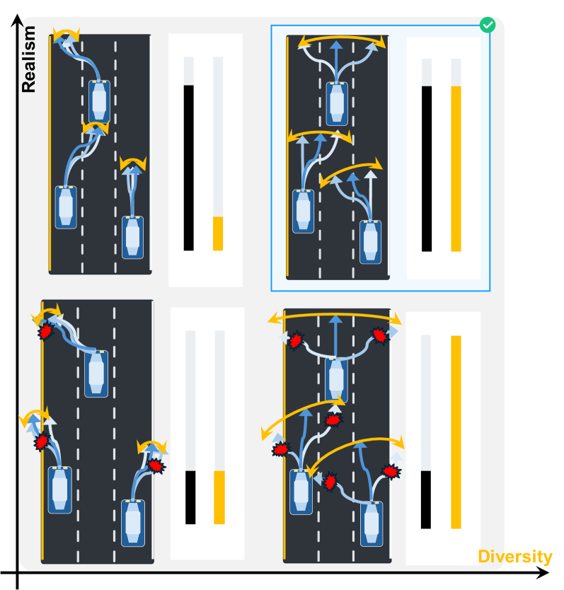
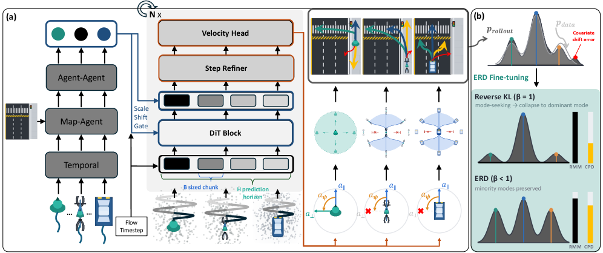
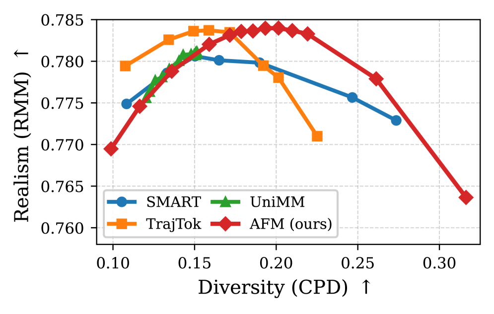
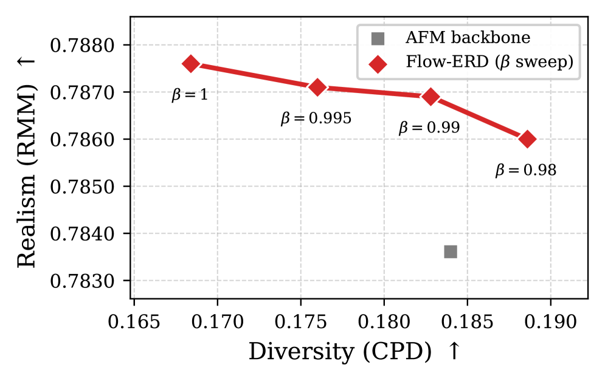
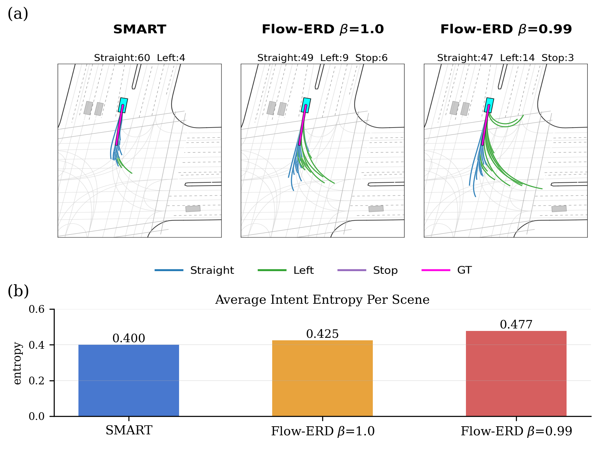

# Flow-ERD: 다양한 traffic simulation을 위한 agent-type aware flow matching과 entropy-regularized distillation

- 원제: **Flow-ERD: Agent-type Aware Flow Matching with Entropy-Regularized Distillation for Diverse Traffic Simulation**
- 저자: Seulbin Hwang, Kiyoung Om, Daejung Kim, Jinhan Lee
- Hugging Face: https://huggingface.co/papers/2607.06957
- arXiv: https://arxiv.org/abs/2607.06957
- Project: https://seulbinhwang.github.io/flow-erd-project-page/

> 번역 범위: arXiv HTML 본문을 기준으로 Abstract, Introduction, Related Work, Preliminaries, Method, Experiments, Conclusion을 중심으로 기술 번역했다. 수식·표·appendix 전체의 줄 단위 완역은 생략했으며, 핵심 architecture/metric/실험 주장과 figure caption은 학습용으로 보존했다.

## Abstract — 한국어 번역

자율주행 개발에는 현실적이면서도 다양한 traffic simulation이 필수적이다. 기존 benchmark는 realism을 강하게 보상하지만 diversity는 상대적으로 덜 평가해, 모델이 단일 logged future에 과적합되는 문제가 있다. Flow-ERD는 Agent-Type Aware Flow Matching(AFM)과 Entropy-Regularized Distillation(ERD)을 결합해 realism과 diversity를 동시에 추구하는 multi-agent simulator다. AFM은 flow matching의 multi-modal expressiveness를 vehicle/cyclist/pedestrian 등 type-specific kinematic execution과 결합한다. ERD는 entropy-regularized reverse-KL objective로 closed-loop rollout distribution을 보정하여 covariate shift를 줄이되 high-density mode로 붕괴하지 않게 한다. WOSAC test benchmark에서 높은 realism과 log-free diversity를 함께 달성하며 Pareto frontier를 개선한다.

## Introduction — 한국어 기술 번역/정리

Traffic simulation은 public-road deployment 이전의 controlled validation과 AV planning policy 학습/평가의 핵심 인프라다. simulator의 주변 agent는 현실적으로 움직여야 하며, 동시에 한 장면에서 가능한 여러 미래를 충분히 포괄해야 ego policy의 robustness를 검증할 수 있다. 기존 WOSAC류 realism metric은 단일 logged future와의 유사성을 측정하므로, 다양하지만 타당한 alternative future를 충분히 보상하지 못한다.

## Related Works — 한국어 기술 번역/정리

기존 learning-based multi-agent simulator는 next-token prediction, diffusion/flow 기반 trajectory generation, closed-loop rollout distillation 등으로 발전했다. 하지만 token vocabulary 기반 방식은 type-compatible motion을 잘 만들더라도 fine-grained diversity가 제한되고, sampling temperature 조정만으로 realism-diversity 균형을 잡기 어렵다. closed-loop distillation은 covariate shift를 줄이지만 mode collapse 위험이 있다.

## Preliminaries — 한국어 기술 번역/정리

Multi-agent driving simulation은 history observation과 map/context를 바탕으로 vehicle, cyclist, pedestrian 등 agent별 future action/state를 반복적으로 rollout한다. closed-loop에서는 모델의 예측이 다음 입력 distribution을 바꾸므로 open-loop 학습 분포와 rollout 분포 사이에 covariate shift가 생긴다. Flow matching은 noise/state 사이의 continuous vector field를 학습해 multi-modal sample을 생성할 수 있다.

## Method — 한국어 기술 번역/정리

Flow-ERD의 AFM backbone은 action-space에서 flow를 모델링하고, agent type별 transition model을 통해 physical motion으로 변환한다. vehicle은 bicycle-style kinematics, pedestrian/cyclist는 더 holonomic한 motion assumption을 사용할 수 있다. Transition-consistent action target으로 학습해 생성 action이 type-specific dynamics와 맞물리게 한다. 두 번째 단계 ERD는 closed-loop rollout을 teacher/reference distribution과 맞추는 reverse-KL distillation을 사용하되 entropy regularization을 더해 plausible mode들을 보존한다.

## Experiments — 한국어 기술 번역/정리

평가는 standard realism score와 log-free diversity metric을 함께 사용한다. Flow-ERD는 WOSAC test benchmark에서 높은 순위를 기록하고, reproducible baselines 대비 realism-diversity Pareto front를 지배한다고 보고된다. 핵심 ablation은 AFM이 backbone의 realism-diversity trade-off를 완화하고, ERD가 closed-loop covariate shift를 줄이면서 diversity collapse를 방지한다는 점을 보여준다.

## Conclusion — 한국어 기술 번역/정리

Flow-ERD는 “자율주행 simulator는 단일 정답 궤적을 맞히는 모델이 아니라, agent type에 맞는 다양한 plausible future를 안정적으로 rollout해야 한다”는 문제의식을 구현한다. VLA/E2E AD 연구에서는 policy를 closed-loop로 시험할 realistic-diverse environment generator로 활용될 수 있다.

## Figures / Captions

- Figure 1 caption: Figure 1 : Low-diversity rollouts concentrate on a dominant behavior, whereas low-realism rollouts deviate from plausible traffic motion. Flow-ERD targets the desired regime of realistic and diverse closed-loop rollouts.

- Figure 2 caption: Figure 2 : Overview of Flow-ERD. (a) The Agent-Type Aware Flow-Matching (AFM) backbone generates a shared continuous action representation, executed through type-specific kinematics (non-holonomic for vehicles/cyclists, holonomic for pedestrians). (b) Entropy-Regularized Distillation (ERD) then fine-tunes the closed-loop distribution: the vanilla reverse-KL objective ( β = 1 \beta=1 ) is mode-seeking, easier to collapse onto the dominant (straight) mode, whereas ERD ( β &lt; 1 \beta&lt;1 ) targe

- Figure 3 caption: Figure 3 : Realism–diversity trade-off on the validation split. UniMM, SMART, and TrajTok sweep k k of top-k decoding during validation rollouts, whereas AFM (ours) sweeps the Gaussian noise scale. AFM traces the upper-right Pareto frontier, reaching an RMM of 0.7840 at noise scale 1.05.

- Figure 4 caption: Figure 4 : ERD entropy temperature β \beta sweep on the WOSAC 2025 validation split. Sweeping β ∈ ( 0 , 1 ] \beta\in(0,1] traces Flow-ERD’s realism (RMM) versus diversity (CPD, Eq. 21 ) trade-off: lowering β \beta flattens the target distribution and raises diversity at a small cost in realism.

- Figure 5 caption: Figure 5 : We run multi-agent closed-loop rollouts over 1,048 validation scenes and label ego-maneuver intents following WOMD [ 5 ] . (a) Ego-trajectory diversity on a WOSAC scene, shown by overlaying closed-loop rollouts. (b) Average per-scene intent entropy of the ego rollouts.

## 생략 및 확인 필요

- Appendix, 전체 수식 전개, 모든 ablation table의 세부 숫자는 원문 PDF/HTML에서 추가 확인해야 한다.
- 이 번역은 주간 학습과 llm-wiki ingest를 위한 기술 번역/정리본이며, 인용 시 원문 arXiv 버전(2607.06957)을 기준으로 확인한다.
