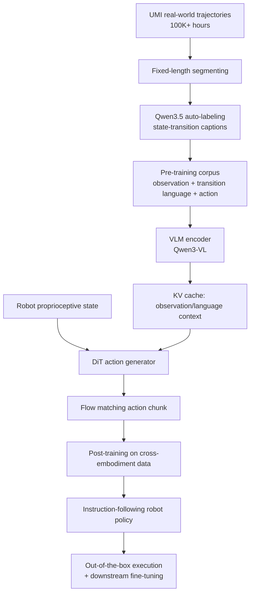

# Xiaomi-Robotics-1 분석: 100K+ trajectory 기반 VLA 스케일링

## 한 문장 결론

**Xiaomi-Robotics-1은 UMI 기반 10만+ 시간 trajectory와 state-transition language auto-labeling을 결합해, robot VLA에서도 데이터 규모와 모델 규모가 실제 out-of-the-box 조작 성능으로 이어질 수 있음을 보여준 scaling paper다.**

## 문제 정의

Robot foundation policy를 만들려면 언어 instruction과 시각 observation을 실제 action으로 grounding해야 한다. 그러나 robotics 데이터는 웹 텍스트/이미지처럼 쉽게 scale되지 않는다. Teleoperation은 비싸고 느리며, task/environment diversity가 부족하다. 이 논문은 다음 질문을 던진다.

- UMI 같은 저비용/대규모 조작 trajectory를 VLA pre-training 데이터로 바꿀 수 있는가?
- State-transition description을 언어 조건으로 쓰면 action grounding이 강화되는가?
- Pre-training data/model scaling이 post-training 이후 real robot 성능으로 이전되는가?
- Foundation policy가 새로운 task에 적은 데이터로 빠르게 적응하는가?

## 핵심 기여

1. **100K+ hours real-world manipulation trajectory pre-training**
   - UMI handheld gripper와 egocentric camera로 대규모 실제 manipulation trajectory를 수집.
   - Household, commercial, industrial, office, outdoor 등 open-world diversity를 확보.

2. **State-transition language auto-labeling pipeline**
   - Trajectory를 fixed-length segment로 나누고 Qwen3.5-27B가 gripper/object state transition을 captioning.
   - Task label이 아니라 “현재 상태에서 목표 상태로 어떤 변화가 일어나는가”를 언어로 표현해 action learning에 직접 연결.

3. **MoT VLA architecture**
   - Qwen3-VL 기반 VLM + Diffusion Transformer (DiT).
   - VLM은 observation/language token을 encode하고, DiT는 VLM KV cache와 robot state를 조건으로 flow matching action chunk를 생성.

4. **Cross-embodiment post-training**
   - UMI gripper에서 학습한 action capability를 mobile manipulator, dual-arm robot, static arm 등 다양한 embodiment로 transfer.
   - State-transition description에서 사람이 주는 imperative instruction으로 language conditioning을 shift.

5. **Scaling evidence**
   - Data scale 증가 → validation action error 감소 및 post-training success rate 상승.
   - Model size 2B→5B→10B 증가 → unseen environment out-of-the-box success rate 상승.
   - RoboCasa365/RoboDojo 등 simulation benchmark에서 SOTA급 결과.

## Architecture / Pipeline

## Input / Output / Action Representation

| 항목 | 내용 |
|---|---|
| 입력 observation | 주로 camera/egocentric visual observation, robot 상태 포함 |
| language input | pre-training: state-transition description / post-training: imperative task instruction |
| proprioception | robot state \(s_t\)가 DiT conditioning으로 들어감 |
| 출력 | horizon \(H\) 길이의 continuous action chunk \(a_{t:t+H}\) |
| action generator | flow matching 기반 Diffusion Transformer |
| action grounding 방식 | 언어가 “해야 할 변화”를 지정하고 DiT가 이를 continuous control trajectory로 변환 |

## Training Recipe

### Pre-training

- 데이터: 100K+ hours UMI manipulation trajectories.
- 라벨: VLM 자동 captioning으로 state transition language prompt 생성.
- 목적: diverse real-world manipulation prior와 action generation representation 학습.
- Objective: action chunk likelihood / flow matching loss.

### Post-training

- 데이터: 약 10K hours cross-embodiment trajectory.
  - 7.2K+ hours in-house robot data.
  - 1K+ hours instruction-labeled UMI data.
  - Bridge V2, RT-1, DROID 등 open-source robot datasets.
- 목적:
  1. UMI action capability → robot embodiment transfer.
  2. State-transition prompt → human imperative instruction alignment.

### Downstream fine-tuning

- 새로운 task: phone packing, laundry loading, printer refilling, box packing.
- 데이터: high-data 144h, low-data 36h.
- 목표: foundation policy의 data-efficient adaptation 검증.

## Evaluation

| 축 | 평가 내용 | 결과 요지 |
|---|---|---|
| Pre-training data scaling | 12.5/25/50/100% of 20K UMI data | 데이터가 늘수록 validation action MSE 감소, 작은 데이터는 overfitting |
| Model scaling | 2B/5B/10B | 크기가 커질수록 action prediction 및 real-robot success 향상 |
| Post-training OOD | shoe storage, bag packing, table organization, sofa tidying | action pre-training 없음 26% → 100% data pre-training 75% |
| New-task fine-tuning | 4개 hold-out task | 적은 데이터에서도 baseline 대비 높은 progress/success |
| Simulation | RoboCasa, RoboCasa365, VLABench, RoboDojo | RoboCasa365 57.6%, RoboDojo 20.07 등 SOTA급 |

## Open-loop vs Closed-loop 관점

- **Open-loop 성격:** Pre-training validation은 predicted action과 ground-truth action의 MSE를 본다. 이는 action imitation 품질을 측정하지만 실제 환경 feedback까지 보지는 않는다.
- **Closed-loop 성격:** Post-training real-robot evaluation과 simulation benchmark는 policy가 실제/시뮬레이션 환경에서 action을 실행해 task success를 달성하는지 본다.
- 중요한 점: 논문은 open-loop action error가 좋아지는 것만 보여주는 데 그치지 않고, scaling gain이 real-robot out-of-the-box success로 이전됨을 실험한다.

## 강점

1. **데이터 scaling의 설득력**: 100K+ hours라는 규모는 VLA robotics에서 매우 큰 축에 속하며, UMI 수집 방식은 hardware-bound teleoperation 병목을 완화한다.
2. **언어의 역할이 명확함**: language가 explanation 장식이 아니라 state transition/action conditioning으로 쓰인다.
3. **Embodiment transfer를 정면으로 다룸**: UMI gripper pre-training에서 실제 robot embodiment post-training으로 이어지는 recipe가 명확하다.
4. **실험 축이 넓음**: pre-training scaling, post-training OOD, downstream adaptation, simulation benchmark를 모두 포함한다.
5. **AD/VLA 관점의 시사점**: 자율주행 VLA에서도 “state transition language + trajectory/action generation” 조합이 route-conditioned driving action grounding으로 확장될 수 있다.

## 한계와 주의점

1. **Manipulation 중심**: 자율주행 VLA와 직접 동일하지 않다. Driving은 BEV/occupancy/map/route/traffic rule과 closed-loop safety 제약이 더 강하다.
2. **데이터·컴퓨트 장벽**: 100K+ hours 데이터와 billion-scale model은 대부분 연구실이 재현하기 어렵다.
3. **Auto-label 품질 의존성**: VLM captioning이 state transition을 잘못 설명하면 action grounding에 noisy supervision이 들어갈 수 있다.
4. **Safety guarantee 부족**: 성공률 중심 평가이고, failure mode·collision/safety constraint·uncertainty calibration 분석은 제한적이다.
5. **Latency/deployment 세부 부족**: DiT flow matching inference가 real-time control loop에서 어떤 latency trade-off를 갖는지 더 자세한 분석이 필요하다.

## 왜 중요한가: 찬호님 관심 주제와 연결

- **VLA:** Vision + language + continuous action chunk generation을 명확히 구현한다.
- **E2E policy:** Perception/planning/control을 분리된 모듈보다 foundation policy로 학습하는 방향과 맞닿아 있다.
- **Action grounding:** State-transition language를 continuous trajectory로 변환하는 구조는 VLA 연구의 핵심 질문을 다룬다.
- **Autonomous driving 전이 가능성:** Driving VLA에서도 language route/instruction, scene transition, trajectory/waypoint generation을 결합하는 설계가 중요하다. 이 논문은 manipulation domain에서 그 scaling recipe를 보여준다.
- **Foundation model scaling:** Robot policy의 scaling axis가 data size, model size, embodiment diversity임을 체계적으로 보여준다.

## 비교 포지셔닝

| 모델/계열 | 포지션 | Xiaomi-Robotics-1과의 차이 |
|---|---|---|
| RT-1 | large-scale real-robot transformer policy | Xiaomi는 VLM+DiT, UMI 100K+ hours, state-transition labeling 강조 |
| pi0 / pi0.5 | VLA flow/action model | Xiaomi는 UMI 대규모 pre-training과 cross-embodiment post-training scaling을 전면 검증 |
| DROID/Bridge data 기반 정책 | open robot dataset 활용 | Xiaomi는 in-house massive UMI + robot data와 auto-label pipeline을 결합 |
| World-action model | 미래/행동 dynamics modeling | Xiaomi는 direct action chunk generation에 초점, world model은 보조적 배경 |

## 핵심 takeaway

Xiaomi-Robotics-1의 가장 큰 메시지는 “로봇 VLA도 scale한다”이다. 다만 단순히 많은 trajectory를 모으는 것이 아니라, trajectory를 **언어로 표현된 state transition**으로 재구성해야 VLA가 action grounding을 학습할 수 있다. 자율주행 VLA로 옮겨 생각하면, sensor observation과 route/traffic-rule language를 “미래 driving state transition”과 연결하고, 이를 waypoint/trajectory/control로 grounding하는 것이 핵심 설계 축이 될 수 있다.
