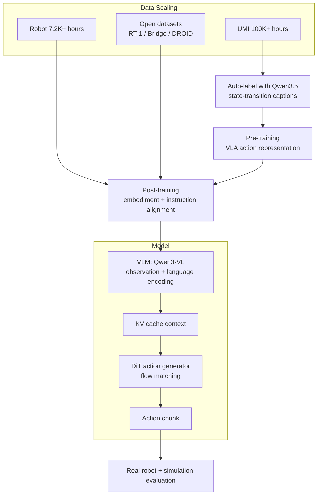

# Xiaomi-Robotics-1 학습 노트: VLA scaling과 action grounding

## 학습 목표

이 노트를 읽고 나면 다음을 설명할 수 있어야 한다.

1. UMI trajectory가 왜 robot VLA pre-training에 유용한지.
2. State-transition language captioning이 action grounding과 어떤 관련이 있는지.
3. VLM + DiT + flow matching 구조가 continuous action chunk를 어떻게 생성하는지.
4. Pre-training data scale, model size, post-training embodiment alignment가 각각 어떤 역할을 하는지.
5. 자율주행 VLA/E2E AD로 가져올 수 있는 설계 교훈이 무엇인지.

## 사전 지식

| 주제 | 알아야 할 내용 |
|---|---|
| VLA | Vision-Language-Action: 시각 observation과 언어 instruction을 실행 가능한 action으로 변환 |
| Imitation learning | Demonstration trajectory에서 policy를 학습하는 기본 방식 |
| Flow matching / diffusion | noise에서 target sample/action으로 가는 vector field 또는 denoising process 학습 |
| VLM | Vision-language representation을 만들고 instruction/scene understanding을 담당 |
| Robot embodiment | gripper, mobile manipulator, dual-arm robot 등 action/state space가 다른 물리 형태 |
| Closed-loop evaluation | policy가 환경에서 직접 action을 실행하고 feedback을 받는 평가 |

## 핵심 용어

- **UMI (Universal Manipulation Interface):** 실제 로봇이 없어도 handheld gripper로 in-the-wild manipulation trajectory를 수집하는 장치/방법.
- **State-transition description:** “현재 scene/object/gripper 상태가 어떻게 변했는지”를 설명하는 language caption. 단순 task label보다 action과 더 가까운 supervision이다.
- **Action chunk:** 한 timestep의 control이 아니라 horizon \(H\) 동안의 action sequence. Long-horizon 안정성과 inference 효율을 위해 자주 사용된다.
- **Cross-embodiment post-training:** UMI, mobile manipulator, dual-arm robot, static arm처럼 embodiment가 다른 데이터를 섞어 특정 로봇 action space에 policy를 맞추는 단계.
- **Out-of-the-box performance:** 평가 환경/task instance에 별도 fine-tuning 없이 바로 실행한 성능.

## 전체 구조 한눈에 보기

## Step-by-step 설명

### Step 1. 많은 trajectory를 모은다

로봇 데이터는 비싸다. Xiaomi-Robotics-1은 real robot teleoperation만 고집하지 않고, UMI gripper를 이용해 사람이 다양한 환경에서 조작하는 trajectory를 대규모로 수집한다. 이 방식은 robot hardware deployment 비용을 낮추고, environment/task/object diversity를 늘린다.

### Step 2. Trajectory를 language-conditioned action data로 바꾼다

그냥 trajectory만 있으면 “어떤 목적의 행동인지”가 불분명할 수 있다. 저자들은 trajectory를 fixed-length segment로 자르고, VLM에게 각 segment의 state transition을 설명하게 한다.

예:

- 나쁜 라벨: “컵 조작”
- 좋은 state-transition 라벨: “gripper가 컵 손잡이를 잡고 컵을 오른쪽 접시 위로 이동한다”

두 번째 라벨은 action이 만들어야 하는 world-state change를 직접 지정한다. 따라서 VLA의 language input이 action grounding에 가까워진다.

### Step 3. VLM이 multimodal context를 만든다

Qwen3-VL은 observation과 instruction을 입력받아 visual-language context를 만든다. 이 context는 KV cache 형태로 action generator에 전달된다.

자율주행 비유:

- VLM context = 전방/주변 scene 이해 + route command + traffic rule context
- Action generator = waypoint/trajectory/control generator

### Step 4. DiT가 flow matching으로 action chunk를 생성한다

DiT는 random/noisy action에서 시작해 target action chunk로 가는 방향을 학습한다. 기본 loss는 다음 형태다.

\[
L_{Flow}(\theta)=\lVert v_\theta(o_t,l,s_t,\tilde{a}^{\tau}_{t:t+H},\tau)-u(\tilde{a}^{\tau}_{t:t+H},a_{t:t+H},\tau)\rVert_2^2
\]

- \(o_t\): observation
- \(l\): language instruction
- \(s_t\): robot proprioceptive state
- \(a_{t:t+H}\): ground-truth action chunk
- \(\tilde{a}^{\tau}_{t:t+H}\): noise가 섞인 action
- \(v_\theta\): 모델이 예측하는 vector field
- \(u\): 정답 방향

핵심은 language와 vision이 action chunk 생성의 조건으로 들어간다는 것이다.

### Step 5. Post-training으로 실제 로봇 instruction에 맞춘다

Pre-training caption은 state transition description이다. 하지만 사용자는 로봇에게 보통 “이 신발을 정리해”, “가방을 싸”, “프린터에 종이를 넣어” 같은 imperative instruction을 준다. Post-training은 이 gap을 줄인다.

또한 UMI gripper와 실제 robot arm/mobile manipulator의 action/state space는 다르다. Post-training은 embodiment gap도 줄인다.

## Taxonomy 위치

| 축 | Xiaomi-Robotics-1의 위치 |
|---|---|
| VLA taxonomy | Numerical Action Generator / continuous action chunk generator |
| Language role | state-transition supervision, task instruction following, action conditioning |
| Action grounding | VLM context + robot state를 조건으로 DiT가 continuous action chunk 생성 |
| Training | large-scale pre-training + cross-embodiment post-training + downstream fine-tuning |
| Evaluation | open-loop action MSE + closed-loop real-robot success + simulation benchmark |
| 자율주행 연결 | waypoint/trajectory generation VLA와 구조적으로 유사하나 domain은 manipulation |

## 자율주행 VLA로 번역해 보기

Xiaomi-Robotics-1의 recipe를 E2E autonomous driving에 옮기면 다음과 같다.

| Manipulation VLA | Autonomous Driving VLA 대응 |
|---|---|
| UMI manipulation trajectory | fleet driving logs / simulation rollouts |
| state-transition caption | scene evolution, route intent, traffic-rule-constrained driving rationale |
| robot proprioception | ego speed, acceleration, yaw, steering state |
| action chunk | future waypoints, trajectory, steering/throttle/brake sequence |
| cross-embodiment | vehicle platform / sensor suite / city-domain adaptation |
| real-robot success | closed-loop CARLA/nuPlan/real-road safety metrics |

주의할 점은 driving에서는 safety-critical constraint가 훨씬 강하다는 것이다. VLA가 reasoning을 잘해도 trajectory가 collision-free, traffic-rule compliant, comfortable해야 한다. 따라서 driving에서는 Xiaomi식 action generator에 safety planner, verifier, uncertainty estimation을 더해야 할 가능성이 높다.

## 구현/재현 관점 체크리스트

### 데이터

- [ ] Trajectory source가 충분히 다양하고 long-tail을 포함하는가?
- [ ] Language annotation이 action에 필요한 state change를 구체적으로 설명하는가?
- [ ] Idle/noisy segment를 filtering했는가?
- [ ] Embodiment별 state/action representation을 어떻게 normalize하는가?

### 모델

- [ ] VLM backbone은 observation과 instruction을 충분히 encode하는가?
- [ ] Action generator는 continuous action distribution을 표현할 수 있는가?
- [ ] Action chunk horizon은 latency와 control stability 사이에서 적절한가?
- [ ] VLM token과 action token 사이 attention 설계가 불필요한 leakage/비효율을 만들지 않는가?

### 평가

- [ ] Open-loop imitation metric만 보지 않고 closed-loop success를 보는가?
- [ ] Unseen environment/object/task split이 명확한가?
- [ ] Safety/failure mode/latency를 별도 측정하는가?
- [ ] Data/model scaling curve가 saturation되는지 확인하는가?

## 주요 Figure 해설

- **Figure 1:** 전체 recipe. UMI pre-training → cross-embodiment post-training → out-of-the-box/fine-tuning evaluation.
- **Figure 2:** VLM + DiT MoT architecture. VLM은 context, DiT는 action chunk 생성.
- **Figure 5:** Pre-training scaling curve. 데이터가 커질수록 overfitting이 줄고 action error가 감소.
- **Figure 8:** Post-training success rate. Pre-training scale과 model size가 real robot success로 이전.
- **Figure 10:** Downstream fine-tuning. 적은 데이터에서도 새로운 task에 적응.

## 공부 질문과 답

### Q1. 왜 task label보다 state-transition caption이 중요한가?

A. Task label은 “무엇을 해야 하는지”를 거칠게 말하지만, state-transition caption은 “scene/object/gripper 상태가 어떻게 변해야 하는지”를 말한다. Action은 결국 world state를 바꾸는 것이므로, state transition은 action grounding에 더 직접적인 supervision이다.

### Q2. UMI data는 robot embodiment가 아닌데 왜 도움이 되는가?

A. UMI는 실제 physical interaction과 manipulation trajectory를 제공한다. Gripper embodiment는 실제 robot arm과 다르지만, object interaction, contact, motion prior, visual change는 robot manipulation에 유용하다. Post-training이 이 prior를 robot embodiment에 맞춘다.

### Q3. Xiaomi-Robotics-1은 VLA인가, VA인가?

A. VLA다. Observation은 visual, instruction/state-transition prompt는 language, 출력은 continuous action chunk다. 특히 language가 action generator의 conditioning으로 직접 들어간다.

### Q4. Open-loop MSE가 낮으면 closed-loop 성공도 보장되는가?

A. 보장되지는 않는다. 하지만 이 논문은 pre-training scaling으로 action MSE가 낮아지고, post-training 뒤 closed-loop success도 증가한다는 상관/이전 효과를 보여준다. Driving/robotics에서는 반드시 closed-loop 평가가 필요하다.

### Q5. 자율주행 VLA에 가장 중요한 교훈은?

A. Language를 단순 explanation으로 쓰지 말고, future state/route/traffic intent를 action trajectory와 직접 연결하는 supervision으로 써야 한다. 또한 data scale이 커져도 closed-loop safety와 latency 검증이 별도로 필요하다.

## 읽기 로드맵

1. **빠른 이해:** Abstract → Figure 1 → Figure 2 → Conclusion.
2. **모델 이해:** Section 2.1 Model에서 VLM/DiT/flow matching 부분을 집중.
3. **데이터 이해:** Section 2.2에서 UMI pre-training과 post-training dataset 차이를 비교.
4. **실험 이해:** Figure 5와 Figure 8을 통해 scaling curve를 본다.
5. **VLA 연결:** π0/π0.5, RT-1, UMI, Diffusion Policy를 함께 읽는다.
6. **AD 전이:** driving VLA 논문에서 language-conditioned waypoint/trajectory generation과 비교한다.

## 개인 연구 메모

- 이 논문은 “VLA reasoning”보다 “VLA action scaling”에 더 초점이 있다.
- CoT나 explicit planner보다, language-conditioned continuous control generator가 핵심이다.
- 자율주행 쪽으로 확장하려면 `state-transition caption`을 `scene evolution + intended maneuver + safety constraint` 형태로 바꾸는 것이 자연스럽다.
- 가장 큰 open problem은 auto-label language가 실제 causal action supervision인지, 그럴듯한 caption noise인지 검증하는 방법이다.
