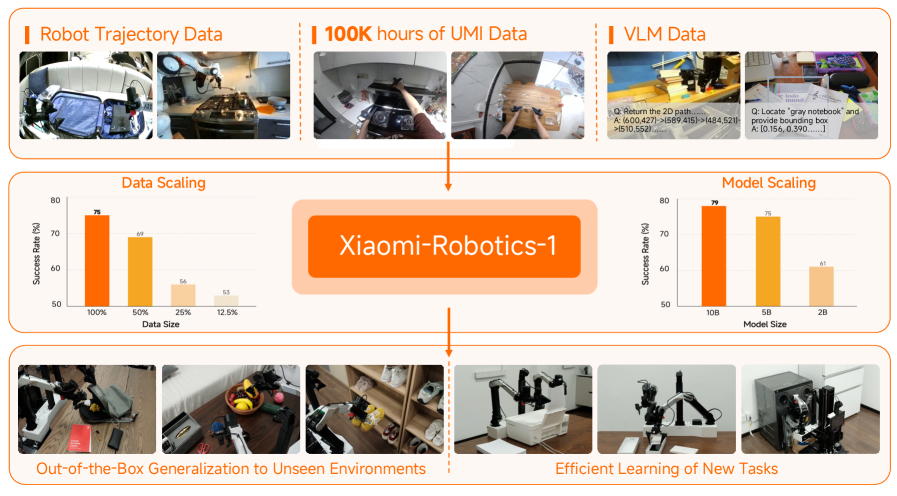
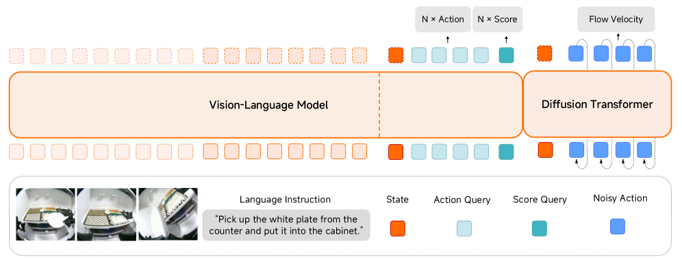
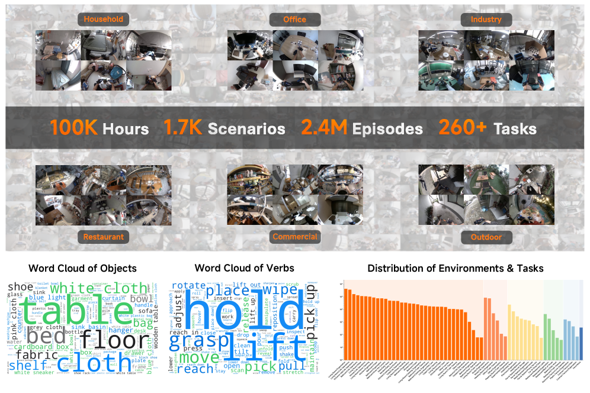
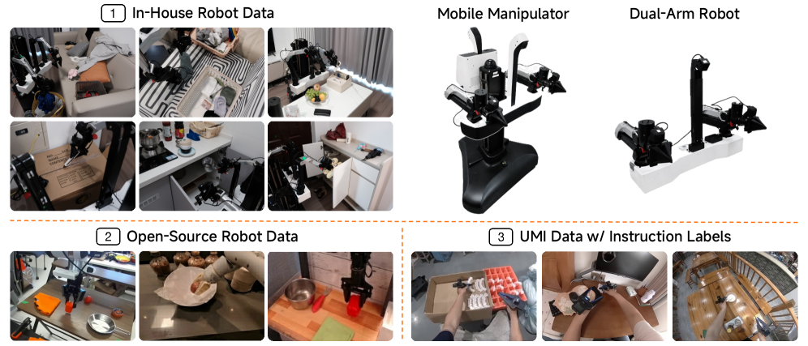
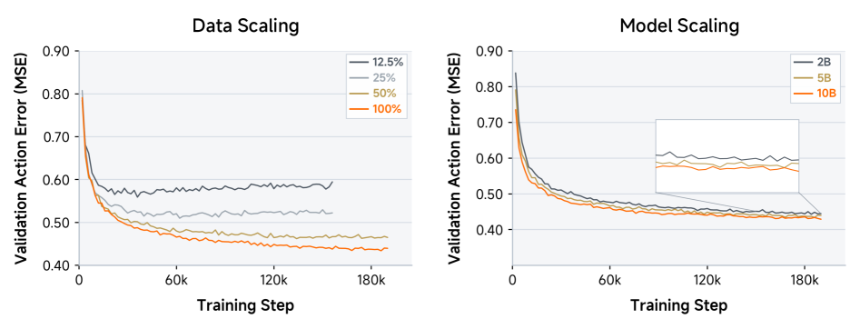
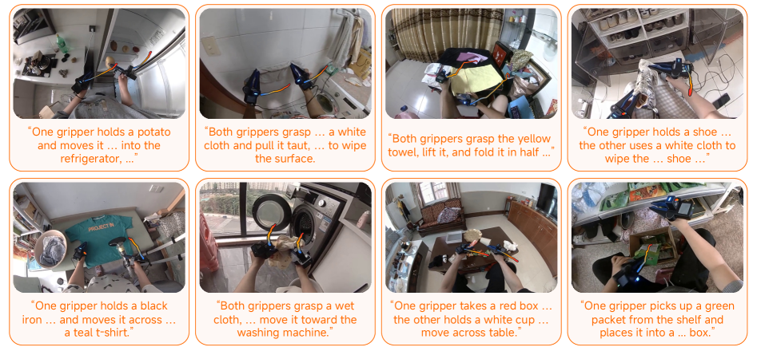
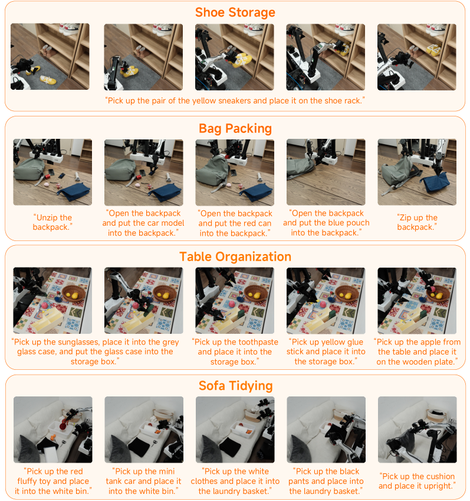
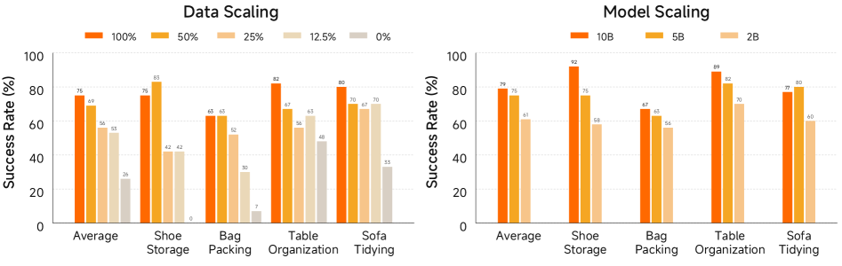
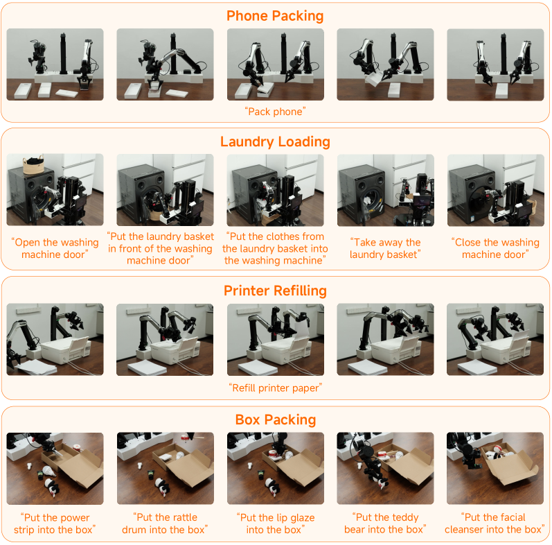

# Xiaomi-Robotics-1: 10만+ 시간 실제 궤적으로 Vision-Language-Action 모델 스케일링

- 원제: **Xiaomi-Robotics-1: Scaling Vision-Language-Action Models with over 100K Hours of Real-World Trajectories**
- 저자: Xiaomi Robotics Team 외
- 원문: <https://arxiv.org/abs/2607.15330>
- 프로젝트: <https://robotics.xiaomi.com/xiaomi-robotics-1.html>
- 코드/모델 예정: <https://github.com/XiaomiRobotics/Xiaomi-Robotics-1>

> 번역 범위: arXiv HTML 본문을 기준으로 Abstract, Introduction, Model/Training, Experiments, Related Work, Conclusion, 주요 Figure/Table 캡션을 기술적으로 충실히 번역·정리했다. 부록의 세부 표·저자 감사문·일부 반복적 참고문헌 목록은 원문 링크와 `source-extract.txt`에 보존하고 여기서는 핵심만 다룬다.

## 그림 목록

**Figure 1 번역 — 개요.** Xiaomi-Robotics-1은 UMI 장치로 수집한 10만 시간 이상의 실제 조작 trajectory에 대해, state transition을 설명하는 언어 prompt를 자동 라벨링하여 pre-training된다. 이후 cross-embodiment post-training으로 robot embodiment와 imperative instruction prompt에 정렬된다. 모델은 data scale과 model size가 커질수록 성능이 좋아지고, unseen environment에서 여러 task를 out-of-the-box로 수행하며, 새로운 task에도 적은 데이터로 효율적으로 적응한다.

**Figure 2 번역 — 모델 아키텍처.** Xiaomi-Robotics-1은 pre-trained VLM과 DiT를 결합한 Mixture-of-Transformers 구조를 사용한다. VLM은 observation과 language instruction을 encode하고, Choice Policies 방식으로 action chunk도 함께 예측해 training convergence를 빠르게 한다. DiT는 robot state와 VLM이 만든 observation/language token의 KV cache를 조건으로 받아 flow matching으로 action chunk를 생성한다. action-related token은 DiT attention 계산에서 제외된다.

## Abstract 한국어 번역

이 논문은 **Xiaomi-Robotics-1**을 제안한다. Xiaomi-Robotics-1은 foundational **vision-language-action (VLA)** 모델로서, (1) 다양한 자연어 instruction을 따라 unseen environment에서 폭넓은 mobile manipulation task를 out-of-the-box로 수행하고, (2) 적은 fine-tuning 데이터만으로 새로운 downstream task에 효율적으로 적응하는 것을 목표로 한다.

저자들은 pre-training과 post-training으로 구성된 **two-stage training recipe**를 제안한다. Pre-training 단계에서는 UMI 장치로 수집한 10만 시간 이상의 실제 조작 trajectory를 사용해, 광범위하고 일반화 가능한 action-generation 능력을 모델에 주입한다. 핵심은 trajectory clip에 대해 scene state transition을 설명하는 자연어를 자동으로 붙이는 scalable auto-labeling pipeline이다. 이 언어 라벨은 action learning에 풍부하고 정확한 conditioning 신호를 제공한다.

Post-training 단계에서는 pre-training에서 얻은 능력을 실제 robot embodiment와 사람이 로봇에게 주는 imperative instruction에 맞춘다. 즉, state transition description으로 학습한 action 이해를 실행 가능한 task prompt로 옮긴다.

실험 결과는 강한 scaling behavior를 보인다. Xiaomi-Robotics-1은 pre-training 데이터 규모와 모델 크기가 증가할수록 성능이 꾸준히 좋아진다. 이 scaling 효과는 post-training 이후 unseen environment에서의 real-robot out-of-the-box 성능으로 직접 이전된다. 또한 Xiaomi-Robotics-1은 복잡하고 dexterous한 새로운 task에 대해 data-efficient fine-tuning이 가능한 robot foundation policy 역할을 한다. 여러 simulation benchmark에서 SOTA를 넘으며, RoboCasa365에서는 57.6% success rate로 이전 최고 46.6%를 넘고, RoboDojo에서는 평균 score 20.07로 기존 13.07을 크게 앞선다.

## 1. Introduction 번역

현대 large model의 뛰어난 능력은 근본적으로 **scale**에서 나온다. 대규모·다양한 training corpus는 large language model과 vision-language model에서 성능 도약을 이끌어 왔다. 최근 VLA 모델과 world-action model도 robot manipulation에서 유망한 결과를 보였고, training data가 더 크고 다양해질수록 policy가 더 유능하고 일반화 가능해진다는 초기 증거가 있다. 따라서 robotics에서도 large model과 같은 scaling trajectory를 따르는 것은 자연스러운 방향이다.

하지만 robotics에는 고유한 병목이 있다. 일반적인 real-robot teleoperation 데이터 수집은 느리고 비싸며 hardware-bound이다. 또 teleoperation 데이터는 redundant하고 특정 task/environment에 좁게 집중되기 쉬워 데이터 다양성이 제한된다.

Xiaomi-Robotics-1은 이러한 병목을 **UMI(Universal Manipulation Interface)** 기반 대규모 실제 조작 trajectory로 우회한다. 저자들은 10만 시간 이상의 UMI trajectory를 수집하고, task별 manual segmentation/language annotation 대신 VLM을 이용해 fixed-length trajectory segment의 state transition을 자동 captioning한다. 이 caption은 “현재 observation에서 어떤 state로 변해야 하는가”를 자연어로 제시하므로, action generation을 위한 정밀한 conditioning 신호가 된다.

논문의 핵심 주장:

1. 로봇 policy도 LLM/VLM처럼 data scale과 model scale의 이득을 받을 수 있다.
2. UMI trajectory처럼 robot embodiment에 직접 묶이지 않은 데이터도, state-transition language labeling을 통해 VLA pre-training corpus가 될 수 있다.
3. Pre-training의 scaling gain은 post-training 뒤 real robot out-of-the-box 성능으로 이전된다.
4. Foundation policy로서 Xiaomi-Robotics-1은 novel task fine-tuning에 높은 data efficiency를 보인다.

## 2. Xiaomi-Robotics-1 번역

Xiaomi-Robotics-1은 heterogeneous data source, 즉 UMI trajectory, cross-embodiment robot trajectory, vision-language data를 함께 사용하는 end-to-end VLA 모델이다. 입력은 현재 observation \(o_t\)와 language instruction \(l\)이며, 출력은 horizon \(H\) 길이의 **action chunk** \(a_{t:t+H}\)이다. 학습 목표는 training dataset \(D\)에서 다음 log-likelihood를 최대화하는 것이다.

\[
\max_\theta \mathbb{E}_{(o_t,l,a_{t:t+H})\sim D}\log \pi_\theta(a_{t:t+H}\mid o_t,l)
\]

Two-stage recipe는 다음과 같다.

- **Pre-training:** scalable non-robot/UMI 데이터와 open-world diversity를 이용해 action generation을 위한 broad representation을 학습한다.
- **Post-training:** cross-embodiment robot data로 representation을 robot embodiment와 instruction-conditioned action generation에 맞춘다.

### 2.1 Model 번역

모델 구조는 **Mixture-of-Transformers (MoT)**이다. Qwen3-VL 기반 pre-trained VLM과 Diffusion Transformer (DiT)를 결합한다. VLM은 observation과 instruction을 처리하고, DiT는 VLM의 KV cache와 robot proprioceptive state를 조건으로 받아 action chunk를 생성한다.

DiT는 flow matching objective로 학습된다.

\[
L_{Flow}(\theta)=\lVert v_\theta(o_t,l,s_t,\tilde{a}^{\tau}_{t:t+H},\tau)-u(\tilde{a}^{\tau}_{t:t+H},a_{t:t+H},\tau)\rVert_2^2
\]

여기서 \(\tau\)는 flow-matching timestep이고, noisy action은 다음과 같이 구성된다.

\[
\tilde{a}^{\tau}_{t:t+H}=\tau a_{t:t+H}+(1-\tau)\epsilon,\quad \epsilon\sim\mathcal{N}(0,I)
\]

직관적으로는 정답 action chunk와 noise 사이를 잇는 continuous trajectory를 학습하고, inference 시에는 noise에서 실행 가능한 action chunk로 흐름을 따라간다. 이 방식은 discrete token으로 action을 예측하는 방법보다 연속 제어 trajectory에 잘 맞는다.

논문은 또한 VLM 쪽에 **Choice Policies**식 action 예측 보조 경로를 두어 학습 수렴을 빠르게 한다. 다만 DiT가 action chunk를 생성할 때 action-related token은 attention 계산에서 제외하여, observation/language context와 action generator의 역할을 분리한다.

### 2.2 Training & Data 번역

#### 2.2.1 Pre-training

Pre-training의 목표는 다양한 manipulation scenario로 transfer될 수 있는 broad representation을 얻는 것이다. 저자들은 UMI handheld gripper와 egocentric camera로 수집한 **100,000+ hours** real-world manipulation trajectory를 사용한다. 데이터는 household, commercial premises, industrial site, office, outdoor space 등 매우 다양한 환경을 포함한다.

기존 robot trajectory annotation은 task semantics에 따라 trajectory를 수작업으로 segment하고 각 segment에 language instruction을 붙여야 한다. 10만 시간 규모에서는 불가능에 가깝다. Xiaomi-Robotics-1은 이를 위해 자동 라벨링 pipeline을 만든다.

1. 전체 trajectory를 equal-length segment로 나눈다.
2. Qwen3.5-27B VLM을 사용해 각 segment에서 gripper와 interacting object의 state transition을 captioning한다.
3. CPU worker thread가 clip segmentation을 in-memory filesystem에 만들고, client thread는 수백 개 captioning request를 동시에 유지하는 producer-consumer pipeline을 사용한다.
4. 이 방식으로 10만 시간 이상의 corpus를 약 2주 만에 라벨링한다.

이 데이터로 학습된 모델은 “현재 observation의 상태를 언어로 설명된 목표 state로 바꾸는 action”을 생성하도록 학습된다. 여기서 language는 단순 task label이 아니라 **state transition description**이므로 action grounding이 더 직접적이다.

#### 2.2.2 Post-training

Post-training의 목표는 두 가지다.

1. UMI gripper에서 얻은 action-generation capability를 실제 robot embodiment로 이전한다.
2. Pre-training의 state-transition description conditioning을 사람이 로봇에게 주는 imperative instruction conditioning으로 바꾼다.

Post-training dataset은 UMI 장치, static robot arm, mobile manipulator, dual-arm robot의 cross-embodiment manipulation trajectory로 구성된다. 저자들은 household 환경과 task에서 mobile manipulator와 dual-arm robot으로 7,200시간 이상의 in-house robot data를 수집하고, Qwen3.5를 이용해 human-segmented video clip에 language instruction을 붙인다. 여기에 1,000시간 이상의 human-annotated UMI data와 Bridge V2, RT-1, DROID 같은 open-source robot dataset을 더한다. Idle segment는 filtering하여 학습 신호가 희석되는 것을 막는다. 전체 post-training 데이터는 약 10,000시간이다.

**Figure 3 번역 — Pre-training dataset.** 10만 시간 이상의 실제 조작 trajectory를 UMI 장치로 수집했다.

**Figure 4 번역 — Post-training dataset.** 약 10k 시간의 cross-embodiment trajectory로 구성되며, 7.2k+ 시간 in-house robot data, 1k+ 시간 instruction-labeled UMI data, open-source robot dataset을 포함한다.

## 3. Experiments 번역

실험은 네 질문에 답하도록 설계된다.

1. Xiaomi-Robotics-1은 pre-training 단계에서 data scale과 model size가 커질수록 잘 scale하는가?
2. 강한 pre-trained model은 post-training 이후 unseen environment의 out-of-the-box 성능으로 이전되는가?
3. Xiaomi-Robotics-1은 적은 데이터로 어려운 새로운 task에 적응할 수 있는가?
4. Real-robot 및 simulation benchmark에서 다른 robot foundation model과 비교하면 어떤가?

### 3.1 Pre-training: Data and Model Scaling

Data scaling 실험은 Xiaomi-Robotics-1-5B로 수행한다. 계산 비용 때문에 20k 시간 UMI data의 12.5%, 25%, 50%, 100% subset을 사용해 pre-training하고, held-out validation set에서 flow matching action prediction의 MSE를 측정한다.

결과는 data scale 증가에 따라 validation action error가 감소한다. 12.5%와 25% 데이터에서는 loss가 감소하다 다시 올라 overfitting을 보인다. 반면 50%와 100% 데이터에서는 loss가 단조 감소하고, 20k setting은 더 가파르게 개선된다. 이는 robot action learning에서 dataset volume이 generalization의 주요 병목이라는 점을 보여준다.

Model scaling 실험은 2B, 5B, 10B variant를 같은 20k 데이터로 학습해 비교한다. 모델이 커질수록 action prediction precision이 개선되지만, data scale에서 보인 차이만큼 크지는 않다. 논문은 billion-parameter scale에서는 현재 데이터 분포를 포착하기에 모델 capacity가 어느 정도 충분하며, 더 큰 일반화를 위해서는 데이터 규모가 더 중요할 수 있다고 해석한다.

**Figure 5 번역 — Pre-training scaling.** Data-scaling 및 model-scaling 실험의 validation action error(MSE)를 보여준다. 작은 데이터 setting은 overfitting 때문에 조기 종료되었고, 더 큰 데이터와 모델은 더 낮은 action error를 달성한다.

**Figure 6 번역 — Pre-training qualitative results.** Pre-training 후 Xiaomi-Robotics-1은 held-out UMI validation set에서 state transition language description에 맞는 action trajectory를 예측할 수 있다.

### 3.2 Post-training: Unseen Environment Out-of-the-Box Evaluation

Post-training 후 모델은 training 때 보지 않은 environment와 object instance에서 평가된다. 평가 task는 shoe storage, bag packing, table organization, sofa tidying 네 가지이다. Task category 자체는 post-training dataset에 존재하지만, environment와 object instance는 unseen이다.

#### Pre-training data scaling의 효과

5B variant를 대상으로, action pre-training 없이 Qwen3-VL에서 시작한 baseline과, 20k pre-training data의 12.5%, 25%, 50%, 100% checkpoint에서 시작한 모델을 비교한다. 전체 success rate는 action pre-training 없음 26%에서, 100% pre-training data 사용 시 75%로 증가한다. 12.5%만 사용해도 baseline 대비 두 배 이상 좋아지고, 50%에서 100%로 늘려도 6%p 추가 개선이 있어 saturation이 보이지 않는다.

특히 contact-rich manipulation task에서 gain이 크다. 예를 들어 shoe tidying에서 pre-training 없는 baseline은 실패하지만, 100% data로 pre-trained된 모델은 75% success rate에 도달한다.

#### Model size scaling의 효과

2B, 5B, 10B variant를 비교하면 전체 success rate는 61%, 75%, 79%로 단조 증가한다. Shoe tidying에서는 2B 58%, 5B 75%, 10B 92%로 model scaling의 효과가 뚜렷하다. 이는 pre-training data scale과 model size가 out-of-distribution setting에서 상호보완적인 scaling axis임을 보여준다.

**Figure 7 번역 — Post-training evaluation.** 모델은 unseen environment에서 네 가지 task를 out-of-the-box로 수행한다.

**Figure 8 번역 — Post-training quantitative results.** Pre-training data scale과 model size가 커질수록 out-of-the-box success rate가 증가한다.

### 3.3 Downstream Fine-tuning: New Task Adaptation

Robot foundation model의 중요한 조건은 새로운 task에 적은 데이터로 적응하는 능력이다. 논문은 phone packing, laundry loading, printer refilling, box packing 네 task를 사용한다. 이 task들은 in-house robot dataset에서 완전히 hold-out되어 있다.

- Phone packing: bimanual coordination 필요
- Laundry loading: long-horizon mobile manipulation 및 multi-step instruction following 필요
- Printer refilling: deformable paper handling 필요
- Box packing: multiple object에 대한 language grounding 필요

Fine-tuning 데이터는 high-data 144시간, low-data 36시간 setting으로 나뉜다. Low-data setting은 task당 평균 10시간 미만이다. Xiaomi-Robotics-1은 pi0.5 및 Xiaomi-Robotics-0 baseline과 비교된다. 결과적으로 Xiaomi-Robotics-1은 success rate와 progress score에서 더 높은 data efficiency를 보이며, pre-training/post-training으로 쌓은 foundation capability가 새로운 task 적응에도 이전됨을 보인다.

**Figure 9 번역 — Downstream fine-tuning evaluation.** 네 가지 새로운 challenging task에 대해 적은 데이터로 fine-tuning한다.

**Figure 10 번역 — Fine-tuning quantitative results.** 성공률과 progress를 비교하며 Xiaomi-Robotics-1의 adaptation efficiency를 보여준다.

### 3.4 Simulation Benchmarks

논문은 네 simulation benchmark에서 평가한다.

- **RoboCasa:** realistic kitchen environment의 single-arm manipulation benchmark. 24개 everyday kitchen manipulation task를 포함하고, unseen object 및 일부 unseen scene style에서 generalization을 평가한다.
- **RoboCasa365:** 365개 task, 2,500+ procedural kitchen scene, 3,200 object instance를 포함하는 대규모 benchmark. Short-horizon과 long-horizon mobile manipulation을 모두 평가한다.
- **VLABench:** VLA policy의 instruction following, progress, intention score를 평가하는 benchmark.
- **RoboDojo:** 다양한 manipulation skill과 generalization을 요구하는 simulation benchmark.

핵심 결과는 Xiaomi-Robotics-1이 RoboCasa365에서 57.6% success rate를 달성해 이전 최고 46.6%를 넘고, RoboDojo에서 평균 20.07 score로 기존 13.07을 앞선다는 것이다. 이는 단지 real-robot in-house task에 특화된 것이 아니라, simulation benchmark generalization에서도 강한 foundation policy임을 시사한다.

## 4. Related Work 번역

논문은 세 흐름 위에 놓인다.

1. **Scaling laws and multimodal foundation models:** LLM과 VLM의 scaling은 data/compute/model capacity가 함께 커질 때 성능이 예측 가능하게 좋아짐을 보여주었다. Xiaomi-Robotics-1은 이 패러다임을 robot learning으로 가져온다.
2. **Large-scale robot data collection:** Real-robot teleoperation은 비싸고 느리므로, UMI 같은 portable interface와 egocentric human manipulation data를 활용하는 방법이 등장했다. 이 논문은 10만 시간 UMI data를 직접 VLA pre-training으로 사용한다.
3. **VLA/WAM robot foundation policies:** pi0, pi0.5, RT-1, DROID 기반 정책, GR 계열, world-action model 등이 generalist robot policy를 추구한다. Xiaomi-Robotics-1의 차별점은 state-transition auto-labeling + 100K-hour pre-training + cross-embodiment post-training으로 scaling behavior를 체계적으로 검증했다는 점이다.

## 5. Conclusion 번역

이 논문은 Xiaomi-Robotics-1이라는 foundational VLA 모델을 제안한다. 모델은 unseen environment에서 다양한 mobile manipulation task를 instruction에 따라 out-of-the-box로 수행하고, 새로운 어려운 task에도 적은 데이터로 적응한다. Pre-training에는 10만 시간 이상의 실제 조작 trajectory가 사용되며, 자동 라벨링 pipeline이 각 trajectory segment를 scene state transition language prompt로 설명한다. Post-training에서는 cross-embodiment dataset을 통해 pre-training 능력을 robot embodiment 및 imperative instruction prompt와 정렬한다.

실험은 pre-training에서 data scale과 model size가 커질수록 성능이 지속적으로 향상됨을 보여준다. 더 중요한 점은 이 scaling property가 post-training 이후 unseen environment의 real-robot performance로 직접 이전된다는 것이다. Xiaomi-Robotics-1은 novel challenging task에 minimal data로 fine-tuning될 수 있고, 여러 simulation benchmark에서도 강한 SOTA 성능을 보인다.

## 원문 부록/표에 대한 메모

원문에는 모델 variant별 구성표, RoboCasa/RoboCasa365/VLABench/RoboDojo 세부 결과표, UMI data 예시, post-training data 예시, progress definition table이 포함된다. 본 번역본은 핵심 figure/caption과 본문 주장을 중심으로 번역했으며, 표의 세부 숫자는 원문 HTML/PDF와 함께 `source-extract.txt`에 보존되어 있다.
