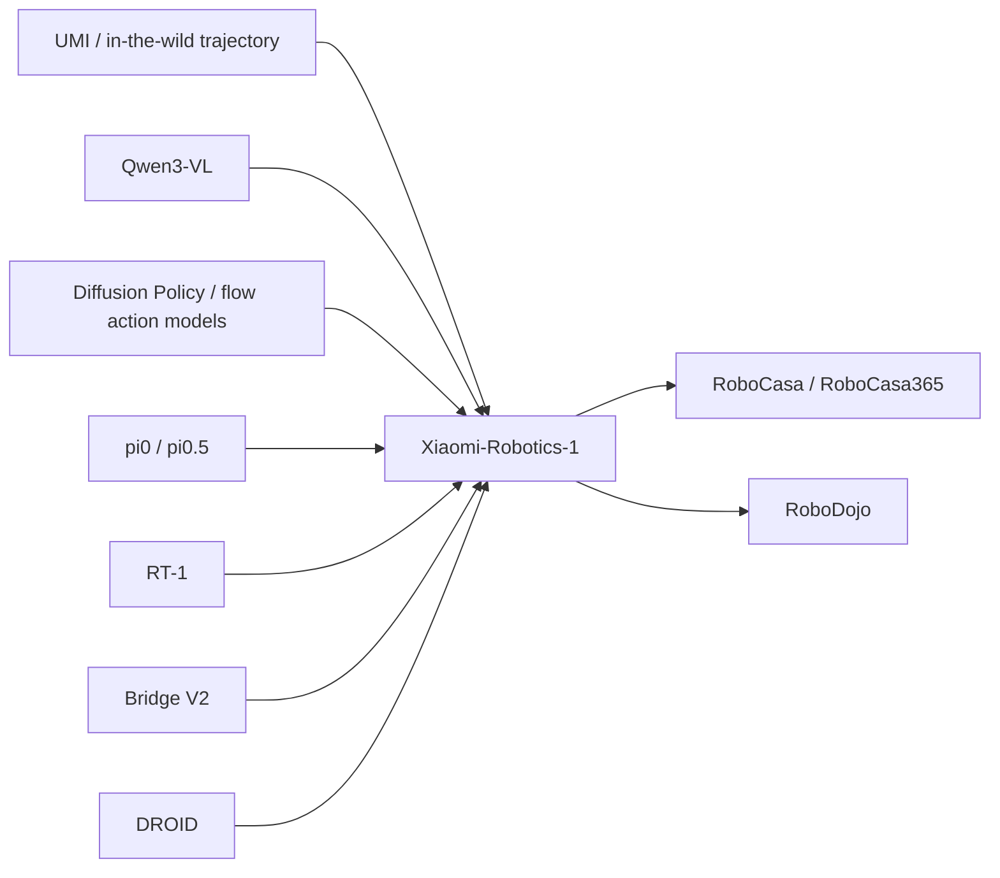

# Xiaomi-Robotics-1 참고 레퍼런스 요약

> Semantic Scholar references endpoint는 실행 중 429 rate limit이 발생해 arXiv HTML의 References 섹션을 기준으로 핵심 문헌을 선별했다. 가능한 경우 arXiv ID/URL을 함께 적었다.

## 1. π0: A Vision-Language-Action Flow Model for General Robot Control

- 인용: Kevin Black et al., 2024
- arXiv: <https://arxiv.org/abs/2410.24164>
- 관계: Xiaomi-Robotics-1이 직접 비교·참조하는 대표적인 VLA flow/action model 계열이다. Continuous robot action을 language-conditioned policy로 생성한다는 점에서 Xiaomi의 DiT flow matching action chunk와 구조적 친연성이 있다.
- 차이: π0는 general robot control을 위한 VLA flow model을 제안한 핵심 선행연구이고, Xiaomi-Robotics-1은 여기에 100K+ UMI trajectory pre-training 및 cross-embodiment post-training scaling을 더 전면화한다.

## 2. π0.5: A Vision-Language-Action Model with Open-World Generalization

- 인용: Kevin Black et al., 2025
- arXiv: <https://arxiv.org/abs/2504.16054>
- 관계: Xiaomi-Robotics-1의 downstream fine-tuning baseline 중 하나다. Open-world generalization을 강조하는 VLA policy로서 Xiaomi의 unseen environment 평가와 같은 문제의식에 있다.
- 차이: Xiaomi-Robotics-1은 UMI 100K+ hours 및 state-transition auto-labeling을 통해 pre-training data scale 자체를 크게 밀어붙인다.

## 3. RT-1: Robotics Transformer for Real-World Control at Scale

- 인용: Anthony Brohan et al., 2022
- arXiv: <https://arxiv.org/abs/2212.06817>
- 관계: large-scale real-world robot data로 transformer policy를 학습한 고전적/핵심 reference다. Xiaomi-Robotics-1 post-training에 포함되는 open-source robot dataset 계열과도 연결된다.
- 차이: RT-1은 robot trajectory를 직접 transformer policy로 학습하는 흐름이고, Xiaomi는 VLM+DiT 및 language-labeled state transition pre-training을 결합한다.

## 4. Universal Manipulation Interface: In-the-Wild Robot Teaching without In-the-Wild Robots

- 인용: Cheng Chi et al., 2024
- arXiv: <https://arxiv.org/abs/2402.10329>
- 관계: Xiaomi-Robotics-1의 데이터 수집 핵심 기반이다. UMI는 실제 로봇을 현장에 배치하지 않고도 handheld gripper로 in-the-wild manipulation trajectory를 수집하는 interface를 제공한다.
- 왜 중요함: Xiaomi의 100K+ hours scale은 conventional teleoperation으로는 어려우며, UMI-style collection이 데이터 병목을 완화한다.

## 5. Diffusion Policy: Visuomotor Policy Learning via Action Diffusion

- 인용: Cheng Chi et al., 2024
- 논문/저널: International Journal of Robotics Research
- 관계: Continuous action generation에 diffusion/denoising 계열 모델을 적용한 중요한 선행연구다. Xiaomi-Robotics-1은 DiT와 flow matching을 사용하지만, action distribution을 generative process로 다룬다는 큰 흐름에서 연결된다.
- 차이: Diffusion Policy는 visuomotor policy의 action diffusion을 강조하고, Xiaomi는 VLM language grounding, KV cache conditioning, large-scale pre/post-training recipe를 결합한다.

## 6. Qwen3-VL Technical Report

- 인용: Shuai Bai et al., 2025
- arXiv: <https://arxiv.org/abs/2511.21631>
- 관계: Xiaomi-Robotics-1의 VLM backbone으로 사용된다. Observation과 instruction을 encode하고, action generation에 필요한 multimodal context를 제공한다.
- 시사점: VLA policy의 성능은 low-level action generator뿐 아니라 VLM backbone의 visual-language representation 품질에도 크게 의존한다.

## 7. Xiaomi-Robotics-0: An Open-Sourced Vision-Language-Action Model with Real-Time Execution

- 인용: Rui Cai et al., 2026
- arXiv: <https://arxiv.org/abs/2602.12684>
- 관계: Xiaomi 연구팀의 이전 VLA 모델이며, Xiaomi-Robotics-1의 baseline/전신으로 볼 수 있다. Real-time execution과 open-source VLA 모델이라는 방향을 제공한다.
- 차이: Xiaomi-Robotics-1은 훨씬 더 큰 UMI pre-training corpus, data/model scaling 실험, 100K+ trajectory recipe로 확장된다.

## 8. Bridge V2

- 관계: Xiaomi-Robotics-1 post-training에 포함되는 open-source robot dataset 중 하나다. 다양한 manipulation setting의 trajectory를 제공해 cross-embodiment alignment에 도움을 준다.
- 시사점: Proprietary in-house robot data만으로는 embodiment 다양성이 부족할 수 있어, open datasets를 섞는 것이 foundation policy generalization에 중요하다.

## 9. DROID: A Large-Scale In-the-Wild Robot Manipulation Dataset

- 관계: Xiaomi-Robotics-1 post-training에 포함되는 open-source robot dataset이다. Real-world manipulation diversity를 제공한다.
- 시사점: UMI pre-training이 non-robot/portable data scaling을 담당한다면, DROID/Bridge/RT-1 계열은 실제 robot embodiment alignment를 보강한다.

## 10. RoboCasa / RoboCasa365

- 관계: Xiaomi-Robotics-1의 주요 simulation evaluation benchmark다. RoboCasa는 kitchen manipulation 중심이고, RoboCasa365는 task/scene/object 다양성을 크게 늘려 general-purpose robot manipulation을 평가한다.
- 결과 맥락: Xiaomi-Robotics-1은 RoboCasa365에서 57.6% success rate로 이전 최고 46.6%를 넘어, pre-training scaling이 simulation generalization에도 도움이 됨을 보여준다.

## 참고문헌 맵

## 읽기 우선순위

1. **UMI** — Xiaomi 데이터 scaling의 전제.
2. **π0 / π0.5** — VLA flow/action model의 직접 선행 흐름.
3. **RT-1 / DROID / Bridge V2** — robot data scaling과 cross-embodiment dataset 맥락.
4. **Diffusion Policy** — continuous action generation을 generative model로 다루는 기초.
5. **RoboCasa365 / RoboDojo** — foundation robot policy benchmark 해석.
