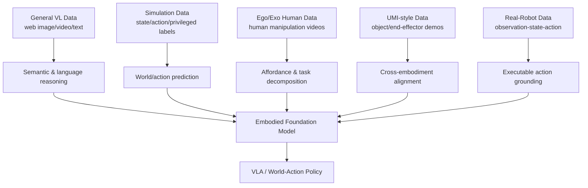

# Data Pyramid for Embodied Manipulation — 요약 분석

## 한 문장 결론

**Embodied/VLA 모델의 성능 병목은 “모델 크기”만이 아니라 real-robot, UMI, human video, simulation, general VL data를 어떤 원칙으로 정렬·혼합하느냐이며, 이 논문은 그 데이터 레시피를 data pyramid로 체계화한다.**

## Problem

VLA와 embodied foundation model은 perception-language pretraining만으로는 충분하지 않다. 실제 action은 robot embodiment, coordinate frame, proprioception, contact dynamics, task reset, safety, closed-loop execution과 묶여 있다. 기존 survey는 model architecture 중심이거나 특정 모델의 data recipe 설명에 머물렀다. 이 논문은 **데이터 source 자체의 역할과 trade-off**를 systematize한다.

## 핵심 기여

1. Embodied manipulation data를 five-layer pyramid로 정리: real-robot, UMI-style, egocentric/exocentric, simulation, general data.
2. 각 data source를 scalability, robot alignment, quality, diversity, reusability, physical fidelity로 비교.
3. Embodied brain model, VLA model, world-action model이 서로 다른 data layer를 어떤 capability와 연결하는지 분석.
4. action-space alignment와 geometric alignment를 heterogeneous data mixture의 핵심 문제로 제시.
5. tactile/failure/recovery/cross-embodiment/data-recipe라는 open problem을 도출.

## Architecture / Pipeline 관점

이 논문 자체는 새로운 neural architecture를 제안하지 않는다. 대신 데이터 pipeline architecture를 제안한다.

## Input-Output / Action Representation

| 모델 family | 주요 input | output/action | 필요한 데이터 |
|---|---|---|---|
| Embodied brain model | image/video/language/3D/context | reasoning, affordance, plan | general VL + ego/exo + embodied QA |
| VLA model | observation, instruction, robot state | action token, waypoint, trajectory, control | real-robot/UMI/simulation action supervision |
| World-action model | current/future observation, action, state | future frame/state, action consequence | simulation + video + robot trajectory |

자율주행으로 옮기면, camera/LiDAR/BEV/route command/language instruction에서 waypoint/trajectory/control을 생성하려면 general VLM data와 driving log/action data가 모두 필요하다.

## Training Recipe 관점

논문은 특정 optimizer나 loss를 제안하지 않지만, recipe design 원칙을 제시한다.

- general VL pretraining으로 semantic grounding과 language reasoning 확보
- simulation/naturalistic logs로 large-scale temporal dynamics와 closed-loop scenario 확보
- UMI/human video로 affordance와 human demonstration prior 확보
- real-robot 또는 real-driving action logs로 executable action grounding 확보
- action-space/geometric alignment로 heterogeneous data를 같은 policy interface에 연결

## Dataset / Benchmark / Metric

평가의 핵심은 단순 volume이 아니라 다음 metric을 포함해야 한다.

- action success / task completion
- physical fidelity 및 contact realism
- diversity under distribution shift
- failure/recovery coverage
- cross-embodiment transferability
- closed-loop robustness와 safety
- data quality/annotation consistency

## Open-loop vs Closed-loop

Open-loop imitation metric은 data alignment를 확인하는 데 유용하지만, embodied policy에서는 closed-loop interaction이 핵심이다. Real-robot/simulation data는 closed-loop consequence를 직접 제공하고, human/general data는 주로 representation과 reasoning에 기여한다.

## 강점

- 모델이 아니라 데이터 설계를 중심으로 VLA/embodied 분야를 읽는 좋은 taxonomy.
- VLA, world model, embodied brain model을 data composition 관점에서 연결한다.
- “web-scale general data + small action data”라는 단순 구도를 넘어 data quality/diversity/reusability/physical fidelity를 분리한다.

## 한계

- Survey/position 성격이 강해 새로운 empirical benchmark나 mixture optimization 결과는 없다.
- 각 계층의 최적 비율을 정량적으로 산출하지 않는다.
- Autonomous driving 특화 taxonomy는 아니므로 driving log, HD map, BEV/occupancy, traffic rule language 같은 AD-specific source는 별도 확장이 필요하다.

## Safety / Latency / Deployment 함의

- 안전한 deployment에는 success-only demonstration보다 failure/recovery trajectory가 중요하다.
- real-robot data는 안전·비용 제약으로 rare case coverage가 부족하므로 simulation 및 synthetic scenario가 필요하다.
- web-scale VLM reasoning은 hallucination 가능성이 있어 executable policy는 action-grounded data로 검증되어야 한다.

## 왜 찬호님의 관심사에 중요한가

VLA for autonomous driving을 공부할 때, 논문별 architecture 비교만 하면 “어떤 데이터가 어떤 capability를 만들었는가”를 놓치기 쉽다. 이 paper는 **자율주행 VLA data recipe**를 설계할 때에도 그대로 쓸 수 있는 관점 — real driving logs, simulation, naturalistic human driving videos, web-scale VLM, BEV/occupancy labels, failure/recovery events를 어떻게 섞을지 — 를 제공한다.
