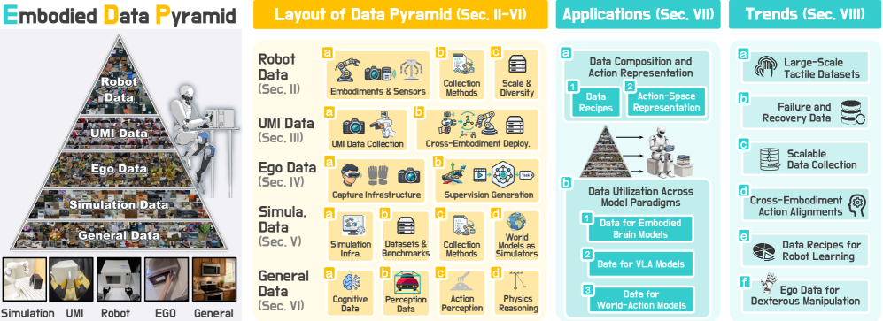

# Data Pyramid for Embodied Manipulation — 한국어 기술 번역

- 원제: **Data Pyramid for Embodied Manipulation**
- 한국어 제목: **임바디드 조작을 위한 데이터 피라미드**
- 저자: Yifan Ye 외
- 원문: https://arxiv.org/abs/2607.24744
- 프로젝트/리소스: https://jasper-aaa.github.io/embodied-data-pyramid/ / https://github.com/worldbench/awesome-embodied-data-pyramid

> 번역 범위 메모: 이 논문은 survey/position paper 성격이 강하고 원문 전체가 매우 길다. 본 파일은 Abstract, Introduction, taxonomy, 핵심 데이터 계층, embodied foundation model 분석, 과제/결론을 충실히 번역·재구성했다. 세부 dataset catalog와 긴 부록성 목록은 `references.md`와 `learning.md`에서 핵심만 요약한다.

## Abstract 번역

멀티모달 foundation model은 거의 인터넷 전체에 가까운 visual/language 데이터를 소비하면서 “보고 말하는” 능력을 학습했다. 그러나 embodied agent에는 그런 우회로가 없다. 로봇은 관측(observation), 물리 상태(physical state), action이 서로 결합된 데이터를 필요로 하기 때문이다. 이 논문은 embodied data ecosystem을 **다섯 가지 상호보완적 source** — real-robot data, UMI-style data, egocentric/exocentric data, simulation data, general vision-language data — 로 구성된 **data pyramid**로 정리한다.

피라미드는 두 축, 즉 **scalability**와 **robot alignment**의 긴장 관계 위에 놓인다. 또한 각 데이터 source를 data quality, diversity, reusability, physical fidelity 관점에서 평가한다. 저자들은 embodied brain model, VLA(Vision-Language-Action) model, world-action model이 어떤 데이터 조합을 선택·정렬·혼합하는지 분석하고, 그 data recipe가 perception, reasoning, planning, action generation, world prediction 능력과 어떤 관계를 갖는지 설명한다. 마지막으로 tactile data, failure/recovery trajectory, scalable data collection, cross-embodiment action alignment, egocentric data의 dexterous manipulation 활용, 원칙적인 data recipe 설계라는 여섯 가지 open challenge를 제시한다.

## 1. Introduction 번역

멀티모달 foundation model은 대규모 visual/language pretraining으로 폭넓은 지각, 언어, reasoning 능력을 얻었다. 하지만 이 패러다임을 embodied foundation model로 확장하려면 단순히 이미지와 텍스트를 처리하는 수준을 넘어야 한다. Embodied agent는 물리 상태와 dynamics를 이해하고, action이 환경을 어떻게 변화시키는지 추론하며, 실제 세계에서 적절한 행동을 실행해야 한다. 따라서 pretraining supervision의 성격 자체가 바뀐다.

이 논문이 던지는 핵심 질문은 다음과 같다.

1. embodied model을 위한 데이터 source는 어떤 계층과 trade-off로 조직할 수 있는가?
2. 서로 다른 데이터 source를 실제 embodied foundation model, 특히 VLA와 world-action model이 어떻게 활용하는가?

커뮤니티는 이미 여러 종류의 supervision을 탐색했다. 실제 로봇과 simulation에서 수집된 observation-action trajectory, 인간 상호작용의 egocentric/exocentric 영상, 일반 image/video/language 데이터, 그리고 robot 없이 object/end-effector 중심 조작을 수집하는 UMI-style demonstration이 대표적이다. 각 source는 semantic, temporal, physical, action-related supervision을 다르게 제공한다. 그러나 이들의 역할, trade-off, 관계, 통합 전략은 아직 충분히 체계화되지 않았다.

최근 Motus, GR00T 같은 model은 hierarchy 또는 pyramid와 유사한 training data 관점을 제시했지만, 대개 특정 모델의 training recipe를 설명하기 위한 수준에 머물렀다. 이 논문은 특정 모델이 아니라 **데이터 category 자체**를 분석 단위로 삼는다.

## 2. Data Pyramid: 다섯 계층

논문은 embodied data를 아래와 같이 정렬한다. 위쪽일수록 robot alignment와 physical fidelity가 높고, 아래쪽일수록 scalability와 accessibility가 높다.

| 계층 | 핵심 신호 | 장점 | 한계 | VLA 관점 |
|---|---|---|---|---|
| Real-robot data | robot observation, proprioception, executable action | 실제 deployment와 가장 직접적으로 맞물림 | 비싸고 느리며 reset/안전 비용 큼 | action grounding의 gold supervision |
| UMI-style data | object/end-effector centric demonstration | 로봇 없이 비교적 scalable, retarget 가능 | embodiment mapping 필요 | cross-embodiment action alignment에 유용 |
| Egocentric/Exocentric data | 인간 시점/외부 시점 영상, hand/object interaction | 대규모 현실 다양성, affordance/skill decomposition | robot action이 직접 없음 | language/visual reasoning 및 human-to-robot transfer |
| Simulation data | synthetic state/action/privileged label | 무제한 generation, counterfactual 가능 | sim-to-real gap | closed-loop policy, recovery, evaluation |
| General VL data | web image/video/text, QA, caption | 인터넷 규모 semantic/reasoning coverage | physical grounding 부족 | VLM backbone과 high-level reasoning 보강 |

이 순서는 단일 dimension에서 완전히 monotonic하다는 뜻은 아니다. Real-robot data가 항상 다양하다고 볼 수 없고, simulation data가 특정 과제에서는 매우 high-fidelity일 수 있다. 다만 전체적으로는 위로 갈수록 robot-aligned supervision이 강해지고, 아래로 갈수록 데이터 확보와 scale-up이 쉬워진다.

## 3. Category-level dimensions 번역

논문은 data source를 여섯 dimension으로 본다.

1. **Scalability**: 하드웨어 의존성, human labor, reset cost, safety supervision, marginal generation cost를 고려할 때 얼마나 쉽게 늘릴 수 있는가.
2. **Robot alignment**: observation/action representation이 실제 robot learning과 execution에 얼마나 직접 연결되는가.
3. **Quality**: trajectory가 반복적이지 않고, annotation이 정확하며, multimodal signal이 잘 동기화되고, task-relevance가 높은가.
4. **Diversity**: task, object, scene, viewpoint, instruction, embodiment, sensor, behavior, outcome coverage가 충분한가.
5. **Reusability**: task/environment/embodiment/sensing/model family 사이에서 얼마나 재사용 가능한가.
6. **Physical fidelity**: contact, friction, compliance, sensing noise, actuation delay, object motion 같은 물리 interaction을 얼마나 충실히 담는가.

이 framework는 “데이터가 많다”와 “좋은 embodied data다”를 분리해 준다. 예를 들어 일반 web-scale VL data는 semantic diversity는 높지만 action grounding은 약하다. 반대로 특정 real-robot dataset은 action supervision은 강하지만 environment diversity가 좁을 수 있다.

## 4. Real-Robot Data 번역

Real-robot data는 data pyramid의 apex다. 실제 robot이 환경과 interaction하면서 수집하므로 sensory observation, robot state, control action이 폐루프(closed-loop)로 결합되어 있다. 즉 perception-action-physical consequence 관계를 직접 담는다.

수집 방식은 대략 다음으로 나뉜다.

- **Scripted collection**: finite-state machine, heuristic controller, motion planning, trajectory optimization 등을 사용한다. 대량 반복 수집에는 좋지만 task decomposition이 고정되어 다양성이 제한될 수 있다.
- **Trajectory playback**: teleoperation 또는 planning trajectory를 재실행한다. demonstration structure를 유지하면서 variation을 만들 수 있지만 open-loop playback은 contact mismatch에 취약하다.
- **Autonomous policy rollout**: learned/heuristic policy가 직접 상호작용하며 데이터를 만든다. failure/recovery를 포함할 수 있지만 current policy bias가 데이터 분포를 지배한다.
- **Teleoperation**: human operator가 kinesthetic teaching, leader-follower arm, VR/XR controller, SpaceMouse, wearable, vision-based motion capture 등으로 조작한다. contact-rich task에 자연스럽지만 비용과 operator variability가 크다.

VLA 관점에서 real-robot data는 executable action label의 가장 강한 source다. 그러나 scale이 부족하기 때문에 web VL pretraining, simulation, UMI-style data와 혼합해야 한다.

## 5. UMI-style Data 번역

UMI(Universal Manipulation Interface) style data는 robot 없이 object 또는 end-effector 중심으로 demonstration을 수집한다. 핵심은 **수집 시점에는 robot-specific embodiment를 제거하고**, 학습 또는 deployment 시점에는 robot action space로 retarget하는 것이다.

장점은 다음과 같다.

- 사람이 더 자연스럽게 대규모 demonstration을 수집할 수 있다.
- object-centric trajectory와 end-effector-centric motion은 여러 robot arm/dexterous hand로 retarget될 여지가 있다.
- real-world physics와 object interaction을 유지하면서 real robot 운영 비용을 줄인다.

한계는 action alignment다. 사람 또는 도구 기반 trajectory를 robot joint/action/control interface로 변환할 때 coordinate frame, gripper convention, timing, contact semantics가 맞아야 한다. VLA에서 이 계층은 **implicit representation transfer**와 **cross-embodiment policy learning**에 특히 중요하다.

## 6. Egocentric/Exocentric Human Data 번역

Egocentric/exocentric data는 사람의 manipulation을 실제 환경에서 촬영한다. 이는 robot action은 없지만 everyday object, long-tail task, affordance, task phase, hand-object interaction을 풍부하게 제공한다. 특히 egocentric data는 “agent가 보는 시야”에 가까우며, exocentric data는 third-person geometry와 context를 제공한다.

이 데이터는 VLA에 직접 action label을 주지는 않지만 다음을 보강한다.

- task decomposition과 temporal reasoning
- object affordance 및 contact anticipation
- instruction/description grounding
- 실패 전조, recovery cue, long-horizon planning clue

자율주행으로 비유하면 dashcam/naturalistic driving video가 steering label 없이도 scene understanding과 intent prediction에 유용한 것과 비슷하다. 다만 executable action으로 연결하려면 별도 action grounding 또는 distillation이 필요하다.

## 7. Simulation Data 번역

Simulation은 privileged state, dense label, counterfactual rollout, large-scale task generation이 가능하다. 특히 failure/recovery, rare event, 안전한 exploration, closed-loop evaluation에 강하다. 그러나 physics, sensor, contact, latency, human/robot embodiment 차이가 sim-to-real gap을 만든다.

VLA/AD 관점에서는 simulation이 다음을 제공한다.

- closed-loop policy rollout 및 평가
- waypoint/trajectory/action label generation
- privileged BEV/occupancy/state supervision
- rare corner case와 safety-critical scenario generation
- world model 학습을 위한 action-conditioned future supervision

## 8. General Vision-Language Data 번역

일반 image/video/text/QA data는 physical action은 없지만 semantic coverage와 reasoning 능력을 준다. VLM/VLA backbone이 object category, relation, language instruction, commonsense를 이해하는 데 필수다. 그러나 물리 interaction과 action semantics가 없으므로, robot policy로 직접 쓰려면 action-aligned data와 결합해야 한다.

논문의 메시지는 “일반 VL 데이터가 필요 없다는 것”이 아니라 “일반 VL 데이터만으로는 embodied action이 grounded되지 않는다”는 것이다.

## 9. Embodied Foundation Models와 Data Recipe

논문은 embodied model을 세 family로 연결한다.

1. **Embodied brain models**: perception, spatial/temporal reasoning, affordance, memory, high-level planning을 위해 broad multimodal/embodied data를 활용한다.
2. **VLA models**: observation과 instruction을 executable behavior로 mapping하기 위해 robot-compatible action supervision을 필요로 한다.
3. **World-action models**: action-free temporal data, action-conditioned interaction, synthetic experience를 함께 사용해 환경 변화와 action consequence를 모델링한다.

핵심 분석은 두 alignment다.

- **Action-space alignment**: action dimension, control interface, semantics가 embodiment마다 다를 때 어떻게 통합할 것인가.
- **Geometric alignment**: viewpoint, coordinate system, sensor configuration이 다른 data를 robot-compatible representation으로 어떻게 맞출 것인가.

## 10. Open Challenges 번역

논문은 다음 과제를 강조한다.

- **Tactile dataset 부족**: contact-rich manipulation에서 tactile feedback은 이미지로 대체하기 어렵다.
- **Failure/recovery data 부족**: 성공 demonstration만으로는 robust policy를 만들기 어렵다.
- **Scalable collection pipeline**: teleoperation 의존도를 줄이고, informative interaction을 우선 수집해야 한다.
- **Cross-embodiment action alignment**: joint/action/control convention이 다른 robot 사이에서 action을 공유해야 한다.
- **Egocentric data의 dexterous manipulation 활용**: human hand skill을 robot hand로 옮기는 방법이 필요하다.
- **Principled data recipe**: 경험적 mixture가 아니라 capability, quality, diversity, fidelity에 근거한 recipe search가 필요하다.

## 11. 결론 번역

이 논문은 embodied manipulation을 위한 data ecosystem을 data pyramid taxonomy로 정리하고, 각 category가 embodied foundation model의 capability에 어떻게 기여하는지 분석한다. 특히 VLA와 world-action model에서는 “언어와 vision만 키우는 것”이 아니라, observation-state-action의 정렬과 physically grounded data mixture가 중요하다. 자율주행 VLA 연구에서도 이 framework는 naturalistic driving, simulation, closed-loop logs, web-scale VLM pretraining, trajectory/action supervision을 어떻게 섞을지 고민하는 데 직접적인 reference가 된다.
