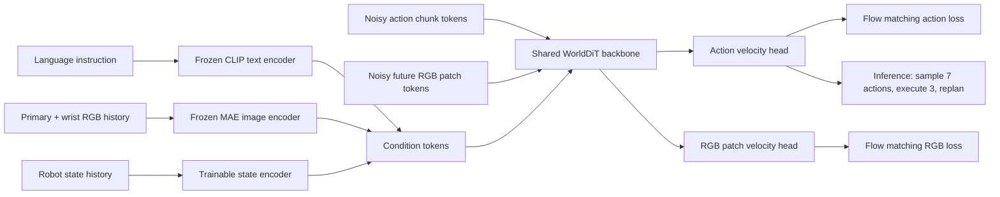

# WorldDiT — 요약 분석

## 한 문장 결론

**WorldDiT는 대형 VLM을 action backbone으로 쓰지 않고도, 하나의 DiT에서 continuous action chunk와 future visual patch prediction을 함께 학습해 compact world-action policy를 만들 수 있음을 보여준다.**

## Problem

최근 VLA/robot policy는 OpenVLA, π0, GR00T처럼 큰 pretrained VLM/VLA backbone에 action head를 붙이는 흐름이 강하다. 그러나 이렇게 하면 성능 향상이 architecture 때문인지, pretrained scale 때문인지, action representation 때문인지 분리하기 어렵고 inference cost도 커진다. WorldDiT는 sub-billion 규모의 unified diffusion transformer로 이 질문을 정면으로 다룬다.

## 핵심 기여

1. **Unified DiT backbone**: action generation과 future RGB patch prediction을 하나의 diffusion transformer에서 처리.
2. **Training-time world supervision, inference-time action-only**: RGB patch prediction은 학습에만 사용하고 배포 시에는 action path만 사용.
3. **Continuous action chunk**: autoregressive text/action token이 아니라 7-step continuous action chunk를 flow matching으로 생성.
4. **Compact Pareto point**: LIBERO 네 suite에서 total parameter-success trade-off상 Pareto frontier에 위치.
5. **World-action modeling baseline**: 대형 VLM action backbone 없이도 강한 baseline을 제시.

## Architecture / Pipeline

## Input / Output / Action Representation

| 항목 | 내용 |
|---|---|
| Inputs | language instruction, primary-camera RGB, wrist-camera RGB, robot state history |
| Conditioning encoders | frozen MAE image encoder, Perceiver Resampler, frozen CLIP text encoder, trainable robot state encoder |
| Training targets | 7-step continuous action chunk + future normalized RGB patch tokens |
| Inference output | 7-step action chunk |
| Control | first 3 actions execute → observe → replan |
| Action grounding | LIBERO demonstration action sequence를 continuous flow target으로 사용 |

## Language role

Language는 high-level instruction conditioning 역할이다. 이 논문은 CoT reasoning이나 textual action generation을 강조하지 않는다. Action grounding은 language reasoning chain이 아니라 **instruction-conditioned continuous action diffusion**을 통해 이루어진다.

## Training Recipe

- LIBERO multi-task split으로 pretraining
- 각 LIBERO suite별 fine-tuning
- Flow matching objective
- action velocity loss + future RGB patch velocity loss
- bf16 mixed precision, 8× RTX Pro 6000 GPUs
- RGB target은 normalized patch vector이며 final temporal slot에 loss 적용

## Dataset / Benchmark / Metric

| Suite | 의미 | 평가 |
|---|---|---|
| LIBERO Spatial | spatial relation 조작 | success rate |
| LIBERO Object | object-centric 조작 | success rate |
| LIBERO Goal | goal-conditioned 조작 | success rate |
| LIBERO Long | long-horizon multi-stage task | success rate, 가장 어려움 |

논문은 500 episodes per suite aggregate를 보고하지만, staged checkpoint selection에 사용된 episode가 일부 포함되어 완전한 held-out estimate는 아니라고 주의한다.

## Open-loop vs Closed-loop

WorldDiT는 demonstration window로 학습되지만 평가에서는 simulator rollout success를 측정하므로 closed-loop 성격이 있다. 다만 실제 real-robot deployment가 아니라 LIBERO simulation이며, action ensembling 및 receding-horizon replanning을 사용한다.

## 강점

- 대형 VLM action backbone 없이 compact하게 강한 성능을 낸다.
- World prediction을 auxiliary로 사용하면서 inference latency는 action branch만 유지한다.
- Continuous action chunk와 flow matching은 robot control에 자연스럽다.
- 자율주행의 future prediction + trajectory planning joint training과 구조적으로 유사하다.

## 한계

- LIBERO simulation 중심이며 real-robot transfer는 검증되지 않았다.
- 보고된 score 일부는 checkpoint selection episode를 포함하므로 unbiased test estimate는 아니다.
- RGB patch prediction이 실제 control에 얼마나 causally 기여하는지 ablation이 더 필요하다.
- Language role은 instruction conditioning에 가깝고, explicit reasoning/traffic rule style reasoning은 없다.
- 공개 weight/code 부재로 baseline 재현성에 제한이 있다.

## Safety / Latency / Deployment 함의

- Inference에서 RGB prediction branch를 제거하므로 deployment path가 비교적 가볍다.
- Receding-horizon replanning은 execution drift를 줄이는 데 유리하다.
- 그러나 safety-critical domain에서는 future prediction auxiliary가 안전을 보장하지 않으므로 uncertainty/failure detection이 필요하다.
- 자율주행에 적용한다면 RGB patch 대신 BEV/occupancy/future trajectory supervision을 사용할 수 있다.

## 왜 찬호님의 관심사에 중요한가

자율주행 VLA 연구에서 큰 VLM으로 모든 reasoning/action을 처리하면 latency와 safety 문제가 생긴다. WorldDiT는 “학습 시에는 world model supervision을 같이 쓰되, 배포 시에는 compact action generator를 사용”하는 실용적 설계를 보여준다. 이는 closed-loop AD policy에서 future BEV/occupancy prediction과 trajectory generation을 하나의 diffusion/flow model로 묶는 방향과 잘 맞는다.
