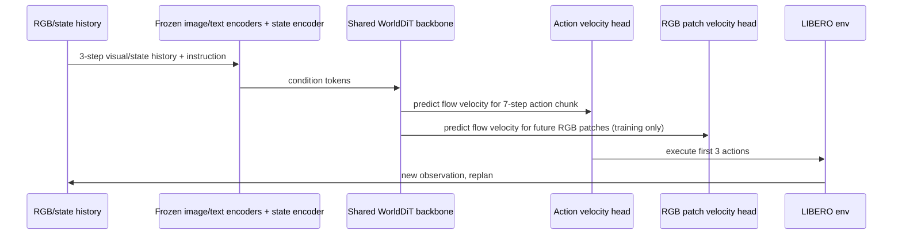

# WorldDiT — 핵심 기술 학습 자료

## 선수 지식

- Diffusion model / Flow matching
- Transformer / DiT(Diffusion Transformer)
- Behavior cloning과 action chunking
- Robot manipulation benchmark: LIBERO
- VLM encoder: CLIP, MAE, Perceiver Resampler
- Receding-horizon control / temporal ensembling

## Glossary

| 용어 | 설명 |
|---|---|
| Action chunk | 한 번에 예측하는 여러 step의 action sequence |
| Flow matching | noise에서 data target으로 가는 velocity field를 학습하는 generative objective |
| Future RGB patch target | 미래 camera frame을 patch로 나눠 normalize한 auxiliary prediction target |
| Receding-horizon control | 여러 action을 예측하되 일부만 실행하고 다시 관측 후 재계획하는 제어 방식 |
| Action backbone | policy에서 action을 직접 생성하는 핵심 neural backbone |
| Pareto frontier | parameter 수와 success 사이에서 더 작은 모델/더 높은 성능으로 지배되지 않는 점들의 경계 |

## 전체 구조



## Step-by-step 설명

### Step 1. Observation window 구성

현재 시점까지 primary camera, wrist camera, robot state, language instruction을 모은다. 논문은 10-step window 중 3-step을 context로 쓰고 7-step action을 target으로 둔다.

### Step 2. Multimodal encoding

- Image: frozen MAE encoder
- Language: frozen CLIP text encoder
- Robot state: trainable state encoder
- Perceiver Resampler로 token shape 조정

### Step 3. Target corruption

Action chunk와 future RGB patch target에 Gaussian noise를 섞는다. 모델은 clean target 자체를 직접 회귀하기보다, noise에서 target으로 이동하는 velocity를 예측한다.

### Step 4. Joint loss

Action velocity loss와 RGB patch velocity loss를 weighted sum으로 학습한다. RGB patch는 world modeling pressure를 주지만 inference path에는 포함되지 않는다.

### Step 5. Inference

Action token을 Gaussian noise에서 시작해 learned velocity field를 적분한다. 7개 action이 나오면 앞 3개만 실행하고 다시 observation을 받아 replan한다.

## 핵심 수식 직관

Flow matching은 다음 직관으로 이해하면 된다.

```text
x0 = Gaussian noise
x1 = clean target(action or RGB patch)
x(t) = (1 - t) * x0 + t * x1
model predicts velocity v = x1 - x0 under condition c
```

WorldDiT는 action과 RGB patch 모두에 대해 같은 형태의 velocity prediction을 한다. 그래서 action modeling과 world modeling이 하나의 generative interface를 공유한다.

## 자율주행 VLA로 확장하는 아이디어

| WorldDiT 구성 | 자율주행 대응 |
|---|---|
| primary/wrist RGB | multi-view camera / LiDAR / BEV |
| robot state | ego speed, yaw rate, route command |
| language instruction | navigation command, traffic rule, scene text |
| 7-step action chunk | future waypoint/trajectory/control sequence |
| future RGB patch | future BEV/occupancy/segmentation/flow prediction |
| LIBERO closed-loop | CARLA/nuPlan closed-loop |

## Implementation notes

- RGB auxiliary branch를 inference에서 제거할 수 있어 latency를 줄인다.
- Action chunk는 너무 길면 compounding error, 너무 짧으면 replanning overhead가 증가한다.
- Receding-horizon에서는 overlapping chunk prediction에 temporal ensembling을 쓰면 smoother control이 가능하다.
- Real deployment에는 uncertainty estimation, safety shield, out-of-distribution detector가 추가로 필요하다.

## Study questions

**Q1. WorldDiT가 large VLM action backbone을 피하려는 이유는?**  
A. 성능 원인 분리, parameter/latency 효율, compact deployment 가능성을 확인하기 위해서다.

**Q2. Future RGB patch prediction은 inference에 쓰지 않는데 왜 학습하는가?**  
A. Backbone이 action consequence와 scene dynamics를 representation에 반영하도록 auxiliary world supervision을 제공하기 위해서다.

**Q3. 이 논문이 VLA taxonomy에서 어디에 위치하는가?**  
A. Language-conditioned continuous action generator이면서 world-action model 성격을 갖는다. Explicit CoT VLA라기보다는 numerical action generation + world model transfer에 가깝다.

**Q4. 가장 큰 실험적 주의점은?**  
A. LIBERO simulation 중심이고, checkpoint selection episode 일부가 aggregate에 포함되어 완전한 held-out estimate로 해석하기 어렵다.

## Reading roadmap

1. Diffusion Policy로 action diffusion 기본 이해
2. LIBERO benchmark task 구조 확인
3. OpenVLA/π0/GR00T와 large VLM backbone 계열 비교
4. World model/Video prediction auxiliary objective 논문 읽기
5. 자율주행의 future BEV/occupancy prediction + trajectory generation 모델과 연결
