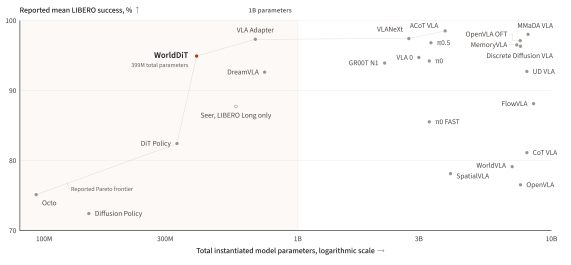

# WorldDiT — 한국어 기술 번역

- 원제: **WorldDiT: A Unified Diffusion Architecture for World and Action Modeling**
- 한국어 제목: **WorldDiT: World Modeling과 Action Modeling을 위한 통합 Diffusion 아키텍처**
- 원문: https://arxiv.org/abs/2607.23909

> 번역 범위 메모: 원문 HTML에서 Abstract, Introduction, Method, Training, Inference, Experiments, Discussion, 주요 Figure/Table caption을 중심으로 충실히 번역했다. 수식은 arXiv HTML 변환에서 일부 기호가 누락되어 의미 중심으로 재기술했다.

## Abstract 번역

최근 많은 robot policy는 더 강한 제어 성능을 얻기 위해 대규모 pretrained VLM을 action backbone으로 사용한다. WorldDiT는 이와 다른 방향을 택한다. 저자들은 **action generation**과 **visual world modeling**을 하나의 diffusion transformer로 결합하는 unified architecture를 제안하며, 큰 pretrained VLM action backbone 없이도 강한 성능을 달성할 수 있음을 보인다.

학습 중 하나의 diffusion transformer는 continuous action chunk를 생성하는 동시에 미래 camera frame에서 추출한 normalized RGB patch target을 예측한다. 네 개의 LIBERO simulation suite에서 WorldDiT는 네 suite 모두를 보고한 방법들 중 total parameter와 mean success 기준의 Pareto frontier 위에 위치한다. 이 결과는 sub-billion-parameter robot policy scaling 연구를 위한 강한 baseline을 제공한다.

## 1. Introduction 번역

많은 robot policy는 language model에서 익숙한 패턴, 즉 큰 pretrained model에 action generation head를 붙이는 방식을 따른다. 이 방식은 broad perception과 language understanding을 제공하지만, 성능의 원인이 model scale인지, architecture인지, action design인지 분리하기 어렵다. 수십억 parameter policy에서는 좋은 control이 pretrained backbone 덕분인지 action formulation 덕분인지 명확하지 않다.

WorldDiT는 다음 질문을 던진다.

> 하나의 unified diffusion transformer가 continuous action generation과 auxiliary future visual prediction을 함께 학습해, large pretrained VLM action backbone 없이도 강한 control 성능을 유지할 수 있는가?

저자들은 frozen visual encoder, frozen language encoder, trainable robot state encoder로 observation/history/language instruction을 condition하고, shared DiT backbone이 **7-step action chunk**와 **future normalized RGB patch**의 flow velocity를 예측하도록 학습한다. Inference에서는 RGB patch prediction branch를 쓰지 않고 action chunk만 생성한다. 예측된 7개 action 중 앞 3개를 실행한 뒤 다시 observation을 업데이트하고 replan하는 receding-horizon control을 사용한다.

## 2. Method 번역

### 2.1 Overview

WorldDiT는 action generation과 auxiliary future normalized RGB patch objective를 함께 학습하는 unified diffusion transformer다. 기존 world-action model 또는 VLA가 대형 VLM으로 action token을 autoregressive하게 생성하는 것과 달리, WorldDiT는 하나의 shared DiT backbone으로 **continuous robot action**과 **미래 RGB patch**를 모두 모델링한다.


입력은 다음으로 구성된다.

- language instruction
- temporally ordered visual observations: primary camera + wrist camera
- robot state
- action sequence target
- future frame에서 샘플링한 normalized RGB patch target

Visual observation과 language instruction은 frozen encoder로 encoding된다. Robot state는 trainable state encoder를 거친다. 학습 시에는 action token과 RGB patch token에 Gaussian noise를 더하고, shared DiT가 clean target으로 가는 flow velocity를 예측한다.

### 2.2 Trajectory / Target 구성

논문은 일정 길이 trajectory segment를 잡고, 앞부분을 observation context로 사용한다. 현재 control step까지의 history를 conditioning context로 삼고, 이후 7-step action chunk를 target으로 만든다. 동시에 future primary-camera와 wrist-camera frame을 CLIP preprocessing한 뒤 patch로 나누고, 각 patch vector를 normalize하여 RGB patch target을 만든다.

핵심은 **action target과 future world target을 같은 flow-matching interface로 다룬다**는 점이다.

### 2.3 Training 번역

WorldDiT는 flow matching으로 학습된다. Clean action target 또는 RGB patch target을 `x_1`, Gaussian noise를 `x_0`로 두고, 시간 `t`에서 두 점 사이의 straight path를 만든다. 모델은 이 path의 velocity를 예측한다.

전체 loss는 action velocity loss와 RGB patch velocity loss의 weighted sum이다.

```text
L_total = lambda_action * L_action_velocity + lambda_rgb * L_rgb_patch_velocity
```

RGB patch prediction은 training-time auxiliary supervision이다. 즉 모델이 action만 맞추는 것이 아니라, action과 관련된 future visual consequence를 같은 backbone에서 함께 학습하도록 압력을 준다.

### 2.4 Inference 번역

Deployment에서는 clean future target도 RGB patch target도 제공하지 않는다. 모델은 최근 3-step observation history와 instruction/state를 encoding한 뒤, action token을 Gaussian noise에서 시작해 velocity field를 Euler integration으로 따라가며 7-step action chunk를 생성한다.


이후 첫 3개 action만 실행하고, 새 observation을 받아 context window를 밀어 다시 action chunk를 샘플링한다. 이는 receding-horizon control이며 overlapping prediction에는 temporal ensembling을 적용한다.

## 3. Experiments 번역

### 3.1 Setup

WorldDiT는 LIBERO manipulation benchmark에서 평가된다. 사용한 suite는 LIBERO Spatial, Object, Goal, Long 네 가지이며, large multi-task split은 pretraining에만 사용된다. Raw demonstration은 multi-view RGB observation, robot state, language instruction, action sequence를 포함한 fixed-length window로 변환된다.

Encoding 구성은 다음과 같다.

- frozen MAE image encoder
- shared Perceiver Resampler
- frozen CLIP text encoder
- trainable robot state encoder
- unified WorldDiT backbone

Training은 one node, eight RTX Pro 6000 GPUs에서 수행되었다. Fine-tuning은 각 suite별로 별도 수행하며 bf16 mixed precision을 사용한다.

### 3.2 Evaluation

WorldDiT는 각 suite별 simulator episode에서 success rate를 평가한다. Inference에서는 action token을 Gaussian noise에서 초기화하고, 20 flow step 동안 velocity field를 적분한다. Backbone은 7개 action을 예측하고, 그중 3개를 실행한 뒤 replan한다.

논문은 주의점도 명시한다. 보고된 aggregate에는 staged checkpoint selection에 사용된 episode가 일부 포함되어 있어 완전히 held-out unbiased test estimate로 해석해서는 안 된다. 또한 공개 weight/code 부재 때문에 모든 baseline을 동일 protocol로 재현하지 않고, cited report의 score를 사용한다.

### 3.3 Results

WorldDiT는 네 suite에서 각각 높은 success를 보이고, mean success 94.9로 보고된다. 특히 total parameter 약 399M, trainable parameter 약 231M인 sub-billion 규모에서, 네 suite 모두의 mean을 보고한 방법들 중 parameter-success Pareto frontier 위에 놓인다.



Table 1의 핵심 비교는 다음과 같다.

| Category | Method examples | Mean success 경향 |
|---|---|---|
| Large pretrained VLM action backbone | ACoT-VLA, MMaDA-VLA, VLANeXt, OpenVLA, π0, GR00T N1 등 | 최고권 성능은 높지만 parameter가 큼 |
| No large pretrained VLM action backbone | WorldDiT, DreamVLA, FlowVLA, DiT Policy, Diffusion Policy 등 | WorldDiT가 compact Pareto point |

## 4. Discussion 번역

WorldDiT는 하나의 diffusion transformer가 continuous action generation과 future visual prediction을 결합하면서도 inference 때는 action-only path를 유지할 수 있음을 보인다. 399M parameter system이 LIBERO parameter-success Pareto frontier에 위치한다는 점은, 큰 pretrained VLM을 action backbone에 넣지 않아도 strong benchmark performance를 얻을 수 있음을 시사한다.

더 넓게 보면 WorldDiT는 **unified world-and-action modeling**이 model capacity, data diversity, deployment setting을 확장하기 위한 compact basis가 될 수 있음을 보여준다. 저자들은 future normalized RGB objective가 control에 어떤 영향을 주는지, 같은 trade-off가 larger scale에서도 유지되는지 추가 연구가 필요하다고 말한다.

## 5. 주요 Figure / Caption 번역

- Figure 1: 24개 방법에 대해 reported LIBERO success와 total model parameter를 비교한다. 선은 네 suite 평균 success를 보고한 방법 중 Pareto frontier를 연결한다.
- Figure 2: LIBERO Spatial/Object/Goal/Long의 성공 rollout 예시를 보여준다.
- Figure 3: 10-step window가 3 observed context steps, 7 target actions, 1 future normalized RGB patch target을 제공한다. Frozen encoder와 trainable projection이 multimodal token을 만들고, 하나의 WorldDiT backbone이 action 및 RGB patch flow velocity를 예측한다.
- Figure 4: Unified backbone이 3-step observed context를 encoding하고 20 flow step으로 7-action chunk를 샘플링한다. 첫 3개 action을 실행한 뒤 window를 업데이트하고 replan한다.

## 6. 결론 번역

WorldDiT의 메시지는 “world modeling과 action modeling을 완전히 분리하지 않아도 된다”는 것이다. Training에서는 future RGB patch를 예측하게 하여 world consequence를 학습시키고, inference에서는 compact action-only policy로 배포한다. 자율주행 VLA 관점에서도 이 구조는 future BEV/occupancy/image prediction을 auxiliary로 쓰면서, 실시간 배포에서는 trajectory/waypoint만 빠르게 내보내는 설계와 잘 대응된다.
