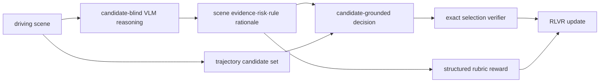

# DEFT-RLVR 분석

## 한 문장 결론
미래 GT trajectory를 reasoning 전에 주지 않고 **사후 검증 대상으로 지연 노출**하면, 자율주행 VLM의 CoT가 결과 합리화로 흐르는 것을 줄이면서도 candidate trajectory 선택을 정확히 검증할 수 있다.

## 문제와 기여
- **문제:** GT future를 본 teacher CoT는 decision을 장면에서 도출하지 않고 결과에 맞춰 narrative를 만든다(trajectory anchoring bias).
- **AD-MCQ:** scene-specific trajectory candidate 중 하나를 고르는 검증 가능한 planning benchmark.
- **DEFT:** scene-only reasoning 뒤에 후보를 보이는 two-stage interaction으로 rationale의 causal direction을 보존.
- **DEFT-RLVR:** 선택 정답 reward와 structured reasoning-rubric reward를 결합해 candidate-blind CoT를 강화.
- **증거:** 사람이 매긴 severe hallucination은 GT 비노출 29.0%, 노출 50.0%; nuScenes OOD에서 DEFT-RLVR은 training-free DEFT보다 ACC/CFS를 개선했다.

## Architecture / pipeline

| 단계 | 입력 | 출력 | 역할 |
|---|---|---|---|
| reasoning | scene / AD question | 근거·위험·maneuver rationale | future/candidate shortcut 차단 |
| decision | rationale + scene-specific candidates | 선택한 trajectory | 검증 가능한 action grounding |
| optimization | selection correctness + rubric | policy update | decision과 rationale을 함께 정렬 |

## Input–output 및 language 역할
- **입력:** driving scene의 visual observation, task/query, 단계 2에서만 candidate trajectory set.
- **출력:** 후보 선택(이산 trajectory)과 reasoning trace. 자유 좌표 trajectory 회귀가 아니다.
- **language 역할:** 설명용 장식이 아니라 scene evidence→maneuver 판단의 중간 표현이며, rubric의 평가 대상이다.
- **action grounding:** rationale 뒤에 명시 candidate를 선택하므로 outcome correctness가 exact-match로 확인된다.

## Training recipe와 평가
- trajectory clustering 기반 discrete prototype/codebook; 논문은 K=8192를 균형 구성으로 보고.
- Qwen3-VL-8B-Instruct에서 training-free, distillation, cold-start SFT, correctness-only RLVR, rubric RLVR를 통제 비교.
- **AD 측정:** ACC, causal-faithfulness score(CFS), high-level decision consistency(HLD).
- **일반 능력:** basic, embodied, 3D/multi-view, referring-spatial의 visual capability.
- **OOD:** nuScenes 500 scene. 이는 planning/grounding 평가이며 논문 중심 결과는 full closed-loop simulator/실차 safety result가 아니다.

## 강점
1. privileged future information이 CoT supervision을 오염시키는 구체적 failure mode를 사람 평가까지 포함해 보였다.
2. candidate choice로 verifiable reward와 action decision을 연결한다.
3. AD specialization과 general visual capability의 trade-off를 함께 측정한다.
4. online rubric보다 낮은 training overhead를 제시한다.

## 한계·안전·배포 함의
- 후보 생성기가 나쁘거나 후보 set에 안전한 maneuver가 없으면 MCQ의 “정답”도 잘못될 수 있다.
- candidate selection은 continuous control/trajectory 다양성을 압축한다.
- CFS와 rubric score가 실제 closed-loop collision·comfort·rule compliance를 보증하지 않는다.
- deployment에서는 VLM reasoning latency, candidate proposal의 freshness, verifier/rubric의 adversarial failure를 별도 점검해야 한다.

## 왜 중요한가
VLA for AD에서 “설명을 생성했다”와 “설명이 action의 인과 근거다”는 다르다. 이 논문은 **언어를 action 전에 evidence formation으로 제한하고, action은 사후에 검증**하는 설계 원칙을 제공한다. 이는 trajectory planning, RLVR, safety-critical VLM supervision을 잇는 실용적 연구 질문이다.
