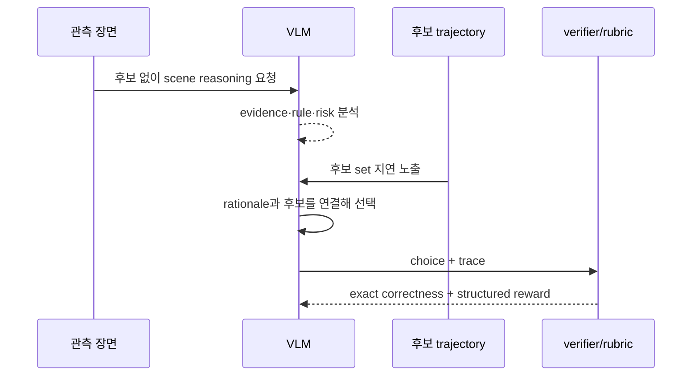

# DEFT-RLVR 학습 노트

## 선수지식·용어
| 용어 | 이 논문에서의 뜻 |
|---|---|
| CoT | 장면 증거와 driving decision을 잇는 언어 reasoning trace |
| trajectory anchoring bias | GT 미래를 먼저 본 모델이 scene cause 대신 결과를 사후 합리화하는 편향 |
| AD-MCQ | scene별 trajectory 후보에서 정답을 고르는 benchmark |
| RLVR | outcome을 기계적으로 검증할 수 있는 reward로 RL post-training |
| CFS | reasoning의 grounding, 무-hallucination, specificity, coherence를 묶은 causal-faithfulness score |

## 핵심 흐름

## 단계별 이해
1. **왜 free-form trajectory가 아닌 MCQ인가?** 자유 trajectory는 high-level maneuver가 맞아도 좌표 오차로 채점이 흐려진다. 후보 선택은 decision reward를 정확히 한다.
2. **왜 후보도 reasoning 전에 숨기는가?** 후보가 보이면 모델이 candidate wording/geometry에 맞춘 explanation을 지어낼 수 있다. scene-only trace가 causal evidence를 먼저 요구한다.
3. **왜 rubric이 필요한가?** 정답 후보를 찍어도 hallucinated evidence·불필요한 장황함은 남는다. rubric은 trace의 질에 learning signal을 준다.
4. **왜 general visual evaluation을 같이 하는가?** AD 데이터만 SFT하면 domain specialization 대가로 일반 VLM perception/reasoning가 무너질 수 있다.

## Representation과 reward
최종 decision을 $a\in\{1,\dots,M\}$인 candidate index로 쓰면 기본 검증 reward는 다음처럼 생각할 수 있다.

$$R_{MCQ}=\mathbb{1}[a=a^*].$$

DEFT-RLVR은 이를 candidate-blind rationale $r$의 rubric reward와 결합한다.

$$R = R_{MCQ}+\lambda R_{rubric}(r,\,scene).$$

중요한 제약은 $r$ 생성 시 candidate/GT future가 관측되지 않아야 한다는 것이다. 그래야 $R_{rubric}$이 result-conditioned narrative가 아니라 scene-grounded analysis를 장려한다.

## 구현·배포 체크리스트
- candidate generator의 coverage/validity/deduplication을 audit한다.
- GT/future latent/candidate visibility가 stage별로 누출되지 않도록 prompt·attention·data pipeline을 검사한다.
- selection accuracy뿐 아니라 CFS, hallucination rate, rule compliance와 closed-loop safety를 함께 본다.
- VLM trace를 action controller에 직접 연결할 경우 fallback planner와 uncertainty threshold를 둔다.

## 점검 질문과 답
**Q1. DEFT가 future 정보를 영구히 버리는가?**
A. 아니다. reasoning 전에만 가리고, decision/verification 단계에는 candidate trajectory를 제공한다.

**Q2. AD-MCQ 정답이면 안전한가?**
A. 아니다. 후보 set와 oracle label의 품질에 조건부이며 continuous closed-loop safety를 대체하지 않는다.

**Q3. JEFT와의 핵심 차이는?**
A. candidate/future를 reasoning 전에 볼 수 있는 JEFT와 달리 DEFT는 exposure ordering 자체를 supervision constraint로 둔다.

## 90분 읽기 로드맵
1. 그림 1–3과 Introduction (20분): anchoring bias와 two-stage interface.
2. §3–4 (25분): candidate construction, DEFT/RLVR reward.
3. §5 표·그림 5–6 (25분): AD 성능/일반 능력/효율 trade-off.
4. Appendix D의 candidate validity와 reward setup (20분): 재현 시 누출 방지 지점.
