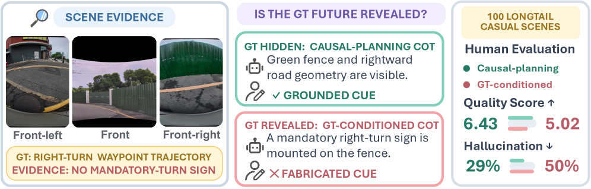
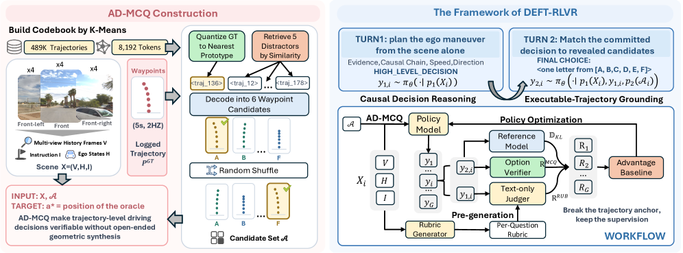
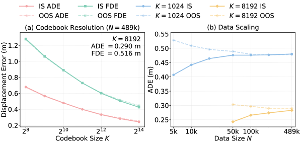
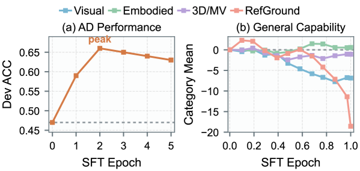
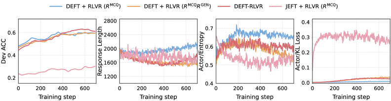

# DEFT-RLVR: 자율주행 VLM에서 검증 가능한 추론을 위한 미래 trajectory 지연 노출

> 원문: Zixuan Huang 외, *Deferred Exposure of Future Trajectories for Verifiable Reasoning in Autonomous Driving VLMs* (arXiv:2608.01755v2). 본 문서는 arXiv HTML 본문의 핵심 섹션을 한국어로 기술 번역한 것이다. 부록의 세부 hyperparameter·전수 예시는 생략했으며, 원문 HTML/PDF를 함께 참조한다.

## Abstract
최근 자율주행(AD) Vision-Language-Action 모델은 Vision-Language Model(VLM)의 추론 능력을 높이기 위해 chain-of-thought(CoT) supervision을 사용한다. 그러나 기존 annotation pipeline은 teacher에게 기록된 ground-truth(GT) 미래 trajectory를 미리 보여 주는 경우가 많다. 저자들은 이것이 **trajectory anchoring bias**를 낳는다고 보인다. 즉 teacher가 장면 증거로부터 결정을 추론하는 대신 이미 알려진 결과를 그럴듯하게 합리화하며, 인과적으로 덜 충실한 CoT와 더 심한 hallucination을 만든다.

GT trajectory를 숨기면 이 shortcut은 사라지지만, 자유 형식 trajectory 생성은 고수준 의사결정·정밀 기하 합성·저수준 dynamics를 한 문제로 묶는다. 이를 피하기 위해 논문은 planning을 명시적 trajectory 후보 중 선택으로 바꾸는 **AD-MCQ**를 제안한다. 이어서 **DEFT-RLVR**는 미래 trajectory를 사전 anchoring 정보가 아니라 사후 검증 target으로 바꾼다. 실험에서 이 방법은 AD reasoning을 높이면서 일반 visual capability를 보존하거나 개선하며, VLM-only inference와 후보 구성으로 난이도 조절이 가능한 확장성 있는 검증 기반을 제공한다.

## 1. Introduction
VLM 기반 AD reasoning은 장면 설명과 decision rationale을 제공할 수 있지만, 설명이 실제 driving decision의 원인이라는 보장은 없다. 특히 future trajectory를 보고 CoT를 쓰게 하면, 모델은 장면에 없는 mandatory-turn sign을 꾸며내는 식으로 결과를 정당화할 수 있다. 사람 평가에서도 GT-conditioned CoT는 grounding, hallucination 부재, specificity, causal coherence 및 종합 causal-faithfulness에서 불리했다. 심한 hallucination 비율은 GT 비노출 조건 29.0%에 비해 노출 조건 50.0%였고, pairwise 선호도도 60.5% 대 24.0%였다.

논문의 핵심 원칙은 **solve then verify**다. 장면을 보고 근거와 결정을 먼저 만들고, 이후 실제/후보 미래와 대조해 검증한다. 이것이 단순히 “미래를 가리지 말자”는 데이터 규칙을 넘어, verifier가 정확히 채점할 수 있는 decision representation을 요구한다.

## 2. AD VLM의 trajectory anchoring bias
GT trajectory는 annotation을 쉽게 하지만 inference-time에 이용할 수 없는 privileged information이다. 노출된 teacher는 trajectory를 원인처럼 되풀이하는 post-hoc narrative를 만들 수 있고, 학생 모델은 이 방향이 잘못된 supervision을 모방한다. 저자들은 causal-planning(비노출)과 GT-conditioned annotation을 비교해 이 bias를 정량화한다. 관찰 가능한 scene evidence가 아니라 결과에 맞춘 언어 prior가 큰 gradient를 받으므로, 정확해 보이는 CoT도 안전한 policy의 근거가 아닐 수 있다.

## 3. AD-MCQ: 검증 가능한 candidate-trajectory benchmark
AD-MCQ는 자율주행 planning을 scene별 소수 후보 trajectory의 multiple-choice selection으로 정의한다. 입력은 driving scene의 시각 관측과 질의이고, 출력은 선택한 candidate 및 그 장면 근거를 설명하는 reasoning trace다. 이산 trajectory prototype은 대규모 trajectory clustering으로 구성하며, 논문은 codebook 크기와 clustering corpus 크기에 따른 reconstruction error를 분석해 **K=8192**가 fidelity와 활용도 사이의 균형점이라고 보고한다.

후보를 명시하면 (1) 최종 선택의 정오답을 정확히 확인할 수 있고, (2) high-level driving decision을 저수준 좌표 회귀와 분리하며, (3) plausible하지만 미래를 본 explanation을 판별할 수 있다. 후보는 scene-specific하게 구성되어 지름길이 되지 않도록 validity·deduplication·oracle fidelity·candidate separation을 점검한다.

## 4. DEFT-RLVR: 미래 trajectory의 지연 노출
### 4.1 DEFT
DEFT(Deferred Exposure of Future Trajectories)는 interaction을 두 단계로 나눈다.

1. **Candidate-blind reasoning:** 모델은 scene만 보고 위험요인, traffic rule, 의도된 maneuver를 설명한다. 이 시점에는 candidate trajectory가 보이지 않는다.
2. **Candidate-grounded decision/verification:** reasoning 뒤에 candidate set을 노출하고, 모델은 앞의 근거와 후보를 연결해 하나를 선택한다.

따라서 모델은 결과를 거꾸로 설명하기보다, 장면→reasoning→candidate selection의 방향을 학습한다. 후보를 사후에 제공하므로 정확한 action grounding은 유지하면서 geometric trajectory를 자유 생성할 필요가 없다.

### 4.2 두 단계 최적화
DEFT-RLVR은 강화학습 with verifiable rewards(RLVR)로 이 두 단계 출력을 공동 최적화한다. 선택 reward는 AD-MCQ 정답 여부를 직접 확인한다. 후보를 처음부터 보게 하는 JEFT류 설정은 shortcut-driven policy drift를 키우는 반면, DEFT는 후보 접근 시점을 제어해 reasoning 단계의 인과적 scene grounding을 보호한다.

### 4.3 structured rubric reward
정답만 주는 reward는 장황하거나 무근거인 rationale을 허용할 수 있다. 저자들은 candidate-blind trace에 대해 구조화된 rubric으로 scene evidence, 위험/규칙, decision logic을 평가한다. online rubric을 매 rollout에 계산하는 비싼 방식과 달리 DEFT-RLVR은 효율적인 structured supervision을 사용한다. 보고된 step runtime은 correctness-only DEFT보다 약 0.5% 높은 426.5초이며 online-rubric variant보다 41.1% 빠르다.

## 5. Experiments
실험은 AD-MCQ의 in-domain 설정, 500개 nuScenes scene의 OOD cross-domain 설정, 그리고 basic/embodied/3D-multiview/referring-spatial을 포함한 general visual capability 평가를 사용한다. 기반 모델은 Qwen3-VL-8B-Instruct다.

- Candidate-grounded training은 training-free DEFT보다 AD reasoning을 높였다. nuScenes에서 training-free DEFT / mixed-target distillation / DEFT-RLVR의 ACC는 각각 39.6 / 55.8 / 49.5이며, 후자의 CFS는 0.636으로 training-free의 0.522보다 높다.
- AD-specific evaluation에서 base Qwen3-VL-8B-Instruct의 ACC 28.1%는 DEFT 뒤 56.6%가 되었고, DEFT + RLVR 조합은 보고된 variant에서 더 높은 결과를 보였다.
- cold-start SFT 및 distillation은 AD specialization을 주지만 초기 general visual capability 하락을 보였다. 반면 DEFT-RLVR은 AD reasoning 향상과 일반 시각 능력 유지의 균형을 목표로 한다.
- 후보 노출을 지연할수록 shortcut 최적화가 줄고, rubric supervision은 쓸모없는 exploration을 줄였다.

## 6. Conclusion 및 한계
이 논문은 자율주행 VLM의 설명이 future trajectory를 본 뒤 쓰인 사후 합리화가 되지 않도록, trajectory를 **결정 전 anchor가 아닌 결정 후 verifier target**으로 재정의한다. AD-MCQ는 직접 검증되는 선택을 제공하고, DEFT-RLVR은 candidate-blind reasoning과 candidate-grounded decision을 결합한다.

다만 MCQ 후보 집합의 quality·coverage가 benchmark 난이도와 안전성 판단을 좌우한다. candidate set 밖의 더 나은 maneuver를 표현하지 못하며, CFS/rubric이 실제 closed-loop 안전을 완전히 대체하지 않는다. 또한 Qwen3-VL-8B 기반 결과를 다른 backbone·실차 closed-loop setting에 일반화하려면 추가 검증이 필요하다.

## 원문 링크
- Hugging Face Papers: https://huggingface.co/papers/2608.01755
- arXiv Abstract: https://arxiv.org/abs/2608.01755
- arXiv HTML: https://arxiv.org/html/2608.01755
- Code: https://github.com/hzx122/DEFT-RLVR
