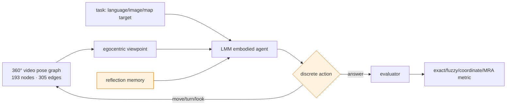

# 360CityArena 분석

## 한 문장 결론

360CityArena는 Akihabara 360° video pose graph에서 perception, map/language grounding, path planning, action execution을 함께 시험하며, 현 LMM agent가 human에 비해 특히 city-scale route planning에서 크게 부족함을 드러낸다.

## 문제와 기여

- 기존 urban simulator는 realism·dynamic scene·continuous district exploration을 모두 만족시키기 어렵다.
- 602개의 360° video segment, 85개 street, 193 node/305 edge pose graph로 Akihabara를 구성한다.
- 175 human-crafted task를 Environment Understanding, Path Reasoning, Spatial Reasoning의 3×7 taxonomy로 조직한다.
- language-goal와 image-goal landmark search를 같은 setting에서 비교해 modality effect를 진단한다.
- model error를 Action/Grounding/Perception/Explore/Planning으로 분해해 integrated agent의 병목을 분석한다.

## Environment–agent pipeline

| interface | 내용 | AD/VLA 관점 |
|---|---|---|
| 관측 | 360° city viewpoint, 선택적 map, reference image | front/around-view scene grounding의 축소판 |
| task | landmark, route, VLN instruction, relation, count | route command·semantic goal와 유사 |
| action | forward/branch/rotate/tilt/reset/answer | low-level vehicle control은 아닌 discrete navigation |
| memory | 각 step의 textual reflection | long-horizon state tracking 보조 |
| evaluator | text·coordinate·MRA·LLM judge | 실제 driving의 collision/rule metric과는 다름 |

## Input–output/action representation

- **입력:** egocentric visual observation, natural-language instruction 또는 landmark image, 일부 task의 map/location marker, task-specific Reflection Memory.
- **출력:** 7개 기본 discrete action과 branch action, 또는 final text/numeric answer.
- **language 역할:** object-goal와 VLN instruction의 task specification 및 memory 기록이다.
- **action grounding:** visual/map cue를 방향 전환·이동 선택으로 연결한다. continuous steering, acceleration, waypoint/trajectory output은 범위 밖이다.
- **taxonomy 위치:** VLA-like embodied navigation benchmark. autonomous-driving E2E planner의 직접 score는 아니지만, urban localization·landmark association·route reasoning의 prerequisite를 측정한다.

## Datasets, metrics, 실험 설계

- **environment:** Tokyo Akihabara 약 750m×650m; 85 streets; 602 segments; city는 하나다.
- **task:** Localization, Landmark Search(Language/Image), Map Navigation, VLN, Relational Spatial Reasoning, Object Count — 각 25개.
- **difficulty:** Easy/Medium/Hard가 distance, ambiguity, visibility, exploration 요구량을 반영한다.
- **metrics:** Localization exact match, relational answer fuzzy match(GPT-5 judge+human check), goal tasks coordinate match($\epsilon=10$m; map nav 20m), Object Count MRA.
- **models:** GPT-5, Claude Sonnet 4.5, Gemini 2.5 Flash, Qwen2.5-VL-32B, InternVL3.5 8B/38B; open model inference에는 8×A100 80GB가 사용됐다.

## 결과 해석: open-loop vs closed-loop

이 논문은 static VQA/open-loop benchmark가 아니라 observation–action loop를 가진 **simulated closed-loop navigation**이다. 그러나 physical vehicle/robot closed loop는 아니다. pre-recorded video graph에서 no free-space collision, dynamics reaction, control smoothness, traffic-rule compliance를 평가하지 않는다.

- human은 Map Nav 92%, VLN 88%, Rel Reason 92%이고, 표의 모든 LMM은 Map Nav 0%다.
- image landmark가 language landmark보다 GPT-5에서 48% 대 16%로 높다. visual appearance cue가 phrase보다 더 grounding-friendly할 수 있다.
- map location prior는 개선을 보장하지 않는다. location map을 camera coordinate와 align하지 못하면 extra context가 planning에 독이 된다.
- GPT-5는 Explore loop가, Gemini/InternVL은 Action error가 상대적으로 두드러졌다. 단순 model capability가 아니라 harness/controller/memory interface를 진단해야 한다.

## 강점

1. dynamic pedestrian/vehicle를 포함한 실제 도시 video의 시각 복잡도를 유지한다.
2. 같은 landmark를 image와 language goal로 주어 modality의 장단점을 통제 비교한다.
3. task 난이도와 failure taxonomy가 “어디에서 망가졌는가”를 보여 준다.
4. urban VLA의 perception, grounding, planning, execution을 분리된 subtask로 측정한다.

## 한계·안전·배포 함의

- 360° video trajectory에 제한되므로 자유 공간 이동과 물리 상호작용이 없다. trajectory 경계 discontinuity도 있다.
- Akihabara 하나만 사용해 weather, global city layout, signage language, traffic culture의 OOD 일반화는 평가하지 않는다.
- small task count(175)와 local-expert human baseline은 statistical coverage에 주의가 필요하다.
- fuzzy-match에 LLM judge를 쓰므로 judge bias와 prompt sensitivity를 지속 확인해야 한다.
- 자율주행으로 전이할 때 discrete city exploration은 route-level reasoning 검사일 뿐이다. continuous control, collision/TTC, comfort, legal compliance, multi-sensor BEV/occupancy와 결합한 평가가 필수다.

## 왜 중요한가

VLA/자율주행의 실패는 “무엇을 봤는가”뿐 아니라 map-to-view alignment, landmark grounding, exploration stop condition, reasoning→action interface에서 발생한다. 360CityArena는 이 중 city-scale spatial intelligence를 photorealistic observation으로 강하게 압박한다. 다음 연구는 benchmark의 reflection memory를 uncertainty-calibrated map memory, learned topological planner, safety-constrained action policy와 비교하는 것이 유망하다.
