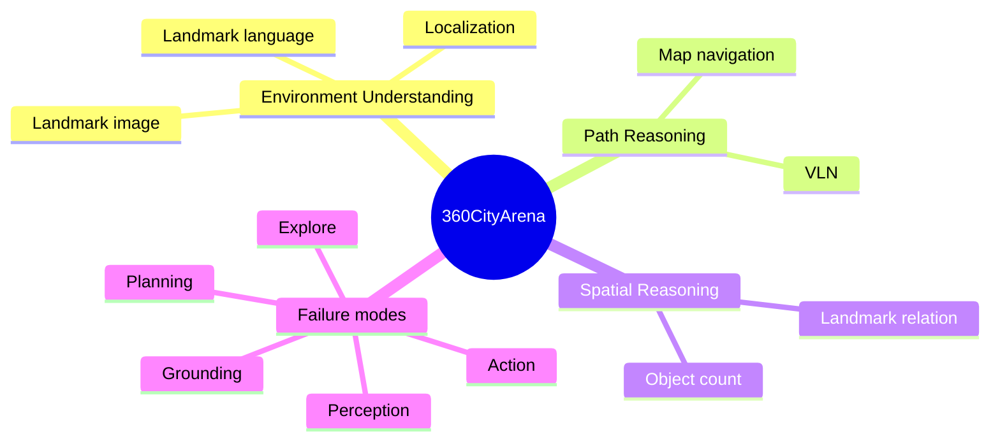

# 360CityArena 핵심 기술 학습 자료

## 선수 지식

- **POMDP:** state 전체는 보이지 않고, observation history와 memory로 action을 결정하는 sequential problem.
- **pose graph:** place/viewpoint node와 이동 가능한 transition edge로 구성한 navigation graph.
- **VLN:** natural-language instruction을 visual observation에 ground해 이동하는 Vision-Language Navigation.
- **open-loop vs closed-loop:** static datum에 한 번 예측하는 것과, action이 다음 observation을 바꾸는 loop를 구별한다.

## benchmark 지형도

## environment와 action loop

환경은 다음 partial-observation transition으로 생각할 수 있다.

$$s_t\xrightarrow{\text{render}}o_t,\qquad a_t=\pi(o_t,M_t,g),\qquad s_{t+1}=T(s_t,a_t).$$

- $s_t$: pose graph의 위치·heading.
- $o_t$: current 360° viewpoint와 선택적 map/location marker.
- $M_t$: 이전 visual cue와 hypothesis를 보존하는 Reflection Memory.
- $g$: language/image/map task goal.
- $a_t$: move, rotate, tilt, reset, answer.

이 식은 car control과 완전히 같지는 않지만 `observation → belief/memory → route decision → next observation`이라는 VLA/AD 공통 loop를 드러낸다.

## task별 무엇을 측정하는가

| task | 핵심 latent variable | 흔한 실패 | AD/VLA 대응물 |
|---|---|---|---|
| Localization | map pose·heading | visual cue↔grid mismatch | ego localization/HD-map alignment |
| Landmark language | object/landmark semantic grounding | 이름은 이해하지만 visual cue를 못 찾음 | route landmark grounding |
| Landmark image | appearance matching | viewpoint/scale/occlusion | target observation association |
| Map Navigation | topological route plan | branch 선택·progress tracking | route planning |
| VLN | instruction state machine | turn/stop condition 누락 | natural-language route command |
| Relation | landmark topology | camera-relative vs world-relative 혼동 | scene graph/BEV reasoning |
| Object Count | temporal/spatial coverage | double count·missed region | object inventory/occupancy reasoning |

## 평가 metric을 읽는 법

- **exact match**는 output syntax와 discrete localization error를 엄격히 잡는다.
- **coordinate match**는 target 도달을 재며 $\epsilon$ 선택에 민감하다. 논문은 map navigation에서 20m를 사용했다.
- **fuzzy match**는 relation 답의 표현 다양성에 유용하지만 judge model의 calibration/independence가 필요하다.
- **MRA**는 count의 error magnitude를 반영한다. threshold별 curve도 함께 보는 것이 좋다.

이 benchmark의 closed loop는 pose graph 안의 closed loop다. collision prediction, continuous dynamics, ride comfort, legal rule compliance가 없으므로 autonomous-driving safety score로 오용하면 안 된다.

## 실험 결과에서 배울 점

1. **visual cue의 가치:** GPT-5 landmark image 48% 대 language 16%는 target의 appearance/neighboring context가 vague text보다 바로 usable할 수 있음을 보인다.
2. **map은 자동 해결책이 아니다:** location prior가 일부 task에서 악화된 것은 map-to-egocentric transform, orientation, landmark correspondence가 병목이라는 뜻이다.
3. **reasoner만 강화해도 부족하다:** GPT-5의 Explore failure와 다른 model의 Action failure는 agent harness, stopping policy, low-level controller를 함께 설계해야 함을 보여 준다.
4. **난이도 scaling:** 더 긴 path, 많은 decision point, 낮은 landmark visibility가 memory error를 누적시킨다.

## 구현/배포 체크리스트

- observation마다 place recognition confidence와 heading uncertainty를 기록한다.
- memory에는 observation fact, pose hypothesis, next-action rationale, disconfirming evidence를 분리해 쓴다.
- planner에는 loop/stagnation detector, route-progress monitor, maximum-step rule을 둔다.
- image goal은 multi-view feature matching, language goal은 grounded scene graph와 결합한다.
- map prior는 raw image로 던지기보다 calibrated coordinate transform과 uncertainty-aware correspondence를 제공한다.
- safety-critical AD 연결에서는 route planner 아래에 continuous trajectory optimizer, dynamic obstacle prediction, collision/rule shield를 둔다.

## 자가 점검 질문과 답

**Q1. 360CityArena가 CARLA를 대체하는가?**  
A. 아니다. CARLA는 vehicle dynamics·sensor/traffic interaction을, 360CityArena는 photorealistic 실제 도시 observation에서의 embodied spatial intelligence를 더 직접 시험한다.

**Q2. image-goal이 language-goal보다 항상 좋은가?**  
A. 아니다. 논문에서도 InternVL은 일관된 image advantage를 보이지 않았다. target visibility, representation alignment, model visual grounding에 의존한다.

**Q3. map position을 주면 왜 성능이 떨어질 수 있는가?**  
A. map의 north/heading/scale과 first-person image의 perspective를 align하는 module이 없으면 extra information이 competing hypothesis를 만들기 때문이다.

**Q4. action grounding을 평가하는가?**  
A. discrete navigation action까지는 평가하지만, low-level steering/acceleration/trajectory safety의 grounding은 평가하지 않는다.

## 75분 읽기 로드맵

1. **10분:** teaser와 task taxonomy를 보고 7 subtask를 input/goal/metric으로 표기한다.
2. **15분:** pose graph와 POMDP formulation에서 observation·memory·action interface를 그린다.
3. **20분:** Table 2와 difficulty/failure analysis를 읽고 “왜 Map Nav가 0%인가”에 대한 가설 세 개를 쓴다.
4. **15분:** location-prior ablation을 읽고 map-to-view alignment module 설계를 제안한다.
5. **15분:** CARLA 또는 자신의 VLA stack과 비교해, 이 benchmark가 커버하지 않는 closed-loop safety metric을 목록화한다.
