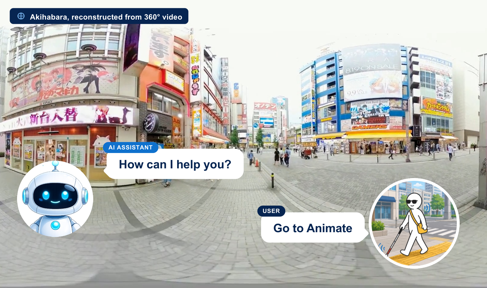
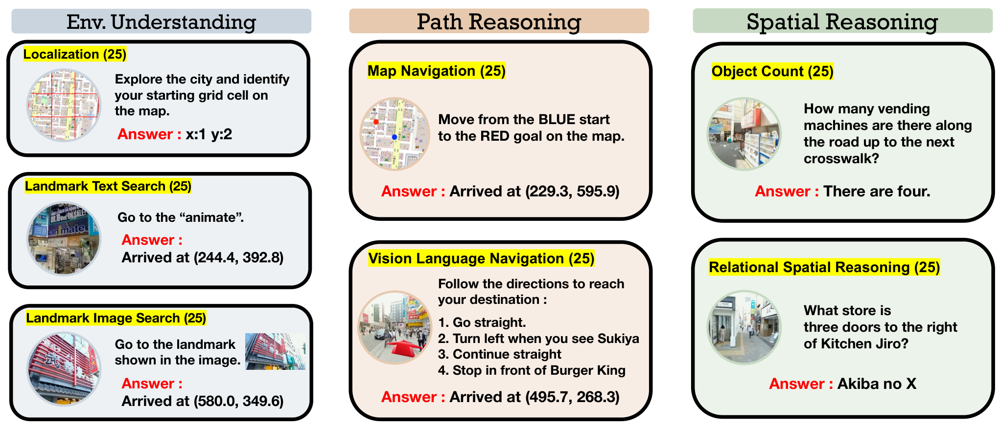

# 360CityArena: Embodied Agent를 위한 사실적 가상 도시 내비게이션 벤치마크

> 원문: Kenta Watanabe 외, *360CityArena: A Realistic Virtual Urban Navigation Benchmark for Embodied Agents* (arXiv:2608.08814). Abstract, Introduction, benchmark construction, agent/evaluation protocol, experiment, limitation, appendix의 핵심을 번역했다. 모든 prompt 전문과 사례 이미지 연속 프레임은 생략했다.

## Abstract

360CityArena는 360도 video로 만든 photorealistic virtual environment에서 embodied agent의 urban exploration을 평가하는 benchmark다. 기존 outdoor benchmark는 시각적 사실성 또는 도시 구조의 복잡성이 부족하다. 저자들은 Tokyo Akihabara를 602개의 360° video segment와 85개 street로 재구성하고, 175개의 사람이 만든 task를 제공한다.

task는 Environment Understanding, Path Reasoning, Spatial Reasoning의 세 범주이며 localization, landmark search, path planning, relational spatial reasoning을 포함한다. 최신 LMM 기반 agent를 평가했을 때 최고 Gemini 2.5 Flash도 human 77.3%에 비해 17.1%에 그쳐 city-scale embodied navigation의 큰 격차를 보였다.

## 1. Introduction

도시에서 길을 잃은 사람을 돕거나 시각장애인을 안내하는 assistant에는 perception, self-localization, language grounding, route planning, action execution이 결합되어야 한다. 그러나 conventional 3D simulator는 photorealism과 구조 복잡성이 낮고, Google Street View 환경은 dynamic element와 연속 navigation이 부족하며, video-to-sim은 clip이 짧아 넓은 street network를 탐색하기 어렵다.

360CityArena는 실제 Akihabara를 interconnected 360° video trajectory의 pose graph로 표현한다. 현실 city의 visual clutter, pedestrian/vehicle motion, signboard, dense landmark를 유지하면서도 reproducible benchmark가 되도록 175 task를 구성한다. 이 benchmark는 agent의 단일 VLM QA 성능이 아니라, observation–memory–planning–action loop의 통합 성능을 보는 데 의의가 있다.

## 2. Related Work

- **embodied agent와 simulator:** Habitat, CARLA, EmbodiedCity, MetaUrban은 interaction 또는 urban setting을 제공하지만, 도시의 photorealism·dynamic scene·district-scale exploration을 동시에 충족하기 어렵다.
- **outdoor navigation:** point-goal, image-goal, object-goal, Vision-Language Navigation(VLN)은 goal specification이 다르다. aerial VLN·map-only route planning은 ground-level egocentric exploration과 구분된다.
- **real-world reconstruction:** NeRF/Gaussian Splatting은 visual realism을 높였지만 static scene인 경우가 많다. Realistic Virtual World(RVW)는 대량의 360° video를 pose graph로 연결해 city-scale dynamic observation을 제공한다.

## 3. 360CityArena

### 3.1 Akihabara virtual environment

환경은 85개 street에서 수집한 602 video segment로 구성된다. 각 video는 spherical surface에 projection되고 Unity의 navigable pose graph로 정리된다. graph는 193 node, 305 edge, 평균 branching degree 3.16의 하나의 connected component다. 범위는 Akihabara Station 주변 남북 약 750m, 동서 약 650m다.

agent는 임의 3D 위치로 자유 이동하는 대신 사전 녹화된 trajectory 위를 이동한다. 이 선택은 real-world visual dynamics를 보존하지만 trajectory boundary의 discontinuity와 physical interaction 부재라는 제약을 만든다.

### 3.2 task taxonomy

7개 subcategory마다 25 task가 있다.

| 대분류 | subtask | 핵심 능력 | 입력/성공 조건 |
|---|---|---|---|
| Environment Understanding | Localization | local landmark로 5×5 grid 위치 추정 | viewpoint→grid text exact match |
|  | Landmark Search (Language) | language object-goal grounding | landmark description→목표 근처 이동 |
|  | Landmark Search (Image) | visual target matching | reference image→목표 근처 이동 |
| Path Reasoning | Map Navigation | map-route planning 및 분기 실행 | map과 start/goal→route follow |
|  | VLN | multi-step instruction following | natural-language direction→goal |
| Spatial Reasoning | Relational Spatial Reasoning | landmark relative relation | reference landmark/relation→answer |
|  | Object Count | 범위 안 object 수량 | observation→numeric estimate |

annotation은 8명이 Unity에서 task를 만들고 solvability를 검증했다. 난이도 Easy/Medium/Hard는 distance, instruction ambiguity, landmark visibility, required exploration을 고려해 부여했다. 예를 들어 map-navigation path length는 124/247/347m, decision point는 3.3/6.4/9.0으로 증가한다.

### 3.3 평가 protocol

1. **exact_match:** Localization의 grid coordinate/text가 target과 정확히 같은지 확인한다.
2. **fuzzy_match:** Relational Spatial Reasoning의 open text answer를 GPT-5 judge가 target과 의미적으로 비교하고 사람 검증을 병행한다. 보고된 judge–human majority agreement는 97.9%, $\kappa=0.937$이다.
3. **coordinate_match:** Map Navigation, VLN, Landmark Search는 Unity coordinate와 target의 Euclidean distance로 판정한다. 기본 $\epsilon=10$m, Map Navigation은 map marker noise를 고려해 $\epsilon=20$m이다.
4. **mean relative accuracy(MRA):** Object Count는 multiple tolerance threshold에 걸친 상대 정확도를 평균한다.

## 4. Navigation Agent

환경은 부분 관측 sequential decision process $\mathcal{E}=(S,A,\Omega,T)$로 모델링된다. time $t$에 agent는 viewpoint image와 선택적 location-map, 이전 step의 Reflection Memory $M_t$를 받고 action $a_t$를 낸다. $M_t$는 observation·thought에서 중요한 정보를 text로 기록해 다음 turn input으로 제공된다.

action space는 forward, up/down tilt, left/right rotate, heading alignment reset, answer의 7개 discrete action이다. branch point에서는 left/right/forward 등 traversable direction action이 추가된다. 평가 LMM은 GPT-5, Claude Sonnet 4.5, Gemini 2.5 Flash, Qwen2.5-VL-32B-Instruct, InternVL3.5-8B/38B다.

## 5. Experiments

### 인간과 모델 결과

human 평가는 Akihabara 경험이 있는 5명을 사용한 in-domain upper-bound이다. 사람은 Map Navigation 92%, Landmark Image 92%, VLN 88%, Relational Reasoning 92%를 보였다. 반면 최고 모델은 category별로 매우 낮았고, 전체적으로 Gemini 2.5 Flash가 가장 높지만 human 대비 큰 격차가 남았다.

| Model | Loc | Landmark-Lang | Landmark-Img | Map Nav | VLN | Obj Count | Rel Reason |
|---|---:|---:|---:|---:|---:|---:|---:|
| GPT-5 | 8.0 | 16.0 | 48.0 | 0.0 | 8.0 | 2.4 | 32.0 |
| Gemini 2.5 Flash | 12.0 | 28.0 | 36.0 | 0.0 | 8.0 | 24.0 | 12.0 |
| Qwen2.5-VL-32B | 4.0 | 16.0 | 20.0 | 0.0 | 0.0 | 18.8 | 4.0 |
| Human | 68.0 | 64.0 | 92.0 | 92.0 | 88.0 | 45.2 | 92.0 |

주요 발견은 다음과 같다.

- **F1:** 모든 LMM이 human보다 크게 낮다. 특히 path reasoning의 Map Navigation은 모든 표의 모델에서 0%다.
- **F2:** image-goal landmark search가 language-goal보다 대체로 쉽다. GPT-5는 48.0 대 16.0이고, image가 façade·color·context 같은 구체적 cue를 준다. 그러나 InternVL에는 일관된 이득이 없었다.
- **F3:** Easy→Medium→Hard에서 성능이 대체로 내려간다. 이는 task 난이도가 도시 행동의 실제 복잡도를 반영함을 보인다.
- **location prior:** map에 현재 위치를 표시해도 항상 낫지 않았다. map representation과 egocentric visual cue의 alignment가 해결되지 않으면 정보가 strategy를 혼란시킬 수 있다.

### failure 분석

failure는 Action, Grounding, Perception, Explore, Planning으로 분류됐다. GPT-5는 Action error는 적지만 Explore failure가 크고, Gemini/InternVL은 low-level Action error가 많았다. spatial reasoning에서 Perception failure가 증가했고, Gemini는 map-to-first-person alignment를 시사하는 Grounding error가 지속됐다. 이는 도시 autonomy에서 “reasoning model의 score”와 “실제로 안전하게 탐색하는 agent” 사이의 interface가 핵심임을 보여 준다.

## 6. Limitations 및 7. Conclusion

360CityArena는 photorealistic하지만 pre-recorded video의 pose graph라 자유 이동·물리 상호작용을 지원하지 않는다. boundary transition은 전체 action의 11.3%였고 저자들의 manual inspection에서 error에 과대표되지 않았지만, simulator artifact 가능성을 완전히 없애지는 않는다. 또 Akihabara 한 district만 포함하므로 도시·국가·weather·traffic 문화 간 generalization을 주장할 수 없다.

그럼에도 이 benchmark는 visual realism, connected urban topology, dynamic city observation, multi-task diagnosis를 함께 제공한다. VLA/자율주행 연구에는 car control benchmark가 아니라 **도시 spatial grounding과 navigation reasoning의 stress test**로 유용하다. 실제 vehicle/robot deployment로 가려면 continuous control, sensor fusion, dynamic-agent interaction, rule compliance, collision·comfort 같은 closed-loop metric을 추가해야 한다.

## 원문 링크

- Hugging Face Papers: https://huggingface.co/papers/2608.08814
- arXiv Abstract: https://arxiv.org/abs/2608.08814
- arXiv HTML: https://arxiv.org/html/2608.08814
- Project: https://360mm-team.github.io/360CityArena/
- Code: https://github.com/360MM-Team/360CityArena
