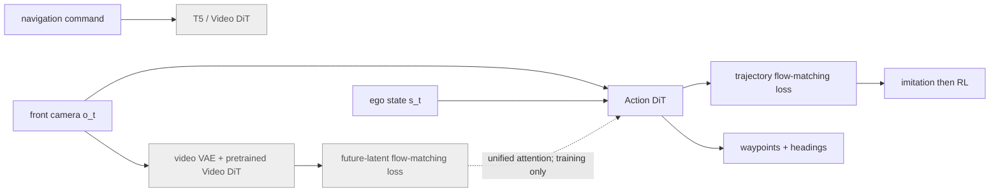

# SimWAM 분석

## 한 문장 결론
SimWAM은 대형 video world model을 **학습 중 representation teacher**로만 사용하고 deployment에서는 작은 action DiT만 남겨, world-model prior와 direct trajectory planner의 낮은 latency를 함께 노린다.

## 문제와 기여
- 기존 WAM의 imagine-then-act는 future video/latent generation을 inference loop 안에서 수행해 비싸다.
- Wan2.2-5B video DiT와 lightweight trajectory DiT를 joint flow matching으로 co-train한다.
- isolated attention mask가 action token의 future-frame attention을 막아 information leakage 없이 video prior를 전이한다.
- video branch와 action branch가 parameter를 공유하지 않아 backbone 교체와 action scaling이 쉽다.
- imitation 뒤 compositional driving reward로 RL을 적용해 NAVSIM **91.5 PDMS**를 보고한다.

## Architecture / pipeline

| 단계 | 입력 | 출력 | deployment 시 유지? |
|---|---|---|---|
| video expert | current frame, command, future-frame latent | video velocity field | 아니오 |
| action expert | current front camera, ego state | trajectory velocity field → waypoint trajectory | 예 |
| RL | action planner rollout / compositional reward | action policy update | 학습만 |

## Input–output/action representation
- **입력:** front-camera observation, ego velocity·acceleration·yaw rate, navigation command.
- **출력:** ego coordinate의 waypoint position과 heading으로 된 trajectory.
- **언어 역할:** command를 T5 cross-attention으로 video expert에 condition한다. 이 논문의 최종 policy는 text-action VLA가 아니라 numerical trajectory planner다.
- **action grounding:** ODE로 noise를 trajectory로 적분하는 flow-matching policy가 현재 observation에서 직접 action을 만든다.

## Training recipe와 평가
1. pretrained Wan2.2-5B video DiT/video VAE/T5와 action DiT 준비.
2. future-frame latent와 trajectory 각각에 flow-matching loss를 적용한 joint training.
3. isolated mask로 action→future access 차단.
4. action branch만 남긴 뒤 hard subset에서 RL.

- **Benchmark:** NAVSIM navtrain/navtest; zero-shot nuScenes transfer.
- **metrics:** NC, DAC, EP, TTC, collision-related C 및 PDMS.
- **open/closed-loop:** NAVSIM planning score 및 nuScenes transfer가 중심이다. 논문 텍스트가 제시한 주요 수치는 full real-world closed-loop deployment 증명이 아니다.
- **ablation:** action-only 86.6 → +video 90.3 → +RL 91.5 PDMS. isolated mask는 90.3 PDMS로 대안 mask보다 높았다.

## 강점
- video generation의 dynamics knowledge를 쓰되 inference-time generation cost를 제거한다.
- parameter-disjoint 구조라 pretrained video model의 발전을 planner에 흡수하기 쉽다.
- backbone flexibility와 action-model scaling을 표로 보여 modularity를 검증한다.
- motion-prior imitation과 reward optimization을 분리해 분석한다.

## 한계·안전·latency
- video expert를 버려도 training distribution에서 배운 prior가 current observation에 충분히 담긴다는 가정이 필요하다.
- NAVSIM PDMS 향상이 rare-event safety나 actual actuator control 안정성을 보장하지 않는다.
- RL reward가 coverage하지 않은 rule violation/long-tail interaction을 최적화하지 않을 수 있다.
- action-only deployment는 저지연이지만, camera-only/ego-state interface의 sensor failure와 OOD weather/road layout 취약성은 별도 closed-loop 시험이 필요하다.

## 왜 중요한가
VLA/VLM 연구는 대형 world model을 planning loop에 넣는 대가로 latency를 잃기 쉽다. SimWAM은 **미래 imagination 자체보다 그 imagination을 만들기 위한 학습 신호**를 옮기는 방법을 제안하며, practical E2E AD와 world-model distillation의 기준선이 된다.
