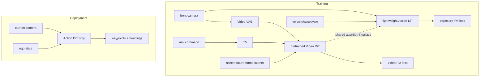

# SimWAM 학습 노트

## 선수지식·용어
| 용어 | 요약 |
|---|---|
| E2E AD | sensor observation에서 trajectory를 직접 예측하는 driving policy |
| WAM | world dynamics/video prior와 action prediction을 결합한 model |
| DiT | diffusion process를 transformer로 parameterize한 model |
| flow matching | noise→data 경로의 velocity field를 회귀하고 ODE로 sampling하는 학습 방식 |
| isolated attention | action token이 future-video token을 보지 못하도록 하는 attention constraint |
| PDMS | NAVSIM에서 driving quality를 종합하는 planner score |

## Architecture map

## 단계별 설명
1. **trajectory policy 정의:** $o_t,s_t,c_t$에서 ego-frame waypoint trajectory를 만든다.
2. **video expert pretraining 활용:** current frame은 condition, future frames는 noised target이다. Wan2.2 video DiT가 traffic motion/dynamics prior를 학습한다.
3. **action flow matching:** action DiT는 current representation과 ego-state embedding에서 trajectory의 velocity field를 예측한다.
4. **joint training:** video loss와 trajectory loss를 함께 최소화해 action representation이 dynamics-sensitive하도록 만든다.
5. **isolation:** action→future attention을 막아 planner가 training-time privileged future를 이용하지 않는다.
6. **RL:** imitation checkpoint에서 compositional driving reward로 정책을 개선한다.

## 최소 수식 관점
노이즈 trajectory $x_0$와 target trajectory $x_1$ 사이 interpolation을 $x_t$라 할 때 action DiT는 $v_\theta(x_t,t\mid o_t,s_t)$를 target velocity에 맞춘다. sampling은 다음 ODE 관점으로 이해할 수 있다.

$$\frac{dx_t}{dt}=v_\theta(x_t,t\mid o_t,s_t).$$

학습 loss의 개념적 형태는

$$\mathcal{L}=\mathcal{L}_{FM}^{action}+\lambda\mathcal{L}_{FM}^{video}.$$

여기서 video loss는 inference input이 아니라 action representation을 형성하는 auxiliary training signal이다.

## 구현/배포 노트
- video DiT, VAE, T5는 GPU memory가 크므로 training graph와 deployment graph를 분리해 profile한다.
- mask unit test로 action token→future latent attention이 0인지 확인한다.
- video backbone 교체 시 same interface와 loss scale $\lambda$ 재조정이 필요할 수 있다.
- action-only latency뿐 아니라 camera preprocessing, ODE sampling step, safety wrapper의 end-to-end latency를 측정한다.
- RL 전/후에 collision, progress, route compliance, comfort의 multi-objective regression을 확인한다.

## 질문과 답
**Q1. video branch를 버리는데 왜 성능이 오르는가?**
A. joint training 중 video reconstruction이 current observation representation에 future dynamics와 관련된 signal을 주기 때문이다. inference 때 future video를 생성할 필요는 없다.

**Q2. isolated mask가 없으면?**
A. action planner가 future latent를 shortcut으로 쓰면 train–test mismatch가 생긴다. 표의 bidirectional/action→video mask 결과도 isolated 구성보다 낮다.

**Q3. SimWAM은 VLA인가?**
A. 넓은 embodied/world-action 문맥과 연결되지만 최종 output은 language가 아니라 numerical trajectory다. taxonomy상 Vision-Action/WAM에 더 가깝다.

## 90분 읽기 로드맵
1. Abstract·그림 1–2 (15분): 문제와 training/deployment 분리.
2. §3–4 (30분): flow matching, mask, interface.
3. §5 Table 1–5 (30분): PDMS·mask·backbone·scale ablation.
4. Related Work와 Fast-WAM/DriveWAM 비교 (15분): test-time imagination의 설계 공간.
