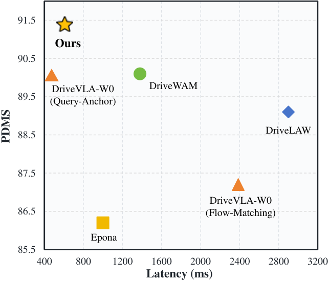
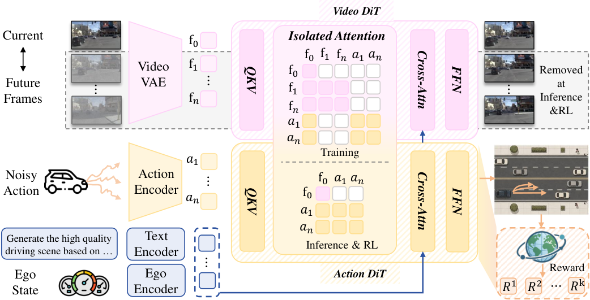

# SimWAM: End-to-End 자율주행을 위한 단순 World-Action Model

> 원문: Zongchuang Zhao 외, *SimWAM: A Simple World Action Model for End-to-End Autonomous Driving* (arXiv:2608.07468v1). arXiv HTML의 Abstract, Introduction, Method, Experiments, Conclusion을 중심으로 번역했다. 수식의 전개와 부록 수준 구현 세부는 원문 HTML/PDF를 참조한다.

## Abstract
World-Action Model(WAM)은 video dynamics prior를 action prediction으로 전이해 end-to-end autonomous driving을 개선하지만, 기존 방법은 inference 때 비용이 큰 future generation을 요구한다. SimWAM은 video generation을 **오직 training signal**로 쓰는 단순한 WAM을 제안한다. pretrained video expert와 가벼운 action expert를 joint flow matching으로 co-train하고, isolated attention mask가 action prediction을 future frame으로부터 독립시킨다. 그러므로 학습 후 video branch는 버리고 trajectory를 직접 예측하는 self-contained planner만 남길 수 있다.

두 expert는 parameter를 공유하지 않고 unified attention interface로만 상호작용한다. 따라서 video backbone을 교체하거나 action expert를 scale해도 objective와 inference pipeline을 바꿀 필요가 없다. 이후 reinforcement learning으로 trajectory imitation을 넘어 compositional driving reward를 최적화한다. SimWAM은 NAVSIM에서 **91.5 PDMS**를 기록하고 더 낮은 latency로 기존 WAM planner를 넘었으며, nuScenes로 zero-shot transfer한다.

## 1. Introduction
End-to-end AD는 raw sensor observation에서 planned trajectory까지를 하나의 network로 매핑한다. 수작업 perception–prediction–planning interface와 error propagation을 줄이는 장점이 있지만, traffic dynamics와 미래 상호작용을 이해하기 어렵다. video generation model은 강한 dynamics prior를 갖고 있어 driving WAM은 이를 future latent 생성 후 action 생성에 이용한다. 문제는 imagine-then-act factorization이 real-time loop 안에서 대형 video generator를 호출한다는 점이다.

SimWAM의 질문은 “video model의 미래 영상을 inference 때 실제로 생성해야 하는가?”이다. 답은 아니다. video expert가 학습 중 현재 observation representation을 traffic-aware하게 만들도록 돕고, action expert가 그 representation에서 직접 trajectory를 예측하게 하면 된다.

## 2. Related Work
논문은 세 흐름을 구분한다.

1. **VLA for AD:** language reasoning과 planning을 결합하지만 VLM의 latency·hallucination·action grounding 문제가 남는다.
2. **WAM for AD:** DriveLaW, DriveWAM 등은 video prediction과 planner를 결합하지만, 많은 경우 inference에도 future latent/video generation이 필요하다.
3. **RL for AD:** imitation trajectory만 모방하면 reward와 안전 trade-off를 직접 최적화하기 어렵다. RL은 non-collision, route progress, comfort 등을 조합한 driving objective를 반영할 수 있다.

SimWAM은 VLA처럼 text action을 내는 모델은 아니며, taxonomy상 **Vision-Action / image-based world-model prior를 쓰는 numerical trajectory generator**에 속한다. language/navigation command는 video branch의 T5 cross-attention conditioning에 사용되고, 최종 action은 ego-frame waypoint trajectory다.

## 3. Preliminary: Flow Matching
Flow matching은 noise에서 data로 가는 continuous path의 velocity field를 학습한다. action trajectory와 future-frame latent 각각에 대해 목표 velocity를 예측하고 ODE를 적분해 sample을 복원한다. SimWAM은 같은 기본 objective로 영상 dynamics와 trajectory distribution을 함께 학습하되, 두 modality의 역할을 attention mask로 분리한다.

## 4. Method
### 4.1 Model architecture
문제 설정에서 planner 입력은 front-camera observation $o_t$, velocity·acceleration·yaw rate를 담은 ego state $s_t$, navigation command $c_t$다. 출력은 ego-vehicle coordinate에서의 trajectory이며 각 waypoint는 planned position과 heading을 가진다.

- **Video expert:** Wan2.2-5B로 초기화한 video Diffusion Transformer(DiT), video VAE, T5 text encoder를 사용한다. VAE는 driving frame을 latent token으로 바꾸며 navigation command는 T5 cross-attention으로 들어간다. current frame은 clean condition, future frame은 noisy reconstruction target이고 flow matching이 video dynamics prior를 학습한다.
- **Action expert:** 작은 DiT가 current observation representation과 MLP로 embed한 ego state에 조건부로 trajectory velocity field를 예측한다. ODE 적분으로 noise에서 planned trajectory를 얻는다.
- **Co-training:** 두 expert는 parameter를 공유하지 않는다. shared/unified attention interface를 통해서만 video future prediction이 action planning representation을 형성한다. joint loss는 trajectory flow-matching loss와 video-latent flow-matching loss의 가중 합이다.

### 4.2 Isolated attention mask
핵심 장치는 action token이 future frame token에 attention하지 못하게 하는 mask다. action expert는 학습 중에도 현재 observation에 기반해야 한다. video expert는 future frame을 재구성하지만, 그것이 planner의 privileged inference input으로 새지 않는다. 그 결과 deployment에서는 video DiT·VAE·T5를 버리고 lightweight action DiT만 남긴다.

### 4.3 Flexibility 및 RL
모듈 분리 덕분에 Wan2.2-5B 외 video backbone으로 바꾸거나 action DiT 크기를 조정할 수 있다. imitation pretraining 후에는 hard subset에서 compositional driving reward로 RL을 수행한다. 이 단계는 expert trajectory를 그대로 따라가는 한계를 보완하며 safety·progress·comfort에 해당하는 결과 지표를 목표에 반영한다.

## 5. Experiments
### Setup
NAVSIM navtrain/navtest를 주 benchmark로 사용하며, front camera와 ego state 및 navigation command에서 trajectory를 계획한다. nuScenes로 zero-shot transfer도 평가한다. base video expert는 Wan2.2-5B이고 LTX-Video, Wan2.1-1.3B, Cosmos2.5 등으로 backbone flexibility를 점검한다.

### Main results
NAVSIM navtest 표에서 SimWAM은 98.4 NC, 98.7 DAC, 86.4 EP, 95.5 TTC, **91.5 PDMS**를 보고한다. 이는 action-only baseline의 PDMS 86.6보다 크고, joint video learning만 적용한 90.3에서 RL이 91.5까지 올린 결과다. 논문은 WAM 비교군보다 future generation을 실행하지 않아 latency를 크게 낮춘다고 설명한다.

### Ablations
- **Component:** action-only 86.6 PDMS → +video 90.3 → +RL 91.5.
- **Mask:** isolated mask의 PDMS 90.3은 bidirectional 90.2 및 action→video 90.1보다 좋다. 이는 미래 영상 정보를 planner로 흘리는 것보다 action independence가 중요함을 시사한다.
- **Video backbone:** LTX-Video 88.7, Wan2.1-1.3B 90.2, Cosmos2.5 90.4, Wan2.2-5B 90.3 PDMS로, 더 나은 video prior가 유리하되 특정 backbone에 묶이지 않는다.
- **Action scaling:** 0.21B / 0.45B / 1.02B action DiT는 각각 89.9 / 90.1 / 90.3 PDMS로 보고된다. action model만 독립적으로 scale할 수 있다.

## 6. Conclusion 및 한계
SimWAM은 world model의 출력을 deployment에서 쓰지 않고, **world-model 학습 신호를 현재 관측 기반 action representation으로 전이**한다. 이 설계는 video generative model의 개선을 활용하면서도 direct trajectory planner의 latency를 유지한다.

그러나 평가의 중심은 NAVSIM open-loop planner score와 nuScenes zero-shot transfer다. 실차 혹은 더 긴 closed-loop 운영에서 rare safety event, domain shift, video prior의 편향을 충분히 보장하지는 않는다. 또한 front-camera 중심 입력과 trajectory score가 LiDAR/BEV 기반 대안 또는 실제 control 안정성을 완전히 대표하지 않으며, RL reward 설계가 policy의 바람직하지 않은 shortcut을 만들 수 있다.

## 원문 링크
- Hugging Face Papers: https://huggingface.co/papers/2608.07468
- arXiv Abstract: https://arxiv.org/abs/2608.07468
- arXiv HTML: https://arxiv.org/html/2608.07468
- Code/weights: https://github.com/H-EmbodVis/SimWAM/
